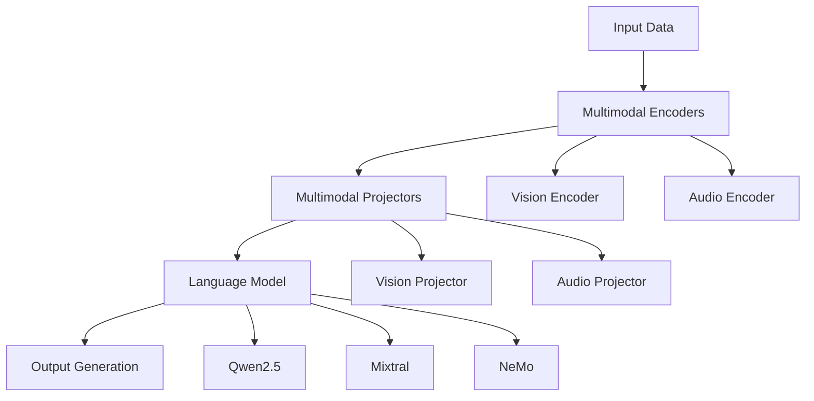
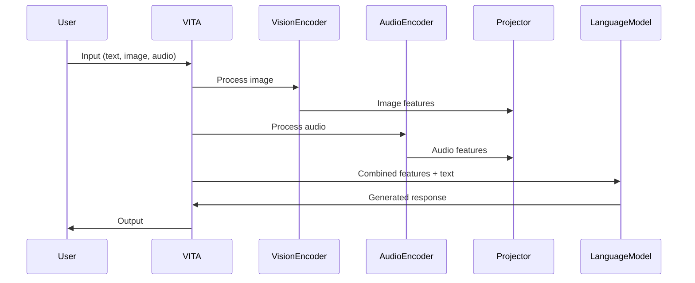
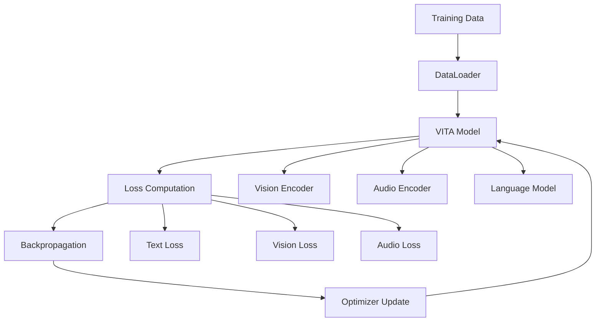

# VITA-1.5 Source Code Architecture

This document provides a comprehensive overview of the VITA-1.5 source code architecture, including the project structure, core components, design patterns, and implementation details.

## 📋 Table of Contents

- [Project Overview](#project-overview)
- [Directory Structure](#directory-structure)
- [Core Architecture](#core-architecture)
- [Model Components](#model-components)
- [Data Flow](#data-flow)
- [Configuration System](#configuration-system)
- [Training Pipeline](#training-pipeline)
- [Inference Pipeline](#inference-pipeline)
- [Design Patterns](#design-patterns)
- [Extension Points](#extension-points)
- [Performance Considerations](#performance-considerations)

## 🌟 Project Overview

VITA-1.5 is built as a modular, extensible multimodal large language model framework. The architecture follows a component-based design that separates concerns and enables easy extension and modification of individual components.

### Key Design Principles

- **Modularity**: Each component is self-contained and can be developed/tested independently
- **Extensibility**: Easy to add new modalities, encoders, or language models
- **Configurability**: All components are configurable through configuration files
- **Performance**: Optimized for both training and inference efficiency
- **Maintainability**: Clear separation of concerns and well-documented interfaces

## 📁 Directory Structure

```
VITA/
├── vita/                          # Core VITA package
│   ├── __init__.py               # Package initialization
│   ├── constants.py              # Global constants and tokens
│   ├── conversation.py           # Conversation management
│   ├── model/                    # Model implementations
│   │   ├── __init__.py
│   │   ├── builder.py            # Model builder and factory
│   │   ├── vita_arch.py          # Core VITA architecture
│   │   ├── language_model/       # Language model implementations
│   │   │   ├── vita_qwen2.py     # Qwen2.5 integration
│   │   │   ├── vita_mixtral.py   # Mixtral integration
│   │   │   ├── vita_nemo.py      # NeMo integration
│   │   │   └── vita_fo_qwen2.py  # Qwen2.5 FO integration
│   │   ├── multimodal_encoder/   # Multimodal encoders
│   │   │   ├── builder.py        # Encoder builder
│   │   │   ├── clip/             # CLIP encoder
│   │   │   ├── eva_clip/         # EVA-CLIP encoder
│   │   │   ├── internvit/        # InternViT encoder
│   │   │   ├── siglip/           # SigLIP encoder
│   │   │   └── whale/            # Whale encoder
│   │   ├── multimodal_projector/ # Multimodal projectors
│   │   │   └── builder.py        # Projector builder
│   │   └── vita_tts/             # Text-to-speech components
│   ├── config/                   # Configuration management
│   │   ├── __init__.py
│   │   └── dataset_config.py     # Dataset configurations
│   ├── train/                    # Training components
│   │   ├── train.py              # Training script
│   │   └── vita_trainer.py       # Custom trainer
│   └── util/                     # Utility functions
├── data_tools/                   # Data processing tools
├── script/                       # Training and evaluation scripts
├── web_demo/                     # Web demo implementation
├── videomme/                     # Video-MME evaluation
├── VLMEvalKit/                   # Evaluation framework
└── requirements.txt              # Dependencies
```

## 🏗 Core Architecture

### High-Level Architecture



### Component Interaction

The VITA architecture follows a pipeline pattern where:

1. **Input Processing**: Raw multimodal data (text, images, audio) is processed
2. **Encoding**: Specialized encoders convert each modality to embeddings
3. **Projection**: Projectors align modality embeddings with language model space
4. **Language Modeling**: The language model processes aligned embeddings
5. **Generation**: Output is generated based on the processed representations

## 🔧 Model Components

### 1. VITAMetaModel (`vita_arch.py`)

The core architecture class that orchestrates all components:

```python
class VITAMetaModel:
    def __init__(self, config):
        # Initialize vision tower if configured
        if hasattr(config, "mm_vision_tower"):
            self.vision_tower = build_vision_tower(config)
            self.mm_projector = build_vision_projector(config)
        
        # Initialize audio encoder if configured
        if hasattr(config, "mm_audio_encoder"):
            self.audio_encoder = build_audio_encoder(config)
    
    def get_vision_tower(self):
        """Get the vision tower component"""
        return getattr(self, "vision_tower", None)
    
    def get_audio_encoder(self):
        """Get the audio encoder component"""
        return getattr(self, "audio_encoder", None)
```

**Key Responsibilities:**
- Component initialization and management
- Multimodal feature extraction coordination
- Token processing and alignment
- Forward pass orchestration

### 2. Language Model Implementations

#### Qwen2.5 Integration (`vita_qwen2.py`)

```python
class VITAQwen2ForCausalLM(VITAMetaModel, Qwen2ForCausalLM):
    def __init__(self, config):
        super(VITAQwen2ForCausalLM, self).__init__(config)
        # Initialize Qwen2.5 specific components
    
    def encode_images(self, images):
        """Encode images using vision tower"""
        image_features = self.get_vision_tower()(images)
        image_features = self.mm_projector(image_features)
        return image_features
    
    def encode_audios(self, audios):
        """Encode audio using audio encoder"""
        audio_features = self.get_audio_encoder()(audios)
        return audio_features
```

#### Mixtral Integration (`vita_mixtral.py`)

Similar structure but adapted for Mixtral's MoE architecture:

```python
class VITAMixtralForCausalLM(VITAMetaModel, MixtralForCausalLM):
    def __init__(self, config):
        super(VITAMixtralForCausalLM, self).__init__(config)
        # Mixtral-specific initialization
    
    def forward(self, input_ids, attention_mask, **kwargs):
        # Custom forward pass for Mixtral with multimodal inputs
        pass
```

### 3. Multimodal Encoders

#### Vision Encoder Builder (`multimodal_encoder/builder.py`)

```python
def build_vision_tower(config, delay_load=False):
    """Build vision tower based on configuration"""
    vision_tower = getattr(config, 'mm_vision_tower', None)
    
    if vision_tower is None:
        return None
    
    # Map vision tower names to implementations
    vision_tower_map = {
        'clip': CLIPVisionTower,
        'eva_clip': EVACLIPVisionTower,
        'internvit': InternViTVisionTower,
        'siglip': SigLIPVisionTower,
        'whale': WhaleVisionTower,
    }
    
    vision_tower_class = vision_tower_map.get(vision_tower)
    if vision_tower_class is None:
        raise ValueError(f'Unknown vision tower: {vision_tower}')
    
    return vision_tower_class(config, delay_load)
```

#### Audio Encoder Builder

```python
def build_audio_encoder(config):
    """Build audio encoder based on configuration"""
    audio_encoder = getattr(config, 'mm_audio_encoder', None)
    
    if audio_encoder is None:
        return None
    
    # Load pre-trained audio encoder
    from transformers import AutoModel
    return AutoModel.from_pretrained(audio_encoder)
```

### 4. Multimodal Projectors

#### Projector Builder (`multimodal_projector/builder.py`)

```python
def build_vision_projector(config):
    """Build vision projector based on configuration"""
    mm_projector_type = getattr(config, 'mm_projector_type', 'linear')
    
    if mm_projector_type == 'linear':
        return LinearProjector(config)
    elif mm_projector_type == 'mlp2x_gelu':
        return MLP2xGELUProjector(config)
    else:
        raise ValueError(f'Unknown projector type: {mm_projector_type}')

class MLP2xGELUProjector(nn.Module):
    def __init__(self, config):
        super().__init__()
        self.linear1 = nn.Linear(config.mm_hidden_size, config.hidden_size)
        self.linear2 = nn.Linear(config.hidden_size, config.hidden_size)
        self.gelu = nn.GELU()
    
    def forward(self, x):
        x = self.linear1(x)
        x = self.gelu(x)
        x = self.linear2(x)
        return x
```

## 🔄 Data Flow

### 1. Input Processing Flow



### 2. Token Processing

```python
def process_multimodal_inputs(self, input_ids, attention_mask, **kwargs):
    """Process multimodal inputs and align with text tokens"""
    
    # Extract image and audio inputs
    images = kwargs.get('images', None)
    audios = kwargs.get('audios', None)
    
    # Process images
    if images is not None:
        image_features = self.encode_images(images)
        # Replace image tokens with features
        input_ids = self.replace_image_tokens(input_ids, image_features)
    
    # Process audio
    if audios is not None:
        audio_features = self.encode_audios(audios)
        # Replace audio tokens with features
        input_ids = self.replace_audio_tokens(input_ids, audio_features)
    
    return input_ids, attention_mask
```

### 3. Feature Alignment

```python
def align_multimodal_features(self, text_embeddings, image_features, audio_features):
    """Align multimodal features in the language model space"""
    
    # Project image features to language model space
    if image_features is not None:
        image_embeddings = self.mm_projector(image_features)
        # Insert image embeddings at appropriate positions
        text_embeddings = self.insert_image_embeddings(text_embeddings, image_embeddings)
    
    # Project audio features to language model space
    if audio_features is not None:
        audio_embeddings = self.audio_projector(audio_features)
        # Insert audio embeddings at appropriate positions
        text_embeddings = self.insert_audio_embeddings(text_embeddings, audio_embeddings)
    
    return text_embeddings
```

## ⚙️ Configuration System

### 1. Configuration Structure

```python
# vita/config/__init__.py
from .dataset_config import *

# Dataset configurations
DataConfig = {
    "Pretrain_video": NaturalCap,
    "Pretrain_audio": AudioCap,
    "Pretrain_image": ImageCap,
}

# Model configurations
ModelConfig = {
    "model_type": "qwen2p5_instruct",
    "mm_vision_tower": "internvit",
    "mm_audio_encoder": "facebook/wav2vec2-base",
    "mm_projector_type": "mlp2x_gelu",
    "mm_hidden_size": 4096,
    "hidden_size": 4096,
}
```

### 2. Dataset Configuration (`dataset_config.py`)

```python
# Dataset folder mappings
FolderDict = {
    "sharegpt4": "/path/to/sharegpt4/images",
    "llava": "/path/to/llava/images",
    "coco": "/path/to/coco/images",
}

# Dataset configurations
ShareGPT4V = {
    "chat_path": "/path/to/sharegpt4v.json",
    "image_folder": FolderDict["sharegpt4"],
}

NaturalCap = [ShareGPT4V]
```

### 3. Constants (`constants.py`)

```python
# Model constants
MAX_IMAGE_LENGTH = 16
MIN_IMAGE_LENGTH = 4
IGNORE_INDEX = -100
IMAGE_TOKEN_INDEX = -200
AUDIO_TOKEN_INDEX = -500

# Token definitions
DEFAULT_IMAGE_TOKEN = "<image>"
DEFAULT_VIDEO_TOKEN = "<video>"
DEFAULT_AUDIO_TOKEN = "<audio>"

# Paths
GLOBAL_WEIGHTS_PATH = "/path/to/model_weights"
```

## 🎓 Training Pipeline

### 1. Training Architecture



### 2. Custom Trainer (`vita_trainer.py`)

```python
class VITATrainer(Trainer):
    def __init__(self, model, args, **kwargs):
        super().__init__(model, args, **kwargs)
        self.multimodal_processor = MultimodalProcessor()
    
    def compute_loss(self, model, inputs, return_outputs=False):
        """Compute multimodal loss"""
        outputs = model(**inputs)
        
        # Extract different loss components
        text_loss = outputs.loss
        vision_loss = getattr(outputs, 'vision_loss', 0)
        audio_loss = getattr(outputs, 'audio_loss', 0)
        
        # Combine losses
        total_loss = text_loss + vision_loss + audio_loss
        
        return (total_loss, outputs) if return_outputs else total_loss
    
    def training_step(self, model, inputs):
        """Custom training step for multimodal data"""
        # Process multimodal inputs
        inputs = self.multimodal_processor(inputs)
        
        # Forward pass
        loss = self.compute_loss(model, inputs)
        
        # Backward pass
        if self.args.n_gpu > 1:
            loss = loss.mean()
        
        loss.backward()
        return loss.detach()
```

### 3. Training Script (`train.py`)

```python
def main():
    # Parse arguments
    parser = HfArgumentParser((ModelArguments, DataArguments, TrainingArguments))
    model_args, data_args, training_args = parser.parse_args_into_dataclasses()
    
    # Load model
    model = load_pretrained_model(
        model_args.model_name_or_path,
        model_args.model_base,
        model_args.model_name,
        model_args.model_type,
        **model_kwargs
    )
    
    # Load tokenizer
    tokenizer = AutoTokenizer.from_pretrained(
        model_args.model_name_or_path,
        cache_dir=training_args.cache_dir,
        model_max_length=training_args.model_max_length,
        padding_side="right",
        use_fast=False,
    )
    
    # Load data
    data_module = make_supervised_data_module(tokenizer=tokenizer, data_args=data_args)
    
    # Initialize trainer
    trainer = VITATrainer(
        model=model,
        tokenizer=tokenizer,
        args=training_args,
        **data_module
    )
    
    # Start training
    trainer.train()
```

## 🚀 Inference Pipeline

### 1. Model Builder (`builder.py`)

```python
def load_pretrained_model(
    model_path,
    model_base,
    model_name,
    model_type,
    load_8bit=False,
    load_4bit=False,
    device_map="auto",
    device="cuda",
    **kwargs,
):
    """Load pre-trained VITA model"""
    
    # Validate model type
    if model_type not in {"mixtral-8x7b", "nemo", "qwen2p5_instruct", "qwen2p5_fo_instruct"}:
        raise ValueError(f"Unknown Model Type {model_type}")
    
    # Configure loading options
    if load_8bit:
        kwargs["load_in_8bit"] = True
    elif load_4bit:
        kwargs["load_in_4bit"] = True
        kwargs["quantization_config"] = BitsAndBytesConfig(
            load_in_4bit=True,
            bnb_4bit_compute_dtype=torch.float16,
            bnb_4bit_use_double_quant=True,
            bnb_4bit_quant_type="nf4",
        )
    else:
        kwargs["torch_dtype"] = torch.float16
    
    # Load model based on type
    if model_type == "qwen2p5_instruct":
        model = VITAQwen2ForCausalLM.from_pretrained(
            model_path, low_cpu_mem_usage=True, **kwargs
        )
    elif model_type == "mixtral-8x7b":
        model = VITAMixtralForCausalLM.from_pretrained(
            model_path, low_cpu_mem_usage=True, **kwargs
        )
    
    return model
```

### 2. Inference Flow

```python
def generate_response(model, tokenizer, text, image=None, audio=None, **kwargs):
    """Generate response for multimodal input"""
    
    # Prepare conversation
    conv = get_conversation_template(model.config.model_type)
    conv.append_message(conv.roles[0], text)
    conv.append_message(conv.roles[1], None)
    prompt = conv.get_prompt()
    
    # Process inputs
    inputs = tokenizer(prompt, return_tensors="pt")
    
    # Add multimodal inputs
    if image is not None:
        inputs['images'] = image
    if audio is not None:
        inputs['audios'] = audio
    
    # Generate response
    with torch.no_grad():
        output_ids = model.generate(
            **inputs,
            do_sample=True,
            temperature=kwargs.get('temperature', 0.7),
            top_p=kwargs.get('top_p', 0.9),
            num_beams=kwargs.get('num_beams', 1),
            max_new_tokens=kwargs.get('max_new_tokens', 512),
            use_cache=True
        )
    
    # Decode response
    response = tokenizer.batch_decode(
        output_ids, skip_special_tokens=True, spaces_between_special_tokens=False
    )[0]
    
    return response
```

## 🎨 Design Patterns

### 1. Builder Pattern

Used for constructing complex model configurations:

```python
class ModelBuilder:
    def __init__(self):
        self.config = {}
    
    def with_vision_tower(self, vision_tower):
        self.config['mm_vision_tower'] = vision_tower
        return self
    
    def with_audio_encoder(self, audio_encoder):
        self.config['mm_audio_encoder'] = audio_encoder
        return self
    
    def with_projector(self, projector_type):
        self.config['mm_projector_type'] = projector_type
        return self
    
    def build(self):
        return VITAModel(self.config)
```

### 2. Factory Pattern

Used for creating different model types:

```python
class ModelFactory:
    @staticmethod
    def create_model(model_type, config):
        if model_type == "qwen2p5_instruct":
            return VITAQwen2ForCausalLM(config)
        elif model_type == "mixtral-8x7b":
            return VITAMixtralForCausalLM(config)
        elif model_type == "nemo":
            return VITANeMoForCausalLM(config)
        else:
            raise ValueError(f"Unknown model type: {model_type}")
```

### 3. Strategy Pattern

Used for different encoding strategies:

```python
class EncodingStrategy(ABC):
    @abstractmethod
    def encode(self, inputs):
        pass

class VisionEncodingStrategy(EncodingStrategy):
    def encode(self, images):
        return self.vision_tower(images)

class AudioEncodingStrategy(EncodingStrategy):
    def encode(self, audios):
        return self.audio_encoder(audios)
```

### 4. Observer Pattern

Used for training monitoring:

```python
class TrainingObserver(ABC):
    @abstractmethod
    def on_epoch_start(self, epoch):
        pass
    
    @abstractmethod
    def on_epoch_end(self, epoch, metrics):
        pass

class MetricsLogger(TrainingObserver):
    def on_epoch_end(self, epoch, metrics):
        logging.info(f"Epoch {epoch}: {metrics}")
```

## 🔌 Extension Points

### 1. Adding New Language Models

```python
# vita/model/language_model/vita_custom.py
class VITACustomForCausalLM(VITAMetaModel, CustomForCausalLM):
    def __init__(self, config):
        super(VITACustomForCausalLM, self).__init__(config)
        # Custom initialization
    
    def encode_images(self, images):
        """Custom image encoding"""
        pass
    
    def encode_audios(self, audios):
        """Custom audio encoding"""
        pass
```

### 2. Adding New Vision Encoders

```python
# vita/model/multimodal_encoder/custom_vision.py
class CustomVisionTower(nn.Module):
    def __init__(self, config, delay_load=False):
        super().__init__()
        self.config = config
        # Custom vision encoder implementation
    
    def load_model(self):
        """Load pre-trained weights"""
        pass
    
    def forward(self, images):
        """Forward pass"""
        pass
```

### 3. Adding New Projectors

```python
# vita/model/multimodal_projector/custom_projector.py
class CustomProjector(nn.Module):
    def __init__(self, config):
        super().__init__()
        # Custom projector implementation
    
    def forward(self, x):
        """Forward pass"""
        pass
```

### 4. Adding New Training Strategies

```python
# vita/train/custom_trainer.py
class CustomVITATrainer(VITATrainer):
    def __init__(self, model, args, **kwargs):
        super().__init__(model, args, **kwargs)
        # Custom training setup
    
    def training_step(self, model, inputs):
        """Custom training step"""
        pass
```

## ⚡ Performance Considerations

### 1. Memory Optimization

```python
class MemoryOptimizedVITA(VITAMetaModel):
    def __init__(self, config):
        super().__init__(config)
        self.gradient_checkpointing = True
    
    def forward(self, **kwargs):
        if self.gradient_checkpointing and self.training:
            return torch.utils.checkpoint.checkpoint(
                self._forward_impl, **kwargs
            )
        else:
            return self._forward_impl(**kwargs)
```

### 2. Batch Processing

```python
def process_batch_multimodal(model, batch):
    """Process batch of multimodal inputs efficiently"""
    # Separate different modalities
    images = batch.get('images', None)
    audios = batch.get('audios', None)
    texts = batch['input_ids']
    
    # Process in parallel where possible
    if images is not None:
        image_features = model.encode_images(images)
    
    if audios is not None:
        audio_features = model.encode_audios(audios)
    
    # Combine features
    return model.combine_features(texts, image_features, audio_features)
```

### 3. Caching

```python
class CachedVITA(VITAMetaModel):
    def __init__(self, config):
        super().__init__(config)
        self.feature_cache = {}
    
    def encode_images(self, images):
        """Cache image features for efficiency"""
        cache_key = hash(images.tobytes())
        if cache_key in self.feature_cache:
            return self.feature_cache[cache_key]
        
        features = self.vision_tower(images)
        self.feature_cache[cache_key] = features
        return features
```

### 4. Quantization

```python
def quantize_model(model, quantization_config):
    """Apply quantization to reduce memory usage"""
    from transformers import BitsAndBytesConfig
    
    if quantization_config == "8bit":
        model = model.quantize(bits=8)
    elif quantization_config == "4bit":
        model = model.quantize(bits=4)
    
    return model
```

## 🔍 Debugging and Profiling

### 1. Debug Mode

```python
class DebugVITA(VITAMetaModel):
    def __init__(self, config):
        super().__init__(config)
        self.debug_mode = getattr(config, 'debug_mode', False)
    
    def forward(self, **kwargs):
        if self.debug_mode:
            self._log_inputs(kwargs)
        
        outputs = super().forward(**kwargs)
        
        if self.debug_mode:
            self._log_outputs(outputs)
        
        return outputs
    
    def _log_inputs(self, inputs):
        logging.debug(f"Input shapes: {[(k, v.shape if hasattr(v, 'shape') else type(v)) for k, v in inputs.items()]}")
    
    def _log_outputs(self, outputs):
        logging.debug(f"Output shapes: {[(k, v.shape if hasattr(v, 'shape') else type(v)) for k, v in outputs.items()]}")
```

### 2. Profiling

```python
import torch.profiler

def profile_model(model, sample_inputs):
    """Profile model performance"""
    with torch.profiler.profile(
        activities=[torch.profiler.ProfilerActivity.CPU, torch.profiler.ProfilerActivity.CUDA],
        record_shapes=True,
        with_stack=True
    ) as prof:
        model(**sample_inputs)
    
    # Print profiling results
    print(prof.key_averages().table(sort_by="cuda_time_total", row_limit=10))
```

---

**Note**: This architecture documentation provides a comprehensive overview of the VITA-1.5 source code structure. For specific implementation details, refer to the actual source code files and their inline documentation.

**Last Updated**: January 2025  
**Architecture Version**: VITA-1.5  
**Documentation Version**: 1.0
