# VITA Encoder Layer Documentation

## 📋 Table of Contents

- [Overview](#overview)
- [Vision Encoder (InternViT-300M)](#vision-encoder-internvit-300m)
- [Audio Encoder (Whale ASR)](#audio-encoder-whale-asr)
- [Encoder Integration](#encoder-integration)
- [Input/Output Specifications](#inputoutput-specifications)
- [Performance Characteristics](#performance-characteristics)
- [Practical Examples](#practical-examples)

## Overview

The VITA Encoder Layer consists of two specialized encoders that process different modalities: the **Vision Encoder** (InternViT-300M) for visual inputs and the **Audio Encoder** (Whale ASR) for audio inputs. These encoders transform preprocessed multimodal data into high-level feature representations suitable for the projection layer.

### Key Components



```mermaid
graph TB
    subgraph "Input Sources"
        A1["🖼️ Processed Images<br/>[batch, 3, 448, 448]"]
        A2["🎵 Mel-spectrograms<br/>[batch, T, 80]"]
    end
    
    subgraph "Encoder Layer"
        B1["👁️ Vision Encoder<br/>InternViT-300M<br/>vita/model/multimodal_encoder/internvit/"]
        B2["🎧 Audio Encoder<br/>Whale ASR<br/>vita/model/multimodal_encoder/whale/"]
    end
    
    subgraph "Output Features"
        C1["🖼️ Vision Features<br/>[batch, 1025, 1024]"]
        C2["🎵 Audio Features<br/>[batch, T', 1024]"]
    end
    
    A1 --> B1
    A2 --> B2
    B1 --> C1
    B2 --> C2
```

### Dimension Notation

- **T**: Original time frames in input mel-spectrogram
- **T'**: Reduced time frames after CNN subsampling (typically T' = T/4)
- **batch**: Number of samples in the batch
- **1024**: Hidden dimension for both encoders
- **1025**: Vision sequence length (1 class token + 1024 patch tokens)

## Vision Encoder (InternViT-300M)

### Architecture Overview

The Vision Encoder is based on the InternViT-300M architecture, which is a Vision Transformer (ViT) specifically designed for multimodal learning. It processes images through patch embedding, positional encoding, and multiple transformer layers.

**File**: `vita/model/multimodal_encoder/internvit/modeling_intern_vit.py:68-395`

### Key Components

#### 1. **InternVisionEmbeddings**
```python
# File: vita/model/multimodal_encoder/internvit/modeling_intern_vit.py:68-120
class InternVisionEmbeddings(nn.Module):
    def __init__(self, config: InternVisionConfig):
        super().__init__()
        self.config = config
        self.embed_dim = config.hidden_size  # 1024
        self.image_size = config.image_size  # 448
        self.patch_size = config.patch_size  # 14
        
        # Class token embedding
        self.class_embedding = nn.Parameter(
            torch.randn(1, 1, self.embed_dim),  # [1, 1, 1024]
        )
        
        # Patch embedding (convolutional layer)
        self.patch_embedding = nn.Conv2d(
            in_channels=3,           # RGB channels
            out_channels=self.embed_dim,  # 1024
            kernel_size=self.patch_size,  # 14x14 patches
            stride=self.patch_size,       # Non-overlapping patches
        )
        
        # Calculate number of patches
        self.num_patches = (self.image_size // self.patch_size) ** 2  # (448/14)^2 = 1024
        self.num_positions = self.num_patches + 1  # 1025 (including class token)
        
        # Positional embeddings
        self.position_embedding = nn.Parameter(
            torch.randn(1, self.num_positions, self.embed_dim)  # [1, 1025, 1024]
        )
```

#### 2. **Patch Embedding Process**
```python
# File: vita/model/multimodal_encoder/internvit/modeling_intern_vit.py:107-120
def forward(self, pixel_values: torch.FloatTensor) -> torch.Tensor:
    """
    Convert image patches to embeddings.
    
    Args:
        pixel_values: [batch_size, 3, 448, 448] - Preprocessed images
    
    Returns:
        embeddings: [batch_size, 1025, 1024] - Patch embeddings with class token
    """
    target_dtype = self.patch_embedding.weight.dtype
    
    # Extract patch embeddings using convolution
    patch_embeds = self.patch_embedding(pixel_values)  # [batch, 1024, 32, 32]
    batch_size, _, height, width = patch_embeds.shape
    
    # Flatten spatial dimensions
    patch_embeds = patch_embeds.flatten(2).transpose(1, 2)  # [batch, 1024, 1024]
    
    # Add class token
    class_embeds = self.class_embedding.expand(batch_size, 1, -1).to(target_dtype)
    embeddings = torch.cat([class_embeds, patch_embeds], dim=1)  # [batch, 1025, 1024]
    
    # Add positional embeddings
    position_embedding = torch.cat([
        self.position_embedding[:, :1, :],  # Class token position
        self._get_pos_embed(self.position_embedding[:, 1:, :], height, width)
    ], dim=1)
    
    embeddings = embeddings + position_embedding
    return embeddings
```

#### 3. **InternVisionEncoderLayer**
```python
# File: vita/model/multimodal_encoder/internvit/modeling_intern_vit.py:220-255
class InternVisionEncoderLayer(nn.Module):
    def __init__(self, config: InternVisionConfig):
        super().__init__()
        self.embed_dim = config.hidden_size  # 1024
        
        # Multi-head self-attention
        self.self_attn = InternVisionAttention(config)
        
        # Layer normalization
        self.layer_norm1 = nn.LayerNorm(self.embed_dim, eps=config.layer_norm_eps)
        self.layer_norm2 = nn.LayerNorm(self.embed_dim, eps=config.layer_norm_eps)
        
        # Feed-forward network
        self.mlp = InternVisionMLP(config)
        
        # Drop path for regularization
        self.drop_path = DropPath(config.drop_path_rate) if config.drop_path_rate > 0. else nn.Identity()
    
    def forward(self, hidden_states: torch.Tensor) -> torch.Tensor:
        # Self-attention with residual connection
        residual = hidden_states
        hidden_states = self.layer_norm1(hidden_states)
        hidden_states = self.self_attn(hidden_states)
        hidden_states = self.drop_path(hidden_states) + residual
        
        # Feed-forward with residual connection
        residual = hidden_states
        hidden_states = self.layer_norm2(hidden_states)
        hidden_states = self.mlp(hidden_states)
        hidden_states = self.drop_path(hidden_states) + residual
        
        return hidden_states
```

#### 4. **InternVisionModel**
```python
# File: vita/model/multimodal_encoder/internvit/modeling_intern_vit.py:321-395
class InternVisionModel(PreTrainedModel):
    def __init__(self, config: InternVisionConfig):
        super().__init__(config)
        self.config = config
        
        # Embedding layer
        self.embeddings = InternVisionEmbeddings(config)
        
        # Encoder layers
        self.encoder = InternVisionEncoder(config)
        
        # Final layer norm
        self.post_layernorm = nn.LayerNorm(config.hidden_size, eps=config.layer_norm_eps)
    
    def forward(self, pixel_values: torch.FloatTensor) -> BaseModelOutputWithPooling:
        # Get embeddings
        hidden_states = self.embeddings(pixel_values)  # [batch, 1025, 1024]
        
        # Pass through encoder layers
        encoder_outputs = self.encoder(hidden_states)
        last_hidden_state = encoder_outputs.last_hidden_state  # [batch, 1025, 1024]
        
        # Apply final layer norm
        last_hidden_state = self.post_layernorm(last_hidden_state)
        
        # Pool features (use class token)
        pooled_output = last_hidden_state[:, 0]  # [batch, 1024]
        
        return BaseModelOutputWithPooling(
            last_hidden_state=last_hidden_state,
            pooler_output=pooled_output
        )
```

### Input/Output Specifications

#### Input Format
- **Type**: PyTorch tensor
- **Shape**: `[batch_size, 3, 448, 448]`
- **Data Type**: `torch.float32`
- **Value Range**: `[-1.0, 1.0]` (normalized)
- **Channels**: RGB (3 channels)

#### Output Format
- **Type**: `BaseModelOutputWithPooling`
- **last_hidden_state**: `[batch_size, 1025, 1024]`
  - 1025 = 1 class token + 1024 patch tokens
  - 1024 = hidden dimension
- **pooler_output**: `[batch_size, 1024]` (class token features)

## Audio Encoder (Whale ASR)

### Architecture Overview

The Audio Encoder is based on the Whale ASR (Automatic Speech Recognition) architecture, which uses a Conformer-based encoder with CNN subsampling and attention mechanisms optimized for speech processing.

**File**: `vita/model/multimodal_encoder/whale/init_model.py:63-193`

### Key Components

#### 1. **Audio Encoder Structure**
```python
# File: vita/model/multimodal_encoder/whale/init_model.py:63-120
class audioEncoder(torch.nn.Module):
    def __init__(
        self,
        encoder: torch.nn.Module,      # Conformer encoder
        llm_path: str,                 # LLM model path
        freeze_llm: bool = True,       # Freeze LLM parameters
        enc_out_dim: int = 512,        # Encoder output dimension
        llm_embed_dim: int = 4096,     # LLM embedding dimension
        kernel_size: int = 3,          # CNN kernel size
        adpter_type: str = "cnn",      # Adapter type
        freeze_encoder: bool = False,  # Freeze encoder parameters
        freeze_adpter: bool = False,   # Freeze adapter parameters
        **kwargs
    ):
        super().__init__()
        self.encoder = encoder
        self.enc_out_dim = enc_out_dim
        self.llm_embed_dim = llm_embed_dim
        
        # Adapter for dimension alignment
        if adpter_type == "cnn":
            self.adpter = CNNAdapter(enc_out_dim, llm_embed_dim, kernel_size)
        elif adpter_type == "linear":
            self.adpter = LinearAdapter(enc_out_dim, llm_embed_dim)
        elif adpter_type == "subsampling":
            self.adpter = CNNSubsampling(
                enc_out_dim, llm_embed_dim, kernel_size, activation_func, norm
            )
        
        # Freeze parameters if specified
        if self.freeze_encoder:
            self.encoder.eval()
            for param in self.encoder.parameters():
                param.requires_grad = False
```

#### 2. **Conformer Encoder Architecture**
```python
# The Conformer encoder consists of:
# 1. CNN Subsampling Layer
#    - Reduces temporal dimension by 4x
#    - Input: [batch, 80, time_frames] -> Output: [batch, 512, time_frames/4]

# 2. Conformer Blocks (typically 12-17 layers)
#    - Multi-head self-attention
#    - Convolution module
#    - Feed-forward network
#    - Layer normalization and residual connections

# 3. Output Projection
#    - Final linear layer to encoder output dimension
```

#### 3. **Forward Pass**
```python
# File: vita/model/multimodal_encoder/whale/init_model.py:140-193
def forward(self, input_features, attention_mask=None):
    """
    Process audio features through the encoder.
    
    Args:
        input_features: [batch, time_frames, 80] - Mel-spectrogram features
        attention_mask: [batch, time_frames] - Attention mask
    
    Returns:
        encoder_outputs: Encoder hidden states
        attention_mask: Updated attention mask
    """
    # Pass through Conformer encoder
    encoder_outputs = self.encoder(
        input_features,
        attention_mask=attention_mask
    )
    
    # Get hidden states
    hidden_states = encoder_outputs.last_hidden_state  # [batch, T', 512]
    
    # Apply adapter for dimension alignment
    adapted_features = self.adpter(hidden_states)  # [batch, T', 4096]
    
    return adapted_features, attention_mask
```

### Input/Output Specifications

#### Input Format
- **Type**: PyTorch tensor
- **Shape**: `[batch_size, time_frames, 80]`
- **Data Type**: `torch.float32`
- **Value Range**: Log-mel energy values (typically `[-5.0, 5.0]`)
- **Time Frames**: Variable based on audio duration
- **Mel Bins**: 80 mel-frequency bins

#### Output Format
- **Type**: PyTorch tensor
- **Shape**: `[batch_size, T', 1024]`
- **Data Type**: `torch.float32`
- **T'**: Reduced time dimension (typically T/4 due to CNN subsampling)
  - **Example**: Input T=300 frames → Output T'=75 frames
  - **Reason**: CNN subsampling reduces temporal resolution for efficiency
  - **Benefit**: Faster attention computation while preserving important information
- **1024**: Hidden dimension aligned with LLM

## Encoder Integration

### Builder Functions

#### Vision Encoder Builder
```python
# File: vita/model/multimodal_encoder/builder.py:14-44
def build_vision_tower(vision_tower_cfg, **kwargs):
    """
    Build vision encoder based on configuration.
    
    Args:
        vision_tower_cfg: Vision tower configuration
        **kwargs: Additional arguments
    
    Returns:
        Vision encoder instance
    """
    vision_tower = getattr(vision_tower_cfg, "mm_vision_tower", None)
    
    if "internvit" in vision_tower.lower():
        return InternViTVisionTower(vision_tower, args=vision_tower_cfg, **kwargs)
    elif "eva" in vision_tower.lower():
        return EvaClipVisionTower(vision_tower, args=vision_tower_cfg, **kwargs)
    elif "sig" in vision_tower.lower():
        return SiglipVisionTower(vision_tower, args=vision_tower_cfg, **kwargs)
    else:
        raise ValueError(f"Unknown vision tower: {vision_tower}")
```

#### Audio Encoder Builder
```python
# File: vita/model/multimodal_encoder/builder.py:46-84
def build_audio_encoder(audio_encoder_config, **kwargs):
    """
    Build audio encoder based on configuration.
    
    Args:
        audio_encoder_config: Audio encoder configuration
        **kwargs: Additional arguments
    
    Returns:
        Audio encoder instance
    """
    # Load configuration from YAML
    with open(get_file_from_repo(audio_encoder_config.mm_audio_encoder, "train.yaml"), "r") as fin:
        configs = yaml.load(fin, Loader=yaml.FullLoader)
    
    # Load CMVN file
    configs["cmvn_file"] = get_file_from_repo(
        audio_encoder_config.mm_audio_encoder, "global_cmvn"
    )
    
    # Configure freezing options
    configs["model_conf"]["freeze_encoder"] = getattr(
        audio_encoder_config, "freeze_audio_encoder", True
    )
    configs["model_conf"]["freeze_adpter"] = getattr(
        audio_encoder_config, "freeze_audio_encoder_adapter", True
    )
    
    # Initialize model
    model = init_model(configs)
    return model
```

## Performance Characteristics

### Vision Encoder Performance
- **Parameters**: ~300M parameters
- **Input Resolution**: 448×448 pixels
- **Patch Size**: 14×14 pixels (1024 patches)
- **Hidden Dimension**: 1024
- **Layers**: Typically 24-32 transformer layers
- **Memory Usage**: ~1.2GB for batch size 1
- **Inference Time**: ~50ms per image (RTX 4090)

### Audio Encoder Performance
- **Parameters**: ~50M parameters (Conformer)
- **Input Features**: 80 mel bins
- **Temporal Reduction**: 4x (CNN subsampling)
- **Hidden Dimension**: 512 → 1024 (via adapter)
- **Layers**: 12-17 Conformer blocks
- **Memory Usage**: ~200MB for batch size 1
- **Inference Time**: ~20ms per second of audio

## Practical Examples

### Vision Encoder Example

#### Input Example
```python
# Preprocessed image tensor
pixel_values = torch.randn(2, 3, 448, 448)  # Batch of 2 images
print(f"Input shape: {pixel_values.shape}")  # torch.Size([2, 3, 448, 448])
print(f"Value range: [{pixel_values.min():.3f}, {pixel_values.max():.3f}]")
```

#### Processing Example
```python
# Initialize vision encoder
from vita.model.multimodal_encoder.internvit.modeling_intern_vit import InternVisionModel
from vita.model.multimodal_encoder.internvit.configuration_intern_vit import InternVisionConfig

config = InternVisionConfig(
    hidden_size=1024,
    image_size=448,
    patch_size=14,
    num_hidden_layers=24,
    num_attention_heads=16
)

vision_encoder = InternVisionModel(config)

# Process images
with torch.no_grad():
    outputs = vision_encoder(pixel_values)
    
    last_hidden_state = outputs.last_hidden_state
    pooled_output = outputs.pooler_output
    
    print(f"Hidden states shape: {last_hidden_state.shape}")  # torch.Size([2, 1025, 1024])
    print(f"Pooled output shape: {pooled_output.shape}")     # torch.Size([2, 1024])
```

#### Output Analysis
```python
# Analyze output features
print("Vision Encoder Output Analysis:")
print(f"Batch size: {last_hidden_state.shape[0]}")
print(f"Sequence length: {last_hidden_state.shape[1]}")  # 1025 (1 class + 1024 patches)
print(f"Hidden dimension: {last_hidden_state.shape[2]}")  # 1024

# Class token features (used for global image representation)
class_token_features = last_hidden_state[:, 0, :]  # [batch, 1024]
print(f"Class token features shape: {class_token_features.shape}")

# Patch features (used for detailed spatial information)
patch_features = last_hidden_state[:, 1:, :]  # [batch, 1024, 1024]
print(f"Patch features shape: {patch_features.shape}")

# Feature statistics
print(f"Feature mean: {last_hidden_state.mean():.4f}")
print(f"Feature std: {last_hidden_state.std():.4f}")
print(f"Feature range: [{last_hidden_state.min():.4f}, {last_hidden_state.max():.4f}]")
```

### Audio Encoder Example

#### Input Example
```python
# Preprocessed mel-spectrogram
mel_spectrogram = torch.randn(1, 300, 80)  # 1 audio, 300 time frames, 80 mel bins
attention_mask = torch.ones(1, 300)  # All frames are valid

print(f"Input shape: {mel_spectrogram.shape}")  # torch.Size([1, 300, 80])
print(f"Attention mask shape: {attention_mask.shape}")  # torch.Size([1, 300])
print(f"Audio duration: {mel_spectrogram.shape[1] * 0.01:.2f} seconds")  # 3.00 seconds
```

#### Processing Example
```python
# Initialize audio encoder
from vita.model.multimodal_encoder.whale.init_model import audioEncoder

# Load pre-trained Conformer encoder
encoder = load_conformer_encoder()  # Load from checkpoint

audio_encoder = audioEncoder(
    encoder=encoder,
    llm_path="path/to/llm",
    enc_out_dim=512,
    llm_embed_dim=1024,
    adpter_type="cnn"
)

# Process audio
with torch.no_grad():
    adapted_features, updated_mask = audio_encoder(mel_spectrogram, attention_mask)
    
    print(f"Adapted features shape: {adapted_features.shape}")  # torch.Size([1, 75, 1024])
    print(f"Updated mask shape: {updated_mask.shape}")         # torch.Size([1, 75])
```

#### Output Analysis
```python
# Analyze output features
print("Audio Encoder Output Analysis:")
print(f"Batch size: {adapted_features.shape[0]}")
print(f"Time frames: {adapted_features.shape[1]}")  # 75 (300/4 due to subsampling)
print(f"Hidden dimension: {adapted_features.shape[2]}")  # 1024

# Temporal reduction analysis
original_frames = mel_spectrogram.shape[1]
output_frames = adapted_features.shape[1]
reduction_factor = original_frames / output_frames
print(f"Temporal reduction: {reduction_factor:.1f}x ({original_frames} -> {output_frames})")

# Feature statistics
print(f"Feature mean: {adapted_features.mean():.4f}")
print(f"Feature std: {adapted_features.std():.4f}")
print(f"Feature range: [{adapted_features.min():.4f}, {adapted_features.max():.4f}]")

# Attention mask analysis
valid_frames = updated_mask.sum().item()
print(f"Valid frames: {valid_frames}/{output_frames}")
```

### Complete Encoder Pipeline Example

```python
def process_multimodal_encoders(images, audios):
    """
    Process multimodal inputs through both encoders.
    
    Args:
        images: [batch, 3, 448, 448] - Preprocessed images
        audios: [batch, time_frames, 80] - Mel-spectrograms
    
    Returns:
        tuple: (vision_features, audio_features)
    """
    # Process images through vision encoder
    vision_outputs = vision_encoder(images)
    vision_features = vision_outputs.last_hidden_state  # [batch, 1025, 1024]
    
    # Process audio through audio encoder
    audio_features, _ = audio_encoder(audios)  # [batch, T', 1024]
    
    return vision_features, audio_features

# Usage
batch_images = torch.randn(2, 3, 448, 448)
batch_audios = torch.randn(2, 300, 80)

vision_feats, audio_feats = process_multimodal_encoders(batch_images, batch_audios)

print(f"Vision features: {vision_feats.shape}")  # torch.Size([2, 1025, 1024])
print(f"Audio features: {audio_feats.shape}")    # torch.Size([2, 75, 1024])
```

This encoder layer documentation provides comprehensive coverage of both vision and audio encoders, including their architectures, implementations, and practical usage examples with real data shapes and processing steps.
