# VITA Language Model Layer Documentation

## 📋 Table of Contents

- [Overview](#overview)
- [Architecture Components](#architecture-components)
- [Input/Output Specifications](#inputoutput-specifications)
- [Multimodal Integration](#multimodal-integration)
- [Generation Process](#generation-process)
- [Performance Characteristics](#performance-characteristics)
- [Practical Examples](#practical-examples)

## Overview

The VITA Language Model Layer is based on Qwen2-7B, a transformer-based causal language model specifically adapted for multimodal understanding. It processes text, vision, and audio embeddings to generate coherent responses and control TTS synthesis.

### Key Components

```mermaid
graph TB
    subgraph "Input Sources"
        A1["📝 Text Tokens<br/>[B, S]<br/>Token IDs"]
        A2["🖼️ Vision Embeddings<br/>[B, 1025, 4096]<br/>From Vision Projector"]
        A3["🎵 Audio Embeddings<br/>[B, T', 4096]<br/>From Audio Projector"]
    end
    
    subgraph "Language Model Layer"
        B1["🔤 Token Embeddings<br/>Vocab: 151,936<br/>Dim: 4096<br/>File: vita_qwen2.py"]
        B2["🔄 Rotary Position Embedding<br/>Max Seq: 32,768<br/>RoPE encoding<br/>File: vita_qwen2.py"]
        B3["🧠 Decoder Layers (32x)<br/>Multi-head attention<br/>SwiGLU MLP<br/>File: vita_qwen2.py"]
    end
    
    subgraph "Output Generation"
        C1["💬 Text Response<br/>[B, S_out]<br/>Generated tokens"]
        C2["🎤 TTS Control<br/>[B, T_audio]<br/>Speech synthesis"]
    end
    
    A1 --> B1
    A2 --> B1
    A3 --> B1
    B1 --> B2
    B2 --> B3
    B3 --> C1
    B3 --> C2
    
    style A1 fill:#e8f5e8
    style A2 fill:#e1f5fe
    style A3 fill:#f3e5f5
    style B1 fill:#fff3e0
    style B2 fill:#fce4ec
    style B3 fill:#f1f8e9
    style C1 fill:#e3f2fd
    style C2 fill:#f9fbe7
```



## Architecture Components

### 1. **Token Embedding Layer**

**File**: `vita/model/language_model/vita_qwen2.py:21-100`

```python
# File: vita/model/language_model/vita_qwen2.py:21-100
def custom_forward(
    self,
    input_ids: torch.LongTensor = None,
    attention_mask: Optional[torch.Tensor] = None,
    position_ids: Optional[torch.LongTensor] = None,
    past_key_values: Optional[List[torch.FloatTensor]] = None,
    inputs_embeds: Optional[torch.FloatTensor] = None,
    labels: Optional[torch.LongTensor] = None,
    use_cache: Optional[bool] = None,
    output_attentions: Optional[bool] = None,
    output_hidden_states: Optional[bool] = None,
    return_dict: Optional[bool] = None,
    cache_position: Optional[torch.LongTensor] = None,
) -> Union[Tuple, CausalLMOutputWithPast]:
    """
    Forward pass for the language model.
    
    Args:
        input_ids: Token IDs [B, S]
        attention_mask: Attention mask [B, S]
        position_ids: Position IDs [B, S]
        past_key_values: Cached key-value pairs for generation
        inputs_embeds: Pre-computed embeddings [B, S, 4096]
        labels: Training labels [B, S]
        use_cache: Whether to use KV cache
        output_attentions: Whether to output attention weights
        output_hidden_states: Whether to output hidden states
        return_dict: Whether to return dictionary output
        cache_position: Position in cache for generation
    
    Returns:
        CausalLMOutputWithPast: Model outputs with logits and past key-values
    """
    
    # Get decoder outputs
    outputs = self.model(
        input_ids=input_ids,
        attention_mask=attention_mask,
        position_ids=position_ids,
        past_key_values=past_key_values,
        inputs_embeds=inputs_embeds,
        use_cache=use_cache,
        output_attentions=output_attentions,
        output_hidden_states=output_hidden_states,
        return_dict=return_dict,
        cache_position=cache_position,
    )
    
    # Get hidden states
    hidden_states = outputs[0]  # [B, S, 4096]
    
    # Language modeling head
    logits = self.lm_head(hidden_states)  # [B, S, 151936]
    
    # Compute loss if labels provided
    loss = None
    if labels is not None:
        # Shift for next token prediction
        shift_logits = logits[..., :-1, :].contiguous()  # [B, S-1, 151936]
        shift_labels = labels[..., 1:].contiguous()      # [B, S-1]
        
        # Flatten for loss computation
        loss_fct = CrossEntropyLoss()
        shift_logits = shift_logits.view(-1, self.config.vocab_size)  # [B*(S-1), 151936]
        shift_labels = shift_labels.view(-1)                          # [B*(S-1)]
        
        # Compute loss
        loss = loss_fct(shift_logits, shift_labels)
    
    return CausalLMOutputWithPast(
        loss=loss,
        logits=logits,
        past_key_values=outputs.past_key_values,
        hidden_states=outputs.hidden_states,
        attentions=outputs.attentions,
    )
```

### 2. **Multimodal Input Processing**

**File**: `vita/model/vita_arch.py:308-602`

```python
# File: vita/model/vita_arch.py:308-602
def prepare_inputs_labels_for_multimodal(
    self, 
    input_ids, 
    position_ids, 
    attention_mask, 
    past_key_values, 
    labels, 
    images, 
    audios, 
    sf_masks, 
    shared_v_pid_stride=None
):
    """
    Prepare multimodal inputs for language model processing.
    
    Args:
        input_ids: Text token IDs [B, S]
        position_ids: Position IDs [B, S]
        attention_mask: Attention mask [B, S]
        past_key_values: Cached key-value pairs
        labels: Training labels [B, S]
        images: Image tensors [B, 3, 448, 448]
        audios: Audio features [B, T', 4096]
        sf_masks: Slow-fast masks for video
        shared_v_pid_stride: Shared position ID stride
    
    Returns:
        tuple: Processed inputs ready for language model
    """
    
    # Process vision inputs
    vision_tower = self.get_vision_tower()
    if vision_tower is not None and images is not None:
        if type(images) is list or images.ndim == 5:
            # Multiple images or video frames
            concat_images = torch.cat([image for image in images], dim=0)
            image_features = self.encode_images(concat_images)
            split_sizes = [image.shape[0] for image in images]
            image_features = torch.split(image_features, split_sizes, dim=0)
            image_features = [x.flatten(0, 1).to(self.device) for x in image_features]
        else:
            # Single image
            image_features = self.encode_images(images).to(self.device)
        
        image_features = [e for e in image_features]
        
        # Apply slow-fast processing if needed
        if sf_masks is not None:
            assert len(image_features) == len(sf_masks)
            image_features = self.slow_fast(image_features, sf_masks)
    
    # Process audio inputs
    audio_encoder = self.get_audio_encoder()
    if audios is not None:
        audio_features = audio_encoder(audios["audios"], audios["lengths"])
        state_labels = audios.get("state_labels", None)
        lengths_for_llm = audios["lengths_for_llm"]
    else:
        audio_features, state_labels, lengths_for_llm = None, None, None
    
    # Prepare attention mask and position IDs
    if attention_mask is None:
        attention_mask = torch.ones_like(input_ids, dtype=torch.bool)
    else:
        attention_mask = attention_mask.bool()
    
    if position_ids is None:
        position_ids = torch.arange(
            0, input_ids.shape[1], dtype=torch.long, device=input_ids.device
        )
    
    if labels is None:
        labels = torch.full_like(input_ids, IGNORE_INDEX)
    
    # Remove padding using attention mask
    input_ids = [
        cur_input_ids[cur_attention_mask]
        for cur_input_ids, cur_attention_mask in zip(input_ids, attention_mask)
    ]
    labels = [
        cur_labels[cur_attention_mask]
        for cur_labels, cur_attention_mask in zip(labels, attention_mask)
    ]
    
    # Process multimodal tokens
    new_input_embeds = []
    new_labels = []
    cur_image_idx = 0
    cur_audio_idx = 0
    
    for batch_idx, cur_input_ids in enumerate(input_ids):
        cur_labels = labels[batch_idx]
        cur_input_embeds = []
        cur_labels_embeds = []
        
        # Process each token in the sequence
        for token_idx, token_id in enumerate(cur_input_ids):
            if token_id == IMAGE_TOKEN_INDEX:
                # Replace image token with image features
                if cur_image_idx < len(image_features):
                    cur_input_embeds.append(image_features[cur_image_idx])
                    cur_labels_embeds.append(torch.full_like(
                        image_features[cur_image_idx][:, 0], IGNORE_INDEX
                    ))
                    cur_image_idx += 1
            elif token_id == AUDIO_TOKEN_INDEX:
                # Replace audio token with audio features
                if cur_audio_idx < len(audio_features["inputs_embeds"]):
                    cur_input_embeds.append(audio_features["inputs_embeds"][cur_audio_idx])
                    cur_labels_embeds.append(torch.full_like(
                        audio_features["inputs_embeds"][cur_audio_idx][:, 0], IGNORE_INDEX
                    ))
                    cur_audio_idx += 1
            else:
                # Regular text token
                cur_input_embeds.append(self.get_model().embed_tokens(token_id.unsqueeze(0)))
                cur_labels_embeds.append(cur_labels[token_idx])
        
        # Concatenate embeddings
        new_input_embeds.append(torch.cat(cur_input_embeds, dim=0))
        new_labels.append(torch.cat(cur_labels_embeds, dim=0))
    
    # Pad sequences to same length
    max_len = max([x.shape[0] for x in new_input_embeds])
    batch_size = len(new_input_embeds)
    
    inputs_embeds = torch.zeros(
        (batch_size, max_len, new_input_embeds[0].shape[-1]),
        dtype=new_input_embeds[0].dtype,
        device=new_input_embeds[0].device
    )
    
    attention_mask = torch.zeros(
        (batch_size, max_len),
        dtype=torch.bool,
        device=new_input_embeds[0].device
    )
    
    labels = torch.full(
        (batch_size, max_len),
        IGNORE_INDEX,
        dtype=new_labels[0].dtype,
        device=new_labels[0].device
    )
    
    for i, (cur_input_embeds, cur_labels, cur_attention_mask) in enumerate(
        zip(new_input_embeds, new_labels, attention_mask)
    ):
        inputs_embeds[i, :cur_input_embeds.shape[0]] = cur_input_embeds
        attention_mask[i, :cur_input_embeds.shape[0]] = True
        labels[i, :cur_labels.shape[0]] = cur_labels
    
    return input_ids, position_ids, attention_mask, past_key_values, inputs_embeds, labels
```

### 3. **Generation Process**

**File**: `vita/model/language_model/vita_qwen2.py:184-226`

```python
# File: vita/model/language_model/vita_qwen2.py:184-226
@torch.no_grad()
def generate(
    self,
    inputs: Optional[torch.Tensor] = None,
    images: Optional[torch.Tensor] = None,
    audios: Optional[torch.Tensor] = None,
    sf_masks: Optional[torch.Tensor] = None,
    shared_v_pid_stride: Optional[int] = None,
    **kwargs,
) -> Union[GenerateOutput, torch.LongTensor]:
    """
    Generate text responses from multimodal inputs.
    
    Args:
        inputs: Input token IDs [B, S]
        images: Image tensors [B, 3, 448, 448]
        audios: Audio features [B, T', 4096]
        sf_masks: Slow-fast masks for video
        shared_v_pid_stride: Shared position ID stride
        **kwargs: Additional generation parameters
    
    Returns:
        Generated token sequences
    """
    
    position_ids = kwargs.pop("position_ids", None)
    attention_mask = kwargs.pop("attention_mask", None)
    
    if "inputs_embeds" in kwargs:
        raise NotImplementedError("`inputs_embeds` is not supported")
    
    # Process multimodal inputs
    if images is not None or audios is not None:
        (
            inputs,
            position_ids,
            attention_mask,
            _,
            inputs_embeds,
            _
        ) = self.prepare_inputs_labels_for_multimodal(
            inputs,
            position_ids,
            attention_mask,
            None,
            None,
            images,
            audios,
            sf_masks,
            shared_v_pid_stride,
        )
    else:
        # Text-only input
        inputs_embeds = self.get_model().embed_tokens(inputs)
    
    # Generate using parent class method
    return super().generate(
        position_ids=position_ids,
        attention_mask=attention_mask,
        inputs_embeds=inputs_embeds,
        **kwargs
    )
```

## Input/Output Specifications

### Input Format

#### **Text Input**
- **Type**: PyTorch tensor
- **Shape**: `[batch_size, sequence_length]`
- **Data Type**: `torch.long`
- **Value Range**: `[0, vocab_size-1]` where `vocab_size = 151,936`
- **Special Tokens**:
  - `<image>`: IMAGE_TOKEN_INDEX (151936)
  - `<audio>`: AUDIO_TOKEN_INDEX (151937)
  - `<video>`: VIDEO_TOKEN_INDEX (151938)

#### **Vision Input**
- **Type**: PyTorch tensor
- **Shape**: `[batch_size, 1025, 4096]`
- **Data Type**: `torch.float32`
- **Source**: Vision projector output
- **Components**: 1 class token + 1024 patch tokens

#### **Audio Input**
- **Type**: PyTorch tensor
- **Shape**: `[batch_size, T', 4096]`
- **Data Type**: `torch.float32`
- **Source**: Audio projector output
- **T'**: Reduced time dimension (typically T/4)

#### **Attention Mask**
- **Type**: PyTorch tensor
- **Shape**: `[batch_size, sequence_length]`
- **Data Type**: `torch.bool`
- **Values**: `True` for valid tokens, `False` for padding

#### **Position IDs**
- **Type**: PyTorch tensor
- **Shape**: `[batch_size, sequence_length]`
- **Data Type**: `torch.long`
- **Values**: Position indices for each token

### Output Format

#### **Logits**
- **Type**: PyTorch tensor
- **Shape**: `[batch_size, sequence_length, vocab_size]`
- **Data Type**: `torch.float32`
- **Values**: Raw prediction scores for each token

#### **Generated Tokens**
- **Type**: PyTorch tensor
- **Shape**: `[batch_size, generated_length]`
- **Data Type**: `torch.long`
- **Values**: Generated token IDs

#### **Past Key Values**
- **Type**: List of tuples
- **Structure**: `[(key, value), ...]` for each layer
- **Purpose**: Cached attention states for efficient generation

## Multimodal Integration

### Token Replacement Process


### Multiple Output Handling

The language model handles multiple outputs through sophisticated embedding concatenation and sequence management:

#### **1. Multiple Image/Audio Tokens**
```python
# File: vita/model/vita_arch.py:402-416
for batch_idx, cur_input_ids in enumerate(input_ids):
    num_images = (cur_input_ids == IMAGE_TOKEN_INDEX).sum()
    num_audio_frames = (cur_input_ids == AUDIO_TOKEN_INDEX).sum()
    
    if num_images == 0 and num_audio_frames == 0:
        # No multimodal tokens - use dummy embeddings
        cur_image_features = image_features[cur_image_idx]
        cur_audio_features = audio_features["inputs_embeds"][cur_audio_idx]
        cur_input_embeds_1 = self.get_model().embed_tokens(cur_input_ids)
        cur_input_embeds = torch.cat(
            [cur_input_embeds_1, cur_image_features[0:0], cur_audio_features[0:0]], dim=0
        )
        new_input_embeds.append(cur_input_embeds)
        new_labels.append(labels[batch_idx])
        cur_image_idx += 1
        cur_audio_idx += 1
        continue
```

#### **2. Sequential Token Processing**
```python
# File: vita/model/vita_arch.py:418-486
# Find positions of image/audio tokens
image_audio_token_indices = (
    [-1]
    + torch.where(
        (cur_input_ids == IMAGE_TOKEN_INDEX) | (cur_input_ids == AUDIO_TOKEN_INDEX)
    )[0].tolist()
    + [cur_input_ids.shape[0]]
)

# Split text segments between multimodal tokens
cur_input_ids_noim_noau = []
for i in range(len(image_audio_token_indices) - 1):
    cur_input_ids_noim_noau.append(
        cur_input_ids[
            image_audio_token_indices[i] + 1 : image_audio_token_indices[i + 1]
        ]
    )

# Process each segment and insert multimodal embeddings
for i in range(num_images + num_audio_frames + 1):
    cur_new_input_embeds.append(cur_input_embeds_no_im_no_au[i])
    cur_new_labels.append(cur_labels_noim_noau[i])
    
    if i < num_images + num_audio_frames:
        if cur_input_ids[image_audio_token_indices[i + 1]] == IMAGE_TOKEN_INDEX:
            # Insert image features
            cur_image_features = image_features[cur_image_idx]
            cur_image_idx += 1
            cur_new_input_embeds.append(cur_image_features)
            cur_new_labels.append(
                torch.full(
                    (cur_image_features.shape[0],),
                    IGNORE_INDEX,
                    device=cur_labels.device,
                    dtype=cur_labels.dtype,
                )
            )
        elif cur_input_ids[image_audio_token_indices[i + 1]] == AUDIO_TOKEN_INDEX:
            # Insert audio features
            cur_audio_features = audio_features["inputs_embeds"][cur_audio_idx]
            cur_audio_idx += 1
            cur_new_input_embeds.append(cur_audio_features)
            cur_new_labels.append(
                torch.full(
                    (cur_audio_features.shape[0],),
                    IGNORE_INDEX,
                    device=cur_labels.device,
                    dtype=cur_labels.dtype,
                )
            )
```

### No Text Input Handling

The language model gracefully handles cases where there's no text input through several mechanisms:

#### **1. Pure Multimodal Input**
```python
# File: vita/model/vita_arch.py:312-332
if vision_tower is None or images is None or input_ids.shape[1] == 1:
    if (
        past_key_values is not None
        and vision_tower is not None
        and images is not None
        and input_ids.shape[1] == 1
    ):
        # Handle generation continuation with multimodal context
        target_shape = past_key_values[-1][-1].shape[-2] + 1
        attention_mask = torch.cat(
            (
                attention_mask,
                torch.ones(
                    (attention_mask.shape[0], target_shape - attention_mask.shape[1]),
                    dtype=attention_mask.dtype,
                    device=attention_mask.device,
                ),
            ),
            dim=1,
        )
        position_ids = torch.sum(attention_mask, dim=1).unsqueeze(-1) - 1
    return input_ids, position_ids, attention_mask, past_key_values, None, labels
```

#### **2. Dummy Embedding Strategy**
```python
# File: vita/model/vita_arch.py:487-494
if num_images != 0 and num_audio_frames == 0:
    # Only images, no audio - add empty audio embeddings
    cur_audio_features = audio_features["inputs_embeds"][cur_audio_idx]
    cur_audio_idx += 1
    cur_new_input_embeds.append(cur_audio_features[0:0])  # Empty tensor
elif num_images == 0 and num_audio_frames != 0:
    # Only audio, no images - add empty image embeddings
    cur_image_features = image_features[cur_image_idx]
    cur_image_idx += 1
    cur_new_input_embeds.append(cur_image_features[0:0])  # Empty tensor
```

#### **3. Sequence Padding and Alignment**
```python
# File: vita/model/vita_arch.py:515-586
# Truncate sequences to max length as image embeddings can make the sequence longer
tokenizer_model_max_length = getattr(self.config, "tokenizer_model_max_length", None)
if tokenizer_model_max_length is not None:
    new_input_embeds = [x[:tokenizer_model_max_length] for x in new_input_embeds]
    new_labels = [x[:tokenizer_model_max_length] for x in new_labels]

# Combine and pad sequences
max_len = max(x.shape[0] for x in new_input_embeds)
batch_size = len(new_input_embeds)

new_input_embeds_padded = []
new_labels_padded = torch.full(
    (batch_size, max_len),
    IGNORE_INDEX,
    dtype=new_labels[0].dtype,
    device=new_labels[0].device,
)
attention_mask = torch.zeros(
    (batch_size, max_len), dtype=attention_mask.dtype, device=attention_mask.device
)
position_ids = torch.zeros(
    (batch_size, max_len), dtype=position_ids.dtype, device=position_ids.device
)

for i, (cur_new_embed, cur_new_labels) in enumerate(zip(new_input_embeds, new_labels)):
    cur_len = cur_new_embed.shape[0]
    if getattr(self.config, "tokenizer_padding_side", "right") == "left":
        # Left padding
        new_input_embeds_padded.append(
            torch.cat(
                (
                    torch.zeros(
                        (max_len - cur_len, cur_new_embed.shape[1]),
                        dtype=cur_new_embed.dtype,
                        device=cur_new_embed.device,
                    ),
                    cur_new_embed,
                ),
                dim=0,
            )
        )
        if cur_len > 0:
            new_labels_padded[i, -cur_len:] = cur_new_labels
            attention_mask[i, -cur_len:] = True
            position_ids[i, -cur_len:] = torch.arange(
                0, cur_len, dtype=position_ids.dtype, device=position_ids.device
            )
    else:
        # Right padding (default)
        new_input_embeds_padded.append(
            torch.cat(
                (
                    cur_new_embed,
                    torch.zeros(
                        (max_len - cur_len, cur_new_embed.shape[1]),
                        dtype=cur_new_embed.dtype,
                        device=cur_new_embed.device,
                    ),
                ),
                dim=0,
            )
        )
        if cur_len > 0:
            new_labels_padded[i, :cur_len] = cur_new_labels
            attention_mask[i, :cur_len] = True
            position_ids[i, :cur_len] = torch.arange(
                0, cur_len, dtype=position_ids.dtype, device=position_ids.device
            )
```

### Special Token Handling

```python
# File: vita/util/mm_utils.py:45-70
def tokenizer_image_token(
    prompt, 
    tokenizer, 
    image_token_index=IMAGE_TOKEN_INDEX, 
    return_tensors=None
):
    """
    Process text with image tokens.
    
    Args:
        prompt: Text with <image> tokens
        tokenizer: Text tokenizer
        image_token_index: Index for image token
        return_tensors: Tensor format
    
    Returns:
        Token IDs with image tokens
    """
    
    # Split prompt by image tokens
    prompt_chunks = [tokenizer(chunk).input_ids for chunk in prompt.split("<image>")]
    
    def insert_separator(X, sep):
        return [ele for sublist in zip(X, [sep] * len(X)) for ele in sublist][:-1]
    
    input_ids = []
    offset = 0
    
    # Handle BOS token
    if (
        len(prompt_chunks) > 0
        and len(prompt_chunks[0]) > 0
        and prompt_chunks[0][0] == tokenizer.bos_token_id
    ):
        offset = 1
        input_ids.append(prompt_chunks[0][0])
    
    # Insert image tokens between chunks
    for x in insert_separator(prompt_chunks, [image_token_index] * (offset + 1)):
        input_ids.extend(x[offset:])
    
    if return_tensors is not None:
        if return_tensors == "pt":
            return torch.tensor(input_ids, dtype=torch.long)
        raise ValueError(f"Unsupported tensor type: {return_tensors}")
    
    return input_ids
```

## Generation Process

### Text Generation

```python
# File: vita/model/language_model/vita_qwen2.py:228-264
def prepare_inputs_for_generation(
    self,
    input_ids,
    past_key_values=None,
    inputs_embeds=None,
    attention_mask=None,
    **kwargs,
):
    """
    Prepare inputs for generation with multimodal support.
    
    Args:
        input_ids: Input token IDs
        past_key_values: Cached key-value pairs
        inputs_embeds: Pre-computed embeddings
        attention_mask: Attention mask
        **kwargs: Additional parameters
    
    Returns:
        Prepared inputs for generation
    """
    
    images = kwargs.pop("images", None)
    audios = kwargs.pop("audios", None)
    sf_masks = kwargs.pop("sf_masks", None)
    
    # Prepare base inputs
    _inputs = super().prepare_inputs_for_generation(
        input_ids,
        past_key_values=past_key_values,
        inputs_embeds=inputs_embeds,
        attention_mask=attention_mask,
        **kwargs,
    )
    
    # Handle position IDs for generation
    position_ids = _inputs["position_ids"]
    cache_position = _inputs["cache_position"]
    
    if cache_position.shape[-1] == 1 and position_ids.shape[-1] > 1:
        new_position_ids = torch.zeros(
            (position_ids.shape[0], 1), 
            dtype=position_ids.dtype, 
            device=position_ids.device
        )
        new_position_ids[:, 0] = position_ids[0, -1] + cache_position[-1] + 1 - position_ids.shape[-1]
        position_ids = new_position_ids
        _inputs["position_ids"] = position_ids
    
    # Add multimodal inputs
    if images is not None:
        _inputs["images"] = images
    if audios is not None:
        _inputs["audios"] = audios
    if sf_masks is not None:
        _inputs["sf_masks"] = sf_masks
    
    return _inputs
```

### TTS Integration

```python
# File: vita/model/vita_tts/pipeline.py:25-81
def speech_dialogue(
    self,
    text: str,
    audio_path: str = None,
    voice: str = "default",
    speed: float = 1.0,
    **kwargs
):
    """
    Generate speech from text using TTS pipeline.
    
    Args:
        text: Input text to synthesize
        audio_path: Output audio file path
        voice: Voice type to use
        speed: Speech speed multiplier
        **kwargs: Additional TTS parameters
    
    Returns:
        Generated audio data
    """
    
    # Preprocess text
    processed_text = self.preprocess_text(text)
    
    # Generate speech features
    speech_features = self.text_to_speech(
        processed_text,
        voice=voice,
        speed=speed,
        **kwargs
    )
    
    # Convert features to audio
    audio_data = self.features_to_audio(speech_features)
    
    # Save audio if path provided
    if audio_path:
        self.save_audio(audio_data, audio_path)
    
    return audio_data
```

## Performance Characteristics

### Computational Complexity

#### **Attention Mechanism**
- **Complexity**: O(S²) where S = sequence length
- **Multi-Head**: 32 heads × 128 dimensions per head
- **Causal Masking**: Prevents attention to future tokens

#### **MLP Layers**
- **Complexity**: O(S × d²) where d = 4096
- **SwiGLU**: 4096 → 11008 → 4096 expansion
- **Activation**: SiLU (Swish) activation function

#### **Memory Usage**
- **Model Parameters**: ~7B parameters
- **Memory per Layer**: ~28GB (FP32)
- **KV Cache**: ~2GB for 2048 sequence length

### Generation Performance

| Metric | Value | Notes |
|--------|-------|-------|
| **Parameters** | 7B | Qwen2-7B base model |
| **Memory (FP32)** | 28GB | Full precision |
| **Memory (FP16)** | 14GB | Half precision |
| **Memory (INT8)** | 7GB | Quantized |
| **Inference Time** | 200ms | RTX 4090, 512 tokens |
| **Throughput** | 5 tokens/sec | RTX 4090 |
| **Max Sequence** | 32,768 | Context length |

## Practical Examples

### Text-Only Generation

#### Input Example
```python
# Text input
input_text = "What is the capital of France?"
input_ids = tokenizer(input_text, return_tensors="pt").input_ids
print(f"Input shape: {input_ids.shape}")  # torch.Size([1, 8])
print(f"Input tokens: {input_ids}")       # tensor([[151643, 319, 264, 2786, 29901, 29962, 30, 29914]])

# Decode to verify
decoded = tokenizer.decode(input_ids[0])
print(f"Decoded: {decoded}")  # "What is the capital of France?"
```

#### Processing Example
```python
# Generate response
with torch.no_grad():
    outputs = model.generate(
        input_ids,
        max_new_tokens=50,
        temperature=0.7,
        do_sample=True,
        pad_token_id=tokenizer.eos_token_id
    )
    
    print(f"Output shape: {outputs.shape}")  # torch.Size([1, 58])
    print(f"Generated tokens: {outputs[0, 8:]}")  # New tokens only
```

#### Output Analysis
```python
# Decode generated response
generated_text = tokenizer.decode(outputs[0], skip_special_tokens=True)
print(f"Generated text: {generated_text}")
# "What is the capital of France?\nThe capital of France is Paris."

# Analyze token probabilities
with torch.no_grad():
    logits = model(input_ids).logits
    probabilities = F.softmax(logits[0, -1, :], dim=-1)
    top_tokens = torch.topk(probabilities, 5)
    
    print("Top 5 next tokens:")
    for i, (prob, token_id) in enumerate(zip(top_tokens.values, top_tokens.indices)):
        token = tokenizer.decode(token_id)
        print(f"{i+1}. {token}: {prob:.4f}")
```

### Multimodal Generation

#### Input Example
```python
# Multimodal input
input_text = "What do you see in this <image>?"
image = Image.open("example.jpg")  # [3, 448, 448]

# Tokenize with image token
input_ids = tokenizer_image_token(input_text, tokenizer)
input_ids = torch.tensor(input_ids).unsqueeze(0)  # [1, S]

print(f"Input shape: {input_ids.shape}")  # torch.Size([1, 9])
print(f"Image token position: {(input_ids == IMAGE_TOKEN_INDEX).nonzero()}")
```

#### Processing Example
```python
# Process multimodal input
with torch.no_grad():
    outputs = model.generate(
        input_ids,
        images=image.unsqueeze(0),  # [1, 3, 448, 448]
        max_new_tokens=100,
        temperature=0.7,
        do_sample=True
    )
    
    print(f"Output shape: {outputs.shape}")  # torch.Size([1, 109])
```

#### Output Analysis
```python
# Decode multimodal response
generated_text = tokenizer.decode(outputs[0], skip_special_tokens=True)
print(f"Generated text: {generated_text}")
# "What do you see in this <image>?\nI can see a beautiful landscape with mountains and a lake."

# Analyze multimodal attention
with torch.no_grad():
    outputs = model(
        input_ids,
        images=image.unsqueeze(0),
        output_attentions=True
    )
    
    # Get attention weights for image tokens
    image_token_pos = (input_ids == IMAGE_TOKEN_INDEX).nonzero()[0, 1]
    attention_weights = outputs.attentions[-1][0, :, image_token_pos, :]
    
    print(f"Image attention shape: {attention_weights.shape}")  # torch.Size([32, 109])
    print(f"Average attention to image: {attention_weights.mean():.4f}")
```

### Audio-Text Generation

#### Input Example
```python
# Audio-text input
input_text = "What is being said in this <audio>?"
audio_features = torch.randn(1, 60, 4096)  # [1, T', 4096]

# Tokenize with audio token
input_ids = tokenizer_image_audio_token(input_text, tokenizer)
input_ids = torch.tensor(input_ids).unsqueeze(0)  # [1, S]

print(f"Input shape: {input_ids.shape}")  # torch.Size([1, 10])
print(f"Audio token position: {(input_ids == AUDIO_TOKEN_INDEX).nonzero()}")
```

#### Processing Example
```python
# Process audio-text input
with torch.no_grad():
    outputs = model.generate(
        input_ids,
        audios={"audios": audio_features, "lengths": [60]},
        max_new_tokens=100,
        temperature=0.7,
        do_sample=True
    )
    
    print(f"Output shape: {outputs.shape}")  # torch.Size([1, 110])
```

#### Output Analysis
```python
# Decode audio-text response
generated_text = tokenizer.decode(outputs[0], skip_special_tokens=True)
print(f"Generated text: {generated_text}")
# "What is being said in this <audio>?\nThe audio contains a conversation about the weather."

# Analyze audio-text attention
with torch.no_grad():
    outputs = model(
        input_ids,
        audios={"audios": audio_features, "lengths": [60]},
        output_attentions=True
    )
    
    # Get attention weights for audio tokens
    audio_token_pos = (input_ids == AUDIO_TOKEN_INDEX).nonzero()[0, 1]
    attention_weights = outputs.attentions[-1][0, :, audio_token_pos, :]
    
    print(f"Audio attention shape: {attention_weights.shape}")  # torch.Size([32, 110])
    print(f"Average attention to audio: {attention_weights.mean():.4f}")
```

### Multiple Input Handling

The language model efficiently handles multiple inputs in a batch through sophisticated batching and padding mechanisms:

#### **Multiple Input Processing Block Diagram**


#### **Detailed Processing Flow**


#### **Memory and Performance Flow**

```mermaid
graph LR
    subgraph "Input Memory"
        A1["Input 1: 1031 tokens"]
        A2["Input 2: 78 tokens"]
        A3["Input 3: 2 tokens"]
        A4["Input 4: 1100 tokens"]
    end
    
    subgraph "Processing Memory"
        B1["Individual Processing<br/>Variable memory usage"]
        B2["Feature Extraction<br/>Image: 1025×4096<br/>Audio: 75×4096"]
        B3["Batch Preparation<br/>4×1100×4096 = 18M parameters"]
    end
    
    subgraph "Model Memory"
        C1["Language Model<br/>7B parameters"]
        C2["KV Cache<br/>4×1100×4096"]
        C3["Attention Weights<br/>4×32×1100×1100"]
    end
    
    subgraph "Output Memory"
        D1["Generated Tokens<br/>4×100 tokens"]
        D2["Response Text<br/>Variable length strings"]
    end
    
    A1 --> B1
    A2 --> B1
    A3 --> B1
    A4 --> B1
    
    B1 --> B2
    B2 --> B3
    
    B3 --> C1
    C1 --> C2
    C2 --> C3
    
    C3 --> D1
    D1 --> D2
```



#### **Detailed Internal Processing Architecture**

```mermaid
graph TB
    subgraph "Input Analysis & Tokenization"
        A1["Input 1: 'What is in this &lt;image&gt;?'"]
        A2["Input 2: 'Describe this &lt;audio&gt;'"]
        A3["Input 3: 'Hello, how are you?'"]
        A4["Input 4: 'Compare this &lt;image&gt; with this &lt;audio&gt;'"]
        
        B1["Tokenizer Analysis<br/>• Text tokens: 6<br/>• &lt;image&gt; tokens: 1<br/>• Total: 7 tokens"]
        B2["Tokenizer Analysis<br/>• Text tokens: 5<br/>• &lt;audio&gt; tokens: 0<br/>• Total: 5 tokens"]
        B3["Tokenizer Analysis<br/>• Text tokens: 6<br/>• No special tokens<br/>• Total: 6 tokens"]
        B4["Tokenizer Analysis<br/>• Text tokens: 6<br/>• &lt;image&gt; tokens: 1<br/>• &lt;audio&gt; tokens: 1<br/>• Total: 8 tokens"]
    end
    
    subgraph "Special Token Processing"
        C1["Input 1 Processing:<br/>• &lt;image&gt; → 1025 image features<br/>• Shape: [1025, 4096]<br/>• Source: Vision Encoder"]
        C2["Input 2 Processing:<br/>• No &lt;audio&gt; token found<br/>• Shape: [0, 4096]<br/>• No audio processing"]
        C3["Input 3 Processing:<br/>• Text tokens → embeddings<br/>• Shape: [6, 4096]<br/>• Source: Token Embeddings"]
        C4["Input 4 Processing:<br/>• &lt;image&gt; → 1025 features<br/>• &lt;audio&gt; → 60 features<br/>• Combined: [1085, 4096]"]
    end
    
    subgraph "Sequence Construction"
        D1["Input 1 Final Sequence:<br/>[text_emb, img_emb, text_emb]<br/>Length: 6 + 1025 + 0 = 1031"]
        D2["Input 2 Final Sequence:<br/>[text_emb, text_emb]<br/>Length: 5 + 0 = 5"]
        D3["Input 3 Final Sequence:<br/>[text_emb, text_emb]<br/>Length: 6 + 0 = 6"]
        D4["Input 4 Final Sequence:<br/>[text_emb, img_emb, text_emb, audio_emb]<br/>Length: 6 + 1025 + 0 + 60 = 1091"]
    end
    
    subgraph "Batch Padding & Masking"
        E1["Input 1 Padding:<br/>Pad to max_len=1091<br/>Add 60 padding tokens<br/>Create attention mask"]
        E2["Input 2 Padding:<br/>Pad to max_len=1091<br/>Add 1086 padding tokens<br/>Create attention mask"]
        E3["Input 3 Padding:<br/>Pad to max_len=1091<br/>Add 1085 padding tokens<br/>Create attention mask"]
        E4["Input 4 Padding:<br/>Pad to max_len=1091<br/>Add 0 padding tokens<br/>Create attention mask"]
    end
    
    subgraph "Position Encoding"
        F1["Input 1 Position IDs:<br/>[0,1,2,3,4,5,6,7,...,1030]<br/>+ [0,0,0,...,0] (padding)"]
        F2["Input 2 Position IDs:<br/>[0,1,2,3,4]<br/>+ [0,0,0,...,0] (padding)"]
        F3["Input 3 Position IDs:<br/>[0,1,2,3,4,5]<br/>+ [0,0,0,...,0] (padding)"]
        F4["Input 4 Position IDs:<br/>[0,1,2,3,4,5,6,7,...,1090]"]
    end
    
    subgraph "Language Model Layers"
        G1["Embedding Layer<br/>Input: [4, 1091, 4096]<br/>Output: [4, 1091, 4096]"]
        G2["Position Embedding<br/>Add RoPE encoding<br/>Output: [4, 1091, 4096]"]
        G3["32x Decoder Layers<br/>• Multi-Head Attention<br/>• MLP (SwiGLU)<br/>• RMS Layer Norm"]
        G4["Output Projection<br/>Input: [4, 1091, 4096]<br/>Output: [4, 1091, 128256]"]
    end
    
    subgraph "Generation Process"
        H1["Sampling Parameters<br/>• Temperature: 0.7<br/>• Top-p: 0.9<br/>• Max tokens: 100"]
        H2["Autoregressive Generation<br/>• KV Cache: [4, 32, 1091, 128]<br/>• Attention: [4, 32, 1091, 1091]"]
        H3["Token Selection<br/>• Softmax + Sampling<br/>• Next token prediction<br/>• Sequence continuation"]
    end
    
    A1 --> B1
    A2 --> B2
    A3 --> B3
    A4 --> B4
    
    B1 --> C1
    B2 --> C2
    B3 --> C3
    B4 --> C4
    
    C1 --> D1
    C2 --> D2
    C3 --> D3
    C4 --> D4
    
    D1 --> E1
    D2 --> E2
    D3 --> E3
    D4 --> E4
    
    E1 --> F1
    E2 --> F2
    E3 --> F3
    E4 --> F4
    
    F1 --> G1
    F2 --> G1
    F3 --> G1
    F4 --> G1
    
    G1 --> G2
    G2 --> G3
    G3 --> G4
    
    G4 --> H1
    H1 --> H2
    H2 --> H3
```



#### **Memory Layout & Data Flow**

```mermaid
graph LR
    subgraph "Input Memory Layout"
        A1["Input 1: 1031 tokens<br/>Memory: 4.2 MB<br/>• Text: 6 tokens<br/>• Image: 1025 tokens<br/>• Padding: 0 tokens"]
        A2["Input 2: 5 tokens<br/>Memory: 0.02 MB<br/>• Text: 5 tokens<br/>• Audio: 0 tokens<br/>• Padding: 0 tokens"]
        A3["Input 3: 6 tokens<br/>Memory: 0.02 MB<br/>• Text: 6 tokens<br/>• Padding: 0 tokens"]
        A4["Input 4: 1091 tokens<br/>Memory: 4.5 MB<br/>• Text: 6 tokens<br/>• Image: 1025 tokens<br/>• Audio: 60 tokens<br/>• Padding: 0 tokens"]
    end
    
    subgraph "Feature Extraction Memory"
        B1["Vision Encoder<br/>• Input: [3, 448, 448]<br/>• Output: [1025, 4096]<br/>• Memory: 16.8 MB"]
        B2["Audio Encoder<br/>• Input: [60, 80]<br/>• Output: [60, 4096]<br/>• Memory: 0.98 MB"]
        B3["Text Embeddings<br/>• Input: [2]<br/>• Output: [2, 4096]<br/>• Memory: 0.03 MB"]
        B4["Combined Features<br/>• Vision: [1025, 4096]<br/>• Audio: [60, 4096]<br/>• Memory: 17.8 MB"]
    end
    
    subgraph "Batch Processing Memory"
        C1["Batch Embeddings<br/>Shape: [4, 1091, 4096]<br/>Memory: 71.5 MB<br/>• FP16: 35.8 MB"]
        C2["Attention Masks<br/>Shape: [4, 1091]<br/>Memory: 0.02 MB<br/>• Boolean tensor"]
        C3["Position IDs<br/>Shape: [4, 1091]<br/>Memory: 0.02 MB<br/>• Long tensor"]
        C4["KV Cache<br/>Shape: [4, 32, 1091, 128]<br/>Memory: 178.8 MB<br/>• Per layer cache"]
    end
    
    subgraph "Model Memory"
        D1["Language Model<br/>Parameters: 7.0B<br/>Memory: 14.0 GB<br/>• FP16 weights"]
        D2["Attention Weights<br/>Shape: [4, 32, 1091, 1091]<br/>Memory: 1.5 GB<br/>• Per head attention"]
        D3["Intermediate States<br/>Shape: [4, 1091, 4096]<br/>Memory: 71.5 MB<br/>• Layer outputs"]
        D4["Output Logits<br/>Shape: [4, 1091, 128256]<br/>Memory: 2.1 GB<br/>• Vocabulary logits"]
    end
    
    A1 --> B1
    A2 --> B2
    A3 --> B3
    A4 --> B4
    
    B1 --> C1
    B2 --> C1
    B3 --> C1
    B4 --> C1
    
    C1 --> C2
    C1 --> C3
    C1 --> C4
    
    C2 --> D1
    C3 --> D1
    C4 --> D1
    
    D1 --> D2
    D1 --> D3
    D1 --> D4
```



#### **Attention Mechanism Details**

```mermaid
graph TB
    subgraph "Multi-Head Attention (32 heads)"
        A1["Input: [4, 1091, 4096]<br/>Batch size: 4<br/>Sequence length: 1091<br/>Hidden size: 4096"]
        
        B1["Linear Projections<br/>Q: [4, 1091, 4096] → [4, 32, 1091, 128]<br/>K: [4, 1091, 4096] → [4, 32, 1091, 128]<br/>V: [4, 1091, 4096] → [4, 32, 1091, 128]"]
        
        C1["Attention Scores<br/>Q @ K^T / √128<br/>Shape: [4, 32, 1091, 1091]<br/>• Causal masking applied<br/>• Attention mask applied"]
        
        D1["Softmax + Dropout<br/>Softmax over last dimension<br/>Dropout: 0.1<br/>Shape: [4, 32, 1091, 1091]"]
        
        E1["Weighted Values<br/>Attention @ V<br/>Shape: [4, 32, 1091, 128]<br/>• Weighted combination"]
        
        F1["Concatenate & Project<br/>Concat: [4, 1091, 4096]<br/>Linear: [4, 1091, 4096]<br/>• Final output projection"]
    end
    
    subgraph "Attention Patterns"
        G1["Self-Attention<br/>• Text tokens attend to text<br/>• Image tokens attend to image<br/>• Cross-modal attention"]
        G2["Causal Masking<br/>• Future tokens masked<br/>• Autoregressive generation<br/>• Triangular attention matrix"]
        G3["Padding Masking<br/>• Padded positions ignored<br/>• Attention mask: [4, 1100]<br/>• Boolean masking"]
    end
    
    A1 --> B1
    B1 --> C1
    C1 --> D1
    D1 --> E1
    E1 --> F1
    
    C1 --> G1
    C1 --> G2
    C1 --> G3
```



#### **Generation Process Details**


#### **Performance Characteristics**

```mermaid
graph TB
    subgraph "Computational Complexity"
        A1["Tokenization: O(n)<br/>• Linear in sequence length<br/>• Per input processing"]
        A2["Feature Extraction: O(1)<br/>• Fixed cost per modality<br/>• Vision: ~50ms<br/>• Audio: ~10ms"]
        A3["Batch Processing: O(n²)<br/>• Quadratic in sequence length<br/>• Attention complexity"]
        A4["Generation: O(n×m)<br/>• n: input length<br/>• m: output length<br/>• Autoregressive"]
    end
    
    subgraph "Memory Complexity"
        B1["Input Memory: O(b×n)<br/>• b: batch size<br/>• n: sequence length<br/>• Linear scaling"]
        B2["KV Cache: O(b×n×h×d)<br/>• h: num heads<br/>• d: head dimension<br/>• Quadratic in length"]
        B3["Attention Weights: O(b×h×n²)<br/>• Quadratic in sequence length<br/>• Major memory bottleneck"]
        B4["Model Parameters: O(1)<br/>• Fixed 7B parameters<br/>• Constant memory"]
    end
    
    subgraph "Latency Breakdown"
        C1["Preprocessing: 5-10ms<br/>• Tokenization<br/>• Feature extraction<br/>• Batch preparation"]
        C2["Model Forward: 50-100ms<br/>• 32 decoder layers<br/>• Attention computation<br/>• MLP processing"]
        C3["Generation: 200-500ms<br/>• Autoregressive sampling<br/>• KV cache updates<br/>• Token selection"]
        C4["Postprocessing: 1-2ms<br/>• Token decoding<br/>• Response formatting<br/>• Output preparation"]
    end
    
    A1 --> B1
    A2 --> B2
    A3 --> B3
    A4 --> B4
    
    B1 --> C1
    B2 --> C2
    B3 --> C3
    B4 --> C4
```



#### **Key Processing Steps**

1. **Individual Input Processing**
   - Each input is tokenized separately with special token counting
   - Multimodal content is processed individually with feature extraction
   - Memory usage varies based on input complexity

2. **Feature Extraction**
   - Image tokens are replaced with 1025-dimensional features from vision encoder
   - Audio tokens are replaced with 60-dimensional features from audio encoder
   - Text tokens remain as embeddings from token embedding layer

3. **Batch Preparation**
   - Maximum sequence length is determined (1100 in example)
   - All sequences are padded to the same length with proper masking
   - Position IDs are created for each sequence

4. **Batch Processing**
   - All inputs are processed together in a single forward pass
   - Memory usage is optimized through shared processing and KV caching
   - Computational efficiency is maximized through parallel attention

5. **Output Generation**
   - Tokens are generated for each input in parallel using autoregressive sampling
   - Responses are decoded individually with proper token handling
   - Final output is a list of responses with variable lengths

#### **1. Batch Processing Architecture**
```python
# File: vita/model/vita_arch.py:521-587
# Combine multiple inputs
max_len = max(x.shape[0] for x in new_input_embeds)
batch_size = len(new_input_embeds)

new_input_embeds_padded = []
new_labels_padded = torch.full(
    (batch_size, max_len),
    IGNORE_INDEX,
    dtype=new_labels[0].dtype,
    device=new_labels[0].device,
)
attention_mask = torch.zeros(
    (batch_size, max_len), dtype=attention_mask.dtype, device=attention_mask.device
)
position_ids = torch.zeros(
    (batch_size, max_len), dtype=position_ids.dtype, device=position_ids.device
)

# Process each input in the batch
for i, (cur_new_embed, cur_new_labels) in enumerate(zip(new_input_embeds, new_labels)):
    cur_len = cur_new_embed.shape[0]
    
    # Right padding (default)
    new_input_embeds_padded.append(
        torch.cat(
            (
                cur_new_embed,
                torch.zeros(
                    (max_len - cur_len, cur_new_embed.shape[1]),
                    dtype=cur_new_embed.dtype,
                    device=cur_new_embed.device,
                ),
            ),
            dim=0,
        )
    )
    
    # Set attention mask and labels
    if cur_len > 0:
        new_labels_padded[i, :cur_len] = cur_new_labels
        attention_mask[i, :cur_len] = True
        position_ids[i, :cur_len] = torch.arange(
            0, cur_len, dtype=position_ids.dtype, device=position_ids.device
        )

# Stack all inputs into batch
new_input_embeds = torch.stack(new_input_embeds_padded, dim=0)
```

#### **2. Variable Length Input Handling**
```python
# Example: Batch with different input lengths
batch_inputs = [
    "What is in this <image>?",           # Length: 6 tokens + 1025 image tokens = 1031
    "Describe this <audio>",              # Length: 5 tokens + 0 audio tokens = 5  
    "Compare <image> and <audio>",        # Length: 6 tokens + 1025 + 60 = 1091
    "Hello world"                         # Length: 2 tokens
]

# Processing results in:
# - max_len = 1091 (longest sequence)
# - batch_size = 4
# - All sequences padded to length 1091
# - Attention mask: [True, True, True, True] for valid positions, [False] for padding
```

#### **3. Multimodal Batch Processing**
```python
# File: vita/model/vita_arch.py:334-356
if type(images) is list or images.ndim == 5:
    # Multiple images in batch
    concat_images = torch.cat([image for image in images], dim=0)
    image_features = self.encode_images(concat_images)
    split_sizes = [image.shape[0] for image in images]
    image_features = torch.split(image_features, split_sizes, dim=0)
    image_features = [x.flatten(0, 1).to(self.device) for x in image_features]
else:
    # Single image for all inputs
    image_features = self.encode_images(images).to(self.device)

# Process audio for batch
audio_encoder = self.get_audio_encoder()
if audios is not None:
    audio_features = audio_encoder(audios["audios"], audios["lengths"])
    state_labels = audios.get("state_labels", None)
    lengths_for_llm = audios["lengths_for_llm"]
else:
    audio_features, state_labels, lengths_for_llm = None, None, None
```

### Multiple Input Scenarios

#### **1. Mixed Input Types in Batch**
```python
# Batch with different input types
batch_texts = [
    "What is in this <image>?",           # Image + text
    "Describe this <audio>",              # Audio + text  
    "Hello, how are you?",                # Text only
    "<image><audio>"                      # Pure multimodal
]

batch_images = [
    torch.randn(3, 448, 448),            # Image for first input
    None,                                 # No image for second
    None,                                 # No image for third
    torch.randn(3, 448, 448)             # Image for fourth
]

batch_audios = [
    None,                                 # No audio for first
    torch.randn(75, 4096),               # Audio for second
    None,                                 # No audio for third
    torch.randn(75, 4096)                # Audio for fourth
]

# Processing:
# 1. Each input processed individually
# 2. Multimodal tokens replaced with features
# 3. All sequences padded to same length
# 4. Batch tensor created: [batch_size, max_len, 4096]
```

#### **2. Variable Multimodal Content**
```python
# Batch with varying multimodal content
batch_inputs = [
    "Compare <image> and <image>",        # 2 images
    "Listen to <audio>",                  # 1 audio
    "What's in <image> and <audio>?",     # 1 image + 1 audio
    "Just text here"                      # No multimodal content
]

# The model handles this by:
# 1. Counting special tokens per input
# 2. Processing each input's multimodal content separately
# 3. Padding all sequences to the same length
# 4. Creating proper attention masks for each input
```

#### **3. Batch Padding Strategy**
```python
# File: vita/model/vita_arch.py:541-585
if getattr(self.config, "tokenizer_padding_side", "right") == "left":
    # Left padding
    new_input_embeds_padded.append(
        torch.cat(
            (
                torch.zeros(
                    (max_len - cur_len, cur_new_embed.shape[1]),
                    dtype=cur_new_embed.dtype,
                    device=cur_new_embed.device,
                ),
                cur_new_embed,
            ),
            dim=0,
        )
    )
    if cur_len > 0:
        new_labels_padded[i, -cur_len:] = cur_new_labels
        attention_mask[i, -cur_len:] = True
        position_ids[i, -cur_len:] = torch.arange(
            0, cur_len, dtype=position_ids.dtype, device=position_ids.device
        )
else:
    # Right padding (default)
    new_input_embeds_padded.append(
        torch.cat(
            (
                cur_new_embed,
                torch.zeros(
                    (max_len - cur_len, cur_new_embed.shape[1]),
                    dtype=cur_new_embed.dtype,
                    device=cur_new_embed.device,
                ),
            ),
            dim=0,
        )
    )
    if cur_len > 0:
        new_labels_padded[i, :cur_len] = cur_new_labels
        attention_mask[i, :cur_len] = True
        position_ids[i, :cur_len] = torch.arange(
            0, cur_len, dtype=position_ids.dtype, device=position_ids.device
        )
```

### Multiple Output Scenarios

#### **1. Multiple Images in Sequence**
```python
# Input with multiple images
text = "Compare these two images: <image> and <image>"
images = [torch.randn(3, 448, 448), torch.randn(3, 448, 448)]

# Processing
input_ids = tokenizer_image_token(text, tokenizer)
input_ids = torch.tensor(input_ids).unsqueeze(0)

# The model will:
# 1. Split text: ["Compare these two images: ", " and ", ""]
# 2. Insert first image features after first text segment
# 3. Insert second image features after second text segment
# 4. Concatenate: [text_emb, img1_emb, text_emb, img2_emb, text_emb]

with torch.no_grad():
    outputs = model.generate(
        input_ids,
        images=images,
        max_new_tokens=100,
        temperature=0.7
    )

response = tokenizer.decode(outputs[0], skip_special_tokens=True)
print(f"Response: {response}")
# "Compare these two images: [img1] and [img2]. The first image shows..."
```

#### **2. Multiple Audio Segments**
```python
# Input with multiple audio segments
text = "Listen to this <audio> and then this <audio>"
audio1 = torch.randn(50, 4096)  # First audio segment
audio2 = torch.randn(60, 4096)  # Second audio segment

# Processing
input_ids = tokenizer_image_audio_token(text, tokenizer)
input_ids = torch.tensor(input_ids).unsqueeze(0)

# The model will:
# 1. Split text: ["Listen to this ", " and then this ", ""]
# 2. Insert first audio features after first text segment
# 3. Insert second audio features after second text segment
# 4. Concatenate: [text_emb, audio1_emb, text_emb, audio2_emb, text_emb]

with torch.no_grad():
    outputs = model.generate(
        input_ids,
        audios={"audios": torch.stack([audio1, audio2]), "lengths": [50, 60]},
        max_new_tokens=100,
        temperature=0.7
    )

response = tokenizer.decode(outputs[0], skip_special_tokens=True)
print(f"Response: {response}")
# "Listen to this [audio1] and then this [audio2]. The first audio contains..."
```

### No Text Input Scenarios

#### **1. Pure Image Input**
```python
# No text input - just image
text = "<image>"  # Only image token
image = torch.randn(3, 448, 448)

# Processing
input_ids = tokenizer_image_token(text, tokenizer)
input_ids = torch.tensor(input_ids).unsqueeze(0)

# The model will:
# 1. Replace <image> token with image features
# 2. Use image features as the only input
# 3. Generate description based purely on visual content

with torch.no_grad():
    outputs = model.generate(
        input_ids,
        images=image.unsqueeze(0),
        max_new_tokens=100,
        temperature=0.7
    )

response = tokenizer.decode(outputs[0], skip_special_tokens=True)
print(f"Response: {response}")
# "This image shows a beautiful landscape with mountains and a lake."
```

#### **2. Pure Audio Input**
```python
# No text input - just audio
text = "<audio>"  # Only audio token
audio = torch.randn(60, 4096)

# Processing
input_ids = tokenizer_image_audio_token(text, tokenizer)
input_ids = torch.tensor(input_ids).unsqueeze(0)

# The model will:
# 1. Replace <audio> token with audio features
# 2. Use audio features as the only input
# 3. Generate description based purely on audio content

with torch.no_grad():
    outputs = model.generate(
        input_ids,
        audios={"audios": audio.unsqueeze(0), "lengths": [75]},
        max_new_tokens=100,
        temperature=0.7
    )

response = tokenizer.decode(outputs[0], skip_special_tokens=True)
print(f"Response: {response}")
# "This audio contains a conversation about the weather and upcoming plans."
```

#### **3. Mixed Multimodal Input**
```python
# Multiple modalities without text
text = "<image><audio>"  # Image and audio tokens
image = torch.randn(3, 448, 448)
audio = torch.randn(60, 4096)

# Processing
input_ids = tokenizer_image_audio_token(text, tokenizer)
input_ids = torch.tensor(input_ids).unsqueeze(0)

# The model will:
# 1. Replace <image> token with image features
# 2. Replace <audio> token with audio features
# 3. Concatenate: [img_emb, audio_emb]
# 4. Generate response based on both modalities

with torch.no_grad():
    outputs = model.generate(
        input_ids,
        images=image.unsqueeze(0),
        audios={"audios": audio.unsqueeze(0), "lengths": [75]},
        max_new_tokens=100,
        temperature=0.7
    )

response = tokenizer.decode(outputs[0], skip_special_tokens=True)
print(f"Response: {response}")
# "I can see a person speaking in the image, and the audio contains their voice saying..."
```

### Multiple Input Processing Examples

#### **Realistic Input Examples**

```python
# More comprehensive and realistic input examples
realistic_batch_inputs = [
    # Image + Text: Visual question answering
    "What objects can you see in this <image>?",
    
    # Audio + Text: Audio description
    "Describe the sounds in this <audio> recording.",
    
    # Text only: General conversation
    "Hello, how are you doing today?",
    
    # Image + Audio + Text: Multimodal comparison
    "Compare what you see in this <image> with what you hear in this <audio>.",
    
    # Complex multimodal: Multiple images and audio
    "Look at both <image> and <image>, then listen to <audio> and tell me what's happening.",
    
    # Pure multimodal: No text, just modalities
    "<image><audio>",
    
    # Long text with multimodal content
    "I need you to analyze this <image> carefully. Look at the details, colors, and composition. Also, listen to this <audio> and describe the audio characteristics. Finally, provide a comprehensive analysis combining both visual and auditory information."
]

# Expected tokenization results:
# Input 1: 9 tokens + 1025 image features = 1034 total
# Input 2: 10 tokens + 0 audio features = 10 total  
# Input 3: 8 tokens = 8 total
# Input 4: 15 tokens + 1025 image + 60 audio = 1100 total
# Input 5: 18 tokens + 2050 image + 60 audio = 2128 total
# Input 6: 0 tokens + 1025 image + 60 audio = 1085 total
# Input 7: 44 tokens + 1025 image + 60 audio = 1129 total
```

#### **1. Batch Processing with Mixed Inputs**
```python
def process_batch_multimodal_inputs(batch_texts, batch_images=None, batch_audios=None):
    """
    Process a batch of multimodal inputs with different types.
    
    Args:
        batch_texts: List of text inputs with special tokens
        batch_images: Optional list of image tensors (can include None)
        batch_audios: Optional list of audio features (can include None)
    
    Returns:
        List of generated responses
    """
    
    batch_size = len(batch_texts)
    
    # Prepare inputs for each item in batch
    input_ids_list = []
    images_list = []
    audios_list = []
    
    for i, text in enumerate(batch_texts):
        # Tokenize each input
        if "<image>" in text and "<audio>" in text:
            input_ids = tokenizer_image_audio_token(text, tokenizer)
        elif "<image>" in text:
            input_ids = tokenizer_image_token(text, tokenizer)
        elif "<audio>" in text:
            input_ids = tokenizer_image_audio_token(text, tokenizer)
        else:
            input_ids = tokenizer(text, return_tensors="pt").input_ids[0].tolist()
        
        input_ids_list.append(torch.tensor(input_ids))
        
        # Add images if provided
        if batch_images is not None and batch_images[i] is not None:
            images_list.append(batch_images[i])
        
        # Add audios if provided
        if batch_audios is not None and batch_audios[i] is not None:
            audios_list.append(batch_audios[i])
    
    # Pad input IDs to same length
    max_len = max(len(ids) for ids in input_ids_list)
    padded_input_ids = torch.zeros(batch_size, max_len, dtype=torch.long)
    attention_mask = torch.zeros(batch_size, max_len, dtype=torch.bool)
    
    for i, input_ids in enumerate(input_ids_list):
        seq_len = len(input_ids)
        padded_input_ids[i, :seq_len] = input_ids
        attention_mask[i, :seq_len] = True
    
    # Prepare multimodal inputs
    inputs = {
        "input_ids": padded_input_ids,
        "attention_mask": attention_mask
    }
    
    if images_list:
        inputs["images"] = images_list
    if audios_list:
        inputs["audios"] = {
            "audios": torch.stack(audios_list),
            "lengths": [audio.shape[0] for audio in audios_list]
        }
    
    # Generate responses for entire batch
    with torch.no_grad():
        outputs = model.generate(
            **inputs,
            max_new_tokens=100,
            temperature=0.7,
            do_sample=True,
            pad_token_id=tokenizer.eos_token_id
        )
    
    # Decode responses
    responses = []
    for i, output in enumerate(outputs):
        # Remove input tokens from output
        input_len = padded_input_ids[i].sum().item()
        generated_tokens = output[input_len:]
        response = tokenizer.decode(generated_tokens, skip_special_tokens=True)
        responses.append(response)
    
    return responses

# Usage example
batch_texts = [
    "What is in this <image>?",     # 6 text + 1 image = 7 tokens → 1031 total
    "Describe this <audio>",        # 5 text + 0 audio = 5 tokens → 5 total
    "Hello, how are you?",          # 6 text = 6 tokens → 6 total
    "<image><audio>"                # 0 text + 1 image + 1 audio = 2 tokens → 1085 total
]

batch_images = [
    torch.randn(3, 448, 448),  # Image for first input
    None,                       # No image for second
    None,                       # No image for third
    torch.randn(3, 448, 448)   # Image for fourth
]

batch_audios = [
    None,                       # No audio for first
    None,                       # No audio for second (text only)
    None,                       # No audio for third
    torch.randn(60, 4096)      # Audio for fourth (60 features, not 75)
]

responses = process_batch_multimodal_inputs(batch_texts, batch_images, batch_audios)
for i, response in enumerate(responses):
    print(f"Input {i+1}: {batch_texts[i]}")
    print(f"Response {i+1}: {response}\n")
```

#### **2. Variable Length Batch Processing**
```python
def process_variable_length_batch(batch_inputs):
    """
    Process batch with variable length inputs efficiently.
    
    Args:
        batch_inputs: List of (text, image, audio) tuples
    
    Returns:
        List of generated responses
    """
    
    # Separate inputs by type
    texts = [item[0] for item in batch_inputs]
    images = [item[1] for item in batch_inputs if item[1] is not None]
    audios = [item[2] for item in batch_inputs if item[2] is not None]
    
    # Process each input individually to handle variable lengths
    responses = []
    
    for text, image, audio in batch_inputs:
        # Tokenize input
        if "<image>" in text and "<audio>" in text:
            input_ids = tokenizer_image_audio_token(text, tokenizer)
        elif "<image>" in text:
            input_ids = tokenizer_image_token(text, tokenizer)
        elif "<audio>" in text:
            input_ids = tokenizer_image_audio_token(text, tokenizer)
        else:
            input_ids = tokenizer(text, return_tensors="pt").input_ids[0].tolist()
        
        input_ids = torch.tensor(input_ids).unsqueeze(0)
        
        # Prepare inputs
        inputs = {"input_ids": input_ids}
        if image is not None:
            inputs["images"] = image.unsqueeze(0)
        if audio is not None:
            inputs["audios"] = {"audios": audio.unsqueeze(0), "lengths": [audio.shape[0]]}
        
        # Generate response
        with torch.no_grad():
            outputs = model.generate(
                **inputs,
                max_new_tokens=100,
                temperature=0.7,
                do_sample=True,
                pad_token_id=tokenizer.eos_token_id
            )
        
        # Decode response
        response = tokenizer.decode(outputs[0], skip_special_tokens=True)
        responses.append(response)
    
    return responses

# Usage example
batch_inputs = [
    ("What is in this <image>?", torch.randn(3, 448, 448), None),  # 1031 tokens
    ("Describe this <audio>", None, None),                         # 5 tokens (no audio processing)
    ("Hello, how are you?", None, None),                           # 6 tokens
    ("<image><audio>", torch.randn(3, 448, 448), torch.randn(60, 4096))  # 1085 tokens
]

responses = process_variable_length_batch(batch_inputs)
for i, response in enumerate(responses):
    print(f"Input {i+1}: {batch_inputs[i][0]}")
    print(f"Response {i+1}: {response}\n")
```

#### **3. Efficient Batch Processing**
```python
def efficient_batch_processing(batch_texts, batch_images=None, batch_audios=None):
    """
    Efficient batch processing with proper padding and attention masking.
    
    Args:
        batch_texts: List of text inputs
        batch_images: Optional list of image tensors
        batch_audios: Optional list of audio features
    
    Returns:
        Batch of generated responses
    """
    
    batch_size = len(batch_texts)
    
    # Process each input to get embeddings
    input_embeddings = []
    attention_masks = []
    
    for i, text in enumerate(batch_texts):
        # Tokenize and process multimodal content
        if "<image>" in text and "<audio>" in text:
            input_ids = tokenizer_image_audio_token(text, tokenizer)
        elif "<image>" in text:
            input_ids = tokenizer_image_token(text, tokenizer)
        elif "<audio>" in text:
            input_ids = tokenizer_image_audio_token(text, tokenizer)
        else:
            input_ids = tokenizer(text, return_tensors="pt").input_ids[0].tolist()
        
        # Convert to embeddings (this would normally be done by the model)
        input_ids_tensor = torch.tensor(input_ids)
        embeddings = model.get_model().embed_tokens(input_ids_tensor)
        
        input_embeddings.append(embeddings)
        attention_masks.append(torch.ones(len(input_ids), dtype=torch.bool))
    
    # Find maximum length
    max_len = max(emb.shape[0] for emb in input_embeddings)
    
    # Pad embeddings and attention masks
    padded_embeddings = torch.zeros(batch_size, max_len, input_embeddings[0].shape[1])
    padded_attention_mask = torch.zeros(batch_size, max_len, dtype=torch.bool)
    
    for i, (emb, mask) in enumerate(zip(input_embeddings, attention_masks)):
        seq_len = emb.shape[0]
        padded_embeddings[i, :seq_len] = emb
        padded_attention_mask[i, :seq_len] = mask
    
    # Generate responses for entire batch
    with torch.no_grad():
        outputs = model.generate(
            inputs_embeds=padded_embeddings,
            attention_mask=padded_attention_mask,
            max_new_tokens=100,
            temperature=0.7,
            do_sample=True,
            pad_token_id=tokenizer.eos_token_id
        )
    
    # Decode responses
    responses = []
    for i, output in enumerate(outputs):
        # Remove input tokens from output
        input_len = padded_attention_mask[i].sum().item()
        generated_tokens = output[input_len:]
        response = tokenizer.decode(generated_tokens, skip_special_tokens=True)
        responses.append(response)
    
    return responses

# Usage example
batch_texts = [
    "What is in this <image>?",
    "Describe this <audio>",
    "Hello, how are you?",
    "<image><audio>"
]

batch_images = [
    torch.randn(3, 448, 448),
    None,
    None,
    torch.randn(3, 448, 448)
]

batch_audios = [
    None,
    None,  # No audio for "Describe this <audio>" (text only)
    None,
    torch.randn(60, 4096)  # 60 features, not 75
]

responses = efficient_batch_processing(batch_texts, batch_images, batch_audios)
for i, response in enumerate(responses):
    print(f"Input {i+1}: {batch_texts[i]}")
    print(f"Response {i+1}: {response}\n")
```

### Complete Multimodal Pipeline

```python
def process_multimodal_request(text, images=None, audios=None):
    """
    Process a complete multimodal request with support for multiple outputs and no text.
    
    Args:
        text: Input text with special tokens (can be just tokens like "<image>")
        images: Optional list of image tensors [3, 448, 448]
        audios: Optional list of audio features [T', 4096]
    
    Returns:
        Generated response
    """
    
    # Count special tokens
    num_images = text.count("<image>")
    num_audios = text.count("<audio>")
    
    # Validate input
    if images is not None and len(images) != num_images:
        raise ValueError(f"Expected {num_images} images, got {len(images)}")
    if audios is not None and len(audios) != num_audios:
        raise ValueError(f"Expected {num_audios} audios, got {len(audios)}")
    
    # Tokenize input
    if num_images > 0 and num_audios > 0:
        input_ids = tokenizer_image_audio_token(text, tokenizer)
    elif num_images > 0:
        input_ids = tokenizer_image_token(text, tokenizer)
    elif num_audios > 0:
        input_ids = tokenizer_image_audio_token(text, tokenizer)
    else:
        input_ids = tokenizer(text, return_tensors="pt").input_ids[0].tolist()
    
    input_ids = torch.tensor(input_ids).unsqueeze(0)
    
    # Prepare inputs
    inputs = {"input_ids": input_ids}
    if images is not None:
        inputs["images"] = images
    if audios is not None:
        inputs["audios"] = {
            "audios": torch.stack(audios), 
            "lengths": [audio.shape[0] for audio in audios]
        }
    
    # Generate response
    with torch.no_grad():
        outputs = model.generate(
            **inputs,
            max_new_tokens=200,
            temperature=0.7,
            do_sample=True,
            pad_token_id=tokenizer.eos_token_id
        )
    
    # Decode response
    response = tokenizer.decode(outputs[0], skip_special_tokens=True)
    return response

# Usage examples
print("=== Multiple Images ===")
text1 = "Compare these images: <image> and <image>"
images1 = [torch.randn(3, 448, 448), torch.randn(3, 448, 448)]
response1 = process_multimodal_request(text1, images=images1)
print(f"Response: {response1}")

print("\n=== Pure Image Input ===")
text2 = "<image>"
image2 = torch.randn(3, 448, 448)
response2 = process_multimodal_request(text2, images=[image2])
print(f"Response: {response2}")

print("\n=== Pure Audio Input ===")
text3 = "<audio>"
audio3 = torch.randn(60, 4096)
response3 = process_multimodal_request(text3, audios=[audio3])
print(f"Response: {response3}")

print("\n=== Mixed Multimodal ===")
text4 = "<image><audio>"
image4 = torch.randn(3, 448, 448)
audio4 = torch.randn(60, 4096)
response4 = process_multimodal_request(text4, images=[image4], audios=[audio4])
print(f"Response: {response4}")
```

This comprehensive Language Model Layer documentation provides detailed coverage of the Qwen2-based language model, including its architecture, input/output specifications, multimodal integration, and practical examples with real data processing scenarios.
