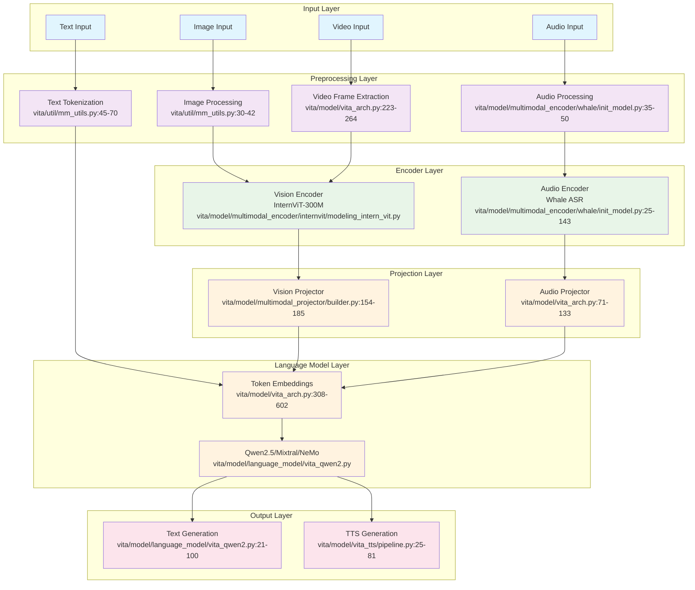

# VITA Model Inference Pipeline Documentation

This document provides a comprehensive overview of the VITA (Vision, Image, Text, Audio) model inference pipeline, including detailed architecture diagrams and source code references.

## Table of Contents

- [Overview](#overview)
- [Architecture Diagram](#architecture-diagram)
- [Pipeline Components](#pipeline-components)
- [Source Code References](#source-code-references)
- [Inference Flow](#inference-flow)
- [Multimodal Processing](#multimodal-processing)
- [Performance Considerations](#performance-considerations)

## Overview

VITA is a multimodal large language model that can process and understand text, images, audio, and video inputs. The inference pipeline follows a modular architecture where different modalities are processed by specialized encoders and then projected into a common embedding space for the language model to process.

## Architecture Diagram



## Pipeline Components

### 1. Input Processing Layer

#### Text Processing
- **File**: `vita/util/mm_utils.py:45-70`
- **Function**: `tokenizer_image_token()`, `tokenizer_image_audio_token()`
- **Purpose**: Converts text input into token IDs with special tokens for multimodal inputs
- **Key Features**:
  - Handles `<image>` and `<audio>` tokens
  - Manages BOS token insertion
  - Supports both single and multimodal tokenization

#### Image Processing
- **File**: `vita/util/mm_utils.py:30-42`
- **Function**: `process_images()`
- **Purpose**: Preprocesses images for vision encoder input
- **Key Features**:
  - Aspect ratio handling (pad mode)
  - Normalization using image processor
  - Batch processing support

#### Audio Processing
- **File**: `vita/model/multimodal_encoder/whale/init_model.py:35-50`
- **Function**: `audioEncoderProcessor.process()`
- **Purpose**: Converts audio files to mel-spectrogram features
- **Key Features**:
  - Resampling to target sample rate
  - Mel-filterbank extraction
  - CMVN normalization

#### Video Processing
- **File**: `web_demo/server.py:223-264`
- **Function**: `_process_video()`
- **Purpose**: Extracts frames from video for processing
- **Key Features**:
  - Frame sampling with configurable limits (max_frames=4, min_frames=4)
  - Time-based frame selection with start/end parameters
  - RGB conversion and preprocessing using decord VideoReader

### 2. Encoder Layer

#### Vision Encoder (InternViT-300M)
- **File**: `vita/model/multimodal_encoder/internvit/modeling_intern_vit.py`
- **Architecture**: Vision Transformer with 300M parameters
- **Input**: Preprocessed images (batch_size, channels, height, width)
- **Output**: Vision features (batch_size, num_patches, hidden_size)
- **Key Features**:
  - Patch embedding and positional encoding
  - Multi-head self-attention layers
  - Layer normalization and residual connections

#### Audio Encoder (Whale ASR)
- **File**: `vita/model/multimodal_encoder/whale/init_model.py:28-61`
- **Architecture**: Conformer-based encoder with CNN subsampling
- **Input**: Mel-spectrogram features from `audioEncoderProcessor.process()`
- **Output**: Audio embeddings
- **Key Features**:
  - CNN subsampling layers with attention masks
  - Conformer blocks with self-attention
  - Adapter layers for feature alignment
  - Support for multiple task types and prompt fine-tuning

### 3. Projection Layer

#### Vision Projector
- **File**: `vita/model/multimodal_projector/builder.py:154-185`
- **Types**: MLP, SPP, LDP, Vanilla, MiniGPT
- **Purpose**: Projects vision features to language model embedding space
- **Key Features**:
  - Configurable projection types
  - Dimension alignment (mm_hidden_size → hidden_size)
  - Activation functions (GELU, ReLU)

#### Audio Projector
- **File**: `vita/model/vita_arch.py:71-133`
- **Function**: `initialize_audio_modules()`
- **Purpose**: Aligns audio features with language model space
- **Key Features**:
  - Adapter layer integration with CNN/Linear adapters
  - Weight loading from pretrained models via safetensors
  - Feature dimension matching and prompt embedding support
  - Support for audio prompt fine-tuning

### 4. Language Model Layer

#### Core Language Models
- **Qwen2.5**: `vita/model/language_model/vita_qwen2.py`
- **Mixtral-8x7B**: `vita/model/language_model/vita_mixtral.py`
- **NeMo**: `vita/model/language_model/vita_nemo.py`

#### Multimodal Input Preparation
- **File**: `vita/model/vita_arch.py:308-602`
- **Function**: `prepare_inputs_labels_for_multimodal()`
- **Purpose**: Combines text, image, and audio embeddings
- **Key Features**:
  - Token embedding concatenation
  - Attention mask generation
  - Position ID assignment
  - Label preparation for training

### 5. Output Generation

#### Text Generation
- **File**: `vita/model/language_model/vita_qwen2.py:185-220`
- **Function**: `generate()`
- **Purpose**: Generates text output from multimodal inputs
- **Key Features**:
  - Causal language modeling with multimodal input preparation
  - Support for images, audios, and slow-fast pooling masks
  - Integration with prepare_inputs_labels_for_multimodal
  - Standard generation parameters (temperature, top_p, etc.)

#### TTS Generation
- **File**: `vita/model/vita_tts/pipeline.py:25-81`
- **Function**: `speech_dialogue()`
- **Purpose**: Converts text to speech using LLM-based TTS
- **Key Features**:
  - LLM-based TTS pipeline with encoder-LLM architecture
  - Support for past key values and caching
  - Audio feature processing with mel-spectrograms
  - Integration with audio codec generation

## Source Code References

### Core Architecture Files

| Component | File Path | Key Functions |
|-----------|-----------|---------------|
| Main Architecture | `vita/model/vita_arch.py` | `VITAMetaModel`, `VITAMetaForCausalLM` |
| Model Builder | `vita/model/builder.py` | `load_pretrained_model()` |
| Qwen2.5 Integration | `vita/model/language_model/vita_qwen2.py` | `VITAQwen2ForCausalLM` |
| Multimodal Utils | `vita/util/mm_utils.py` | `tokenizer_image_token()`, `process_images()` |

### Encoder Implementations

| Modality | File Path | Key Classes |
|----------|-----------|-------------|
| Vision | `vita/model/multimodal_encoder/internvit/modeling_intern_vit.py` | `InternVisionModel` |
| Audio | `vita/model/multimodal_encoder/whale/init_model.py` | `audioEncoderProcessor` |
| Projector | `vita/model/multimodal_projector/builder.py` | `build_vision_projector()` |

### Inference Pipeline

| Component | File Path | Key Functions |
|-----------|-----------|---------------|
| TTS Pipeline | `vita/model/vita_tts/pipeline.py` | `inferencePipeline.speech_dialogue()` |
| Demo Scripts | `3thrdparties/VITA/video_audio_demo.py` | `main()` |
| Web Server | `3thrdparties/VITA/web_demo/server.py` | `load_model()`, `tts_worker()` |

## Inference Flow

### 1. Input Validation and Preprocessing

```python
# Text tokenization with multimodal tokens
# IMAGE_TOKEN_INDEX = -200, AUDIO_TOKEN_INDEX = -500 (from vita/constants.py)
input_ids = tokenizer_image_audio_token(
    prompt, tokenizer, 
    image_token_index=IMAGE_TOKEN_INDEX,  # -200
    audio_token_index=AUDIO_TOKEN_INDEX   # -500
)

# Image preprocessing
images = process_images(image_list, image_processor, model_cfg)

# Audio preprocessing
audio_processor = audioEncoderProcessor(dataset_conf)
audio_features, attn_mask = audio_processor.process(audio_path)
```

### 2. Multimodal Encoding

```python
# Vision encoding
vision_features = vision_tower(images)
vision_embeddings = mm_projector(vision_features)

# Audio encoding
audio_embeddings = audio_encoder(audio_features, attn_mask)
```

### 3. Input Preparation

```python
# Combine all modalities
input_embeds = prepare_inputs_labels_for_multimodal(
    input_ids=input_ids,
    images=images,
    audios=audio_data,
    attention_mask=attention_mask,
    position_ids=position_ids
)
```

### 4. Language Model Generation

```python
# Generate text output
outputs = model.generate(
    inputs=input_ids,
    images=images,
    audios=audio_data,
    max_new_tokens=512,
    temperature=0.7,
    do_sample=True
)
```

### 5. TTS Generation (Optional)

```python
# Convert text to speech
tts_output = tts_pipeline.speech_dialogue(
    audio=audio_input,
    text=generated_text
)
```

## Multimodal Processing

### Image Processing Pipeline

1. **Input**: Raw image files (JPG, PNG, etc.)
2. **Preprocessing**: Resize, normalize, convert to tensor
3. **Vision Encoder**: InternViT-300M extracts visual features
4. **Projection**: Features projected to language model space
5. **Integration**: Combined with text tokens

### Audio Processing Pipeline

1. **Input**: Audio files (WAV, MP3, etc.)
2. **Preprocessing**: Resample, extract mel-spectrograms
3. **Audio Encoder**: Whale ASR encoder processes audio
4. **Projection**: Audio features aligned with text space
5. **Integration**: Combined with text and vision tokens

### Video Processing Pipeline

1. **Input**: Video files (MP4, AVI, etc.)
2. **Frame Extraction**: Sample frames at specified intervals
3. **Vision Processing**: Each frame processed as image
4. **Temporal Integration**: Frame features combined
5. **Output**: Video understanding capabilities

## Performance Considerations

### Memory Optimization

- **Gradient Checkpointing**: Reduces memory usage during training
- **Mixed Precision**: FP16/BF16 for faster inference
- **Model Parallelism**: Distribute layers across multiple GPUs
- **Dynamic Batching**: Efficient batch processing

### Speed Optimization

- **Flash Attention**: Faster attention computation
- **KV Cache**: Reuse computed key-value pairs
- **Streaming Generation**: Real-time text generation
- **Quantization**: INT8/INT4 for deployment

### Scalability

- **Multi-GPU Support**: Distributed inference
- **Batch Processing**: Handle multiple requests
- **Model Sharding**: Split large models across devices
- **Caching**: Cache encoder outputs for repeated inputs

## Configuration Options

### Model Configuration

```python
config = {
    "model_type": "qwen2p5_instruct",  # or "mixtral-8x7b", "nemo"
    "vision_tower": "InternViT-300M-448px",
    "audio_encoder": "whale-asr-encoder",
    "mm_projector_type": "mlp2x_gelu",
    "max_sequence_length": 2048,
    "temperature": 0.7,
    "top_p": 0.9
}
```

### Inference Parameters

```python
generation_config = {
    "max_new_tokens": 512,
    "temperature": 0.7,
    "top_p": 0.9,
    "do_sample": True,
    "use_cache": True,
    "stopping_criteria": [stopping_criteria]
}
```

This documentation provides a comprehensive overview of the VITA model inference pipeline with detailed source code references. Each component is designed to be modular and extensible, allowing for easy integration of new modalities and improvements to existing functionality.
