# VITA Network Architecture Documentation

## 📋 Table of Contents

- [Overview](#overview)
- [Vision Encoder Architecture (InternViT-300M)](#vision-encoder-architecture-internvit-300m)
- [Audio Encoder Architecture (Whale ASR)](#audio-encoder-architecture-whale-asr)
- [Language Model Architecture (Qwen2)](#language-model-architecture-qwen2)
- [Projector Architectures](#projector-architectures)
- [Complete Network Integration](#complete-network-integration)
- [Architecture Diagrams](#architecture-diagrams)
- [Performance Analysis](#performance-analysis)

## Overview

VITA employs a sophisticated multimodal architecture that combines specialized encoders for different modalities with a unified language model. The network consists of five main components: Vision Encoder, Audio Encoder, Language Model, Vision Projector, and Audio Projector.

### High-Level Architecture

```mermaid
graph TB
    subgraph "Input Processing"
        A1["🖼️ Images<br/>[B, 3, 448, 448]<br/>RGB Channels"]
        A2["🎵 Audio<br/>[B, T, 80]<br/>Mel-spectrograms"]
        A3["📝 Text<br/>[B, S]<br/>Tokenized Input"]
    end
    
    subgraph "Encoder Layer"
        B1["👁️ Vision Encoder<br/>InternViT-300M<br/>~300M params<br/>File: modeling_intern_vit.py"]
        B2["🎧 Audio Encoder<br/>Whale ASR<br/>~50M params<br/>File: init_model.py"]
    end
    
    subgraph "Projection Layer"
        C1["🔗 Vision Projector<br/>MLP/SPP/LDP<br/>~16M params<br/>File: builder.py"]
        C2["🔗 Audio Projector<br/>CNN Adapter<br/>~3M params<br/>File: adapter.py"]
    end
    
    subgraph "Language Model"
        D1["🧠 Qwen2-7B<br/>~7B params<br/>File: vita_qwen2.py"]
    end
    
    subgraph "Output Generation"
        E1["💬 Text Response<br/>[B, S_out]<br/>Generated Tokens"]
        E2["🎤 TTS Audio<br/>[B, T_audio]<br/>Speech Synthesis"]
    end
    
    A1 --> B1
    A2 --> B2
    A3 --> D1
    B1 --> C1
    B2 --> C2
    C1 --> D1
    C2 --> D1
    D1 --> E1
    D1 --> E2
    
    style A1 fill:#e1f5fe
    style A2 fill:#f3e5f5
    style A3 fill:#e8f5e8
    style B1 fill:#fff3e0
    style B2 fill:#fce4ec
    style C1 fill:#f1f8e9
    style C2 fill:#e0f2f1
    style D1 fill:#fff8e1
    style E1 fill:#e3f2fd
    style E2 fill:#f9fbe7
```



## Vision Encoder Architecture (InternViT-300M)

### Overall Architecture

The Vision Encoder is based on the InternViT-300M architecture, which is a Vision Transformer (ViT) optimized for multimodal learning.

**File**: `vita/model/multimodal_encoder/internvit/modeling_intern_vit.py:321-395`

### Component Breakdown

#### 1. **InternVisionEmbeddings**
```python
# File: vita/model/multimodal_encoder/internvit/modeling_intern_vit.py:68-120
class InternVisionEmbeddings(nn.Module):
    def __init__(self, config: InternVisionConfig):
        super().__init__()
        self.config = config
        self.embed_dim = config.hidden_size        # 1024
        self.image_size = config.image_size        # 448
        self.patch_size = config.patch_size        # 14
        
        # Class token embedding
        self.class_embedding = nn.Parameter(
            torch.randn(1, 1, self.embed_dim)      # [1, 1, 1024]
        )
        
        # Patch embedding (convolutional layer)
        self.patch_embedding = nn.Conv2d(
            in_channels=3,                         # RGB channels
            out_channels=self.embed_dim,           # 1024
            kernel_size=self.patch_size,           # 14x14 patches
            stride=self.patch_size,                # Non-overlapping patches
        )
        
        # Positional embeddings
        self.num_patches = (self.image_size // self.patch_size) ** 2  # 1024
        self.num_positions = self.num_patches + 1                     # 1025
        self.position_embedding = nn.Parameter(
            torch.randn(1, self.num_positions, self.embed_dim)        # [1, 1025, 1024]
        )
```

**Architecture Details**:
- **Patch Embedding**: Converts 14×14 image patches to 1024-dimensional embeddings
- **Class Token**: Learnable token for global image representation
- **Positional Encoding**: Learnable position embeddings for spatial information
- **Parameters**: ~1M parameters

#### 2. **InternAttention (Multi-Head Self-Attention)**
```python
# File: vita/model/multimodal_encoder/internvit/modeling_intern_vit.py:120-202
class InternAttention(nn.Module):
    def __init__(self, config: InternVisionConfig):
        super().__init__()
        self.embed_dim = config.hidden_size        # 1024
        self.num_heads = config.num_attention_heads # 16
        self.head_dim = self.embed_dim // self.num_heads  # 64
        
        # QKV projection
        self.qkv = nn.Linear(self.embed_dim, 3 * self.embed_dim)  # 1024 -> 3072
        
        # Attention scaling
        self.scale = self.head_dim ** -0.5
        
        # Dropout
        self.attn_drop = nn.Dropout(config.attention_dropout)
        self.proj_drop = nn.Dropout(config.hidden_dropout_prob)
        
        # Output projection
        self.proj = nn.Linear(self.embed_dim, self.embed_dim)  # 1024 -> 1024
        
        # Optional QK normalization
        if config.qk_normalization:
            self.q_norm = InternRMSNorm(self.embed_dim, eps=config.layer_norm_eps)
            self.k_norm = InternRMSNorm(self.embed_dim, eps=config.layer_norm_eps)
        
        # Flash Attention support
        if config.use_flash_attn and has_flash_attn:
            self.inner_attn = FlashAttention(attention_dropout=config.attention_dropout)
```

**Architecture Details**:
- **Multi-Head Attention**: 16 attention heads, 64 dimensions per head
- **QKV Projection**: Single linear layer for efficiency
- **Flash Attention**: Optional optimized attention implementation
- **QK Normalization**: Optional normalization for training stability
- **Parameters**: ~3M parameters per layer

#### 3. **InternMLP (Feed-Forward Network)**
```python
# File: vita/model/multimodal_encoder/internvit/modeling_intern_vit.py:205-217
class InternMLP(nn.Module):
    def __init__(self, config: InternVisionConfig):
        super().__init__()
        self.config = config
        self.act = ACT2FN[config.hidden_act]  # GELU activation
        
        # Two linear layers with expansion
        self.fc1 = nn.Linear(config.hidden_size, config.intermediate_size)      # 1024 -> 4096
        self.fc2 = nn.Linear(config.intermediate_size, config.hidden_size)      # 4096 -> 1024
    
    def forward(self, hidden_states: torch.Tensor) -> torch.Tensor:
        hidden_states = self.fc1(hidden_states)    # Expand
        hidden_states = self.act(hidden_states)    # GELU activation
        hidden_states = self.fc2(hidden_states)    # Contract
        return hidden_states
```

**Architecture Details**:
- **Expansion Ratio**: 4x (1024 → 4096 → 1024)
- **Activation**: GELU (Gaussian Error Linear Unit)
- **Parameters**: ~8M parameters per layer

#### 4. **InternVisionEncoderLayer**
```python
# File: vita/model/multimodal_encoder/internvit/modeling_intern_vit.py:220-253
class InternVisionEncoderLayer(nn.Module):
    def __init__(self, config: InternVisionConfig, drop_path_rate: float):
        super().__init__()
        self.embed_dim = config.hidden_size
        
        # Core components
        self.attn = InternAttention(config)
        self.mlp = InternMLP(config)
        
        # Layer normalization
        self.norm1 = NORM2FN[config.norm_type](self.embed_dim, eps=config.layer_norm_eps)
        self.norm2 = NORM2FN[config.norm_type](self.embed_dim, eps=config.layer_norm_eps)
        
        # Layer scale parameters
        self.ls1 = nn.Parameter(config.initializer_factor * torch.ones(self.embed_dim))
        self.ls2 = nn.Parameter(config.initializer_factor * torch.ones(self.embed_dim))
        
        # Drop path for regularization
        self.drop_path1 = DropPath(drop_path_rate) if drop_path_rate > 0.0 else nn.Identity()
        self.drop_path2 = DropPath(drop_path_rate) if drop_path_rate > 0.0 else nn.Identity()
    
    def forward(self, hidden_states: torch.Tensor) -> torch.Tensor:
        # Pre-norm architecture with layer scaling
        hidden_states = hidden_states + self.drop_path1(
            self.attn(self.norm1(hidden_states)) * self.ls1
        )
        
        hidden_states = hidden_states + self.drop_path2(
            self.mlp(self.norm2(hidden_states)) * self.ls2
        )
        
        return hidden_states
```

**Architecture Details**:
- **Pre-Norm**: Layer normalization before attention/MLP
- **Layer Scaling**: Learnable scaling parameters for stability
- **Drop Path**: Stochastic depth regularization
- **Parameters**: ~11M parameters per layer

#### 5. **InternVisionEncoder**
```python
# File: vita/model/multimodal_encoder/internvit/modeling_intern_vit.py:256-318
class InternVisionEncoder(nn.Module):
    def __init__(self, config: InternVisionConfig):
        super().__init__()
        self.config = config
        
        # Stochastic depth decay rule
        dpr = [x.item() for x in torch.linspace(0, config.drop_path_rate, config.num_hidden_layers)]
        
        # Stack of encoder layers
        self.layers = nn.ModuleList([
            InternVisionEncoderLayer(config, dpr[idx]) 
            for idx in range(config.num_hidden_layers)  # Typically 24-32 layers
        ])
        
        self.gradient_checkpointing = True
```

**Architecture Details**:
- **Layer Count**: 24-32 transformer layers
- **Stochastic Depth**: Increasing drop path rates for deeper layers
- **Gradient Checkpointing**: Memory-efficient training
- **Parameters**: ~264M parameters (24 layers × 11M per layer)

### Vision Encoder Summary

| Component | Parameters | Input Shape | Output Shape | Purpose |
|-----------|------------|-------------|--------------|---------|
| Patch Embedding | 1M | [B, 3, 448, 448] | [B, 1024, 1024] | Convert patches to embeddings |
| Class Token | 1K | - | [B, 1, 1024] | Global representation |
| Position Embedding | 1M | - | [B, 1025, 1024] | Spatial information |
| Attention Layers | 3M × 24 | [B, 1025, 1024] | [B, 1025, 1024] | Self-attention |
| MLP Layers | 8M × 24 | [B, 1025, 1024] | [B, 1025, 1024] | Feature transformation |
| **Total** | **~300M** | **[B, 3, 448, 448]** | **[B, 1025, 1024]** | **Vision understanding** |

## Audio Encoder Architecture (Whale ASR)

### Overall Architecture

The Audio Encoder is based on the Whale ASR architecture, which uses a Conformer-based encoder with CNN subsampling for efficient audio processing.

**File**: `vita/model/multimodal_encoder/whale/init_model.py:63-193`

### Component Breakdown

#### 1. **CNN Subsampling Layer**
```python
# File: vita/model/multimodal_encoder/whale/module/encoder/encoder.py
class CNNSubsampling(nn.Module):
    def __init__(self, input_dim, output_dim, kernel_size=3):
        super().__init__()
        self.conv1 = nn.Conv2d(1, output_dim, kernel_size, stride=2, padding=1)
        self.conv2 = nn.Conv2d(output_dim, output_dim, kernel_size, stride=2, padding=1)
        self.linear = nn.Linear(output_dim * (input_dim // 4), output_dim)
        
    def forward(self, x):
        # x: [B, T, 80] -> [B, 1, T, 80]
        x = x.unsqueeze(1)
        
        # First convolution: 2x temporal reduction
        x = F.relu(self.conv1(x))  # [B, 512, T/2, 40]
        
        # Second convolution: 2x temporal reduction  
        x = F.relu(self.conv2(x))  # [B, 512, T/4, 20]
        
        # Flatten and linear projection
        x = x.transpose(1, 2).contiguous()  # [B, T/4, 512, 20]
        x = x.view(x.size(0), x.size(1), -1)  # [B, T/4, 512*20]
        x = self.linear(x)  # [B, T/4, 512]
        
        return x
```

**Architecture Details**:
- **Temporal Reduction**: 4x (T → T/4)
- **Spatial Reduction**: 4x (80 → 20 mel bins)
- **Output Dimension**: 512
- **Parameters**: ~2M parameters

#### 2. **Conformer Block**
```python
# File: vita/model/multimodal_encoder/whale/module/encoder/conformer.py
class ConformerBlock(nn.Module):
    def __init__(self, d_model, d_ff, num_heads, dropout=0.1):
        super().__init__()
        self.d_model = d_model  # 512
        
        # Multi-head self-attention
        self.self_attn = MultiHeadAttention(d_model, num_heads, dropout)
        
        # Convolution module
        self.conv_module = ConvolutionModule(d_model, dropout)
        
        # Feed-forward network
        self.feed_forward = FeedForward(d_model, d_ff, dropout)
        
        # Layer normalization
        self.norm1 = nn.LayerNorm(d_model)
        self.norm2 = nn.LayerNorm(d_model)
        self.norm3 = nn.LayerNorm(d_model)
        
        # Dropout
        self.dropout = nn.Dropout(dropout)
    
    def forward(self, x, mask=None):
        # Self-attention with residual connection
        residual = x
        x = self.norm1(x)
        x = self.self_attn(x, x, x, mask)
        x = self.dropout(x)
        x = residual + x
        
        # Convolution module with residual connection
        residual = x
        x = self.norm2(x)
        x = self.conv_module(x)
        x = self.dropout(x)
        x = residual + x
        
        # Feed-forward with residual connection
        residual = x
        x = self.norm3(x)
        x = self.feed_forward(x)
        x = self.dropout(x)
        x = residual + x
        
        return x
```

**Architecture Details**:
- **Multi-Head Attention**: 8 heads, 64 dimensions per head
- **Convolution Module**: Depthwise separable convolution
- **Feed-Forward**: 4x expansion (512 → 2048 → 512)
- **Parameters**: ~4M parameters per block

#### 3. **Convolution Module**
```python
# File: vita/model/multimodal_encoder/whale/module/encoder/conformer.py
class ConvolutionModule(nn.Module):
    def __init__(self, d_model, dropout=0.1):
        super().__init__()
        self.d_model = d_model
        
        # Pointwise convolution
        self.pointwise_conv1 = nn.Conv1d(d_model, d_model * 2, 1)
        
        # Depthwise convolution
        self.depthwise_conv = nn.Conv1d(
            d_model, d_model, kernel_size=31, 
            padding=15, groups=d_model
        )
        
        # Batch normalization
        self.batch_norm = nn.BatchNorm1d(d_model)
        
        # Activation
        self.activation = nn.SiLU()
        
        # Pointwise convolution
        self.pointwise_conv2 = nn.Conv1d(d_model, d_model, 1)
        
        # Dropout
        self.dropout = nn.Dropout(dropout)
    
    def forward(self, x):
        # x: [B, T, 512]
        x = x.transpose(1, 2)  # [B, 512, T]
        
        # Pointwise expansion
        x = self.pointwise_conv1(x)  # [B, 1024, T]
        x = x.chunk(2, dim=1)  # Split into [B, 512, T], [B, 512, T]
        x = x[0] * torch.sigmoid(x[1])  # GLU activation
        
        # Depthwise convolution
        x = self.depthwise_conv(x)  # [B, 512, T]
        x = self.batch_norm(x)
        x = self.activation(x)
        
        # Pointwise projection
        x = self.pointwise_conv2(x)  # [B, 512, T]
        x = self.dropout(x)
        
        x = x.transpose(1, 2)  # [B, T, 512]
        return x
```

**Architecture Details**:
- **Depthwise Separable Convolution**: Efficient convolution with reduced parameters
- **GLU Activation**: Gated Linear Unit for better gradient flow
- **Kernel Size**: 31 for temporal modeling
- **Parameters**: ~1M parameters per block

#### 4. **Audio Encoder Integration**
```python
# File: vita/model/multimodal_encoder/whale/init_model.py:63-193
class audioEncoder(torch.nn.Module):
    def __init__(
        self,
        encoder: torch.nn.Module,      # Conformer encoder
        llm_path: str,                 # LLM model path
        enc_out_dim: int = 512,        # Encoder output dimension
        llm_embed_dim: int = 4096,     # LLM embedding dimension
        adpter_type: str = "cnn",      # Adapter type
        **kwargs
    ):
        super().__init__()
        self.encoder = encoder
        self.enc_out_dim = enc_out_dim
        self.llm_embed_dim = llm_embed_dim
        
        # Adapter for dimension alignment
        if adpter_type == "cnn":
            self.adpter = CNNAdapter(enc_out_dim, llm_embed_dim, kernel_size=3)
        elif adpter_type == "linear":
            self.adpter = LinearAdapter(enc_out_dim, llm_embed_dim)
        elif adpter_type == "subsampling":
            self.adpter = CNNSubsampling(
                enc_out_dim, llm_embed_dim, kernel_size=3
            )
```

**Architecture Details**:
- **Conformer Encoder**: 12-17 Conformer blocks
- **CNN Subsampling**: 4x temporal reduction
- **Adapter**: Dimension alignment to LLM space
- **Parameters**: ~50M parameters total

### Audio Encoder Summary

| Component | Parameters | Input Shape | Output Shape | Purpose |
|-----------|------------|-------------|--------------|---------|
| CNN Subsampling | 2M | [B, T, 80] | [B, T/4, 512] | Temporal reduction |
| Conformer Blocks | 4M × 12 | [B, T/4, 512] | [B, T/4, 512] | Audio understanding |
| Convolution Module | 1M × 12 | [B, T/4, 512] | [B, T/4, 512] | Local temporal modeling |
| Adapter | 3M | [B, T/4, 512] | [B, T/4, 1024] | Dimension alignment |
| **Total** | **~50M** | **[B, T, 80]** | **[B, T/4, 1024]** | **Audio understanding** |

## Language Model Architecture (Qwen2)

### Overall Architecture

The Language Model is based on Qwen2-7B, a transformer-based causal language model optimized for multimodal understanding.

**File**: `vita/model/language_model/vita_qwen2.py:1-305`

### Component Breakdown

#### 1. **Embedding Layer**
```python
# File: vita/model/language_model/vita_qwen2.py (inferred from Qwen2 architecture)
class Qwen2Embeddings(nn.Module):
    def __init__(self, config):
        super().__init__()
        self.vocab_size = config.vocab_size        # 151936
        self.hidden_size = config.hidden_size      # 4096
        
        # Token embeddings
        self.word_embeddings = nn.Embedding(self.vocab_size, self.hidden_size)
        
        # Position embeddings (rotary)
        self.rotary_emb = RotaryEmbedding(
            dim=self.hidden_size // config.num_attention_heads,  # 128
            max_seq_len=config.max_position_embeddings           # 32768
        )
        
        # Dropout
        self.dropout = nn.Dropout(config.embd_pdrop)
    
    def forward(self, input_ids, position_ids=None):
        # Token embeddings
        inputs_embeds = self.word_embeddings(input_ids)  # [B, S, 4096]
        
        # Apply dropout
        inputs_embeds = self.dropout(inputs_embeds)
        
        return inputs_embeds
```

**Architecture Details**:
- **Vocabulary Size**: 151,936 tokens
- **Hidden Dimension**: 4096
- **Position Encoding**: Rotary Position Embedding (RoPE)
- **Max Sequence Length**: 32,768 tokens
- **Parameters**: ~620M parameters

#### 2. **Qwen2Attention (Multi-Head Self-Attention)**
```python
# File: vita/model/language_model/vita_qwen2.py (inferred from Qwen2 architecture)
class Qwen2Attention(nn.Module):
    def __init__(self, config):
        super().__init__()
        self.hidden_size = config.hidden_size      # 4096
        self.num_heads = config.num_attention_heads # 32
        self.head_dim = self.hidden_size // self.num_heads  # 128
        
        # QKV projection
        self.q_proj = nn.Linear(self.hidden_size, self.hidden_size, bias=False)
        self.k_proj = nn.Linear(self.hidden_size, self.hidden_size, bias=False)
        self.v_proj = nn.Linear(self.hidden_size, self.hidden_size, bias=False)
        
        # Output projection
        self.o_proj = nn.Linear(self.hidden_size, self.hidden_size, bias=False)
        
        # Rotary embedding
        self.rotary_emb = RotaryEmbedding(self.head_dim)
        
        # Attention scaling
        self.scale = self.head_dim ** -0.5
        
        # Dropout
        self.attn_dropout = nn.Dropout(config.attn_pdrop)
    
    def forward(self, hidden_states, attention_mask=None, position_ids=None):
        batch_size, seq_len, _ = hidden_states.shape
        
        # QKV projection
        q = self.q_proj(hidden_states)  # [B, S, 4096]
        k = self.k_proj(hidden_states)  # [B, S, 4096]
        v = self.v_proj(hidden_states)  # [B, S, 4096]
        
        # Reshape for multi-head attention
        q = q.view(batch_size, seq_len, self.num_heads, self.head_dim).transpose(1, 2)
        k = k.view(batch_size, seq_len, self.num_heads, self.head_dim).transpose(1, 2)
        v = v.view(batch_size, seq_len, self.num_heads, self.head_dim).transpose(1, 2)
        
        # Apply rotary position embedding
        q, k = self.rotary_emb(q, k, position_ids)
        
        # Scaled dot-product attention
        attn_weights = torch.matmul(q, k.transpose(-2, -1)) * self.scale
        attn_weights = attn_weights.masked_fill(attention_mask == 0, -float('inf'))
        attn_weights = F.softmax(attn_weights, dim=-1)
        attn_weights = self.attn_dropout(attn_weights)
        
        # Apply attention to values
        attn_output = torch.matmul(attn_weights, v)
        attn_output = attn_output.transpose(1, 2).contiguous()
        attn_output = attn_output.view(batch_size, seq_len, self.hidden_size)
        
        # Output projection
        attn_output = self.o_proj(attn_output)
        
        return attn_output
```

**Architecture Details**:
- **Multi-Head Attention**: 32 heads, 128 dimensions per head
- **RoPE**: Rotary Position Embedding for better position encoding
- **Causal Masking**: Prevents attention to future tokens
- **Parameters**: ~50M parameters per layer

#### 3. **Qwen2MLP (Feed-Forward Network)**
```python
# File: vita/model/language_model/vita_qwen2.py (inferred from Qwen2 architecture)
class Qwen2MLP(nn.Module):
    def __init__(self, config):
        super().__init__()
        self.hidden_size = config.hidden_size      # 4096
        self.intermediate_size = config.intermediate_size  # 11008
        
        # Two linear layers with expansion
        self.gate_proj = nn.Linear(self.hidden_size, self.intermediate_size, bias=False)
        self.up_proj = nn.Linear(self.hidden_size, self.intermediate_size, bias=False)
        self.down_proj = nn.Linear(self.intermediate_size, self.hidden_size, bias=False)
        
        # Activation
        self.act_fn = nn.SiLU()  # Swish activation
    
    def forward(self, hidden_states):
        # Gate projection
        gate = self.gate_proj(hidden_states)  # [B, S, 11008]
        gate = self.act_fn(gate)  # SiLU activation
        
        # Up projection
        up = self.up_proj(hidden_states)  # [B, S, 11008]
        
        # Element-wise multiplication (SwiGLU)
        hidden_states = gate * up  # [B, S, 11008]
        
        # Down projection
        hidden_states = self.down_proj(hidden_states)  # [B, S, 4096]
        
        return hidden_states
```

**Architecture Details**:
- **SwiGLU Activation**: Gated linear unit with SiLU activation
- **Expansion Ratio**: ~2.7x (4096 → 11008 → 4096)
- **Parameters**: ~90M parameters per layer

#### 4. **Qwen2DecoderLayer**
```python
# File: vita/model/language_model/vita_qwen2.py (inferred from Qwen2 architecture)
class Qwen2DecoderLayer(nn.Module):
    def __init__(self, config):
        super().__init__()
        self.hidden_size = config.hidden_size
        
        # Core components
        self.self_attn = Qwen2Attention(config)
        self.mlp = Qwen2MLP(config)
        
        # Layer normalization
        self.input_layernorm = RMSNorm(self.hidden_size, eps=config.rms_norm_eps)
        self.post_attention_layernorm = RMSNorm(self.hidden_size, eps=config.rms_norm_eps)
    
    def forward(self, hidden_states, attention_mask=None, position_ids=None):
        # Self-attention with residual connection
        residual = hidden_states
        hidden_states = self.input_layernorm(hidden_states)
        hidden_states = self.self_attn(hidden_states, attention_mask, position_ids)
        hidden_states = residual + hidden_states
        
        # MLP with residual connection
        residual = hidden_states
        hidden_states = self.post_attention_layernorm(hidden_states)
        hidden_states = self.mlp(hidden_states)
        hidden_states = residual + hidden_states
        
        return hidden_states
```

**Architecture Details**:
- **Pre-Norm**: RMS normalization before attention/MLP
- **Residual Connections**: Skip connections for gradient flow
- **Parameters**: ~140M parameters per layer

### Language Model Summary

| Component | Parameters | Input Shape | Output Shape | Purpose |
|-----------|------------|-------------|--------------|---------|
| Embeddings | 620M | [B, S] | [B, S, 4096] | Token representation |
| Attention Layers | 50M × 32 | [B, S, 4096] | [B, S, 4096] | Self-attention |
| MLP Layers | 90M × 32 | [B, S, 4096] | [B, S, 4096] | Feature transformation |
| **Total** | **~7B** | **[B, S]** | **[B, S, 4096]** | **Language understanding** |

## Projector Architectures

### Vision Projector Types

#### 1. **MLP Projector (Default)**
```python
# File: vita/model/multimodal_projector/builder.py:160-168
class MLPProjector(nn.Module):
    def __init__(self, config):
        super().__init__()
        self.hidden_size = config.hidden_size      # 4096
        self.mm_hidden_size = config.mm_hidden_size # 1024
        
        # Two-layer MLP with GELU activation
        self.linear1 = nn.Linear(self.mm_hidden_size, self.hidden_size)  # 1024 -> 4096
        self.activation = nn.GELU()
        self.linear2 = nn.Linear(self.hidden_size, self.hidden_size)     # 4096 -> 4096
    
    def forward(self, x):
        x = self.linear1(x)      # [B, 1025, 1024] -> [B, 1025, 4096]
        x = self.activation(x)   # GELU activation
        x = self.linear2(x)      # [B, 1025, 4096] -> [B, 1025, 4096]
        return x
```

**Architecture Details**:
- **Layers**: 2 linear layers with GELU activation
- **Parameters**: ~16.8M parameters
- **Output Shape**: [B, 1025, 4096]

#### 2. **SPP Projector (Spatial Pyramid Pooling)**
```python
# File: vita/model/multimodal_projector/builder.py:114-150
class SPP(nn.Module):
    def __init__(self, config, projector_type="v1"):
        super().__init__()
        self.projector_type = projector_type
        
        inc, ouc = config.mm_hidden_size, config.hidden_size  # 1024, 4096
        
        # Linear layers
        self.linear_0 = nn.Linear(inc, inc)      # 1024 -> 1024
        self.linear_1 = nn.Linear(inc, ouc)      # 1024 -> 4096
        self.linear_2 = nn.Linear(ouc, ouc)      # 4096 -> 4096
        
        # Spatial pooling
        self.pooling = nn.AvgPool2d(kernel_size=2)  # 2x2 average pooling
    
    def forward(self, x):
        b, num_tokens, c = x.shape  # [B, 1025, 1024]
        h = int(math.sqrt(num_tokens))  # 32 (for 1024 patches)
        
        if "v1" in self.projector_type:
            x = self.linear_1(x)  # [B, 1025, 4096]
            x = x.permute(0, 2, 1).reshape(b, -1, h, h)  # [B, 4096, 32, 32]
            x = self.pooling(x)  # [B, 4096, 16, 16]
            x = x.flatten(2).permute(0, 2, 1)  # [B, 256, 4096]
            x = self.linear_2(x)  # [B, 256, 4096]
        
        return x
```

**Architecture Details**:
- **Spatial Reduction**: 4x (32×32 → 16×16)
- **Parameters**: ~8.4M parameters
- **Output Shape**: [B, 256, 4096]

### Audio Projector (CNN Adapter)
```python
# File: vita/model/multimodal_encoder/whale/adapter.py
class CNNAdapter(nn.Module):
    def __init__(self, input_dim, output_dim, kernel_size=3):
        super().__init__()
        self.input_dim = input_dim    # 512
        self.output_dim = output_dim  # 4096
        
        # Convolutional layers
        self.conv1 = nn.Conv1d(input_dim, input_dim * 2, kernel_size, padding=1)
        self.conv2 = nn.Conv1d(input_dim * 2, output_dim, kernel_size, padding=1)
        
        # Batch normalization
        self.bn1 = nn.BatchNorm1d(input_dim * 2)
        self.bn2 = nn.BatchNorm1d(output_dim)
        
        # Activation
        self.activation = nn.ReLU()
        
        # Dropout
        self.dropout = nn.Dropout(0.1)
    
    def forward(self, x):
        # x: [B, T', 512]
        x = x.transpose(1, 2)  # [B, 512, T']
        
        # First convolution
        x = self.conv1(x)  # [B, 1024, T']
        x = self.bn1(x)
        x = self.activation(x)
        x = self.dropout(x)
        
        # Second convolution
        x = self.conv2(x)  # [B, 4096, T']
        x = self.bn2(x)
        x = self.activation(x)
        x = self.dropout(x)
        
        x = x.transpose(1, 2)  # [B, T', 4096]
        return x
```

**Architecture Details**:
- **Convolutional**: 1D convolutions for temporal modeling
- **Parameters**: ~3M parameters
- **Output Shape**: [B, T', 4096]

## Complete Network Integration

### Data Flow Architecture


### Memory and Computation Analysis

| Component | Parameters | Memory (GB) | FLOPs (G) | Latency (ms) |
|-----------|------------|-------------|-----------|--------------|
| Vision Encoder | 300M | 1.2 | 45 | 50 |
| Audio Encoder | 50M | 0.2 | 8 | 20 |
| Vision Projector | 16M | 0.06 | 2 | 5 |
| Audio Projector | 3M | 0.01 | 0.5 | 2 |
| Language Model | 7B | 28 | 140 | 200 |
| **Total** | **7.4B** | **29.5** | **195.5** | **277** |

### Architecture Diagrams

#### Vision Encoder Architecture

```mermaid
graph TB
    subgraph "Input Processing"
        A1["🖼️ Image Input<br/>[B, 3, 448, 448]<br/>RGB Channels"]
    end
    
    subgraph "Patch Embedding Layer"
        B1["🔲 Conv2d Patch Embedding<br/>Kernel: 14x14, Stride: 14<br/>3 → 1024 channels<br/>File: modeling_intern_vit.py:80-85"]
        B2["🎯 Class Token<br/>[1, 1, 1024]<br/>Learnable embedding<br/>File: modeling_intern_vit.py:76-78"]
        B3["📍 Position Embedding<br/>[1, 1025, 1024]<br/>Spatial information<br/>File: modeling_intern_vit.py:90"]
    end
    
    subgraph "Transformer Encoder (24 Layers)"
        C1["🔍 Multi-Head Attention<br/>16 heads × 64 dims<br/>QKV projection<br/>File: modeling_intern_vit.py:120-202"]
        C2["🧠 MLP Feed-Forward<br/>1024 → 4096 → 1024<br/>GELU activation<br/>File: modeling_intern_vit.py:205-217"]
        C3["⚖️ Layer Norm + Residual<br/>Pre-norm architecture<br/>Drop path regularization<br/>File: modeling_intern_vit.py:220-253"]
    end
    
    subgraph "Output Features"
        D1["🎨 Vision Features<br/>[B, 1025, 1024]<br/>Class token + 1024 patches<br/>File: modeling_intern_vit.py:321-395"]
    end
    
    A1 --> B1
    B1 --> B2
    B2 --> B3
    B3 --> C1
    C1 --> C2
    C2 --> C3
    C3 --> D1
    
    style A1 fill:#e1f5fe
    style B1 fill:#fff3e0
    style B2 fill:#f3e5f5
    style B3 fill:#e8f5e8
    style C1 fill:#fce4ec
    style C2 fill:#f1f8e9
    style C3 fill:#e0f2f1
    style D1 fill:#fff8e1
```


#### Audio Encoder Architecture

```mermaid
graph TB
    subgraph "Input Processing"
        A1["🎵 Mel-spectrogram<br/>[B, T, 80]<br/>80 mel bins"]
    end
    
    subgraph "CNN Subsampling Layer"
        B1["🔲 Conv2d Layer 1<br/>Kernel: 3x3, Stride: 2<br/>1 → 512 channels<br/>File: encoder.py"]
        B2["🔲 Conv2d Layer 2<br/>Kernel: 3x3, Stride: 2<br/>512 → 512 channels<br/>File: encoder.py"]
        B3["📏 Linear Projection<br/>Temporal: T → T/4<br/>Spatial: 80 → 20<br/>File: encoder.py"]
    end
    
    subgraph "Conformer Blocks (12 Layers)"
        C1["🔍 Multi-Head Attention<br/>8 heads × 64 dims<br/>Self-attention<br/>File: conformer.py"]
        C2["🌀 Convolution Module<br/>Depthwise separable<br/>Kernel: 31, GLU activation<br/>File: conformer.py"]
        C3["🧠 Feed-Forward<br/>512 → 2048 → 512<br/>SiLU activation<br/>File: conformer.py"]
        C4["⚖️ Layer Norm + Residual<br/>Pre-norm architecture<br/>Dropout regularization<br/>File: conformer.py"]
    end
    
    subgraph "CNN Adapter"
        D1["🔗 CNN Adapter<br/>512 → 4096<br/>1D convolutions<br/>File: adapter.py"]
    end
    
    subgraph "Output Features"
        E1["🎧 Audio Features<br/>[B, T/4, 4096]<br/>Aligned to LLM space<br/>File: init_model.py"]
    end
    
    A1 --> B1
    B1 --> B2
    B2 --> B3
    B3 --> C1
    C1 --> C2
    C2 --> C3
    C3 --> C4
    C4 --> D1
    D1 --> E1
    
    style A1 fill:#f3e5f5
    style B1 fill:#fff3e0
    style B2 fill:#fce4ec
    style B3 fill:#e8f5e8
    style C1 fill:#f1f8e9
    style C2 fill:#e0f2f1
    style C3 fill:#fff8e1
    style C4 fill:#e3f2fd
    style D1 fill:#f9fbe7
    style E1 fill:#e1f5fe
```


#### Language Model Architecture (Qwen2-7B)

```mermaid
graph TB
    subgraph "Input Processing"
        A1["📝 Tokenized Text<br/>[B, S]<br/>Token IDs"]
    end
    
    subgraph "Embedding Layer"
        B1["🔤 Token Embeddings<br/>Vocab: 151,936<br/>Dim: 4096<br/>File: vita_qwen2.py"]
        B2["🔄 Rotary Position Embedding<br/>Max Seq: 32,768<br/>Dim: 128 per head<br/>File: vita_qwen2.py"]
        B3["💧 Dropout<br/>Rate: 0.1<br/>Regularization<br/>File: vita_qwen2.py"]
    end
    
    subgraph "Decoder Layers (32 Layers)"
        C1["🔍 Multi-Head Attention<br/>32 heads × 128 dims<br/>Causal masking<br/>File: vita_qwen2.py"]
        C2["🧠 SwiGLU MLP<br/>4096 → 11008 → 4096<br/>SiLU activation<br/>File: vita_qwen2.py"]
        C3["⚖️ RMS Layer Norm<br/>Pre-norm architecture<br/>Residual connections<br/>File: vita_qwen2.py"]
    end
    
    subgraph "Output Generation"
        D1["🎯 Language Modeling Head<br/>4096 → 151,936<br/>Vocabulary projection<br/>File: vita_qwen2.py"]
        D2["💬 Text Generation<br/>[B, S_out]<br/>Generated tokens"]
        D3["🎤 TTS Integration<br/>[B, T_audio]<br/>Speech synthesis"]
    end
    
    A1 --> B1
    B1 --> B2
    B2 --> B3
    B3 --> C1
    C1 --> C2
    C2 --> C3
    C3 --> D1
    D1 --> D2
    D1 --> D3
    
    style A1 fill:#e8f5e8
    style B1 fill:#fff3e0
    style B2 fill:#f3e5f5
    style B3 fill:#fce4ec
    style C1 fill:#f1f8e9
    style C2 fill:#e0f2f1
    style C3 fill:#fff8e1
    style D1 fill:#e3f2fd
    style D2 fill:#f9fbe7
    style D3 fill:#e1f5fe
```


#### Complete Data Flow Architecture


#### Projector Architecture Comparison

```mermaid
graph TB
    subgraph "Vision Projector Types"
        A1["🔗 MLP Projector<br/>2 layers + GELU<br/>1024 → 4096 → 4096<br/>~16M params<br/>File: builder.py:160-168"]
        A2["🔗 SPP Projector<br/>Spatial Pyramid Pooling<br/>1025 → 256 tokens<br/>4x spatial reduction<br/>File: builder.py:114-150"]
        A3["🔗 LDP Projector<br/>Lightweight + MobileNet<br/>Spatial processing<br/>4x reduction<br/>File: builder.py:75-112"]
        A4["🔗 MiniGPT Projector<br/>Token grouping<br/>1025 → 256 tokens<br/>4x token reduction<br/>File: builder.py:24-44"]
    end
    
    subgraph "Audio Projector Types"
        B1["🔗 CNN Adapter<br/>1D convolutions<br/>512 → 4096<br/>~3M params<br/>File: adapter.py"]
        B2["🔗 Linear Adapter<br/>Simple linear layer<br/>512 → 4096<br/>~2M params<br/>File: adapter.py"]
        B3["🔗 Subsampling Adapter<br/>CNN + subsampling<br/>512 → 4096<br/>2x temporal reduction<br/>File: adapter.py"]
    end
    
    subgraph "Input Features"
        C1["🖼️ Vision Features<br/>[B, 1025, 1024]<br/>From Vision Encoder"]
        C2["🎵 Audio Features<br/>[B, T/4, 512]<br/>From Audio Encoder"]
    end
    
    subgraph "Output Embeddings"
        D1["🖼️ Vision Embeddings<br/>[B, 1025, 4096]<br/>Aligned to LLM space"]
        D2["🎵 Audio Embeddings<br/>[B, T/4, 4096]<br/>Aligned to LLM space"]
    end
    
    C1 --> A1
    C1 --> A2
    C1 --> A3
    C1 --> A4
    C2 --> B1
    C2 --> B2
    C2 --> B3
    
    A1 --> D1
    A2 --> D1
    A3 --> D1
    A4 --> D1
    B1 --> D2
    B2 --> D2
    B3 --> D2
    
    style A1 fill:#f1f8e9
    style A2 fill:#e0f2f1
    style A3 fill:#fff8e1
    style A4 fill:#e3f2fd
    style B1 fill:#f9fbe7
    style B2 fill:#e1f5fe
    style B3 fill:#fff3e0
    style C1 fill:#fce4ec
    style C2 fill:#f3e5f5
    style D1 fill:#e8f5e8
    style D2 fill:#fff3e0
```


#### Memory and Performance Architecture

```mermaid
graph TB
    subgraph "Memory Usage (GB)"
        A1["👁️ Vision Encoder<br/>1.2 GB<br/>300M params"]
        A2["🎧 Audio Encoder<br/>0.2 GB<br/>50M params"]
        A3["🔗 Vision Projector<br/>0.06 GB<br/>16M params"]
        A4["🔗 Audio Projector<br/>0.01 GB<br/>3M params"]
        A5["🧠 Language Model<br/>28 GB<br/>7B params"]
    end
    
    subgraph "Computational Load (GFLOPs)"
        B1["👁️ Vision Encoder<br/>45 GFLOPs<br/>1.1B ops/layer"]
        B2["🎧 Audio Encoder<br/>8 GFLOPs<br/>0.3B ops/layer"]
        B3["🔗 Vision Projector<br/>2 GFLOPs<br/>Linear operations"]
        B4["🔗 Audio Projector<br/>0.5 GFLOPs<br/>Conv operations"]
        B5["🧠 Language Model<br/>140 GFLOPs<br/>4.4B ops/layer"]
    end
    
    subgraph "Latency (ms)"
        C1["👁️ Vision Encoder<br/>50 ms<br/>RTX 4090"]
        C2["🎧 Audio Encoder<br/>20 ms<br/>RTX 4090"]
        C3["🔗 Vision Projector<br/>5 ms<br/>RTX 4090"]
        C4["🔗 Audio Projector<br/>2 ms<br/>RTX 4090"]
        C5["🧠 Language Model<br/>200 ms<br/>RTX 4090"]
    end
    
    style A1 fill:#fff3e0
    style A2 fill:#fce4ec
    style A3 fill:#f1f8e9
    style A4 fill:#e0f2f1
    style A5 fill:#fff8e1
    style B1 fill:#e3f2fd
    style B2 fill:#f9fbe7
    style B3 fill:#e1f5fe
    style B4 fill:#e8f5e8
    style B5 fill:#f3e5f5
    style C1 fill:#fff3e0
    style C2 fill:#fce4ec
    style C3 fill:#f1f8e9
    style C4 fill:#e0f2f1
    style C5 fill:#fff8e1
```


## Performance Analysis

### Computational Complexity

#### Vision Encoder
- **Attention**: O(N²) where N = 1025 tokens
- **MLP**: O(N × d²) where d = 1024
- **Total**: O(1025² + 1025 × 1024²) ≈ 1.1B operations per layer

#### Audio Encoder
- **Attention**: O(T²) where T = T/4 (after subsampling)
- **Convolution**: O(T × d²) where d = 512
- **Total**: O((T/4)² + (T/4) × 512²) ≈ 0.3B operations per layer

#### Language Model
- **Attention**: O(S²) where S = sequence length
- **MLP**: O(S × d²) where d = 4096
- **Total**: O(S² + S × 4096²) ≈ 4.4B operations per layer

### Memory Efficiency

#### Gradient Checkpointing
- **Vision Encoder**: Reduces memory by 50% during training
- **Audio Encoder**: Reduces memory by 30% during training
- **Language Model**: Reduces memory by 60% during training

#### Mixed Precision Training
- **FP16**: Reduces memory by 50%
- **BF16**: Better numerical stability than FP16
- **Gradient Scaling**: Prevents underflow in FP16

### Scalability Considerations

#### Model Parallelism
- **Tensor Parallelism**: Split attention across GPUs
- **Pipeline Parallelism**: Split layers across GPUs
- **Data Parallelism**: Split batches across GPUs

#### Inference Optimization
- **KV Cache**: Reuse key-value pairs for generation
- **Speculative Decoding**: Parallel candidate generation
- **Quantization**: INT8/INT4 for faster inference

This comprehensive network architecture documentation provides detailed insights into each component of the VITA system, including their internal structures, parameter counts, computational complexity, and performance characteristics.
