# VITA Preprocessing Layer Documentation

## 📋 Table of Contents

- [Overview](#overview)
- [Text Preprocessing](#text-preprocessing)
- [Image Preprocessing](#image-preprocessing)
- [Audio Preprocessing](#audio-preprocessing)
- [Video Preprocessing](#video-preprocessing)
- [Real-time Audio Processing](#real-time-audio-processing)
- [Real-time Video Processing](#real-time-video-processing)
- [Input Validation](#input-validation)
- [Output Formats](#output-formats)
- [Performance Considerations](#performance-considerations)

## Overview

The VITA Preprocessing Layer is responsible for converting raw multimodal inputs (text, images, audio, video) into standardized formats suitable for the encoder layers. It handles both static file inputs and real-time streaming data from web clients.

### Key Components

```mermaid
graph TB
    subgraph "Input Sources"
        A1["📝 Text Input"]
        A2["🖼️ Image Input"]
        A3["🎵 Audio Input"]
        A4["🎬 Video Input"]
        A5["📡 Real-time Audio"]
        A6["📹 Real-time Video"]
    end
    
    subgraph "Preprocessing Functions"
        B1["🔤 Text Tokenization<br/>vita/util/mm_utils.py:45-109"]
        B2["🖼️ Image Processing<br/>vita/util/mm_utils.py:30-42"]
        B3["🎵 Audio Processing<br/>vita/model/multimodal_encoder/whale/init_model.py:28-61"]
        B4["🎬 Video Processing<br/>web_demo/server.py:223-264"]
        B5["📡 Real-time Audio<br/>web_demo/server.py:720-786"]
        B6["📹 Real-time Video<br/>web_demo/server.py:897-920"]
    end
    
    subgraph "Output Formats"
        C1["📝 Token IDs"]
        C2["🖼️ Pixel Values"]
        C3["🎵 Mel-spectrograms"]
        C4["🎬 Frame Sequences"]
    end
    
    A1 --> B1
    A2 --> B2
    A3 --> B3
    A4 --> B4
    A5 --> B5
    A6 --> B6
    
    B1 --> C1
    B2 --> C2
    B3 --> C3
    B4 --> C2
    B5 --> C3
    B6 --> C2
```



## Text Preprocessing

### Implementation

**File**: `vita/util/mm_utils.py:45-109`

The text preprocessing handles tokenization of prompts containing special multimodal tokens (`<image>`, `<audio>`, `<video>`).

#### Key Functions

##### `tokenizer_image_token()`
```python
# File: vita/util/mm_utils.py:45-70
def tokenizer_image_token(
    prompt, tokenizer, image_token_index=IMAGE_TOKEN_INDEX, return_tensors=None
):
    """
    Tokenize text with image tokens.
    
    Args:
        prompt (str): Text prompt containing <image> tokens
        tokenizer: HuggingFace tokenizer
        image_token_index (int): Special token index for images
        return_tensors (str): Return format ("pt" for PyTorch tensors)
    
    Returns:
        list or torch.Tensor: Token IDs
    """
    prompt_chunks = [tokenizer(chunk).input_ids for chunk in prompt.split("<image>")]
    
    def insert_separator(X, sep):
        return [ele for sublist in zip(X, [sep] * len(X)) for ele in sublist][:-1]
    
    input_ids = []
    offset = 0
    if (
        len(prompt_chunks) > 0
        and len(prompt_chunks[0]) > 0
        and prompt_chunks[0][0] == tokenizer.bos_token_id
    ):
        offset = 1
        input_ids.append(prompt_chunks[0][0])
    
    for x in insert_separator(prompt_chunks, [image_token_index] * (offset + 1)):
        input_ids.extend(x[offset:])
    
    if return_tensors is not None:
        if return_tensors == "pt":
            return torch.tensor(input_ids, dtype=torch.long)
        raise ValueError(f"Unsupported tensor type: {return_tensors}")
    return input_ids
```

##### `tokenizer_image_audio_token()`
```python
# File: vita/util/mm_utils.py:73-109
def tokenizer_image_audio_token(
    prompt,
    tokenizer,
    image_token_index=IMAGE_TOKEN_INDEX,
    audio_token_index=AUDIO_TOKEN_INDEX,
    return_tensors=None,
):
    """
    Tokenize text with both image and audio tokens.
    
    Args:
        prompt (str): Text prompt containing <image> and <audio> tokens
        tokenizer: HuggingFace tokenizer
        image_token_index (int): Special token index for images
        audio_token_index (int): Special token index for audio
        return_tensors (str): Return format ("pt" for PyTorch tensors)
    
    Returns:
        list or torch.Tensor: Token IDs
    """
    prompt_chunks = []
    for chunk in re.split(r"(<audio>|<image>)", prompt):
        if chunk == "<audio>":
            prompt_chunks.append([audio_token_index])
        elif chunk == "<image>":
            prompt_chunks.append([image_token_index])
        else:
            prompt_chunks.append(tokenizer(chunk).input_ids)
    
    input_ids = []
    offset = 0
    if (
        len(prompt_chunks) > 0
        and len(prompt_chunks[0]) > 0
        and prompt_chunks[0][0] == tokenizer.bos_token_id
    ):
        offset = 1
        input_ids.append(prompt_chunks[0][0])
    
    for x in prompt_chunks:
        if x != [image_token_index] and x != [audio_token_index]:
            input_ids.extend(x[offset:])
        else:
            input_ids.extend(x[:])
    
    if return_tensors is not None:
        if return_tensors == "pt":
            return torch.tensor(input_ids, dtype=torch.long)
        raise ValueError(f"Unsupported tensor type: {return_tensors}")
    return input_ids
```

### Input Format
- **Text**: String containing natural language with special tokens
- **Special Tokens**: `<image>`, `<audio>`, `<video>`
- **Example**: `"Describe this image <image> and analyze the audio <audio>"`

### Output Format
- **Type**: List of integers or PyTorch tensor
- **Shape**: `[seq_len]` where `seq_len` is the number of tokens
- **Special Token Indices**: 
  - `IMAGE_TOKEN_INDEX = -200`
  - `AUDIO_TOKEN_INDEX = -500`

## Image Preprocessing

### Implementation

**File**: `vita/util/mm_utils.py:30-42`

#### Key Function

##### `process_images()`
```python
# File: vita/util/mm_utils.py:30-42
def process_images(images, image_processor, model_cfg):
    """
    Process images for model input.
    
    Args:
        images: List of PIL Images or single PIL Image
        image_processor: HuggingFace image processor
        model_cfg: Model configuration
    
    Returns:
        torch.Tensor: Processed pixel values
    """
    image_aspect_ratio = getattr(model_cfg, "image_aspect_ratio", None)
    new_images = []
    if image_aspect_ratio == "pad":
        for image in images:
            image = expand2square(image, tuple(int(x * 255) for x in image_processor.image_mean))
            image = image_processor.preprocess(image, return_tensors="pt")["pixel_values"][0]
            new_images.append(image)
    else:
        return image_processor(images, return_tensors="pt")["pixel_values"]
    if all(x.shape == new_images[0].shape for x in new_images):
        new_images = torch.stack(new_images, dim=0)
    return new_images
```

##### `expand2square()`
```python
# File: vita/util/mm_utils.py:16-27
def expand2square(pil_img, background_color):
    """
    Expand image to square aspect ratio by padding.
    
    Args:
        pil_img: PIL Image
        background_color: Background color tuple (R, G, B)
    
    Returns:
        PIL.Image: Square image with padding
    """
    width, height = pil_img.size
    if width == height:
        return pil_img
    elif width > height:
        result = Image.new(pil_img.mode, (width, width), background_color)
        result.paste(pil_img, (0, (width - height) // 2))
        return result
    else:
        result = Image.new(pil_img.mode, (height, height), background_color)
        result.paste(pil_img, ((height - width) // 2, 0))
        return result
```

### Input Format
- **File Paths**: String paths to image files (JPG, PNG)
- **PIL Images**: Direct PIL Image objects
- **Base64**: Base64 encoded image data
- **NumPy Arrays**: Image data as numpy arrays

### Output Format
- **Type**: PyTorch tensor
- **Shape**: `[batch_size, 3, height, width]`
- **Data Type**: `torch.float32`
- **Value Range**: Normalized to [0, 1] or [-1, 1] depending on model requirements
- **Standard Size**: Typically `[batch_size, 3, 448, 448]`

## Audio Preprocessing

### Implementation

**File**: `vita/model/multimodal_encoder/whale/init_model.py:28-61`

#### Key Class

##### `audioEncoderProcessor`
```python
# File: vita/model/multimodal_encoder/whale/init_model.py:28-61
class audioEncoderProcessor:
    def __init__(self, dataset_conf: dict = None):
        """
        Initialize audio processor with dataset configuration.
        
        Args:
            dataset_conf (dict): Configuration for audio processing
        """
        self.dataset_conf = dataset_conf

    def process(self, wav_path):
        """
        Process audio file into mel-spectrogram features.
        
        Args:
            wav_path (str): Path to audio file
        
        Returns:
            tuple: (mel-spectrogram, attention_mask_length)
        """
        try:
            waveform, sample_rate = torchaudio.load(wav_path)
        except Exception as e:
            print(f"cannot open {wav_path}!!!!!!!!!!!!!!!!")
        
        # Resample if necessary
        if sample_rate != self.dataset_conf["resample_conf"]["resample_rate"]:
            waveform = torchaudio.transforms.Resample(
                orig_freq=sample_rate, 
                new_freq=self.dataset_conf["resample_conf"]["resample_rate"]
            )(waveform)
            sample_rate = self.dataset_conf['resample_conf']['resample_rate']

        # Scale to 16-bit range
        waveform = waveform * (1 << 15)
        
        # Extract mel-spectrogram features
        mat = kaldi.fbank(
            waveform,
            num_mel_bins=self.dataset_conf["fbank_conf"]["num_mel_bins"],
            frame_length=self.dataset_conf["fbank_conf"]["frame_length"],
            frame_shift=self.dataset_conf["fbank_conf"]["frame_shift"],
            dither=self.dataset_conf["fbank_conf"]["dither"],
            energy_floor=0.0,
            sample_frequency=sample_rate,
        )
        
        # Generate attention mask
        attn_mask = torch.ones(mat.shape[0])
        attn_mask = attn_mask[2::2][2::2][0::2]

        return mat, attn_mask.shape[0]
```

### Input Format
- **File Paths**: String paths to audio files (WAV, MP3)
- **Sample Rates**: Any sample rate (automatically resampled)
- **Channels**: Mono or stereo (converted to mono)

### Output Format
- **Type**: PyTorch tensor
- **Shape**: `[time_frames, num_mel_bins]`
- **Data Type**: `torch.float32`
- **Mel Bins**: Typically 80 mel-frequency bins
- **Time Frames**: Variable based on audio duration and frame shift

### Understanding Mel-Spectrograms

#### What is a Mel-Spectrogram?

A **mel-spectrogram** is a time-frequency representation of audio that mimics human auditory perception. It's derived from the regular spectrogram but uses the **mel scale**, which is a perceptual scale of pitches that better matches how humans perceive sound frequencies.

#### Key Concepts

##### 1. **Mel Scale**
The mel scale is a non-linear frequency scale that approximates human auditory perception:
- **Low frequencies** (0-1000 Hz): Nearly linear relationship with Hz
- **High frequencies** (>1000 Hz): Logarithmic relationship with Hz
- **Formula**: `mel = 2595 * log10(1 + frequency/700)`

##### 2. **Mel-Frequency Cepstral Coefficients (MFCC) vs Mel-Spectrogram**
- **MFCC**: Compressed representation using DCT (Discrete Cosine Transform)
- **Mel-Spectrogram**: Direct mel-scale frequency representation (used in VITA)
- **Advantage**: Mel-spectrograms preserve more frequency information

##### 3. **Mel Filter Bank**
A set of triangular filters that:
- Map linear frequency bins to mel-scale bins
- Typically 80 filters for speech processing
- Each filter has a triangular shape with peak at specific mel frequency

#### VITA's Mel-Spectrogram Processing

```python
# File: vita/model/multimodal_encoder/whale/init_model.py:48-56
mat = kaldi.fbank(
    waveform,
    num_mel_bins=self.dataset_conf["fbank_conf"]["num_mel_bins"],  # 80 bins
    frame_length=self.dataset_conf["fbank_conf"]["frame_length"],  # 25ms
    frame_shift=self.dataset_conf["fbank_conf"]["frame_shift"],    # 10ms
    dither=self.dataset_conf["fbank_conf"]["dither"],              # Noise reduction
    energy_floor=0.0,
    sample_frequency=sample_rate,  # 16kHz
)
```

#### Processing Steps

##### 1. **Pre-emphasis**
```python
# Applied before FFT to emphasize high frequencies
pre_emphasis = 0.97
emphasized_signal = np.append(signal[0], signal[1:] - pre_emphasis * signal[:-1])
```

##### 2. **Windowing**
- **Window Type**: Hamming window (25ms frames)
- **Purpose**: Reduce spectral leakage in FFT
- **Overlap**: 10ms shift (60% overlap)

##### 3. **FFT (Fast Fourier Transform)**
- Converts time-domain signal to frequency domain
- Produces magnitude spectrum for each frame

##### 4. **Mel Filter Bank Application**
```python
# Conceptual mel filter bank application
mel_spectrogram = np.dot(magnitude_spectrum, mel_filter_bank)
```

##### 5. **Log Transformation**
```python
# Convert to log scale (dB)
log_mel_spectrogram = np.log(mel_spectrogram + 1e-8)
```

#### Why Mel-Spectrograms for VITA?

##### 1. **Human Auditory Modeling**
- Matches how humans perceive pitch differences
- Better representation for speech and audio understanding

##### 2. **Dimensionality Reduction**
- 80 mel bins vs 512+ FFT bins
- Reduces computational complexity
- Preserves perceptually important information

##### 3. **Robustness**
- Less sensitive to noise in high frequencies
- Better generalization across different audio conditions

##### 4. **Standard in Speech Processing**
- Widely used in ASR (Automatic Speech Recognition)
- Compatible with pre-trained models
- Proven effectiveness in transformer architectures

#### Visual Representation

```
Raw Audio Waveform
    ↓
[Time Domain: 1D signal]
    ↓ FFT + Windowing
Linear Spectrogram
    ↓ Mel Filter Bank
Mel-Spectrogram
    ↓ Log Scale
Log Mel-Spectrogram
    ↓
[Time × Mel Bins: 2D tensor]
```

#### Typical Parameters in VITA

| Parameter | Value | Purpose |
|-----------|-------|---------|
| Sample Rate | 16kHz | Standard for speech processing |
| Frame Length | 25ms | Balance between time/frequency resolution |
| Frame Shift | 10ms | 60% overlap for smooth transitions |
| Mel Bins | 80 | Standard for speech recognition |
| Window | Hamming | Reduces spectral leakage |
| Pre-emphasis | 0.97 | Emphasizes high frequencies |

#### Mathematical Foundation

##### Mel Scale Conversion
```
mel = 2595 * log10(1 + frequency/700)
```

##### Mel Filter Bank
```
# Triangular filters with peak at mel frequency
for i in range(num_mel_bins):
    filter[i] = triangular_window(center_freq[i])
```

##### Log Mel-Spectrogram
```
log_mel = log(|FFT(signal)| * mel_filter_bank + ε)
```

#### Advantages for Multimodal Learning

1. **Consistent Representation**: Standardized format across different audio inputs
2. **Efficient Processing**: Reduced dimensionality for transformer models
3. **Perceptual Relevance**: Matches human auditory perception
4. **Robust Features**: Less sensitive to recording conditions
5. **Pre-trained Compatibility**: Works with existing audio models

This mel-spectrogram representation allows VITA to effectively process audio inputs alongside text and visual information, creating a unified multimodal representation for the language model.

## Video Preprocessing

### Implementation

**File**: `web_demo/server.py:223-264`

#### Key Function

##### `_process_video()`
```python
# File: web_demo/server.py:223-264
def _process_video(video_path, max_frames=4, min_frames=4, s=None, e=None):
    """
    Process video file by extracting frames.
    
    Args:
        video_path (str): Path to video file
        max_frames (int): Maximum number of frames to extract
        min_frames (int): Minimum number of frames to extract
        s (int): Start time in seconds
        e (int): End time in seconds
    
    Returns:
        list: List of PIL Images (frames)
    """
    # Handle time range parameters
    if s is None or e is None:
        start_time, end_time = None, None
    else:
        start_time = int(s)
        end_time = int(e)
        start_time = max(start_time, 0)
        end_time = max(end_time, 0)
        if start_time > end_time:
            start_time, end_time = end_time, start_time
        elif start_time == end_time:
            end_time = start_time + 1

    # Load video using decord for efficient decoding
    if os.path.exists(video_path):
        vreader = VideoReader(video_path, ctx=cpu(0))
    else:
        raise FileNotFoundError(f"Video file {video_path} does not exist.")

    # Calculate frame positions
    fps = vreader.get_avg_fps()
    f_start = 0 if start_time is None else int(start_time * fps)
    f_end = int(min(1000000000 if end_time is None else end_time * fps, len(vreader) - 1))
    num_frames = f_end - f_start + 1
    
    if num_frames > 0:
        # Sample frames based on max/min frame requirements
        all_pos = list(range(f_start, f_end + 1))
        if len(all_pos) > max_frames:
            sample_pos = [all_pos[_] for _ in np.linspace(0, len(all_pos) - 1, num=max_frames, dtype=int)]
        elif len(all_pos) < min_frames:
            sample_pos = [all_pos[_] for _ in np.linspace(0, len(all_pos) - 1, num=min_frames, dtype=int)]
        else:
            sample_pos = all_pos

        # Extract and return frames
        patch_images = [Image.fromarray(f) for f in vreader.get_batch(sample_pos).asnumpy()]
        return patch_images
    else:
        print("video path: {} error.".format(video_path))
```

### Input Format
- **File Paths**: String paths to video files (MP4, AVI, MOV)
- **Time Range**: Optional start and end times in seconds
- **Frame Limits**: Configurable min/max frame counts

### Output Format
- **Type**: List of PIL Images
- **Count**: 4 frames (default, configurable)
- **Size**: Original video resolution
- **Format**: RGB color space
- **Processing**: Frames are later processed through image preprocessing pipeline

## Real-time Audio Processing

### Implementation

**File**: `web_demo/server.py:720-786`

#### Key Function

##### `send_pcm()`
```python
# File: web_demo/server.py:720-786
def send_pcm(sid, request_inputs_queue):
    """
    Process real-time PCM audio data from WebSocket stream.
    
    Args:
        sid (str): Session ID
        request_inputs_queue: Queue for processed requests
    """
    chunk_size = connected_users[sid][1].wakeup_and_vad.get_chunk_size()

    print(f"Sid: {sid} Start listening")
    while True:
        if connected_users[sid][1].stop_pcm:
            print(f"Sid: {sid} Stop pcm")
            connected_users[sid][1].stop_generate = True 
            connected_users[sid][1].stop_tts = True
            break
            
        time.sleep(0.01)
        e = connected_users[sid][1].pcm_fifo_queue.get(chunk_size)
        if e is None:
            continue

        res = connected_users[sid][1].wakeup_and_vad.predict(e)

        if res is not None:
            if 'start' in res:
                print(f"Sid: {sid} Vad start")

            elif 'cache_dialog' in res:
                print(f"Sid: {sid} Vad end")

                directory = './chat_history'
                if not os.path.exists(directory):
                    os.makedirs(directory)
                audio_duration = len(res["cache_dialog"]) / target_sample_rate

                if audio_duration < 1:
                    print("The duration of the audio is less than 1s, skipping...")
                    continue

                current_time = datetime.datetime.now()
                timestamp = current_time.strftime("%Y%m%d_%H%M%S")
                audio_filename = f"{directory}/test_dialog_{timestamp}.wav"
                torchaudio.save(audio_filename, res["cache_dialog"].unsqueeze(0), target_sample_rate)

                video_filename = None
                if len(connected_users[sid][1].collected_images) > 0:
                    video_filename = f"{directory}/test_video_{timestamp}.mp4"
                    save_video(connected_users[sid][1].collected_images, video_filename)

                print("Start to generate response")
                if video_filename:
                    current_request = {
                        "prompt": "<video><audio>",
                        "multi_modal_data": {
                            "video": [video_filename],
                            "audio": [audio_filename],
                        },
                    }
                else:
                    current_request = {
                        "prompt": "<audio>",
                        "multi_modal_data": {
                            "audio": [audio_filename],
                        },
                    }
                print(f"Start to put request into queue {current_request}")
                request_inputs_queue.put(current_request)
```

### Input Format
- **Source**: WebSocket stream from web client
- **Format**: PCM audio data
- **Sample Rate**: 16kHz
- **Chunk Size**: 256 samples (16ms intervals)
- **Channels**: Mono

### Output Format
- **Temporary Files**: WAV files saved to disk
- **Duration Filter**: Minimum 1 second duration
- **Request Format**: Standardized request object with audio file path

## Real-time Video Processing

### Implementation

**File**: `web_demo/server.py:897-920`

#### Key Function

##### `handle_video_frame()`
```python
# File: web_demo/server.py:897-920
@socketio.on('video_frame')
def handle_video_frame(data):
    """
    Process real-time video frames from WebSocket stream.
    
    Args:
        data (str): Base64 encoded JPEG frame data
    """
    import cv2
    
    sid = request.sid
    if sid in connected_users:
        try:
            image_data = base64.b64decode(data.split(',')[1])
            nparr = np.frombuffer(image_data, np.uint8)
            frame = cv2.imdecode(nparr, cv2.IMREAD_COLOR)
            frame = cv2.cvtColor(frame, cv2.COLOR_BGR2RGB)
            
            current_time = time.time()
            if current_time - connected_users[sid][1].last_image_time > 1:
                connected_users[sid][1].collected_images.clear()
                print("Clearing the collected images")
            
            connected_users[sid][1].collected_images.append(frame)
            connected_users[sid][1].last_image_time = current_time
            
        except Exception as e:
            print(f"Error processing video frame: {e}")
    else:
        disconnect()
```

### Input Format
- **Source**: WebSocket stream from web client
- **Format**: Base64 encoded JPEG frames
- **Frame Rate**: 2 FPS
- **Compression**: JPEG 70% quality
- **Resolution**: Variable (client-dependent)

### Output Format
- **Storage**: In-memory frame collection
- **Timeout**: 1-second timeout for frame collection
- **Format**: NumPy arrays in RGB format
- **Processing**: Frames are later saved as MP4 video files

## Input Validation

### Token Count Validation

The preprocessing layer validates that the number of special tokens in the prompt matches the number of provided multimodal inputs:

```python
# File: web_demo/server.py:273-280
if "prompt" in inputs:
    assert inputs["prompt"].count(IMAGE_TOKEN) == len(image_inputs), \
        f"Number of image token {IMAGE_TOKEN} in prompt must match the number of image inputs."
elif "prompt_token_ids" in inputs:
    assert inputs["prompt_token_ids"].count(IMAGE_TOKEN_INDEX) == len(image_inputs), \
        f"Number of image token ids {IMAGE_TOKEN_INDEX} in prompt_token_ids must match the number of image inputs."
else:
    raise ValueError("Either 'prompt' or 'prompt_token_ids' must be provided.")
```

### File Existence Validation

```python
# File: web_demo/server.py:208-209
if isinstance(image_path, str):
    assert os.path.exists(image_path), f"Image file {image_path} does not exist."
```

### Video Processing Constraints

```python
# File: web_demo/server.py:302-308
assert "prompt" in inputs, "Prompt must be provided when video inputs are provided."
assert "image" not in inputs["multi_modal_data"], "Image inputs are not supported when video inputs are provided."
assert inputs["prompt"].count(VIDEO_TOKEN) == 1, "Currently only one video token is supported in prompt."
assert inputs["prompt"].count(VIDEO_TOKEN) == len(inputs["multi_modal_data"]["video"]), \
    f"Number of video token {VIDEO_TOKEN} in prompt must match the number of video inputs."
```

## Output Formats

### Standardized Request Format

After preprocessing, all inputs are converted to a standardized format:

```python
{
    "prompt": "<image><audio>",  # Text with special tokens
    "multi_modal_data": {
        "image": [processed_image_tensor],  # List of processed images
        "audio": [processed_audio_tensor],  # List of processed audio
        "video": [video_file_path]          # List of video file paths
    }
}
```

### Data Types and Shapes

| Input Type | Output Type | Shape | Data Type |
|------------|-------------|-------|-----------|
| Text | Token IDs | `[seq_len]` | `torch.long` |
| Image | Pixel Values | `[batch, 3, 448, 448]` | `torch.float32` |
| Audio | Mel-spectrogram | `[time_frames, 80]` | `torch.float32` |
| Video | Frame List | `[num_frames]` | `List[PIL.Image]` |

## Performance Considerations

### Memory Management
- **Image Processing**: Automatic batching and tensor stacking
- **Audio Processing**: Streaming processing for real-time inputs
- **Video Processing**: Frame sampling to limit memory usage

### Processing Speed
- **Decord**: Fast video decoding library
- **TorchAudio**: Optimized audio processing
- **PIL**: Efficient image operations

### Real-time Constraints
- **Audio**: 16ms processing intervals
- **Video**: 500ms frame collection intervals
- **VAD**: Voice Activity Detection for efficient processing

### Error Handling
- **File Validation**: Existence and format checks
- **Timeout Handling**: Automatic cleanup for real-time streams
- **Exception Recovery**: Graceful handling of processing errors

This preprocessing layer ensures that all multimodal inputs are properly formatted and validated before being passed to the encoder layers, maintaining consistency and reliability across the VITA inference pipeline.

## Practical Examples

### Text Preprocessing Examples

#### Input Example
```python
# Input text with special tokens
prompt = "Describe this image <image> and analyze the audio <audio>"
tokenizer = AutoTokenizer.from_pretrained("Qwen/Qwen2.5-7B-Instruct")

# Tokenizer configuration
print(f"BOS token: {tokenizer.bos_token} (ID: {tokenizer.bos_token_id})")
print(f"EOS token: {tokenizer.eos_token} (ID: {tokenizer.eos_token_id})")
print(f"Special tokens: <image> -> {IMAGE_TOKEN_INDEX}, <audio> -> {AUDIO_TOKEN_INDEX}")
```

#### Detailed Processing Steps
```python
# Step 1: Split by special tokens
prompt_chunks = prompt.split("<image>")
# Result: ["Describe this image ", " and analyze the audio <audio>"]

# Step 2: Tokenize each chunk
chunk_tokens = []
for chunk in prompt_chunks:
    if "<audio>" in chunk:
        # Handle audio token
        audio_parts = chunk.split("<audio>")
        chunk_tokens.append(tokenizer(audio_parts[0]).input_ids)  # " and analyze the audio"
        chunk_tokens.append([AUDIO_TOKEN_INDEX])  # -500
        if len(audio_parts) > 1:
            chunk_tokens.append(tokenizer(audio_parts[1]).input_ids)  # ""
    else:
        chunk_tokens.append(tokenizer(chunk).input_ids)

# Step 3: Insert image tokens between chunks
input_ids = []
offset = 0
if chunk_tokens[0][0] == tokenizer.bos_token_id:
    offset = 1
    input_ids.append(chunk_tokens[0][0])  # BOS token

# Insert image token and merge chunks
for i, chunk in enumerate(chunk_tokens):
    if i > 0:  # Insert image token before each chunk except first
        input_ids.append(IMAGE_TOKEN_INDEX)  # -200
    input_ids.extend(chunk[offset:])
```

#### Output Example
```python
# Final tokenized output
input_ids = [1, 151644, 8948, 25, 198, -200, 2610, 527, 264, 10950, 13, 198, -500, 2]

# Detailed breakdown:
# 1 = BOS token (tokenizer.bos_token_id)
# 151644 = "Describe" 
# 8948 = " this"
# 25 = " image"
# 198 = " " (space)
# -200 = IMAGE_TOKEN_INDEX (special token for image)
# 2610 = " and"
# 527 = " analyze"
# 264 = " the"
# 10950 = " audio"
# 13 = " " (space)
# 198 = " " (space)
# -500 = AUDIO_TOKEN_INDEX (special token for audio)
# 2 = EOS token (tokenizer.eos_token_id)

# Convert to tensor if needed
input_tensor = torch.tensor(input_ids, dtype=torch.long)
print(f"Input shape: {input_tensor.shape}")  # torch.Size([13])
```

### Image Preprocessing Examples

#### Input Example
```python
# Input: PIL Image or file path
image_path = "/path/to/image.jpg"
image = Image.open(image_path)

# Original image properties
print(f"Original size: {image.size}")  # (640, 480) - width x height
print(f"Mode: {image.mode}")  # RGB
print(f"Format: {image.format}")  # JPEG

# Convert to RGB if needed
if image.mode != 'RGB':
    image = image.convert('RGB')

# For web demo: flip horizontally (mirror effect)
image = image.transpose(Image.FLIP_LEFT_RIGHT)
```

#### Detailed Processing Steps
```python
# Step 1: Handle aspect ratio (pad to square if needed)
image_aspect_ratio = "pad"  # From model config
image_processor = AutoImageProcessor.from_pretrained("Qwen/Qwen2-VL-7B-Instruct")

if image_aspect_ratio == "pad":
    # Get background color from image processor
    background_color = tuple(int(x * 255) for x in image_processor.image_mean)
    # background_color = (123, 117, 104) for typical values [0.485, 0.456, 0.406]
    
    # Expand to square
    width, height = image.size  # (640, 480)
    if width > height:
        # Pad vertically
        new_size = (width, width)  # (640, 640)
        padded_image = Image.new('RGB', new_size, background_color)
        paste_y = (width - height) // 2  # 80
        padded_image.paste(image, (0, paste_y))
    else:
        # Pad horizontally
        new_size = (height, height)  # (480, 480)
        padded_image = Image.new('RGB', new_size, background_color)
        paste_x = (height - width) // 2  # 0
        padded_image.paste(image, (paste_x, 0))
    
    image = padded_image

# Step 2: Apply image processor (resize, normalize)
processed = image_processor(image, return_tensors="pt")
pixel_values = processed["pixel_values"][0]  # Remove batch dimension
```

#### Output Example
```python
# Processed image tensor
print(f"Processed shape: {pixel_values.shape}")  # torch.Size([3, 448, 448])

# Sample values (first few pixels)
print("R channel (first 3x3 pixels):")
print(pixel_values[0, :3, :3])
# tensor([[0.4850, 0.4850, 0.4850],
#         [0.4850, 0.4850, 0.4850],
#         [0.4850, 0.4850, 0.4850]])

print("G channel (first 3x3 pixels):")
print(pixel_values[1, :3, :3])
# tensor([[0.4560, 0.4560, 0.4560],
#         [0.4560, 0.4560, 0.4560],
#         [0.4560, 0.4560, 0.4560]])

print("B channel (first 3x3 pixels):")
print(pixel_values[2, :3, :3])
# tensor([[0.4060, 0.4060, 0.4060],
#         [0.4060, 0.4060, 0.4060],
#         [0.4060, 0.4060, 0.4060]])

# Value range: [-1, 1] (normalized with mean=[0.485, 0.456, 0.406], std=[0.229, 0.224, 0.225])
print(f"Value range: [{pixel_values.min():.3f}, {pixel_values.max():.3f}]")
# Value range: [-1.000, 1.000]

# For batch processing
batch_images = [image1, image2, image3]  # List of PIL Images
batch_processed = image_processor(batch_images, return_tensors="pt")
batch_pixel_values = batch_processed["pixel_values"]  # Shape: [3, 3, 448, 448]
```

### Audio Preprocessing Examples

#### Input Example
```python
# Input: Audio file path
audio_path = "/path/to/audio.wav"

# Load audio with torchaudio
waveform, sample_rate = torchaudio.load(audio_path)
print(f"Original waveform shape: {waveform.shape}")  # torch.Size([1, 48000])
print(f"Sample rate: {sample_rate}")  # 16000
print(f"Duration: {waveform.shape[1] / sample_rate:.2f} seconds")  # 3.00 seconds

# Raw audio properties
print(f"Channels: {waveform.shape[0]}")  # 1 (mono)
print(f"Samples: {waveform.shape[1]}")  # 48000
print(f"Value range: [{waveform.min():.3f}, {waveform.max():.3f}]")  # [-1.000, 1.000]
```

#### Detailed Processing Steps
```python
# Step 1: Resample if necessary
target_sample_rate = 16000
if sample_rate != target_sample_rate:
    resampler = torchaudio.transforms.Resample(
        orig_freq=sample_rate, 
        new_freq=target_sample_rate
    )
    waveform = resampler(waveform)
    sample_rate = target_sample_rate

# Step 2: Scale to 16-bit range
waveform = waveform * (1 << 15)  # Scale to [-32768, 32768]
print(f"Scaled waveform range: [{waveform.min():.0f}, {waveform.max():.0f}]")

# Step 3: Extract mel-spectrogram using Kaldi
dataset_conf = {
    "fbank_conf": {
        "num_mel_bins": 80,
        "frame_length": 25,  # 25ms
        "frame_shift": 10,   # 10ms
        "dither": 1.0
    },
    "resample_conf": {
        "resample_rate": 16000
    }
}

# Calculate mel-spectrogram
mat = kaldi.fbank(
    waveform,
    num_mel_bins=dataset_conf["fbank_conf"]["num_mel_bins"],
    frame_length=dataset_conf["fbank_conf"]["frame_length"],
    frame_shift=dataset_conf["fbank_conf"]["frame_shift"],
    dither=dataset_conf["fbank_conf"]["dither"],
    energy_floor=0.0,
    sample_frequency=sample_rate,
)

# Step 4: Generate attention mask
attn_mask = torch.ones(mat.shape[0])  # [num_frames]
# Apply CNN subsampling: [2::2][2::2][0::2] = 8x subsampling
attn_mask = attn_mask[2::2][2::2][0::2]
```

#### Output Example
```python
# Mel-spectrogram output
print(f"Mel-spectrogram shape: {mat.shape}")  # torch.Size([300, 80])
print(f"Time frames: {mat.shape[0]}")  # 300 frames
print(f"Mel bins: {mat.shape[1]}")  # 80 mel bins

# Sample values (first few frames and bins)
print("First 3 frames, first 5 mel bins:")
print(mat[:3, :5])
# tensor([[ 0.1234, -0.5678,  0.9012, -0.3456,  0.7890],
#         [ 0.2345, -0.4567,  0.8901, -0.2345,  0.6789],
#         [ 0.3456, -0.3456,  0.7890, -0.1234,  0.5678]])

# Attention mask
print(f"Attention mask shape: {attn_mask.shape}")  # torch.Size([37])
print(f"Attention mask length: {attn_mask.shape[0]}")  # 37

# Value statistics
print(f"Mel-spectrogram range: [{mat.min():.3f}, {mat.max():.3f}]")
print(f"Mean: {mat.mean():.3f}, Std: {mat.std():.3f}")

# Time resolution
frame_shift_ms = 10  # 10ms
total_duration_ms = mat.shape[0] * frame_shift_ms
print(f"Total duration: {total_duration_ms}ms ({total_duration_ms/1000:.2f}s)")

# Frequency resolution (mel bins)
print(f"Mel bins cover frequency range: 0Hz to {sample_rate//2}Hz")
print(f"Each mel bin represents: {sample_rate//2 / 80:.1f}Hz on average")
```

#### Real-world Audio Processing Example
```python
# Complete audio processing pipeline
def process_audio_file(audio_path):
    # Load audio
    waveform, sr = torchaudio.load(audio_path)
    
    # Resample to 16kHz
    if sr != 16000:
        resampler = torchaudio.transforms.Resample(sr, 16000)
        waveform = resampler(waveform)
    
    # Scale to 16-bit
    waveform = waveform * (1 << 15)
    
    # Extract mel-spectrogram
    mel_spec = kaldi.fbank(
        waveform,
        num_mel_bins=80,
        frame_length=25,
        frame_shift=10,
        dither=1.0,
        energy_floor=0.0,
        sample_frequency=16000,
    )
    
    # Generate attention mask
    attn_mask = torch.ones(mel_spec.shape[0])[2::2][2::2][0::2]
    
    return mel_spec, attn_mask.shape[0]

# Usage
mel_spec, attn_len = process_audio_file("/path/to/speech.wav")
print(f"Processed audio: {mel_spec.shape}, attention length: {attn_len}")
```

### Video Preprocessing Examples

#### Input Example
```python
# Input: Video file path
video_path = "/path/to/video.mp4"

# Video properties (using decord)
from decord import VideoReader, cpu
vreader = VideoReader(video_path, ctx=cpu(0))

print(f"Video length: {len(vreader)} frames")  # 300 frames
print(f"FPS: {vreader.get_avg_fps():.2f}")  # 30.00 FPS
print(f"Duration: {len(vreader) / vreader.get_avg_fps():.2f} seconds")  # 10.00 seconds
print(f"Resolution: {vreader[0].shape}")  # (1080, 1920, 3) - height x width x channels

# Optional: Specify time range
start_time = 2.0  # Start at 2 seconds
end_time = 8.0    # End at 8 seconds
```

#### Detailed Processing Steps
```python
# Step 1: Calculate frame positions
fps = vreader.get_avg_fps()  # 30.0
f_start = int(start_time * fps) if start_time else 0  # 60
f_end = int(end_time * fps) if end_time else len(vreader) - 1  # 240
num_frames = f_end - f_start + 1  # 181 frames

print(f"Frame range: {f_start} to {f_end} ({num_frames} frames)")

# Step 2: Sample frames based on max/min requirements
max_frames = 4
min_frames = 4

all_pos = list(range(f_start, f_end + 1))  # [60, 61, 62, ..., 240]

if len(all_pos) > max_frames:
    # Sample 4 frames evenly across the range
    sample_pos = [all_pos[i] for i in np.linspace(0, len(all_pos) - 1, num=max_frames, dtype=int)]
    # sample_pos = [60, 120, 180, 240]
elif len(all_pos) < min_frames:
    # Repeat frames if not enough
    sample_pos = [all_pos[i] for i in np.linspace(0, len(all_pos) - 1, num=min_frames, dtype=int)]
else:
    sample_pos = all_pos

print(f"Selected frame positions: {sample_pos}")

# Step 3: Extract frames using decord
frame_batch = vreader.get_batch(sample_pos)  # Shape: [4, 1080, 1920, 3]
frames = [Image.fromarray(frame) for frame in frame_batch.asnumpy()]
```

#### Output Example
```python
# Extracted frames
print(f"Number of frames: {len(frames)}")  # 4

for i, frame in enumerate(frames):
    print(f"Frame {i+1}: {frame.size} {frame.mode}")  # (1920, 1080) RGB

# Frame properties
frame_0 = frames[0]
print(f"Frame 0 shape: {np.array(frame_0).shape}")  # (1080, 1920, 3)
print(f"Frame 0 dtype: {np.array(frame_0).dtype}")  # uint8
print(f"Frame 0 value range: [{np.array(frame_0).min()}, {np.array(frame_0).max()}]")  # [0, 255]

# Sample pixel values (top-left 3x3 region)
sample_pixels = np.array(frame_0)[:3, :3, :]
print("Sample RGB values (top-left 3x3):")
print(sample_pixels)
# array([[[120, 130, 140], [121, 131, 141], [122, 132, 142]],
#        [[123, 133, 143], [124, 134, 144], [125, 135, 145]],
#        [[126, 136, 146], [127, 137, 147], [128, 138, 148]]])

# Time information for each frame
for i, pos in enumerate(sample_pos):
    timestamp = pos / fps
    print(f"Frame {i+1}: position {pos}, timestamp {timestamp:.2f}s")
# Frame 1: position 60, timestamp 2.00s
# Frame 2: position 120, timestamp 4.00s  
# Frame 3: position 180, timestamp 6.00s
# Frame 4: position 240, timestamp 8.00s
```

#### Real-world Video Processing Example
```python
def process_video_file(video_path, max_frames=4, min_frames=4, start_time=None, end_time=None):
    """
    Process video file and extract frames.
    
    Args:
        video_path: Path to video file
        max_frames: Maximum number of frames to extract
        min_frames: Minimum number of frames to extract
        start_time: Start time in seconds (optional)
        end_time: End time in seconds (optional)
    
    Returns:
        List of PIL Images
    """
    # Load video
    vreader = VideoReader(video_path, ctx=cpu(0))
    fps = vreader.get_avg_fps()
    
    # Calculate frame positions
    f_start = 0 if start_time is None else int(start_time * fps)
    f_end = len(vreader) - 1 if end_time is None else int(end_time * fps)
    f_start = max(f_start, 0)
    f_end = min(f_end, len(vreader) - 1)
    
    if f_start > f_end:
        f_start, f_end = f_end, f_start
    elif f_start == f_end:
        f_end = f_start + 1
    
    # Sample frames
    all_pos = list(range(f_start, f_end + 1))
    if len(all_pos) > max_frames:
        sample_pos = [all_pos[i] for i in np.linspace(0, len(all_pos) - 1, num=max_frames, dtype=int)]
    elif len(all_pos) < min_frames:
        sample_pos = [all_pos[i] for i in np.linspace(0, len(all_pos) - 1, num=min_frames, dtype=int)]
    else:
        sample_pos = all_pos
    
    # Extract frames
    frame_batch = vreader.get_batch(sample_pos)
    frames = [Image.fromarray(frame) for frame in frame_batch.asnumpy()]
    
    return frames

# Usage
frames = process_video_file("/path/to/video.mp4", max_frames=4, start_time=1.0, end_time=5.0)
print(f"Extracted {len(frames)} frames from video")
```

### Real-time Audio Processing Examples

#### Input Example
```python
# WebSocket audio stream from client
pcm_data = b'\x00\x01\x02\x03\x04\x05\x06\x07...'  # 256 samples, 16-bit PCM
chunk_size = 256  # samples per chunk
sample_rate = 16000  # Hz
chunk_duration = chunk_size / sample_rate  # 0.016 seconds (16ms)

print(f"PCM chunk size: {len(pcm_data)} bytes")  # 512 bytes (256 samples * 2 bytes)
print(f"Chunk duration: {chunk_duration * 1000:.1f}ms")  # 16.0ms
print(f"Sample rate: {sample_rate}Hz")

# Convert bytes to numpy array
import numpy as np
pcm_array = np.frombuffer(pcm_data, dtype=np.int16)
print(f"PCM array shape: {pcm_array.shape}")  # (256,)
print(f"PCM value range: [{pcm_array.min()}, {pcm_array.max()}]")  # [-32768, 32767]
```

#### Detailed Processing Steps
```python
# Step 1: Add to FIFO queue
connected_users[sid][1].pcm_fifo_queue.put(pcm_array)

# Step 2: Process chunk with VAD
chunk_size = connected_users[sid][1].wakeup_and_vad.get_chunk_size()
e = connected_users[sid][1].pcm_fifo_queue.get(chunk_size)

# Step 3: Voice Activity Detection
res = connected_users[sid][1].wakeup_and_vad.predict(e)

if res is not None:
    if 'start' in res:
        print("Voice activity detected - starting recording")
    elif 'cache_dialog' in res:
        print("Voice activity ended - processing audio")
        
        # Step 4: Validate audio duration
        audio_duration = len(res["cache_dialog"]) / target_sample_rate
        if audio_duration < 1.0:
            print("Audio too short, skipping...")
            continue
        
        # Step 5: Save audio file
        current_time = datetime.datetime.now()
        timestamp = current_time.strftime("%Y%m%d_%H%M%S")
        audio_filename = f"./chat_history/test_dialog_{timestamp}.wav"
        
        # Convert to tensor and save
        audio_tensor = res["cache_dialog"].unsqueeze(0)  # Add channel dimension
        torchaudio.save(audio_filename, audio_tensor, target_sample_rate)
        
        print(f"Saved audio: {audio_filename}")
        print(f"Duration: {audio_duration:.2f} seconds")
```

#### Output Example
```python
# Processed audio file
audio_filename = "./chat_history/test_dialog_20241201_143022.wav"

# File properties
import os
file_size = os.path.getsize(audio_filename)
print(f"Audio file: {audio_filename}")
print(f"File size: {file_size} bytes ({file_size/1024:.1f} KB)")

# Load and verify saved audio
loaded_audio, sr = torchaudio.load(audio_filename)
print(f"Loaded audio shape: {loaded_audio.shape}")  # torch.Size([1, 32000])
print(f"Sample rate: {sr}")  # 16000
print(f"Duration: {loaded_audio.shape[1] / sr:.2f} seconds")  # 2.00 seconds
print(f"Value range: [{loaded_audio.min():.3f}, {loaded_audio.max():.3f}]")

# Audio statistics
print(f"RMS energy: {torch.sqrt(torch.mean(loaded_audio**2)):.3f}")
print(f"Zero crossing rate: {torch.sum(torch.diff(loaded_audio.sign()) != 0) / loaded_audio.shape[1]:.3f}")
```

#### Real-time Audio Pipeline Example
```python
def process_realtime_audio_stream(sid, pcm_chunk):
    """
    Process real-time PCM audio chunk.
    
    Args:
        sid: Session ID
        pcm_chunk: PCM audio data (bytes)
    
    Returns:
        str or None: Audio filename if speech detected, None otherwise
    """
    # Add to queue
    pcm_array = np.frombuffer(pcm_chunk, dtype=np.int16)
    connected_users[sid][1].pcm_fifo_queue.put(pcm_array)
    
    # Process with VAD
    chunk_size = connected_users[sid][1].wakeup_and_vad.get_chunk_size()
    if connected_users[sid][1].pcm_fifo_queue.qsize() >= chunk_size:
        e = connected_users[sid][1].pcm_fifo_queue.get(chunk_size)
        res = connected_users[sid][1].wakeup_and_vad.predict(e)
        
        if res and 'cache_dialog' in res:
            # Save audio
            timestamp = datetime.datetime.now().strftime("%Y%m%d_%H%M%S")
            audio_filename = f"./chat_history/test_dialog_{timestamp}.wav"
            torchaudio.save(audio_filename, res["cache_dialog"].unsqueeze(0), 16000)
            return audio_filename
    
    return None

# Usage in WebSocket handler
@socketio.on('audio_chunk')
def handle_audio_chunk(data):
    sid = request.sid
    audio_file = process_realtime_audio_stream(sid, data)
    if audio_file:
        print(f"Speech detected and saved: {audio_file}")
```

### Real-time Video Processing Examples

#### Input Example
```python
# WebSocket video frame from client
frame_data = "data:image/jpeg;base64,/9j/4AAQSkZJRgABAQEAYABgAAD/2wBDAAYEBQYFBAYGBQYHBwYIChAKCgkJChQODwwQFxQYGBcUFhYaHSUfGhsjHBYWICwgIyYnKSopGR8tMC0oMCUoKSj/2wBDAQcHBwoIChMKChMoGhYaKCgoKCgoKCgoKCgoKCgoKCgoKCgoKCgoKCgoKCgoKCgoKCgoKCgoKCgoKCgoKCgoKCj/wAARCAABAAEDASIAAhEBAxEB/8QAFQABAQAAAAAAAAAAAAAAAAAAAAv/xAAUEAEAAAAAAAAAAAAAAAAAAAAA/8QAFQEBAQAAAAAAAAAAAAAAAAAAAAX/xAAUEQEAAAAAAAAAAAAAAAAAAAAA/9oADAMBAAIRAxEAPwCdABmX/9k="

# Parse base64 data
import base64
import cv2
import numpy as np

# Extract base64 part
base64_data = frame_data.split(',')[1]  # Remove "data:image/jpeg;base64," prefix
image_data = base64.b64decode(base64_data)

print(f"Base64 data length: {len(base64_data)} characters")
print(f"Decoded image size: {len(image_data)} bytes")

# Decode JPEG
nparr = np.frombuffer(image_data, np.uint8)
frame = cv2.imdecode(nparr, cv2.IMREAD_COLOR)
print(f"Decoded frame shape: {frame.shape}")  # (480, 640, 3)
print(f"Frame dtype: {frame.dtype}")  # uint8
print(f"Frame value range: [{frame.min()}, {frame.max()}]")  # [0, 255]

# Convert BGR to RGB
frame_rgb = cv2.cvtColor(frame, cv2.COLOR_BGR2RGB)
print(f"RGB frame shape: {frame_rgb.shape}")  # (480, 640, 3)
```

#### Detailed Processing Steps
```python
# Step 1: Decode base64 frame
image_data = base64.b64decode(data.split(',')[1])
nparr = np.frombuffer(image_data, np.uint8)
frame = cv2.imdecode(nparr, cv2.IMREAD_COLOR)
frame = cv2.cvtColor(frame, cv2.COLOR_BGR2RGB)

# Step 2: Check timeout (clear old frames)
current_time = time.time()
if current_time - connected_users[sid][1].last_image_time > 1.0:
    connected_users[sid][1].collected_images.clear()
    print("Clearing old frames - timeout exceeded")

# Step 3: Add frame to collection
connected_users[sid][1].collected_images.append(frame)
connected_users[sid][1].last_image_time = current_time

print(f"Collected {len(connected_users[sid][1].collected_images)} frames")
```

#### Output Example
```python
# Collected frames in memory
collected_frames = connected_users[sid][1].collected_images

print(f"Number of collected frames: {len(collected_frames)}")

# Frame properties
for i, frame in enumerate(collected_frames):
    print(f"Frame {i+1}: shape={frame.shape}, dtype={frame.dtype}")
    print(f"  Value range: [{frame.min()}, {frame.max()}]")
    print(f"  Mean RGB: [{frame[:,:,0].mean():.1f}, {frame[:,:,1].mean():.1f}, {frame[:,:,2].mean():.1f}]")

# Sample frame data (top-left 3x3 region)
sample_frame = collected_frames[0]
sample_region = sample_frame[:3, :3, :]
print("Sample RGB values (top-left 3x3):")
print(sample_region)
# array([[[120, 130, 140], [121, 131, 141], [122, 132, 142]],
#        [[123, 133, 143], [124, 134, 144], [125, 135, 145]],
#        [[126, 136, 146], [127, 137, 147], [128, 138, 148]]])

# Time information
time_since_last = time.time() - connected_users[sid][1].last_image_time
print(f"Time since last frame: {time_since_last:.3f} seconds")
```

#### Real-time Video Pipeline Example
```python
def process_realtime_video_frame(sid, frame_data):
    """
    Process real-time video frame from WebSocket.
    
    Args:
        sid: Session ID
        frame_data: Base64 encoded JPEG frame
    
    Returns:
        int: Number of collected frames
    """
    try:
        # Decode frame
        image_data = base64.b64decode(frame_data.split(',')[1])
        nparr = np.frombuffer(image_data, np.uint8)
        frame = cv2.imdecode(nparr, cv2.IMREAD_COLOR)
        frame = cv2.cvtColor(frame, cv2.COLOR_BGR2RGB)
        
        # Check timeout
        current_time = time.time()
        if current_time - connected_users[sid][1].last_image_time > 1.0:
            connected_users[sid][1].collected_images.clear()
        
        # Add frame
        connected_users[sid][1].collected_images.append(frame)
        connected_users[sid][1].last_image_time = current_time
        
        return len(connected_users[sid][1].collected_images)
        
    except Exception as e:
        print(f"Error processing video frame: {e}")
        return 0

# Usage in WebSocket handler
@socketio.on('video_frame')
def handle_video_frame(data):
    sid = request.sid
    frame_count = process_realtime_video_frame(sid, data)
    if frame_count > 0:
        print(f"Collected {frame_count} video frames")
```

#### Video Frame Collection and Conversion
```python
# When speech ends, convert collected frames to video
def create_video_from_frames(collected_frames, output_path):
    """
    Convert collected frames to MP4 video.
    
    Args:
        collected_frames: List of numpy arrays (frames)
        output_path: Output video file path
    """
    if not collected_frames:
        return None
    
    # Get frame dimensions
    height, width, channels = collected_frames[0].shape
    
    # Create video writer
    fourcc = cv2.VideoWriter_fourcc(*'mp4v')
    fps = 2.0  # 2 FPS for real-time video
    video_writer = cv2.VideoWriter(output_path, fourcc, fps, (width, height))
    
    # Write frames
    for frame in collected_frames:
        # Convert RGB back to BGR for OpenCV
        frame_bgr = cv2.cvtColor(frame, cv2.COLOR_RGB2BGR)
        video_writer.write(frame_bgr)
    
    video_writer.release()
    print(f"Created video: {output_path}")
    return output_path

# Usage
if len(connected_users[sid][1].collected_images) > 0:
    video_filename = f"./chat_history/test_video_{timestamp}.mp4"
    create_video_from_frames(connected_users[sid][1].collected_images, video_filename)
```

### Complete Multimodal Request Example

#### Input Example
```python
# Raw multimodal input from web demo
raw_input = {
    "prompt": "What's happening in this video <video> and what do you hear <audio>?",
    "multi_modal_data": {
        "video": ["/path/to/video.mp4"],
        "audio": ["/path/to/audio.wav"]
    }
}

print("Raw input:")
print(f"Prompt: {raw_input['prompt']}")
print(f"Video files: {raw_input['multi_modal_data']['video']}")
print(f"Audio files: {raw_input['multi_modal_data']['audio']}")
```

#### Detailed Processing Pipeline
```python
def process_multimodal_input(inputs):
    """
    Complete multimodal input processing pipeline.
    
    Args:
        inputs: Raw multimodal input dictionary
    
    Returns:
        dict: Processed multimodal input ready for model
    """
    # Step 1: Process video (convert to image frames)
    if "video" in inputs["multi_modal_data"]:
        video_inputs = inputs["multi_modal_data"]["video"]
        if not isinstance(video_inputs, list):
            video_inputs = [video_inputs]
        
        # Validate video token count
        assert inputs["prompt"].count(VIDEO_TOKEN) == len(video_inputs), \
            f"Video token count mismatch: {inputs['prompt'].count(VIDEO_TOKEN)} tokens, {len(video_inputs)} files"
        
        # Extract frames from each video
        video_frames_inputs = []
        for video_input in video_inputs:
            frames = _process_video(video_input, max_frames=4, min_frames=4)
            video_frames_inputs.extend(frames)
        
        # Replace video tokens with image tokens
        num_frames = len(video_frames_inputs)
        inputs["prompt"] = inputs["prompt"].replace(VIDEO_TOKEN, IMAGE_TOKEN * num_frames)
        
        # Add frames to image data
        if "image" not in inputs["multi_modal_data"]:
            inputs["multi_modal_data"]["image"] = []
        inputs["multi_modal_data"]["image"].extend(video_frames_inputs)
        
        # Remove video data
        inputs["multi_modal_data"].pop("video", None)
    
    # Step 2: Process images
    if "image" in inputs["multi_modal_data"]:
        image_inputs = inputs["multi_modal_data"]["image"]
        if not isinstance(image_inputs, list):
            image_inputs = [image_inputs]
        
        # Process each image
        processed_images = []
        for image_input in image_inputs:
            if isinstance(image_input, str):
                # File path
                image = Image.open(image_input).convert("RGB").transpose(Image.FLIP_LEFT_RIGHT)
            else:
                # PIL Image or numpy array
                if isinstance(image_input, np.ndarray):
                    image = Image.fromarray(image_input).convert("RGB")
                else:
                    image = image_input.convert("RGB")
            
            # Apply image preprocessing
            processed = image_processor(image, return_tensors="pt")
            processed_images.append(processed["pixel_values"][0])
        
        # Stack images if multiple
        if len(processed_images) > 1:
            inputs["multi_modal_data"]["image"] = torch.stack(processed_images, dim=0)
        else:
            inputs["multi_modal_data"]["image"] = processed_images[0]
    
    # Step 3: Process audio
    if "audio" in inputs["multi_modal_data"]:
        audio_inputs = inputs["multi_modal_data"]["audio"]
        if not isinstance(audio_inputs, list):
            audio_inputs = [audio_inputs]
        
        # Process each audio file
        processed_audios = []
        for audio_input in audio_inputs:
            waveform, sr = torchaudio.load(audio_input)
            audio_features = feature_extractor(waveform, sampling_rate=sr, return_tensors="pt")["input_features"]
            processed_audios.append(audio_features.squeeze(0))
        
        # Stack audios if multiple
        if len(processed_audios) > 1:
            inputs["multi_modal_data"]["audio"] = torch.stack(processed_audios, dim=0)
        else:
            inputs["multi_modal_data"]["audio"] = processed_audios[0]
    
    return inputs
```

#### Output Example
```python
# Processed multimodal input
processed_input = process_multimodal_input(raw_input)

print("Processed input:")
print(f"Updated prompt: {processed_input['prompt']}")
# "What's happening in this video <image><image><image><image> and what do you hear <audio>?"

print("\nImage data:")
image_data = processed_input["multi_modal_data"]["image"]
print(f"Shape: {image_data.shape}")  # torch.Size([4, 3, 448, 448])
print(f"Data type: {image_data.dtype}")  # torch.float32
print(f"Value range: [{image_data.min():.3f}, {image_data.max():.3f}]")  # [-1.000, 1.000]

print("\nAudio data:")
audio_data = processed_input["multi_modal_data"]["audio"]
print(f"Shape: {audio_data.shape}")  # torch.Size([300, 80])
print(f"Data type: {audio_data.dtype}")  # torch.float32
print(f"Value range: [{audio_data.min():.3f}, {audio_data.max():.3f}]")  # [-2.500, 3.200]

# Detailed breakdown
print(f"\nVideo processing:")
print(f"  Original video: 1 file")
print(f"  Extracted frames: 4 frames")
print(f"  Frame shape: [3, 448, 448] each")
print(f"  Total image tokens: 4")

print(f"\nAudio processing:")
print(f"  Original audio: 1 file")
print(f"  Mel-spectrogram: [300, 80]")
print(f"  Time frames: 300 (3 seconds at 10ms intervals)")
print(f"  Mel bins: 80")

print(f"\nToken validation:")
image_tokens = processed_input["prompt"].count(IMAGE_TOKEN)
audio_tokens = processed_input["prompt"].count(AUDIO_TOKEN)
print(f"  Image tokens in prompt: {image_tokens}")
print(f"  Image data provided: {image_data.shape[0] if len(image_data.shape) > 3 else 1}")
print(f"  Audio tokens in prompt: {audio_tokens}")
print(f"  Audio data provided: 1")
print(f"  Validation: {'✓ PASS' if image_tokens == (image_data.shape[0] if len(image_data.shape) > 3 else 1) and audio_tokens == 1 else '✗ FAIL'}")
```

#### Real-world Complete Example
```python
# Complete end-to-end processing example
def complete_multimodal_processing_example():
    """
    Complete example of processing multimodal input from web demo.
    """
    # Simulate web demo input
    raw_request = {
        "prompt": "Describe what you see in this video <video> and what you hear <audio>",
        "multi_modal_data": {
            "video": ["./chat_history/test_video_20241201_143022.mp4"],
            "audio": ["./chat_history/test_dialog_20241201_143022.wav"]
        }
    }
    
    print("=== MULTIMODAL PROCESSING PIPELINE ===")
    print(f"Input prompt: {raw_request['prompt']}")
    
    # Process the input
    processed_request = process_multimodal_input(raw_request)
    
    print(f"\nProcessed prompt: {processed_request['prompt']}")
    print(f"Image data shape: {processed_request['multi_modal_data']['image'].shape}")
    print(f"Audio data shape: {processed_request['multi_modal_data']['audio'].shape}")
    
    # Create final model input
    model_input = {
        "input_ids": tokenizer_image_audio_token(
            processed_request["prompt"], 
            tokenizer, 
            return_tensors="pt"
        ),
        "images": processed_request["multi_modal_data"]["image"],
        "audios": processed_request["multi_modal_data"]["audio"]
    }
    
    print(f"\nFinal model input:")
    print(f"  Input IDs shape: {model_input['input_ids'].shape}")
    print(f"  Images shape: {model_input['images'].shape}")
    print(f"  Audios shape: {model_input['audios'].shape}")
    
    return model_input

# Run the example
model_input = complete_multimodal_processing_example()
```

### Token Count Validation Example

#### Valid Input
```python
prompt = "Describe <image> and listen to <audio>"
image_count = 1
audio_count = 1

# Validation passes:
assert prompt.count("<image>") == image_count  # 1 == 1 ✓
assert prompt.count("<audio>") == audio_count  # 1 == 1 ✓
```

#### Invalid Input
```python
prompt = "Describe <image> and listen to <audio>"
image_count = 2  # But only 1 image provided
audio_count = 1

# Validation fails:
assert prompt.count("<image>") == image_count  # 1 != 2 ✗
# Raises: AssertionError: Number of image token <image> in prompt must match the number of image inputs.
```

These examples demonstrate the complete transformation from raw multimodal inputs to standardized formats ready for the VITA encoder layers.
