# VITA Projection Layer Documentation

## 📋 Table of Contents

- [Overview](#overview)
- [Vision Projector](#vision-projector)
- [Audio Projector](#audio-projector)
- [Projector Types](#projector-types)
- [Input/Output Specifications](#inputoutput-specifications)
- [Performance Characteristics](#performance-characteristics)
- [Practical Examples](#practical-examples)

## Overview

The VITA Projection Layer consists of specialized projectors that align multimodal features from the encoder layer to the language model's embedding space. The **Vision Projector** transforms vision features to match the LLM's hidden dimension, while the **Audio Projector** aligns audio features with the same space.

### Key Components

```mermaid
graph TB
    subgraph "Input Features"
        A1["🖼️ Vision Features<br/>[batch, 1025, 1024]"]
        A2["🎵 Audio Features<br/>[batch, T', 1024]"]
    end
    
    subgraph "Projection Layer"
        B1["🔗 Vision Projector<br/>vita/model/multimodal_projector/builder.py:154-185"]
        B2["🔗 Audio Projector<br/>vita/model/vita_arch.py:71-133"]
    end
    
    subgraph "Output Embeddings"
        C1["🖼️ Vision Embeddings<br/>[batch, 1025, 4096]"]
        C2["🎵 Audio Embeddings<br/>[batch, T', 4096]"]
    end
    
    A1 --> B1
    A2 --> B2
    B1 --> C1
    B2 --> C2
```



## Vision Projector

### Architecture Overview

The Vision Projector transforms vision features from the encoder's hidden dimension (1024) to the language model's embedding dimension (4096). It supports multiple projector types including MLP, SPP, LDP, and others.

**File**: `vita/model/multimodal_projector/builder.py:154-185`

### Projector Types

#### 1. **Linear Projector**
```python
# File: vita/model/multimodal_projector/builder.py:157-158
if projector_type == "linear":
    return nn.Linear(config.mm_hidden_size, config.hidden_size)
    # mm_hidden_size = 1024, hidden_size = 4096
```

**Characteristics**:
- **Type**: Single linear layer
- **Parameters**: 1024 × 4096 = 4.2M parameters
- **Complexity**: Minimal, fastest inference
- **Use Case**: Simple dimension alignment

#### 2. **MLP Projector (Default)**
```python
# File: vita/model/multimodal_projector/builder.py:160-168
elif projector_type.startswith("mlp"):
    mlp_gelu_match = re.match(r"^mlp(\d+)x_gelu$", projector_type)
    if mlp_gelu_match:
        mlp_depth = int(mlp_gelu_match.group(1))  # e.g., 2 for "mlp2x_gelu"
        modules = [nn.Linear(config.mm_hidden_size, config.hidden_size)]
        for _ in range(1, mlp_depth):
            modules.append(nn.GELU())
            modules.append(nn.Linear(config.hidden_size, config.hidden_size))
        return nn.Sequential(*modules)
```

**Characteristics**:
- **Type**: Multi-layer perceptron with GELU activation
- **Architecture**: Linear → GELU → Linear (for mlp2x_gelu)
- **Parameters**: ~16.8M parameters (2 layers)
- **Complexity**: Moderate, good performance
- **Use Case**: Standard vision-language alignment

#### 3. **SPP (Spatial Pyramid Pooling) Projector**
```python
# File: vita/model/multimodal_projector/builder.py:170-171
elif projector_type.startswith("spp"):
    return SPP(config, projector_type)
```

**SPP Implementation**:
```python
# File: vita/model/multimodal_projector/builder.py:114-150
class SPP(nn.Module):
    def __init__(self, config=None, projector_type="v1"):
        super().__init__()
        self.projector_type = projector_type
        
        inc, ouc = config.mm_hidden_size, config.hidden_size  # 1024, 4096
        
        self.linear_0 = nn.Linear(inc, inc)      # 1024 -> 1024
        self.linear_1 = nn.Linear(inc, ouc)      # 1024 -> 4096
        self.linear_2 = nn.Linear(ouc, ouc)      # 4096 -> 4096
        self.pooling = nn.AvgPool2d(kernel_size=2)  # 2x2 average pooling
    
    def forward(self, x):
        b, num_tokens, c = x.shape  # [batch, 1025, 1024]
        h = int(math.sqrt(num_tokens))  # 32 (for 1024 patches)
        
        if "v1" in self.projector_type:
            x = self.linear_1(x)  # [batch, 1025, 4096]
            x = x.permute(0, 2, 1).reshape(b, -1, h, h)  # [batch, 4096, 32, 32]
            x = self.pooling(x)  # [batch, 4096, 16, 16]
            x = x.flatten(2).permute(0, 2, 1)  # [batch, 256, 4096]
            x = self.linear_2(x)  # [batch, 256, 4096]
        
        return x
```

**Characteristics**:
- **Type**: Spatial pyramid pooling with linear layers
- **Architecture**: Linear → Reshape → Pooling → Linear
- **Spatial Reduction**: 4x (32×32 → 16×16)
- **Parameters**: ~8.4M parameters
- **Complexity**: Moderate, spatial-aware
- **Use Case**: Spatial feature compression

#### 4. **LDP (Lightweight Downsample Projector)**
```python
# File: vita/model/multimodal_projector/builder.py:173-174
elif projector_type == "ldp":
    return LDPNetProjector(config)
```

**LDP Implementation**:
```python
# File: vita/model/multimodal_projector/builder.py:75-112
class LDPBlock(nn.Module):
    def __init__(self, config=None):
        super().__init__()
        inc, ouc = config.mm_hidden_size, config.hidden_size  # 1024, 4096
        
        # MLP branch
        self.mlp = nn.Sequential(
            nn.Identity(),
            nn.Linear(inc, ouc),  # 1024 -> 4096
            nn.GELU(),
            nn.Linear(ouc, ouc)   # 4096 -> 4096
        )
        
        # MobileNet block for spatial processing
        self.mb_block = nn.Sequential(
            nn.Identity(),
            InvertedResidual(...),  # MobileNet block 1
            InvertedResidual(...)   # MobileNet block 2
        )
    
    def forward(self, x):
        b, num_tokens, c = x.shape
        h = int(math.sqrt(num_tokens))  # 32
        
        # MLP processing
        x = self.mlp(x)  # [batch, 1025, 4096]
        
        # Spatial processing
        x = x.permute(0, 2, 1).reshape(b, -1, h, h)  # [batch, 4096, 32, 32]
        x = self.mb_block(x)  # [batch, 4096, 16, 16] (2x downsampling)
        x = x.flatten(2).permute(0, 2, 1)  # [batch, 256, 4096]
        
        return x
```

**Characteristics**:
- **Type**: Lightweight with MobileNet blocks
- **Architecture**: MLP + MobileNet spatial processing
- **Spatial Reduction**: 4x (32×32 → 16×16)
- **Parameters**: ~12M parameters
- **Complexity**: Moderate, efficient
- **Use Case**: Efficient spatial feature processing

#### 5. **MiniGPT Projector**
```python
# File: vita/model/multimodal_projector/builder.py:24-44
class Minigpt(nn.Module):
    def __init__(self, config=None):
        super(Minigpt, self).__init__()
        inc, ouc = config.mm_hidden_size, config.hidden_size  # 1024, 4096
        self.linear = nn.Linear(inc * 4, ouc)  # 4096 -> 4096
    
    def forward(self, x):
        b, num_tokens, c = x.shape  # [batch, 1025, 1024]
        
        # Reshape to group tokens by 4
        x = x.view(b, num_tokens // 4, c * 4)  # [batch, 256, 4096]
        x = self.linear(x)  # [batch, 256, 4096]
        
        return x
```

**Characteristics**:
- **Type**: Token grouping with linear projection
- **Architecture**: Reshape → Linear
- **Token Reduction**: 4x (1025 → 256 tokens)
- **Parameters**: ~16.8M parameters
- **Complexity**: Low, token compression
- **Use Case**: Token reduction for efficiency

## Audio Projector

### Architecture Overview

The Audio Projector is integrated within the audio encoder and handles dimension alignment from the encoder output (512) to the LLM embedding space (4096).

**File**: `vita/model/vita_arch.py:71-133`

### Implementation

#### Audio Projector Integration
```python
# File: vita/model/vita_arch.py:71-133
def initialize_audio_modules(self, model_args):
    """
    Initialize audio encoder with projector integration.
    """
    audio_encoder = model_args.audio_encoder
    pretrain_audio_mlp_adapter = model_args.pretrain_audio_mlp_adapter
    
    # Set audio encoder configuration
    setattr(self.config, "mm_audio_encoder", audio_encoder)
    
    # Build audio encoder
    audio_encoder = build_audio_encoder(self.config)
    self.audio_encoder = audio_encoder
    
    # Load pre-trained weights
    if load_audio_ckpt_from_mllm:
        from safetensors.torch import load_file
        audio_weights = {}
        
        # Load weights from safetensors files
        for file_name in os.listdir(model_args.model_name_or_path):
            if file_name.endswith('safetensors'):
                audio_weights.update({
                    k[20:]: v for k, v in load_file(
                        os.path.join(model_args.model_name_or_path, file_name)
                    ).items() if k.startswith('model.audio_encoder.')
                })
        
        # Load weights into audio encoder
        missing_keys, unexpected_keys = self.audio_encoder.load_state_dict(
            audio_weights, strict=False
        )
```

#### Adapter Types
```python
# File: vita/model/multimodal_encoder/whale/init_model.py:100-107
if adpter_type == "cnn":
    self.adpter = CNNAdapter(enc_out_dim, llm_embed_dim, kernel_size)
elif adpter_type == "linear":
    self.adpter = LinearAdapter(enc_out_dim, llm_embed_dim)
elif adpter_type == "subsampling":
    self.adpter = CNNSubsampling(
        enc_out_dim, llm_embed_dim, kernel_size, activation_func, norm
    )
```

**Adapter Characteristics**:
- **CNN Adapter**: Convolutional layers for dimension alignment
- **Linear Adapter**: Simple linear transformation
- **Subsampling Adapter**: CNN with subsampling for temporal reduction

## Input/Output Specifications

### Vision Projector

#### Input Format
- **Type**: PyTorch tensor
- **Shape**: `[batch_size, 1025, 1024]`
- **Data Type**: `torch.float32`
- **Source**: Vision encoder output
- **Components**: 1 class token + 1024 patch tokens

#### Output Format
- **Type**: PyTorch tensor
- **Shape**: Varies by projector type:
  - **Linear/MLP**: `[batch_size, 1025, 4096]`
  - **SPP/LDP**: `[batch_size, 256, 4096]` (4x spatial reduction)
  - **MiniGPT**: `[batch_size, 256, 4096]` (4x token reduction)
- **Data Type**: `torch.float32`
- **Target**: LLM embedding dimension (4096)

### Audio Projector

#### Input Format
- **Type**: PyTorch tensor
- **Shape**: `[batch_size, T', 512]`
- **Data Type**: `torch.float32`
- **Source**: Audio encoder output
- **T'**: Reduced time dimension (typically T/4)

#### Output Format
- **Type**: PyTorch tensor
- **Shape**: `[batch_size, T', 4096]`
- **Data Type**: `torch.float32`
- **Target**: LLM embedding dimension (4096)

## Performance Characteristics

### Vision Projector Performance

| Projector Type | Parameters | Memory (MB) | Inference Time (ms) | Spatial Reduction |
|----------------|------------|-------------|-------------------|-------------------|
| Linear | 4.2M | 16 | 2 | None |
| MLP2x | 16.8M | 64 | 8 | None |
| SPP | 8.4M | 32 | 6 | 4x |
| LDP | 12M | 48 | 10 | 4x |
| MiniGPT | 16.8M | 64 | 4 | 4x |

### Audio Projector Performance

| Adapter Type | Parameters | Memory (MB) | Inference Time (ms) | Temporal Reduction |
|--------------|------------|-------------|-------------------|-------------------|
| Linear | 2.1M | 8 | 1 | None |
| CNN | 3.2M | 12 | 3 | None |
| Subsampling | 4.8M | 18 | 5 | 2x |

## Practical Examples

### Vision Projector Example

#### Input Example
```python
# Vision encoder output
vision_features = torch.randn(2, 1025, 1024)  # Batch of 2 images
print(f"Input shape: {vision_features.shape}")  # torch.Size([2, 1025, 1024])
print(f"Value range: [{vision_features.min():.3f}, {vision_features.max():.3f}]")
```

#### MLP Projector Example
```python
# Initialize MLP projector
from vita.model.multimodal_projector.builder import build_vision_projector

class Config:
    def __init__(self):
        self.mm_hidden_size = 1024
        self.hidden_size = 4096
        self.mm_projector_type = "mlp2x_gelu"

config = Config()
vision_projector = build_vision_projector(config)

# Process vision features
with torch.no_grad():
    projected_features = vision_projector(vision_features)
    
    print(f"Output shape: {projected_features.shape}")  # torch.Size([2, 1025, 4096])
    print(f"Value range: [{projected_features.min():.3f}, {projected_features.max():.3f}]")
```

#### SPP Projector Example
```python
# Initialize SPP projector
config.mm_projector_type = "spp_v1"
spp_projector = build_vision_projector(config)

# Process vision features
with torch.no_grad():
    spp_features = spp_projector(vision_features)
    
    print(f"SPP output shape: {spp_features.shape}")  # torch.Size([2, 256, 4096])
    print(f"Spatial reduction: {1025} -> {256} tokens (4x reduction)")
```

#### Output Analysis
```python
# Analyze projected features
print("Vision Projector Output Analysis:")
print(f"Batch size: {projected_features.shape[0]}")
print(f"Sequence length: {projected_features.shape[1]}")
print(f"Hidden dimension: {projected_features.shape[2]}")

# Class token features (global image representation)
class_token = projected_features[:, 0, :]  # [batch, 4096]
print(f"Class token shape: {class_token.shape}")

# Patch features (spatial information)
patch_features = projected_features[:, 1:, :]  # [batch, 1024, 4096]
print(f"Patch features shape: {patch_features.shape}")

# Feature statistics
print(f"Feature mean: {projected_features.mean():.4f}")
print(f"Feature std: {projected_features.std():.4f}")
print(f"Feature range: [{projected_features.min():.4f}, {projected_features.max():.4f}]")
```

### Audio Projector Example

#### Input Example
```python
# Audio encoder output
audio_features = torch.randn(1, 75, 512)  # 1 audio, 75 time frames, 512 dims
print(f"Input shape: {audio_features.shape}")  # torch.Size([1, 75, 512])
print(f"Value range: [{audio_features.min():.3f}, {audio_features.max():.3f}]")
```

#### Processing Example
```python
# Audio projector is integrated in audio encoder
from vita.model.multimodal_encoder.whale.init_model import audioEncoder

# Initialize audio encoder with projector
audio_encoder = audioEncoder(
    encoder=conformer_encoder,
    llm_path="path/to/llm",
    enc_out_dim=512,
    llm_embed_dim=4096,
    adpter_type="cnn"  # CNN adapter for projection
)

# Process audio features
with torch.no_grad():
    projected_audio, _ = audio_encoder(audio_features)
    
    print(f"Output shape: {projected_audio.shape}")  # torch.Size([1, 75, 4096])
    print(f"Dimension alignment: {512} -> {4096}")
```

#### Output Analysis
```python
# Analyze projected audio features
print("Audio Projector Output Analysis:")
print(f"Batch size: {projected_audio.shape[0]}")
print(f"Time frames: {projected_audio.shape[1]}")
print(f"Hidden dimension: {projected_audio.shape[2]}")

# Temporal analysis
original_frames = audio_features.shape[1]
output_frames = projected_audio.shape[1]
print(f"Temporal preservation: {original_frames} -> {output_frames} frames")

# Feature statistics
print(f"Feature mean: {projected_audio.mean():.4f}")
print(f"Feature std: {projected_audio.std():.4f}")
print(f"Feature range: [{projected_audio.min():.4f}, {projected_audio.max():.4f}]")
```

### Complete Projection Pipeline Example

```python
def process_multimodal_projections(vision_features, audio_features):
    """
    Process multimodal features through projection layers.
    
    Args:
        vision_features: [batch, 1025, 1024] - Vision encoder output
        audio_features: [batch, T', 512] - Audio encoder output
    
    Returns:
        tuple: (projected_vision, projected_audio)
    """
    # Process vision features
    projected_vision = vision_projector(vision_features)  # [batch, 1025, 4096]
    
    # Process audio features (projector integrated in encoder)
    projected_audio, _ = audio_encoder(audio_features)  # [batch, T', 4096]
    
    return projected_vision, projected_audio

# Usage
batch_vision = torch.randn(2, 1025, 1024)
batch_audio = torch.randn(2, 75, 512)

proj_vision, proj_audio = process_multimodal_projections(batch_vision, batch_audio)

print(f"Projected vision: {proj_vision.shape}")  # torch.Size([2, 1025, 4096])
print(f"Projected audio: {proj_audio.shape}")    # torch.Size([2, 75, 4096])

# Verify dimension alignment
assert proj_vision.shape[-1] == 4096, "Vision features not aligned to LLM dimension"
assert proj_audio.shape[-1] == 4096, "Audio features not aligned to LLM dimension"
print("✓ All features aligned to LLM embedding dimension (4096)")
```

### Projector Comparison Example

```python
def compare_projectors(vision_features):
    """
    Compare different vision projector types.
    """
    projectors = {
        "linear": "linear",
        "mlp2x": "mlp2x_gelu", 
        "spp": "spp_v1",
        "ldp": "ldp",
        "minigpt": "minigpt"
    }
    
    results = {}
    
    for name, projector_type in projectors.items():
        config.mm_projector_type = projector_type
        projector = build_vision_projector(config)
        
        with torch.no_grad():
            output = projector(vision_features)
            results[name] = {
                "shape": output.shape,
                "params": sum(p.numel() for p in projector.parameters()),
                "memory": output.element_size() * output.nelement() / 1024**2
            }
    
    # Print comparison
    print("Vision Projector Comparison:")
    print(f"{'Type':<10} {'Output Shape':<20} {'Params':<10} {'Memory (MB)':<12}")
    print("-" * 60)
    
    for name, result in results.items():
        print(f"{name:<10} {str(result['shape']):<20} {result['params']:<10} {result['memory']:<12.2f}")
    
    return results

# Run comparison
comparison_results = compare_projectors(vision_features)
```

This projection layer documentation provides comprehensive coverage of both vision and audio projectors, including their architectures, implementations, performance characteristics, and practical usage examples with detailed analysis of input/output specifications.
