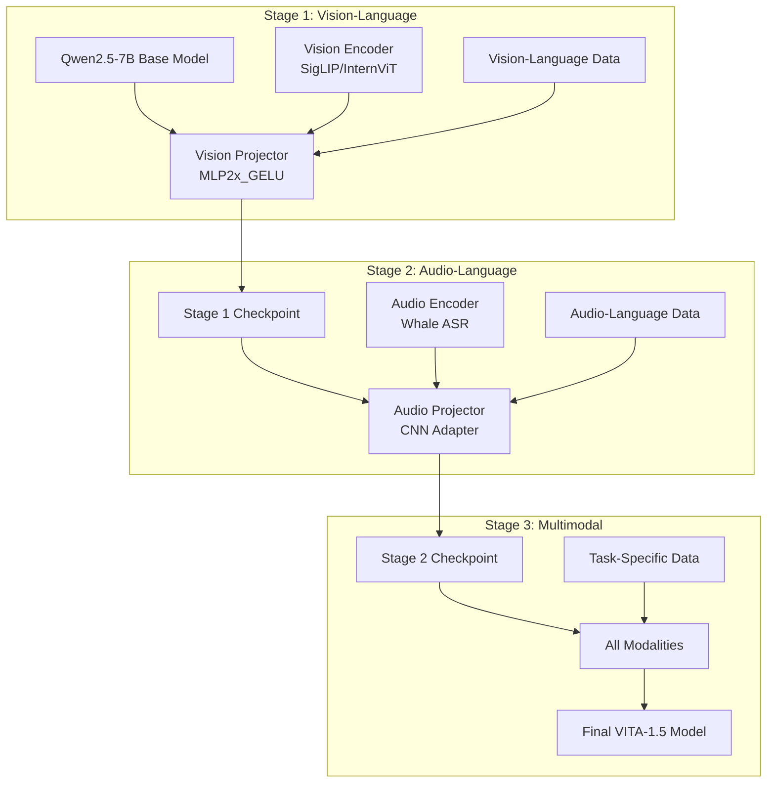

# VITA-1.5 Model Retraining Guide

This comprehensive guide covers how to retrain the VITA-1.5 model from scratch or fine-tune it on custom datasets. The guide includes the complete training pipeline, data preparation, and various training strategies.

## 📋 Table of Contents

- [Overview](#overview)
- [Training Pipeline Architecture](#training-pipeline-architecture)
- [Prerequisites](#prerequisites)
- [Data Preparation](#data-preparation)
- [Training Stages](#training-stages)
- [Training Scripts](#training-scripts)
- [Configuration](#configuration)
- [Distributed Training](#distributed-training)
- [Monitoring and Logging](#monitoring-and-logging)
- [Troubleshooting](#troubleshooting)
- [Best Practices](#best-practices)

## 🌟 Overview

VITA-1.5 uses a progressive training strategy with three main stages:

1. **Stage 1**: Vision-Language Alignment (Pretrain MLP)
2. **Stage 2**: Audio-Language Alignment (Pretrain Audio MLP)
3. **Stage 3**: End-to-End Multimodal Training (Fine-tune Task)

This approach ensures minimal impact on vision-language performance when adding speech capabilities.

## 🏗 Training Pipeline Architecture



## 🛠 Prerequisites

### Hardware Requirements

- **GPUs**: Minimum 4x A100 80GB or 8x RTX 3090/4090
- **RAM**: 256GB+ system memory
- **Storage**: 2TB+ SSD storage for datasets and checkpoints
- **Network**: High-speed interconnect for distributed training

### Software Requirements

```bash
# Install training dependencies
pip install torch torchvision torchaudio --index-url https://download.pytorch.org/whl/cu118
pip install transformers>=4.35.0
pip install deepspeed>=0.12.0
pip install flash-attn --no-build-isolation
pip install datasets accelerate
pip install wandb  # for logging (optional)
```

### Model Weights

Download the required pretrained models using SSH:

```bash
# Set up SSH key for Hugging Face (if not already done)
# 1. Generate SSH key (if you don't have one)
ssh-keygen -t ed25519 -C "your_email@example.com"

# 2. Add SSH key to Hugging Face account
# Copy your public key: cat ~/.ssh/id_ed25519.pub
# Add it to: https://huggingface.co/settings/keys

# 3. Test SSH connection
ssh -T git@huggingface.co

# Create model directory
mkdir -p models/

# Download base language model
cd models/
git lfs install
git clone git@huggingface.co:Qwen/Qwen2.5-7B-Instruct

# Download vision encoders
git clone git@huggingface.co:OpenGVLab/InternViT-300M-448px
git clone git@huggingface.co:google/siglip-so400m-patch14-384

# Download audio encoder
git clone git@huggingface.co:VITA-MLLM/VITA-1.5/audio-encoder-Qwen2-7B-1107-weight-base-11wh-tunning
```

## 📊 Data Preparation

### Dataset Download Guide

Before configuring your data, you need to download the required datasets. Here's a comprehensive guide for downloading and setting up datasets for VITA retraining:

#### **SSH Setup for Hugging Face (Recommended)**

For secure and efficient cloning, set up SSH authentication with Hugging Face:

```bash
# 1. Generate SSH key (if you don't have one)
ssh-keygen -t ed25519 -C "your_email@example.com"
# Press Enter to accept default file location
# Optionally set a passphrase for extra security

# 2. Start SSH agent and add your key
eval "$(ssh-agent -s)"
ssh-add ~/.ssh/id_ed25519

# 3. Copy your public key
cat ~/.ssh/id_ed25519.pub

# 4. Add SSH key to Hugging Face
# Go to: https://huggingface.co/settings/keys
# Click "Add SSH key" and paste your public key

# 5. Test SSH connection
ssh -T git@huggingface.co
# You should see: "Hi username! You've successfully authenticated..."

# 6. Configure Git to use SSH for Hugging Face
git config --global url."git@huggingface.co:".insteadOf "https://huggingface.co/"
```

**Benefits of using SSH:**
- **Security**: No need to store tokens in plain text
- **Speed**: Faster authentication for repeated operations
- **Convenience**: No password prompts during cloning
- **Reliability**: More stable for large file transfers

#### 1. **Required Datasets**

VITA training uses the following datasets:

- **ShareGPT4V**: Multi-modal captions dataset with 1.2M samples
  - `sharegpt4v_instruct_gpt4-vision_cap100k.json` - GPT4-Vision generated captions (100K)
  - `share-captioner_coco_lcs_sam_1246k_1107.json` - Share-Captioner generated captions (1.2M)
  - `sharegpt4v_mix665k_cap23k_coco-ap9k_lcs3k_sam9k_div2k.json` - Mixed dataset for fine-tuning (665K)
- **COCO**: Image dataset for vision-language alignment
- **LLaVA-Instruct**: Instruction-following vision-language data
- **Audio Datasets**: For audio-language alignment (custom or public)

#### 2. **Download Methods**

##### **Method 1: Using Hugging Face Hub (Conversation Files Only)**

**Note**: Hugging Face datasets only contain conversation JSON files, not the actual images/audio. You need to download media files separately.

```bash
# Install and upgrade huggingface_hub
pip install --upgrade huggingface_hub

# Login to Hugging Face (you'll need a token from https://huggingface.co/settings/tokens)
hf login

# Create data directory
mkdir -p /data/vita/datasets
cd /data/vita/datasets

# Download ShareGPT4V dataset (contains 3 JSON files with 1.2M+ samples)
hf download Lin-Chen/ShareGPT4V --repo-type dataset --local-dir sharegpt4v

# Download LLaVA-Instruct dataset
hf download liuhaotian/LLaVA-Instruct-150K --repo-type dataset --local-dir llava_instruct

# Note: COCO images should be downloaded directly from the official source (see Method 3)
```

**Important**: After downloading conversation files, you need to download the actual images and audio files separately (see Method 3 below).

#### **Understanding Dataset Components**

VITA training requires three types of data:

1. **Conversation JSON files**: Contains the text conversations and file paths
2. **Image files**: The actual images referenced in conversations  
3. **Audio files**: The actual audio files referenced in conversations

**The Hugging Face datasets only provide #1 (conversation files). You need to obtain #2 and #3 separately.**

#### **ShareGPT4V Dataset Details**

The ShareGPT4V dataset contains **1.2M+ multi-modal captions** across 3 JSON files:

1. **`sharegpt4v_instruct_gpt4-vision_cap100k.json`** (100K samples)
   - High-quality captions generated by GPT4-Vision
   - Used for supervised fine-tuning
   - Best quality but smaller size

2. **`share-captioner_coco_lcs_sam_1246k_1107.json`** (1.2M samples)
   - Captions generated by Share-Captioner model
   - Trained on GPT4-Vision data
   - Large scale for pre-training

3. **`sharegpt4v_mix665k_cap23k_coco-ap9k_lcs3k_sam9k_div2k.json`** (665K samples)
   - Mixed dataset for fine-tuning
   - Combines multiple sources: COCO, LCS, SAM, DIV2K
   - Curated for optimal training

**Total**: ~2M samples for comprehensive VITA training

##### **Method 2: Using Git Clone with HTTPS**

```bash
# Install git-lfs if not already installed
git lfs install

# Create data directory
mkdir -p /data/vita/datasets
cd /data/vita/datasets

# Clone ShareGPT4V dataset (contains 3 JSON files: 100K + 1.2M + 665K samples)
git clone https://huggingface.co/datasets/Lin-Chen/ShareGPT4V sharegpt4v

# Clone LLaVA-Instruct dataset
git clone https://huggingface.co/datasets/liuhaotian/LLaVA-Instruct-150K llava_instruct
```

##### **Method 3: Complete Dataset Download (Images + Audio + Conversations)**

This method downloads the complete datasets including images and audio files:

```bash
#!/bin/bash

# VITA Dataset Download Script
set -e

# Configuration
DATA_DIR="/data/vita/datasets"
mkdir -p "$DATA_DIR"
cd "$DATA_DIR"

echo "Downloading VITA training datasets..."

# Download ShareGPT4V dataset (3 JSON files with 1.2M+ samples)
echo "Downloading ShareGPT4V dataset..."
if [ ! -d "sharegpt4v" ]; then
    mkdir -p sharegpt4v
    # Download all 3 JSON files from ShareGPT4V
    wget -O sharegpt4v/sharegpt4v_instruct_gpt4-vision_cap100k.json "https://huggingface.co/datasets/Lin-Chen/ShareGPT4V/resolve/main/sharegpt4v_instruct_gpt4-vision_cap100k.json"
    wget -O sharegpt4v/share-captioner_coco_lcs_sam_1246k_1107.json "https://huggingface.co/datasets/Lin-Chen/ShareGPT4V/resolve/main/share-captioner_coco_lcs_sam_1246k_1107.json"
    wget -O sharegpt4v/sharegpt4v_mix665k_cap23k_coco-ap9k_lcs3k_sam9k_div2k.json "https://huggingface.co/datasets/Lin-Chen/ShareGPT4V/resolve/main/sharegpt4v_mix665k_cap23k_coco-ap9k_lcs3k_sam9k_div2k.json"
fi

echo "Note: ShareGPT4V images need to be downloaded separately from COCO and other sources"
echo "The conversation JSON contains image paths that you need to map to your local image directory"

# Download LLaVA-Instruct
echo "Downloading LLaVA-Instruct dataset..."
if [ ! -d "llava_instruct" ]; then
    wget -O llava_instruct.zip "https://huggingface.co/datasets/liuhaotian/LLaVA-Instruct-158K/resolve/main/llava_v1_5_mix665k.json"
    mkdir -p llava_instruct
    unzip llava_instruct.zip -d llava_instruct/
    rm llava_instruct.zip
fi

# Download COCO images (train2017)
echo "Downloading COCO train2017 images..."
if [ ! -d "coco/images/train2017" ]; then
    mkdir -p coco/images
    cd coco/images
    wget http://images.cocodataset.org/zips/train2017.zip
    unzip train2017.zip
    rm train2017.zip
    cd "$DATA_DIR"
fi

# Download COCO images (val2017)
echo "Downloading COCO val2017 images..."
if [ ! -d "coco/images/val2017" ]; then
    cd coco/images
    wget http://images.cocodataset.org/zips/val2017.zip
    unzip val2017.zip
    rm val2017.zip
    cd "$DATA_DIR"
fi

# Download COCO annotations
echo "Downloading COCO annotations..."
if [ ! -d "coco/annotations" ]; then
    mkdir -p coco/annotations
    cd coco/annotations
    wget http://images.cocodataset.org/annotations/annotations_trainval2017.zip
    unzip annotations_trainval2017.zip
    rm annotations_trainval2017.zip
    cd "$DATA_DIR"
fi

echo "Dataset download completed!"
echo "Data directory structure:"
tree -L 3 "$DATA_DIR" || ls -la "$DATA_DIR"
```

#### **Getting Complete Datasets with Images and Audio**

For complete datasets with images and audio, you have several options:

##### **Option 1: Use Pre-processed Datasets**

```bash
# Download complete LLaVA datasets (includes images)
# These are larger but include everything you need
wget -O llava_complete.zip "https://huggingface.co/datasets/liuhaotian/LLaVA-CC3M-Pretrain-595K/resolve/main/llava_v1_5_mix665k.json"
# Note: You still need to download the actual images separately

# For ShareGPT4V, you need to get images from the original sources
# The conversation JSON contains paths like "coco/images/train2017/000000000164.jpg"
# You need to download COCO images and organize them accordingly
```

##### **Option 2: Download Images from Original Sources**

```bash
# Create COCO directory
mkdir -p /data/vita/images/coco
cd /data/vita/images/coco

# Download COCO train2017 images (~18GB)
echo "Downloading COCO train2017 images..."
wget http://images.cocodataset.org/zips/train2017.zip
unzip train2017.zip
rm train2017.zip

# Download COCO val2017 images (~1GB)
echo "Downloading COCO val2017 images..."
wget http://images.cocodataset.org/zips/val2017.zip
unzip val2017.zip
rm val2017.zip

# Download COCO annotations (~250MB)
echo "Downloading COCO annotations..."
wget http://images.cocodataset.org/annotations/annotations_trainval2017.zip
unzip annotations_trainval2017.zip
rm annotations_trainval2017.zip

echo "COCO dataset download completed!"
```

##### **Option 3: Download Audio Datasets**

VITA requires audio datasets for audio-language alignment training. Here are the main sources:

```bash
# Create audio data directory
mkdir -p /data/vita/audio_data

# Option 3A: Download VITA's audio dataset from Hugging Face (Primary)
echo "Downloading VITA's audio dataset from Hugging Face..."
cd /data/vita/audio_data

# Download VITA's official audio dataset
# Method 1: Using Git Clone (recommended for large datasets)
git clone https://huggingface.co/datasets/VITA-MLLM/VITA-Audio-Data vita_audio_data

# Method 2: Using Hugging Face CLI (alternative)
# hf download VITA-MLLM/VITA-Audio-Data --repo-type dataset --local-dir vita_audio_data

# The dataset includes various audio files for different tasks:
# - Speech Question Answering (QA)
# - Automatic Speech Recognition (ASR) 
# - Text-to-Speech (TTS)
# - Audio captioning and understanding

# Create the expected directory structure for new_value_dict
mkdir -p new_value_dict_0717/output_wavs
mkdir -p new_value_dict_0725/output_wavs  
mkdir -p new_value_dict_0730/output_wavs

# Copy audio files from VITA-Audio-Data to the expected structure
# (You may need to organize the files according to your specific needs)
# Audio files should have hash-like names (e.g., f61cf238b7872b4903e1fc15dcb5a50c.wav)
# Example structure:
# new_value_dict_0717/output_wavs/
#   ├── f61cf238b7872b4903e1fc15dcb5a50c.wav
#   ├── a1b2c3d4e5f6g7h8i9j0k1l2m3n4o5p6.wav
#   └── ...

# Option 3B: Download AudioCaps dataset (Alternative)
echo "Downloading AudioCaps dataset..."
# AudioCaps is available from the official website
# You need to register and download from: https://audiocaps.org/
# Place the audio files in: /data/vita/audio_data/audiocaps/

# Option 3C: Download Clotho dataset (Alternative)
echo "Downloading Clotho dataset..."
# Clotho is available from: https://zenodo.org/record/3490684
# Download and extract to: /data/vita/audio_data/clotho/

# Option 3D: Download AudioSet (subset) - For audio encoder training
echo "Downloading AudioSet subset..."
# AudioSet is available from: https://research.google.com/audioset/
# Note: Full AudioSet is very large, consider downloading a subset
# This is used for pre-training the audio encoder, not for VITA training data

# Option 3E: Use custom audio dataset
echo "Preparing custom audio dataset..."
mkdir -p /data/vita/audio_data/custom
# Copy your audio files here
# Supported formats: .wav, .mp3, .flac, .ogg
```

**Audio Dataset Requirements:**
- **Format**: WAV, MP3, FLAC, or OGG
- **Sample Rate**: 16kHz (recommended)
- **Duration**: Variable (typically 1-30 seconds)
- **Content**: Speech, music, environmental sounds, etc.

##### **Option 4: Use Academic/Research Datasets**

```bash
# Some research groups provide complete datasets
# Check the original papers for download links:
# - ShareGPT4V paper: https://sharegpt4v.github.io/
# - LLaVA paper: https://llava-vl.github.io/

# Example: Download from academic sources
# wget -O complete_dataset.zip "https://example.edu/datasets/complete_vita_training_data.zip"
```

##### **Option 4: Create Audio Conversation Files**

After downloading audio datasets, you need to create conversation JSON files that reference the audio:

```bash
# Create audio conversation files
mkdir -p /data/vita/conversations/audio

# Example: Create audio conversation JSON
cat > /data/vita/conversations/audio/audio_conversations.json << 'EOF'
[
    {
        "id": "audio_001",
        "conversations": [
            {
                "from": "human",
                "value": "<audio>\nWhat do you hear in this audio?"
            },
            {
                "from": "gpt",
                "value": "I can hear the sound of birds chirping and leaves rustling in the wind."
            }
        ],
        "audio": ["audio_data/audiocaps/bird_sounds_001.wav"]
    },
    {
        "id": "audio_002", 
        "conversations": [
            {
                "from": "human",
                "value": "<audio>\nDescribe the audio content."
            },
            {
                "from": "gpt",
                "value": "This audio contains the sound of rain falling and thunder in the background."
            }
        ],
        "audio": ["audio_data/custom/rain_thunder_002.wav"]
    }
]
EOF
```

##### **Option 5: Create Your Own Dataset**

```bash
# If you have your own images and audio, organize them as follows:
mkdir -p /data/vita/custom_dataset/{images,audio,conversations}

# Copy your media files
cp /path/to/your/images/* /data/vita/custom_dataset/images/
cp /path/to/your/audio/* /data/vita/custom_dataset/audio/

# Create conversation JSON files in the VITA format
# (See data format examples in the documentation)
```

Make the script executable and run it:

```bash
chmod +x download_datasets.sh
./download_datasets.sh
```

#### 3. **Dataset Structure After Download**

After downloading, your data directory should look like this:

```
/data/vita/datasets/
├── sharegpt4v/
│   ├── sharegpt4v_instruct_gpt4-vision_cap100k.json      # 100K GPT4-Vision captions
│   ├── share-captioner_coco_lcs_sam_1246k_1107.json     # 1.2M Share-Captioner captions
│   ├── sharegpt4v_mix665k_cap23k_coco-ap9k_lcs3k_sam9k_div2k.json  # 665K mixed dataset
│   └── README.md
├── llava_instruct/
│   ├── llava_v1_5_mix665k.json
│   └── README.md
├── coco/
│   ├── images/
│   │   ├── train2017/
│   │   │   ├── 000000000139.jpg
│   │   │   ├── 000000000285.jpg
│   │   │   └── ...
│   │   └── val2017/
│   │       ├── 000000000632.jpg
│   │       └── ...
│   └── annotations/
│       ├── captions_train2017.json
│       ├── captions_val2017.json
│       └── instances_train2017.json
├── audio_data/  # Audio datasets
│   ├── vita_audio_data/  # VITA's official audio dataset from Hugging Face
│   │   ├── speech_qa/  # Speech Question Answering data
│   │   ├── asr/  # Automatic Speech Recognition data
│   │   ├── tts/  # Text-to-Speech data
│   │   ├── audio_captioning/  # Audio captioning data
│   │   └── ...
│   ├── new_value_dict_0717/  # Organized audio files (if needed)
│   │   └── output_wavs/
│   │       ├── f61cf238b7872b4903e1fc15dcb5a50c.wav
│   │       ├── a1b2c3d4e5f6g7h8i9j0k1l2m3n4o5p6.wav
│   │       └── ...
│   ├── audiocaps/  # Alternative dataset
│   │   ├── bird_sounds_001.wav
│   │   └── ...
│   ├── clotho/  # Alternative dataset
│   │   ├── audio_001.wav
│   │   └── ...
│   └── custom/  # Custom dataset
│       ├── rain_thunder_002.wav
│       └── ...
└── conversations/
    ├── audio/
    │   └── audio_conversations.json
    └── ...
```

#### 4. **Alternative Dataset Sources**

##### **Academic/Research Datasets**

```bash
# Download from academic sources
# Example: Download from university repositories
wget -O academic_dataset.zip "https://example.edu/datasets/vita_training_data.zip"
```

##### **Custom Dataset Preparation**

If you have your own dataset, organize it as follows:

```bash
# Create custom dataset structure
mkdir -p /data/vita/custom_dataset/{images,audio,conversations}

# Copy your data
cp /path/to/your/images/* /data/vita/custom_dataset/images/
cp /path/to/your/audio/* /data/vita/custom_dataset/audio/
cp /path/to/your/conversations.json /data/vita/custom_dataset/conversations/
```

#### 5. **Dataset Validation**

After downloading, validate your datasets:

```bash
# Check dataset integrity
python data_tools/check_json.py --data_path /data/vita/datasets/sharegpt4v/sharegpt4v_train.json

# Count dataset statistics
python data_tools/statistics_data_num.py --data_path /data/vita/datasets/

# Check for missing images
python data_tools/check_image_lost.py

# Check for missing audio files
python data_tools/check_audio_lost.py
```

#### 6. **Storage Requirements**

Approximate storage requirements for datasets:

| Dataset | Size | Description |
|---------|------|-------------|
| ShareGPT4V (3 JSON files) | ~3GB | 1.2M+ multi-modal captions |
| LLaVA-Instruct | ~1GB | Instruction JSON files |
| COCO Train2017 | ~18GB | Training images |
| COCO Val2017 | ~1GB | Validation images |
| COCO Annotations | ~250MB | Caption and annotation files |
| **VITA-Audio-Data** | **~50GB** | **VITA's official audio dataset from Hugging Face** |
| AudioCaps | ~100GB | Audio captioning dataset (alternative) |
| Clotho | ~5GB | Audio captioning dataset (alternative) |
| AudioSet (subset) | ~50GB | Audio classification dataset (for encoder) |
| Custom Audio | Variable | Depends on your audio dataset size |

**Total Minimum**: ~25GB for basic training
**Recommended**: 100GB+ for comprehensive training with multiple datasets

#### 7. **Download Troubleshooting**

##### **Common Issues and Solutions**

**Issue**: Hugging Face authentication fails (401 Unauthorized)
```bash
# Solution 1: Login with token
hf login
# Enter your token from https://huggingface.co/settings/tokens

# Solution 2: Clear conflicting credentials
rm ~/.netrc
hf login

# Solution 3: Use environment variable
export HF_TOKEN=your_token_here
hf download liuhaotian/LLaVA-Instruct-150K --repo-type dataset --local-dir llava_instruct

# Solution 4: Use mirror if main site is blocked
export HF_ENDPOINT=https://hf-mirror.com
hf download liuhaotian/LLaVA-Instruct-150K --repo-type dataset --local-dir llava_instruct
```

**Issue**: Repository not found (404 error)
```bash
# Solution: Use correct repository names
# Correct repositories:
hf download Lin-Chen/ShareGPT4V --repo-type dataset --local-dir sharegpt4v
hf download liuhaotian/LLaVA-Instruct-150K --repo-type dataset --local-dir llava_instruct

# Note: COCO dataset is NOT available on Hugging Face
# Download COCO images directly from the official source:
mkdir -p /data/vita/images/coco
cd /data/vita/images/coco
wget http://images.cocodataset.org/zips/train2017.zip
```

**Issue**: COCO dataset authentication error (401 Unauthorized)
```bash
# Solution: COCO dataset is not on Hugging Face, download directly
# The microsoft/COCO_2017_Captioning repository doesn't exist
# Use the official COCO download links instead:

# Download COCO images directly
wget http://images.cocodataset.org/zips/train2017.zip
wget http://images.cocodataset.org/zips/val2017.zip
wget http://images.cocodataset.org/annotations/annotations_trainval2017.zip
```

**Issue**: Large file download interrupted
```bash
# Solution: Resume download with wget
wget -c http://images.cocodataset.org/zips/train2017.zip
```

**Issue**: Insufficient disk space
```bash
# Solution: Check available space and clean up
df -h
du -sh /data/vita/datasets/*
```

**Issue**: Permission denied
```bash
# Solution: Fix permissions
sudo chown -R $USER:$USER /data/vita/datasets/
chmod -R 755 /data/vita/datasets/
```

**Issue**: SSH key authentication fails
```bash
# Solution: Check SSH key setup
# 1. Verify SSH key exists
ls -la ~/.ssh/

# 2. Test SSH connection to Hugging Face
ssh -T git@huggingface.co

# 3. If connection fails, re-add SSH key
ssh-add ~/.ssh/id_ed25519

# 4. Check SSH agent
ssh-add -l

# 5. Restart SSH agent if needed
eval "$(ssh-agent -s)"
ssh-add ~/.ssh/id_ed25519
```

**Issue**: Git LFS files not downloading
```bash
# Solution: Ensure Git LFS is properly configured
git lfs install
git lfs pull

# Or clone with LFS explicitly
git clone --filter=blob:none https://huggingface.co/datasets/Lin-Chen/ShareGPT4V sharegpt4v
cd sharegpt4v
git lfs pull
```

#### 8. **Automated Download Script**

For complete automation, use this comprehensive script:

```bash
#!/bin/bash
# Complete VITA Dataset Download and Setup Script

set -e

# Configuration
DATA_DIR="${1:-/data/vita/datasets}"
echo "Downloading datasets to: $DATA_DIR"

# Create directory structure
mkdir -p "$DATA_DIR"/{sharegpt4v,llava_instruct,coco/{images,annotations},audio_data}

# Function to download with retry
download_with_retry() {
    local url="$1"
    local output="$2"
    local max_attempts=3
    local attempt=1
    
    while [ $attempt -le $max_attempts ]; do
        echo "Download attempt $attempt: $url"
        if wget -O "$output" "$url"; then
            echo "Download successful: $output"
            return 0
        else
            echo "Download failed, attempt $attempt/$max_attempts"
            ((attempt++))
            sleep 5
        fi
    done
    
    echo "Failed to download after $max_attempts attempts: $url"
    return 1
}

# Download datasets
cd "$DATA_DIR"

echo "Starting dataset downloads..."

# Download ShareGPT4V
if [ ! -f "sharegpt4v/sharegpt4v_train.json" ]; then
    echo "Downloading ShareGPT4V..."
    download_with_retry "https://huggingface.co/datasets/Lin-Chen/ShareGPT4V-7B/resolve/main/sharegpt4v_train.json" "sharegpt4v/sharegpt4v_train.json"
fi

# Download LLaVA-Instruct
if [ ! -f "llava_instruct/llava_v1_5_mix665k.json" ]; then
    echo "Downloading LLaVA-Instruct..."
    download_with_retry "https://huggingface.co/datasets/liuhaotian/LLaVA-Instruct-158K/resolve/main/llava_v1_5_mix665k.json" "llava_instruct/llava_v1_5_mix665k.json"
fi

# Download COCO images and annotations
echo "Downloading COCO dataset..."
cd coco/images
if [ ! -d "train2017" ]; then
    download_with_retry "http://images.cocodataset.org/zips/train2017.zip" "train2017.zip"
    unzip train2017.zip && rm train2017.zip
fi

if [ ! -d "val2017" ]; then
    download_with_retry "http://images.cocodataset.org/zips/val2017.zip" "val2017.zip"
    unzip val2017.zip && rm val2017.zip
fi

cd ../annotations
if [ ! -f "captions_train2017.json" ]; then
    download_with_retry "http://images.cocodataset.org/annotations/annotations_trainval2017.zip" "annotations.zip"
    unzip annotations.zip && rm annotations.zip
fi

cd "$DATA_DIR"

echo "Dataset download completed successfully!"
echo "Final directory structure:"
find "$DATA_DIR" -type d -maxdepth 3 | head -20
```

Save this as `download_vita_datasets.sh` and run:

```bash
chmod +x download_vita_datasets.sh
./download_vita_datasets.sh /path/to/your/data/directory
```

### Data Format

VITA uses a conversation-based data format compatible with LLaVA:

```json
[
    {
        "set": "sharegpt4",
        "id": "000000000164",
        "conversations": [
            {
                "from": "human",
                "value": "<image>\n<audio>\nDescribe what you see and hear."
            },
            {
                "from": "gpt",
                "value": "I can see a well-organized kitchen with a clean, modern aesthetic. The kitchen features a white countertop against a white wall, creating a bright and airy atmosphere. I can hear the sound of cooking activities in the background."
            }
        ],
        "image": "path/to/image.jpg",
        "audio": ["path/to/audio.wav"]
    }
]
```

### Data Configuration

The data configuration system in VITA is crucial for organizing and accessing different types of multimodal datasets during training. Here's how to properly configure your data:

#### 1. **Dataset Configuration File (`vita/config/dataset_config.py`)**

This file defines the core dataset paths and configurations:

```python
# Audio data folder path - base directory for all audio files
AudioFolder = "/data/vita/audio_data"

# Image folder mappings for different datasets
FolderDict = {
    "sharegpt4": "/data/vita/images/coco/train2017",
    "custom_dataset": "/data/vita/images/custom",
    "llava_instruct": "/data/vita/images/llava",
}

# Dataset-specific conversation file paths
ShareGPT4V = {"chat_path": "/data/vita/conversations/sharegpt4v_conversations.json"}
ShareGPT4V0 = {"chat_path": "/data/vita/conversations/sharegpt4v_conversations_v0.json"}
CustomDataset = {"chat_path": "/data/vita/conversations/custom_conversations.json"}
AudioDataset = {"chat_path": "/data/vita/conversations/audio_conversations.json"}
```

#### 2. **Data Configuration File (`vita/config/__init__.py`)**

This file organizes datasets into training configurations for different stages:

```python
from .dataset_config import *

# Dataset groupings for different training stages
NaturalCap0 = [ShareGPT4V0]  # Alternative ShareGPT4V configuration
NaturalCap = [ShareGPT4V]    # Main ShareGPT4V configuration
CustomCap = [CustomDataset]  # Custom dataset configuration
AudioCap = [AudioDataset]    # Audio-specific dataset

# Main data configuration mapping for different training stages
DataConfig = {
    "Pretrain_video": NaturalCap,      # Stage 1: Vision-Language Alignment
    "Pretrain_audio": AudioCap,        # Stage 2: Audio-Language Alignment  
    "Custom_task": CustomCap,          # Stage 3: Multimodal Fine-tuning
}

# Datasets that don't use image patching (for specific processing)
NoPatchSets = ["khair", "jester"]
```

#### 3. **Real-World Example Configuration**

Based on the VITA codebase examples, here's a practical configuration:

```python
# vita/config/dataset_config.py
AudioFolder = "/mnt/data/vita/audio/new_value_dict_0717/output_wavs"
FolderDict = {
    "sharegpt4": "/mnt/data/vita/images/coco/images/train2017",
    "llava_instruct": "/mnt/data/vita/images/llava_instruct",
    "custom_video": "/mnt/data/vita/videos/custom_dataset",
}

ShareGPT4V = {"chat_path": "/mnt/data/vita/conversations/sharegpt4v_train.json"}
ShareGPT4V0 = {"chat_path": "/mnt/data/vita/conversations/sharegpt4v_train_v0.json"}
LLaVAInstruct = {"chat_path": "/mnt/data/vita/conversations/llava_instruct_158k.json"}
CustomVideoDataset = {"chat_path": "/mnt/data/vita/conversations/custom_video_conversations.json"}
```

```python
# vita/config/__init__.py
from .dataset_config import *

# Dataset groupings
NaturalCap0 = [ShareGPT4V0]
NaturalCap = [ShareGPT4V, LLaVAInstruct]
CustomCap = [CustomVideoDataset]

# Training stage configurations
DataConfig = {
    "Pretrain_video": NaturalCap,      # Vision-language pretraining
    "Pretrain_audio": [ShareGPT4V],    # Audio-language pretraining
    "Custom_task": CustomCap,          # Custom multimodal tasks
}
```

#### 4. **Directory Structure Example**

Here's the recommended directory structure for your datasets:

```
/data/vita/
├── audio/
│   └── new_value_dict_0717/
│       └── output_wavs/
│           ├── f61cf238b7872b4903e1fc15dcb5a50c.wav
│           ├── a1b2c3d4e5f6g7h8i9j0k1l2m3n4o5p6.wav
│           └── ...
├── images/
│   ├── coco/
│   │   └── images/
│   │       └── train2017/
│   │           ├── 000000000164.jpg
│   │           ├── 000000000165.jpg
│   │           └── ...
│   └── llava_instruct/
│       ├── image1.jpg
│       └── ...
├── videos/
│   └── custom_dataset/
│       ├── video1.mp4
│       └── ...
└── conversations/
    ├── sharegpt4v_train.json
    ├── sharegpt4v_train_v0.json
    ├── llava_instruct_158k.json
    └── custom_video_conversations.json
```

#### 5. **Data Format Examples**

**Vision-Language Data (ShareGPT4V format):**
```json
[
    {
        "set": "sharegpt4",
        "id": "000000000164",
        "conversations": [
            {
                "from": "human",
                "value": "<image>\nDescribe what you see in this image."
            },
            {
                "from": "gpt",
                "value": "I can see a well-organized kitchen with a clean, modern aesthetic. The kitchen features a white countertop against a white wall, creating a bright and airy atmosphere."
            }
        ],
        "image": "coco/images/train2017/000000000164.jpg"
    }
]
```

**Multimodal Data (Image + Audio):**
```json
[
    {
        "set": "sharegpt4",
        "id": "000000000164",
        "conversations": [
            {
                "from": "human",
                "value": "<image>\n<audio>\nDescribe what you see and hear."
            },
            {
                "from": "gpt",
                "value": "I can see a well-organized kitchen with a clean, modern aesthetic. The kitchen features a white countertop against a white wall, creating a bright and airy atmosphere. I can hear the sound of cooking activities in the background."
            }
        ],
        "image": "coco/images/train2017/000000000164.jpg",
        "audio": ["new_value_dict_0717/output_wavs/f61cf238b7872b4903e1fc15dcb5a50c.wav"]
    }
]
```

**Audio-Only Data:**
```json
[
    {
        "id": "audio_001",
        "conversations": [
            {
                "from": "human",
                "value": "<audio>\nWhat do you hear in this audio?"
            },
            {
                "from": "gpt",
                "value": "I can hear the sound of birds chirping and leaves rustling in the wind."
            }
        ],
        "audio": ["audio_data/audiocaps/bird_sounds_001.wav"]
    },
    {
        "id": "audio_002",
        "conversations": [
            {
                "from": "human",
                "value": "<audio>\nDescribe the audio content."
            },
            {
                "from": "gpt",
                "value": "This audio contains the sound of rain falling and thunder in the background."
            }
        ],
        "audio": ["audio_data/custom/rain_thunder_002.wav"]
    }
]
```

**Multimodal Data (Image + Audio + Text):**
```json
[
    {
        "id": "multimodal_001",
        "conversations": [
            {
                "from": "human",
                "value": "<image>\n<audio>\nDescribe what you see and hear."
            },
            {
                "from": "gpt",
                "value": "I can see a beautiful sunset over a mountain range, and I can hear the gentle sound of wind blowing through the trees."
            }
        ],
        "image": "coco/images/train2017/000000000164.jpg",
        "audio": ["audio_data/custom/sunset_wind_001.wav"]
    }
]
```

#### 6. **Configuration Validation**

Use the provided data tools to validate your configuration:

```bash
# Check if all images exist
python data_tools/check_image_lost.py

# Check if all audio files exist  
python data_tools/check_audio_lost.py

# Generate dataset statistics
python data_tools/statistics_data_num.py

# Check conversation format
python data_tools/check_json.py
```

#### 7. **Best Practices**

- **Use Absolute Paths**: Always use absolute paths to avoid issues with working directory changes
- **Consistent Naming**: Use consistent naming conventions for your dataset keys in `FolderDict`
- **Path Validation**: Ensure all paths in your configuration actually exist before training
- **Backup Configurations**: Keep backup copies of working configurations
- **Documentation**: Document your dataset structure and configuration choices
- **Testing**: Test data loading with a small subset before full training

### Data Processing Tools

Use the provided data processing scripts:

```bash
# Concatenate multiple datasets
python data_tools/concat_data_patch.py \
    --input_dirs /path/to/dataset1 /path/to/dataset2 \
    --output_dir /path/to/combined_dataset

# Statistics and token counting
python data_tools/statistics_token_num.py \
    --data_path /path/to/dataset \
    --output_path /path/to/statistics.json
```

## 🎓 Training Stages

### Stage 1: Vision-Language Alignment

**Purpose**: Align vision encoder with language model through vision-language data.

**Key Parameters**:
- `tune_mm_mlp_adapter: True` - Train vision projector
- `freeze_audio_encoder: True` - Keep audio encoder frozen
- `learning_rate: 5e-4` - Higher learning rate for projector

```bash
# Single node training
bash script/train/pretrain_mlp_qwen_nodes.sh /path/to/output

# Multi-node training (modify script for your setup)
export INDEX=0  # Node rank
export MASTER_ADDR="10.0.0.1"  # Master node IP
bash script/train/pretrain_mlp_qwen_nodes.sh /path/to/output
```

**Expected Output**: Vision projector weights aligned with language model.

### Stage 2: Audio-Language Alignment

**Purpose**: Align audio encoder with language model through audio-language data.

**Key Parameters**:
- `tune_audio_mlp_adapter: True` - Train audio projector
- `tune_mm_mlp_adapter: False` - Keep vision projector frozen
- `learning_rate: 5e-4` - Higher learning rate for audio projector

```bash
# Single node training
bash script/train/pretrain_audio_mlp_qwen_nodes.sh /path/to/output

# Multi-node training
export INDEX=0
export MASTER_ADDR="10.0.0.1"
bash script/train/pretrain_audio_mlp_qwen_nodes.sh /path/to/output
```

**Expected Output**: Audio projector weights aligned with language model.

### Stage 3: End-to-End Multimodal Training

**Purpose**: Fine-tune the complete model on multimodal tasks.

**Key Parameters**:
- `tune_mm_mlp_adapter: False` - Keep projectors frozen
- `freeze_audio_encoder: True` - Keep audio encoder frozen
- `learning_rate: 1e-5` - Lower learning rate for fine-tuning

```bash
# Single node training
bash script/train/finetuneTaskNeg_qwen_nodes.sh /path/to/output

# Multi-node training
export INDEX=0
export MASTER_ADDR="10.0.0.1"
bash script/train/finetuneTaskNeg_qwen_nodes.sh /path/to/output
```

**Expected Output**: Complete VITA-1.5 model ready for inference.

## 📜 Training Scripts

### Script Structure

All training scripts follow this structure:

```bash
#!/bin/bash
# Environment setup
export CUDA_DEVICE_MAX_CONNECTIONS=1
export NCCL_SOCKET_IFNAME=eth0
export NCCL_IB_DISABLE=0
export NCCL_IB_GID_INDEX=3
export NCCL_P2P_DISABLE=0
export NCCL_IB_CUDA_SUPPORT=1
export NCCL_DEBUG=INFO

# Distributed training configuration
INDEX=0  # Node rank
MASTER_ADDR="10.0.0.1"  # Master node IP
DISTRIBUTED_ARGS="
    --nproc_per_node 8 \
    --nnodes 4 \
    --node_rank $INDEX \
    --master_addr $MASTER_ADDR \
    --master_port 9999
"

# Training execution
torchrun $DISTRIBUTED_ARGS vita/train/train.py \
    --deepspeed ./script/deepspeed/zero3.json \
    [training parameters...]
```

### Available Scripts

| Script | Purpose | Stage | Key Features |
|--------|---------|-------|--------------|
| `pretrain_mlp_qwen_nodes.sh` | Vision-Language | 1 | Vision projector training |
| `pretrain_audio_mlp_qwen_nodes.sh` | Audio-Language | 2 | Audio projector training |
| `finetuneTaskNeg_qwen_nodes.sh` | Multimodal | 3 | End-to-end fine-tuning |
| `finetune_qwen_nodes.sh` | General Fine-tuning | - | Custom fine-tuning |

### Custom Training Script

Create your own training script:

```bash
#!/bin/bash
# Custom training script
export CUDA_DEVICE_MAX_CONNECTIONS=1
export NCCL_SOCKET_IFNAME=eth0
export NCCL_IB_DISABLE=0
export NCCL_P2P_DISABLE=0
export NCCL_IB_CUDA_SUPPORT=1

# Single node configuration
DISTRIBUTED_ARGS="--nproc_per_node 4"

MODEL_TYPE=qwen2p5_instruct
OUTPUT_DIR=$1
OUTPUT_DIR_FT=${OUTPUT_DIR}/custom_training
mkdir -p ${OUTPUT_DIR_FT}

torchrun $DISTRIBUTED_ARGS vita/train/train.py \
    --deepspeed ./script/deepspeed/zero3.json \
    --model_name_or_path /path/to/base/model \
    --model_type $MODEL_TYPE \
    --version qwen2p5_instruct \
    --dataset_use Custom_dataset \
    --vision_tower /path/to/vision/encoder \
    --mm_projector_type mlp2x_gelu \
    --audio_encoder /path/to/audio/encoder \
    --freeze_audio_encoder True \
    --freeze_audio_encoder_adapter False \
    --image_aspect_ratio square \
    --group_by_modality_length False \
    --bf16 True \
    --output_dir ${OUTPUT_DIR_FT} \
    --num_train_epochs 3 \
    --per_device_train_batch_size 4 \
    --per_device_eval_batch_size 2 \
    --gradient_accumulation_steps 4 \
    --evaluation_strategy "steps" \
    --eval_steps 100 \
    --save_strategy "steps" \
    --save_steps 200 \
    --save_total_limit 3 \
    --learning_rate 2e-5 \
    --weight_decay 0.01 \
    --warmup_ratio 0.1 \
    --lr_scheduler_type "cosine" \
    --logging_steps 10 \
    --tf32 True \
    --model_max_length 4096 \
    --gradient_checkpointing True \
    --dataloader_num_workers 4 \
    --lazy_preprocess True \
    --report_to wandb \
    --run_name "custom_vita_training" \
    2>&1 | tee -a ${OUTPUT_DIR_FT}/training.log
```

## ⚙️ Configuration

### DeepSpeed Configuration

VITA uses DeepSpeed ZeRO Stage 3 for memory optimization:

```json
{
    "fp16": {
        "enabled": "auto",
        "loss_scale": 0,
        "loss_scale_window": 1000,
        "initial_scale_power": 16,
        "hysteresis": 2,
        "min_loss_scale": 1
    },
    "bf16": {
        "enabled": "auto"
    },
    "train_micro_batch_size_per_gpu": "auto",
    "train_batch_size": "auto",
    "gradient_accumulation_steps": "auto",
    "zero_optimization": {
        "stage": 3,
        "overlap_comm": true,
        "contiguous_gradients": true,
        "sub_group_size": 1e9,
        "reduce_bucket_size": "auto",
        "stage3_prefetch_bucket_size": "auto",
        "stage3_param_persistence_threshold": "auto",
        "stage3_max_live_parameters": 1e9,
        "stage3_max_reuse_distance": 1e9,
        "stage3_gather_16bit_weights_on_model_save": true
    }
}
```

### Training Parameters

| Parameter | Stage 1 | Stage 2 | Stage 3 | Description |
|-----------|---------|---------|---------|-------------|
| `learning_rate` | 5e-4 | 5e-4 | 1e-5 | Learning rate |
| `num_train_epochs` | 1 | 1 | 1 | Number of epochs |
| `per_device_train_batch_size` | 8 | 8 | 8 | Batch size per GPU |
| `gradient_accumulation_steps` | 2 | 2 | 2 | Gradient accumulation |
| `warmup_ratio` | 0.03 | 0.03 | 0.03 | Warmup ratio |
| `lr_scheduler_type` | cosine | cosine | cosine | Learning rate scheduler |
| `model_max_length` | 6200 | 6200 | 6200 | Maximum sequence length |

### Model Configuration

```python
# Model arguments
model_args = {
    "model_name_or_path": "/path/to/base/model",
    "model_type": "qwen2p5_instruct",
    "version": "qwen2p5_instruct",
    "vision_tower": "/path/to/vision/encoder",
    "audio_encoder": "/path/to/audio/encoder",
    "mm_projector_type": "mlp2x_gelu",
    "freeze_audio_encoder": True,
    "freeze_audio_encoder_adapter": False,
    "tune_mm_mlp_adapter": True,  # Stage 1 only
    "tune_audio_mlp_adapter": True,  # Stage 2 only
}
```

## 🌐 Distributed Training

### Multi-Node Setup

1. **Configure Network**:
```bash
# On all nodes
export NCCL_SOCKET_IFNAME=eth0
export NCCL_IB_DISABLE=0
export NCCL_IB_GID_INDEX=3
export NCCL_P2P_DISABLE=0
export NCCL_IB_CUDA_SUPPORT=1
```

2. **Set Node Configuration**:
```bash
# Master node (rank 0)
export INDEX=0
export MASTER_ADDR="10.0.0.1"

# Worker nodes (rank 1, 2, 3...)
export INDEX=1  # or 2, 3, etc.
export MASTER_ADDR="10.0.0.1"
```

3. **Launch Training**:
```bash
# On all nodes simultaneously
bash script/train/pretrain_mlp_qwen_nodes.sh /shared/output/path
```

### Single Node Multi-GPU

```bash
# 4 GPUs on single node
export INDEX=0
export MASTER_ADDR="127.0.0.1"
DISTRIBUTED_ARGS="
    --nproc_per_node 4 \
    --nnodes 1 \
    --node_rank 0 \
    --master_addr 127.0.0.1 \
    --master_port 9999
"
```

## 📊 Monitoring and Logging

### Weights & Biases Integration

```bash
# Install wandb
pip install wandb

# Login to wandb
wandb login

# Add to training script
--report_to wandb \
--run_name "vita_stage1_training" \
--wandb_project "vita-retraining"
```

### TensorBoard Logging

```bash
# Install tensorboard
pip install tensorboard

# View logs
tensorboard --logdir /path/to/output/logs --port 6006
```

### Training Metrics

Monitor these key metrics:

- **Loss**: Should decrease steadily
- **Learning Rate**: Follows cosine schedule
- **GPU Memory**: Should be stable
- **Throughput**: Samples per second
- **Gradient Norm**: Should be stable

### Checkpoint Management

```bash
# Save checkpoints every 500 steps
--save_strategy "steps" \
--save_steps 500 \
--save_total_limit 3

# Resume from checkpoint
--resume_from_checkpoint /path/to/checkpoint
```

## 🐛 Troubleshooting

### Common Issues

#### 1. Out of Memory (OOM)

**Symptoms**: `CUDA out of memory` errors

**Solutions**:
```bash
# Reduce batch size
--per_device_train_batch_size 4

# Increase gradient accumulation
--gradient_accumulation_steps 4

# Enable gradient checkpointing
--gradient_checkpointing True

# Use DeepSpeed ZeRO Stage 3
--deepspeed ./script/deepspeed/zero3.json
```

#### 2. Slow Training

**Symptoms**: Low throughput, long training times

**Solutions**:
```bash
# Increase batch size
--per_device_train_batch_size 16

# Reduce gradient accumulation
--gradient_accumulation_steps 1

# Use mixed precision
--bf16 True

# Optimize data loading
--dataloader_num_workers 8
--lazy_preprocess True
```

#### 3. Convergence Issues

**Symptoms**: Loss not decreasing, poor performance

**Solutions**:
```bash
# Adjust learning rate
--learning_rate 1e-4  # or 1e-5

# Increase warmup
--warmup_ratio 0.1

# Check data quality
python data_tools/statistics_token_num.py --data_path /path/to/data
```

#### 4. Distributed Training Issues

**Symptoms**: NCCL errors, hanging training

**Solutions**:
```bash
# Check network configuration
export NCCL_DEBUG=INFO
export NCCL_SOCKET_IFNAME=eth0

# Disable InfiniBand if not available
export NCCL_IB_DISABLE=1

# Use TCP instead of InfiniBand
export NCCL_P2P_DISABLE=1
```

### Debug Mode

Enable debug mode for detailed logging:

```bash
# Add to training script
--logging_steps 1 \
--report_to none \
--debug_mode True
```

## 💡 Best Practices

### 1. Data Quality

- **Clean Data**: Remove corrupted images/audio files
- **Balanced Dataset**: Ensure balanced multimodal samples
- **Token Limits**: Monitor sequence lengths
- **Validation Split**: Use 10-20% for validation

### 2. Training Strategy

- **Progressive Training**: Follow the 3-stage approach
- **Learning Rate**: Use higher LR for projectors, lower for fine-tuning
- **Batch Size**: Start small, increase gradually
- **Checkpointing**: Save frequently, keep multiple checkpoints

### 3. Hardware Optimization

- **GPU Memory**: Use DeepSpeed ZeRO for large models
- **Data Loading**: Use multiple workers for I/O
- **Mixed Precision**: Use bf16 for faster training
- **Gradient Checkpointing**: Trade compute for memory

### 4. Monitoring

- **Loss Tracking**: Monitor training and validation loss
- **Resource Usage**: Track GPU/CPU/memory usage
- **Convergence**: Check if model is learning
- **Overfitting**: Monitor validation performance

### 5. Evaluation

```bash
# Evaluate during training
--evaluation_strategy "steps" \
--eval_steps 500 \
--per_device_eval_batch_size 4

# Run comprehensive evaluation
python -m vlmeval.run \
    --data MME MMBench MathVista \
    --model vita_custom \
    --verbose
```

## 📚 Additional Resources

### Training Data Sources

- **Vision-Language**: LLaVA-1.5, ShareGPT4V, COCO Captions
- **Audio-Language**: AudioCaps, Clotho, AudioSet
- **Multimodal**: Video-ChatGPT, Video-MME

### Preprocessing Tools

```bash
# Image preprocessing
python data_tools/preprocess_images.py \
    --input_dir /path/to/images \
    --output_dir /path/to/processed \
    --size 448

# Audio preprocessing
python data_tools/preprocess_audio.py \
    --input_dir /path/to/audio \
    --output_dir /path/to/processed \
    --sample_rate 16000
```

### Model Conversion

```bash
# Convert to inference format
python script/convert_to_inference.py \
    --checkpoint_path /path/to/training/checkpoint \
    --output_path /path/to/inference/model

# Merge LoRA weights
python script/merge_lora_weights.py \
    --base_model /path/to/base/model \
    --lora_model /path/to/lora/weights \
    --output_path /path/to/merged/model
```

---

**Note**: This guide provides a comprehensive overview of VITA model retraining. For specific use cases or custom requirements, modify the training scripts and parameters accordingly. Always validate your trained model on appropriate benchmarks before deployment.

**Last Updated**: January 2025  
**VITA Version**: 1.5
