# VITA Training Code Documentation

This document provides a comprehensive explanation of the VITA training codebase, including the main training script, custom trainer, data utilities, and training pipeline architecture.

## 📋 Table of Contents

- [Overview](#overview)
- [Training Pipeline Architecture](#training-pipeline-architecture)
- [Main Training Script (`train.py`)](#main-training-script-trainpy)
- [Custom Trainer (`vita_trainer.py`)](#custom-trainer-vita_trainerpy)
- [Data Utilities](#data-utilities)
- [Model Arguments and Configuration](#model-arguments-and-configuration)
- [Training Arguments](#training-arguments)
- [Data Processing Pipeline](#data-processing-pipeline)
- [Model Initialization](#model-initialization)
- [Training Loop](#training-loop)
- [Checkpointing and Saving](#checkpointing-and-saving)
- [Code Flow Diagrams](#code-flow-diagrams)
- [Key Functions Reference](#key-functions-reference)

## 🌟 Overview

The VITA training codebase implements a sophisticated multimodal training pipeline that supports:

- **Progressive Training**: 3-stage training strategy (vision-language → audio-language → multimodal)
- **Multiple Model Types**: Qwen2.5, Mixtral, NeMo support
- **Advanced Features**: LoRA, quantization, gradient checkpointing
- **Distributed Training**: Multi-node, multi-GPU support with DeepSpeed
- **Flexible Data Processing**: Support for images, audio, video, and text

## 🏗 Training Pipeline Architecture


## 📜 Main Training Script (`train.py`)

**File**: `vita/train/train.py` (469 lines)

### File Structure

```python
# vita/train/train.py:1-21
import logging
import os
import pathlib
import random
from dataclasses import dataclass, field
from typing import Optional

import numpy as np
import torch
import transformers
from transformers import set_seed

from vita import conversation as conversation_lib
from vita.model import *
from vita.train.vita_trainer import VITATrainer
from vita.util.data_utils_video_audio_neg_patch import make_supervised_data_module, DataArguments
```

### Key Components

#### 1. Argument Classes

**ModelArguments**: Configuration for model architecture and training strategy

```python
# vita/train/train.py:44-63
@dataclass
class ModelArguments:
    model_name_or_path: Optional[str] = field(default=None)  # Path to base model
    model_type: Optional[str] = field(default=None)          # Model type (qwen2p5_instruct, etc.)
    version: Optional[str] = field(default=None)             # Conversation template version
    freeze_backbone: bool = field(default=False)             # Freeze language model backbone
    tune_mm_mlp_adapter: bool = field(default=False)         # Train vision projector
    tune_audio_mlp_adapter: bool = field(default=False)      # Train audio projector
    audio_prompt_finetune: bool = field(default=False)       # Fine-tune audio prompts
    audio_prompt_num: Optional[int] = field(default=None)    # Number of audio prompts
    audio_state_predictor_tuning: bool = field(default=False) # Train state predictor
    vision_tower: Optional[str] = field(default=None)        # Vision encoder path
    audio_encoder: Optional[str] = field(default=None)       # Audio encoder path
    freeze_audio_encoder: bool = field(default=True)         # Freeze audio encoder
    freeze_audio_encoder_adapter: bool = field(default=True) # Freeze audio adapter
    unfreeze_vision_tower: bool = field(default=False)       # Unfreeze vision tower
    use_s2: bool = field(default=False)                      # Use S2 wrapper
    pretrain_audio_mlp_adapter: Optional[str] = field(default=None) # Pretrained audio adapter
    pretrain_mm_mlp_adapter: Optional[str] = field(default=None)    # Pretrained vision adapter
    mm_projector_type: Optional[str] = field(default="mlp2x_gelu")  # Projector type
```

**TrainingArguments**: Extended HuggingFace training arguments

```python
# vita/train/train.py:66-95
@dataclass
class TrainingArguments(transformers.TrainingArguments):
    cache_dir: Optional[str] = field(default=None)           # Cache directory
    optim: str = field(default="adamw_torch")                # Optimizer
    remove_unused_columns: bool = field(default=False)       # Remove unused columns
    freeze_mm_mlp_adapter: bool = field(default=False)       # Freeze vision projector
    mpt_attn_impl: Optional[str] = field(default="triton")   # Attention implementation
    model_max_length: int = field(default=512)               # Max sequence length
    double_quant: bool = field(default=True)                 # Double quantization
    quant_type: str = field(default="nf4")                   # Quantization type
    bits: int = field(default=16)                            # Bits for quantization
    lora_enable: bool = False                                # Enable LoRA
    lora_r: int = 64                                         # LoRA rank
    lora_alpha: int = 16                                     # LoRA alpha
    lora_dropout: float = 0.05                               # LoRA dropout
    lora_weight_path: str = ""                               # LoRA weight path
    lora_bias: str = "none"                                  # LoRA bias
    mm_projector_lr: Optional[float] = None                  # Projector learning rate
    group_by_modality_length: bool = field(default=False)    # Group by modality length
```

#### 2. Utility Functions

**DeepSpeed Integration**:

```python
# vita/train/train.py:98-112
def maybe_zero_3(param, ignore_status=False, name=None):
    """Handle DeepSpeed ZeRO Stage 3 parameter gathering"""
    from deepspeed import zero
    from deepspeed.runtime.zero.partition_parameters import ZeroParamStatus
    
    if hasattr(param, "ds_id"):
        if param.ds_status == ZeroParamStatus.NOT_AVAILABLE:
            if not ignore_status:
                logging.warning(f"{name}: param.ds_status != ZeroParamStatus.NOT_AVAILABLE: {param.ds_status}")
        with zero.GatheredParameters([param]):
            param = param.data.detach().cpu().clone()
    else:
        param = param.detach().cpu().clone()
    return param
```

**LoRA State Management**:

```python
# vita/train/train.py:116-138
def get_peft_state_maybe_zero_3(named_params, bias):
    """Extract LoRA parameters for saving"""
    if bias == "none":
        to_return = {k: t for k, t in named_params if "lora_" in k}
    elif bias == "all":
        to_return = {k: t for k, t in named_params if "lora_" in k or "bias" in k}
    # ... more bias handling
    to_return = {k: maybe_zero_3(v, ignore_status=True) for k, v in to_return.items()}
    return to_return
```

**Linear Layer Discovery**:

```python
# vita/train/train.py:157-170
def find_all_linear_names(model):
    """Find all linear layer names for LoRA targeting"""
    cls = torch.nn.Linear
    lora_module_names = set()
    multimodal_keywords = ["mm_projector", "vision_tower", "vision_resampler"]
    
    for name, module in model.named_modules():
        if any(mm_keyword in name for mm_keyword in multimodal_keywords):
            continue
        if isinstance(module, cls):
            names = name.split(".")
            lora_module_names.add(names[0] if len(names) == 1 else names[-1])
    
    if "lm_head" in lora_module_names:
        lora_module_names.remove("lm_head")
    return list(lora_module_names)
```

#### 3. Model Initialization Flow

```python
# vita/train/train.py:212-467
def train():
    global local_rank
    
    # Parse arguments
    parser = transformers.HfArgumentParser((ModelArguments, DataArguments, TrainingArguments))
    model_args, data_args, training_args = parser.parse_args_into_dataclasses()
    local_rank = training_args.local_rank
    
    # Determine compute dtype
    compute_dtype = (
        torch.float16 if training_args.fp16
        else (torch.bfloat16 if training_args.bf16 else torch.float32)
    )
    
    # Setup quantization if needed
    bnb_model_from_pretrained_args = {}
    if training_args.bits in [4, 8]:
        from transformers import BitsAndBytesConfig
        bnb_model_from_pretrained_args.update({
            "device_map": {"": training_args.device},
            "load_in_4bit": training_args.bits == 4,
            "load_in_8bit": training_args.bits == 8,
            "quantization_config": BitsAndBytesConfig(
                load_in_4bit=training_args.bits == 4,
                load_in_8bit=training_args.bits == 8,
                llm_int8_skip_modules=["mm_projector"],
                llm_int8_threshold=6.0,
                llm_int8_has_fp16_weight=False,
                bnb_4bit_compute_dtype=compute_dtype,
                bnb_4bit_use_double_quant=training_args.double_quant,
                bnb_4bit_quant_type=training_args.quant_type,
            ),
        })
    
    # Load tokenizer
    tokenizer = transformers.AutoTokenizer.from_pretrained(
        model_args.model_name_or_path,
        cache_dir=training_args.cache_dir,
        model_max_length=training_args.model_max_length,
        padding_side="right",
        use_fast=True,
    )
    
    # Load model based on type
    if model_args.model_type == "qwen2p5_instruct":
        model = VITAQwen2ForCausalLM.from_pretrained(
            model_args.model_name_or_path,
            cache_dir=training_args.cache_dir,
            torch_dtype=torch_dtype,
            attn_implementation="flash_attention_2",
            **bnb_model_from_pretrained_args,
        )
    # ... other model types
    
    # Initialize vision and audio modules
    model.get_model().initialize_vision_modules(model_args=model_args)
    model.get_model().initialize_audio_modules(model_args=model_args)
    
    # Setup training parameters
    setup_training_parameters(model, model_args, training_args)
    
    # Create data module and trainer
    data_module = make_supervised_data_module(tokenizer=tokenizer, data_args=data_args)
    trainer = VITATrainer(model=model, tokenizer=tokenizer, args=training_args, **data_module)
    
    # Start training
    if list(pathlib.Path(training_args.output_dir).glob("checkpoint-*")):
        trainer.train(resume_from_checkpoint=True)
    else:
        trainer.train()
    
    # Save final model
    safe_save_model_for_hf_trainer(trainer=trainer, output_dir=training_args.output_dir)
```

## 🎯 Custom Trainer (`vita_trainer.py`)

**File**: `vita/train/vita_trainer.py` (374 lines)

### Key Features

The `VITATrainer` extends HuggingFace's `Trainer` with multimodal-specific functionality:

#### 1. Modality Length Grouping

```python
# vita/train/vita_trainer.py:62-97
def get_modality_length_grouped_indices(lengths, batch_size, world_size, generator=None):
    """Group samples by modality length for efficient batching"""
    assert all(l != 0 for l in lengths), "Should not have zero length."
    
    if all(l > 0 for l in lengths) or all(l < 0 for l in lengths):
        # All samples are in the same modality
        return get_length_grouped_indices(lengths, batch_size, world_size, generator=generator)
    
    # Separate multimodal and language-only samples
    mm_indices, mm_lengths = zip(*[(i, l) for i, l in enumerate(lengths) if l > 0])
    lang_indices, lang_lengths = zip(*[(i, -l) for i, l in enumerate(lengths) if l < 0])
    
    # Create separate shuffles for each modality
    mm_shuffle = [mm_indices[i] for i in get_length_grouped_indices(mm_lengths, batch_size, world_size, generator=None)]
    lang_shuffle = [lang_indices[i] for i in get_length_grouped_indices(lang_lengths, batch_size, world_size, generator=None)]
    
    # Combine into megabatches
    megabatch_size = world_size * batch_size
    mm_megabatches = [mm_shuffle[i:i + megabatch_size] for i in range(0, len(mm_shuffle), megabatch_size)]
    lang_megabatches = [lang_shuffle[i:i + megabatch_size] for i in range(0, len(lang_shuffle), megabatch_size)]
    
    # Merge and shuffle megabatches
    megabatches = mm_megabatches[:-1] + lang_megabatches[:-1]
    megabatch_indices = torch.randperm(len(megabatches), generator=generator)
    megabatches = [megabatches[i] for i in megabatch_indices]
    
    return [i for megabatch in megabatches for i in megabatch]
```

#### 2. Custom Data Collator

```python
# vita/util/data_utils_video_audio_neg_patch.py:1390-1450 (approximate)
class DataCollatorForSupervisedDataset(object):
    """Data collator for supervised learning with multimodal data"""
    
    def __init__(self, tokenizer, preprocessors, data_args):
        self.tokenizer = tokenizer
        self.preprocessors = preprocessors
        self.data_args = data_args
    
    def __call__(self, instances):
        # Extract input_ids, labels, and multimodal data
        input_ids, labels = tuple([instance[key] for instance in instances] for key in ("input_ids", "labels"))
        
        # Handle multimodal data
        if "image" in instances[0]:
            images = [instance["image"] for instance in instances]
            if all(x is not None and x.shape == images[0].shape for x in images):
                batch_images = torch.stack(images)
            else:
                batch_images = images
        else:
            batch_images = None
        
        if "audio" in instances[0]:
            audios = [instance["audio"] for instance in instances]
            if all(x is not None and x.shape == audios[0].shape for x in audios):
                batch_audios = torch.stack(audios)
            else:
                batch_audios = audios
        else:
            batch_audios = None
        
        # Pad sequences
        input_ids = torch.nn.utils.rnn.pad_sequence(
            input_ids, batch_first=True, padding_value=self.tokenizer.pad_token_id
        )
        labels = torch.nn.utils.rnn.pad_sequence(
            labels, batch_first=True, padding_value=IGNORE_INDEX
        )
        
        return {
            "input_ids": input_ids,
            "labels": labels,
            "images": batch_images,
            "audios": batch_audios,
        }
```

#### 3. Custom Sampler

```python
# vita/train/vita_trainer.py:117-150 (approximate)
class LengthGroupedSampler(Sampler):
    """Sampler that groups samples by length for efficient batching"""
    
    def __init__(self, dataset, world_size, rank, seed, group_by_modality_length=False):
        self.dataset = dataset
        self.world_size = world_size
        self.rank = rank
        self.seed = seed
        self.group_by_modality_length = group_by_modality_length
        
        # Get lengths for all samples
        self.lengths = [len(instance["input_ids"]) for instance in dataset]
        
        # Group indices by length
        if group_by_modality_length:
            self.indices = get_modality_length_grouped_indices(
                self.lengths, batch_size, world_size, generator=generator
            )
        else:
            self.indices = get_length_grouped_indices(
                self.lengths, batch_size, world_size, generator=generator
            )
    
    def __iter__(self):
        # Return indices for this rank
        return iter(self.indices[self.rank::self.world_size])
    
    def __len__(self):
        return len(self.indices) // self.world_size
```

## 📊 Data Utilities

**File**: `vita/util/data_utils_video_audio_neg_patch.py` (1541 lines)

### Data Processing Pipeline

The data utilities handle multimodal data preprocessing:

#### 1. Multimodal Preprocessing

```python
# vita/util/data_utils_video_audio_neg_patch.py:43-100
def preprocess_multimodal(
    sources: Sequence[str],
    data_args: DataArguments,
    image_token_num=1,
    patch_num=[1],
    audio_lens: int = 0,
    inserted_id=None,
) -> Dict:
    """Preprocess multimodal conversation data"""
    is_multimodal = data_args.is_multimodal
    if not is_multimodal:
        return sources
    
    k_img_ph = 0
    for source in sources:
        for i, sentence in enumerate(source):
            # Handle image tokens
            if DEFAULT_IMAGE_TOKEN in sentence["value"] or DEFAULT_VIDEO_TOKEN in sentence["value"]:
                # Clean up token placement
                sentence["value"] = sentence["value"].replace(DEFAULT_IMAGE_TOKEN + "\n", DEFAULT_IMAGE_TOKEN).strip()
                sentence["value"] = sentence["value"].replace("\n" + DEFAULT_IMAGE_TOKEN, DEFAULT_IMAGE_TOKEN).strip()
                
                # Ensure tokens are at the beginning
                if sentence["value"].endswith(DEFAULT_IMAGE_TOKEN):
                    IMAGE_TOKEN_NUM = sentence["value"].count(DEFAULT_IMAGE_TOKEN)
                    sentence["value"] = sentence["value"].replace(DEFAULT_IMAGE_TOKEN * IMAGE_TOKEN_NUM, "").strip()
                    sentence["value"] = DEFAULT_IMAGE_TOKEN * IMAGE_TOKEN_NUM + sentence["value"]
                    sentence["value"] = sentence["value"].strip()
                
                # Handle video tokens similarly
                if sentence["value"].endswith(DEFAULT_VIDEO_TOKEN):
                    VIDEO_TOKEN_NUM = sentence["value"].count(DEFAULT_VIDEO_TOKEN)
                    sentence["value"] = sentence["value"].replace(DEFAULT_VIDEO_TOKEN * VIDEO_TOKEN_NUM, "").strip()
                    sentence["value"] = DEFAULT_VIDEO_TOKEN * VIDEO_TOKEN_NUM + sentence["value"]
                    sentence["value"] = sentence["value"].strip()
                
                # Apply mmtag formatting if needed
                if "mmtag" in conversation_lib.default_conversation.version:
                    sentence["value"] = sentence["value"].replace(
                        DEFAULT_IMAGE_TOKEN, "<Image>" + DEFAULT_IMAGE_TOKEN + "</Image>"
                    )
                
                # Limit image token count
                IMAGE_TOKEN_NUM = sentence["value"].count(DEFAULT_IMAGE_TOKEN)
                if IMAGE_TOKEN_NUM > MAX_IMAGE_LENGTH:
                    sentence["value"] = sentence["value"].replace(
                        DEFAULT_IMAGE_TOKEN * IMAGE_TOKEN_NUM,
                        DEFAULT_IMAGE_TOKEN * MAX_IMAGE_LENGTH,
                    ).strip()
    
    return sources
```

#### 2. Dataset Class

```python
# vita/util/data_utils_video_audio_neg_patch.py:827-1000 (approximate)
class LazySupervisedDataset(Dataset):
    """Lazy loading dataset for multimodal data"""
    
    def __init__(self, data_path: str, tokenizer: transformers.PreTrainedTokenizer, data_args: DataArguments):
        super(LazySupervisedDataset, self).__init__()
        list_data_dict = json.load(open(data_path, "r"))
        
        self.tokenizer = tokenizer
        self.data_args = data_args
        self.list_data_dict = list_data_dict
    
    def __len__(self):
        return len(self.list_data_dict)
    
    def __getitem__(self, i) -> Dict[str, torch.Tensor]:
        sources = self.list_data_dict[i]
        
        # Process conversation
        if isinstance(i, int):
            sources = [sources]
        assert len(sources) == 1, "Don't know why it is wrapped to a list"
        
        if "image" in sources[0]:
            image_file = self.list_data_dict[i]["image"]
            image_folder = self.data_args.image_folder
            processor = self.data_args.image_processor
            
            # Load and process image
            image = Image.open(os.path.join(image_folder, image_file)).convert("RGB")
            if self.data_args.image_aspect_ratio == "pad":
                image = expand2square(image, tuple(int(x * 255) for x in processor.image_mean))
            image_tensor = process_images([image], processor, self.data_args)
            
            # Handle dynamic patching
            if hasattr(self.data_args, "max_dynamic_patch") and self.data_args.max_dynamic_patch > 1:
                patch_num = random.randint(self.data_args.min_dynamic_patch, self.data_args.max_dynamic_patch)
            else:
                patch_num = 1
            
            sources = preprocess_multimodal(
                copy.deepcopy([e["conversations"] for e in sources]),
                self.data_args,
                image_token_num=patch_num,
                patch_num=[patch_num],
            )
        else:
            sources = copy.deepcopy([e["conversations"] for e in sources])
        
        # Process audio if present
        if "audio" in self.list_data_dict[i]:
            audio_file = self.list_data_dict[i]["audio"][0]  # Take first audio file
            audio_folder = AudioFolder
            audio_processor = self.data_args.audio_processor
            
            # Load and process audio
            audio_path = os.path.join(audio_folder, audio_file)
            audio = audio_processor(audio_path)
            audio_tensor = audio["input_features"]
            
            # Add audio tokens to conversation
            sources = preprocess_multimodal(
                sources,
                self.data_args,
                audio_lens=audio_tensor.shape[1],
            )
        else:
            audio_tensor = None
        
        # Tokenize conversation
        data_dict = preprocess(
            sources,
            self.tokenizer,
            has_image=("image" in self.list_data_dict[i]),
            has_audio=("audio" in self.list_data_dict[i]),
        )
        
        # Add multimodal data
        if isinstance(i, int):
            data_dict = dict(input_ids=data_dict["input_ids"][0], labels=data_dict["labels"][0])
        
        if "image" in self.list_data_dict[i]:
            data_dict["image"] = image_tensor
        if "audio" in self.list_data_dict[i]:
            data_dict["audio"] = audio_tensor
        
        return data_dict
```

## ⚙️ Model Arguments and Configuration

### Training Stage Configuration

#### Stage 1: Vision-Language Alignment

```python
# Key parameters for Stage 1
model_args = ModelArguments(
    model_name_or_path="/path/to/qwen2.5-7b-instruct",
    model_type="qwen2p5_instruct",
    version="qwen2p5_instruct",
    vision_tower="/path/to/vision/encoder",
    tune_mm_mlp_adapter=True,        # Train vision projector
    freeze_audio_encoder=True,       # Keep audio encoder frozen
    freeze_audio_encoder_adapter=True,
    mm_projector_type="mlp2x_gelu",
)

training_args = TrainingArguments(
    learning_rate=5e-4,              # Higher LR for projector
    num_train_epochs=1,
    per_device_train_batch_size=8,
    gradient_accumulation_steps=2,
    warmup_ratio=0.03,
    lr_scheduler_type="cosine",
    model_max_length=6200,
    gradient_checkpointing=True,
    bf16=True,
    output_dir="/path/to/stage1/output",
)
```

#### Stage 2: Audio-Language Alignment

```python
# Key parameters for Stage 2
model_args = ModelArguments(
    model_name_or_path="/path/to/stage1/checkpoint",
    model_type="qwen2p5_instruct",
    version="qwen2p5_instruct",
    vision_tower="/path/to/vision/encoder",
    audio_encoder="/path/to/audio/encoder",
    tune_mm_mlp_adapter=False,       # Keep vision projector frozen
    tune_audio_mlp_adapter=True,     # Train audio projector
    freeze_audio_encoder=True,       # Keep audio encoder frozen
    freeze_audio_encoder_adapter=False,
    mm_projector_type="mlp2x_gelu",
)

training_args = TrainingArguments(
    learning_rate=5e-4,              # Higher LR for audio projector
    num_train_epochs=1,
    per_device_train_batch_size=8,
    gradient_accumulation_steps=2,
    warmup_ratio=0.03,
    lr_scheduler_type="cosine",
    model_max_length=6200,
    gradient_checkpointing=True,
    bf16=True,
    output_dir="/path/to/stage2/output",
)
```

#### Stage 3: End-to-End Multimodal Training

```python
# Key parameters for Stage 3
model_args = ModelArguments(
    model_name_or_path="/path/to/stage2/checkpoint",
    model_type="qwen2p5_instruct",
    version="qwen2p5_instruct",
    vision_tower="/path/to/vision/encoder",
    audio_encoder="/path/to/audio/encoder",
    tune_mm_mlp_adapter=False,       # Keep projectors frozen
    tune_audio_mlp_adapter=False,    # Keep projectors frozen
    freeze_audio_encoder=True,       # Keep audio encoder frozen
    freeze_audio_encoder_adapter=True,
    mm_projector_type="mlp2x_gelu",
)

training_args = TrainingArguments(
    learning_rate=1e-5,              # Lower LR for fine-tuning
    num_train_epochs=1,
    per_device_train_batch_size=8,
    gradient_accumulation_steps=2,
    warmup_ratio=0.03,
    lr_scheduler_type="cosine",
    model_max_length=6200,
    gradient_checkpointing=True,
    bf16=True,
    output_dir="/path/to/stage3/output",
)
```

## 🔄 Training Loop

### Main Training Flow

The training loop in VITA follows a structured approach with the main training logic in `train.py` and custom training behavior in `VITATrainer`:

```python
# vita/train/train.py:441-463
# Create data module and trainer
data_module = make_supervised_data_module(tokenizer=tokenizer, data_args=data_args)
trainer = VITATrainer(model=model, tokenizer=tokenizer, args=training_args, **data_module)

# Start training
if list(pathlib.Path(training_args.output_dir).glob("checkpoint-*")):
    trainer.train(resume_from_checkpoint=True)
else:
    trainer.train()
trainer.save_state()

# Save final model
if training_args.lora_enable:
    # Save LoRA weights
    state_dict = get_peft_state_maybe_zero_3(model.named_parameters(), training_args.lora_bias)
    non_lora_state_dict = get_peft_state_non_lora_maybe_zero_3(model.named_parameters())
    model.save_pretrained(training_args.output_dir, state_dict=state_dict)
else:
    safe_save_model_for_hf_trainer(trainer=trainer, output_dir=training_args.output_dir)
```

### Custom Trainer Implementation

The `VITATrainer` extends HuggingFace's `Trainer` with multimodal-specific optimizations:

```python
# vita/train/vita_trainer.py:155-170
class VITATrainer(Trainer):
    def _get_train_sampler(self) -> Optional[torch.utils.data.Sampler]:
        if self.train_dataset is None or not has_length(self.train_dataset):
            return None

        if self.args.group_by_modality_length:
            lengths = self.train_dataset.modality_lengths
            return LengthGroupedSampler(
                self.args.train_batch_size,
                world_size=self.args.world_size * self.args.gradient_accumulation_steps,
                lengths=lengths,
                group_by_modality=True,
            )
        else:
            return super()._get_train_sampler()
```

### Optimizer Configuration

The trainer implements custom optimizer setup with different learning rates for different components:

```python
# vita/train/vita_trainer.py:171-244
def create_optimizer(self):
    """Setup the optimizer with different learning rates for different components"""
    if self.args.mm_projector_lr is not None:
        projector_parameters = [
            name for name, _ in opt_model.named_parameters()
            if "vision_tower" in name
        ]
        optimizer_grouped_parameters = [
            {
                "params": [p for n, p in opt_model.named_parameters() 
                          if n in decay_parameters and n not in projector_parameters and p.requires_grad],
                "weight_decay": self.args.weight_decay,
            },
            {
                "params": [p for n, p in opt_model.named_parameters() 
                          if n not in decay_parameters and n not in projector_parameters and p.requires_grad],
                "weight_decay": 0.0,
            },
            {
                "params": [p for n, p in opt_model.named_parameters() 
                          if n in decay_parameters and n in projector_parameters and p.requires_grad],
                "weight_decay": self.args.weight_decay,
                "lr": self.args.mm_projector_lr,
            },
            {
                "params": [p for n, p in opt_model.named_parameters() 
                          if n not in decay_parameters and n in projector_parameters and p.requires_grad],
                "weight_decay": 0.0,
                "lr": self.args.mm_projector_lr,
            },
        ]
```

### Training Step

The training step uses the standard HuggingFace implementation with potential for custom behavior:

```python
# vita/train/vita_trainer.py:341-363
def training_step(
    self, model: nn.Module, inputs: Dict[str, Union[torch.Tensor, Any]]
) -> torch.Tensor:
    """Perform a training step on a batch of inputs"""
    tr_loss_step = super().training_step(model, inputs)
    return tr_loss_step
```

### Model Forward Pass

The actual forward pass is handled by the model classes (e.g., `VITAQwen2ForCausalLM`) which inherit from HuggingFace's base classes and implement multimodal processing through the `VITAMetaForCausalLM` interface:

```python
# vita/model/vita_arch.py:160-163
def encode_images(self, images):
    image_features = self.get_model().get_vision_tower()(images)
    image_features = self.get_model().mm_projector(image_features)
    return image_features
```

## 💾 Checkpointing and Saving

### Model Saving Strategy

```python
# vita/train/train.py:173-209
def safe_save_model_for_hf_trainer(trainer: transformers.Trainer, output_dir: str):
    """Save model with proper handling of different training stages"""
    
    if getattr(trainer.args, "tune_mm_mlp_adapter", False):
        # Stage 1: Save only vision projector
        keys_to_match = ["mm_projector"]
        if getattr(trainer.args, "use_im_start_end", False):
            keys_to_match.extend(["embed_tokens", "embed_in"])
        
        weight_to_save = get_mm_adapter_state_maybe_zero_3(
            trainer.model.named_parameters(), keys_to_match
        )
        trainer.model.config.save_pretrained(output_dir)
        
        if trainer.args.local_rank == 0 or trainer.args.local_rank == -1:
            if current_folder.startswith("checkpoint-"):
                mm_projector_folder = os.path.join(parent_folder, "mm_projector")
                os.makedirs(mm_projector_folder, exist_ok=True)
                torch.save(
                    weight_to_save, os.path.join(mm_projector_folder, f"{current_folder}.bin")
                )
            else:
                torch.save(weight_to_save, os.path.join(output_dir, f"mm_projector.bin"))
        return
    
    if trainer.deepspeed:
        # DeepSpeed saving
        torch.cuda.synchronize()
        trainer.save_model(output_dir)
        return
    
    # Standard saving
    state_dict = trainer.model.state_dict()
    if trainer.args.should_save:
        cpu_state_dict = {key: value.cpu() for key, value in state_dict.items()}
        del state_dict
        trainer._save(output_dir, state_dict=cpu_state_dict)
```

## 📊 Code Flow Diagrams

### Complete Training Flow

```mermaid
sequenceDiagram
    participant Main as train.py
    participant Parser as ArgumentParser
    participant Model as VITA Model
    participant Data as DataModule
    participant Trainer as VITATrainer
    participant DS as DeepSpeed
    
    Main->>Parser: Parse arguments
    Parser-->>Main: model_args, data_args, training_args
    
    Main->>Model: Load base model
    Model-->>Main: Initialized model
    
    Main->>Model: Initialize vision modules
    Model-->>Main: Vision modules ready
    
    Main->>Model: Initialize audio modules
    Model-->>Main: Audio modules ready
    
    Main->>Data: Create data module
    Data-->>Main: train_dataset, eval_dataset, data_collator
    
    Main->>Trainer: Create trainer
    Trainer-->>Main: Trainer ready
    
    Main->>DS: Initialize DeepSpeed
    DS-->>Main: DeepSpeed ready
    
    Main->>Trainer: Start training
    loop Training Loop
        Trainer->>Model: Forward pass
        Model-->>Trainer: Loss
        Trainer->>DS: Backward pass
        DS-->>Trainer: Gradients updated
        Trainer->>Trainer: Save checkpoint
    end
    
    Main->>Trainer: Save final model
    Trainer-->>Main: Model saved
```



### Data Processing Flow


## 🔧 Key Functions Reference

### Model Initialization Functions

| Function | File:Line | Purpose | Parameters | Returns |
|----------|-----------|---------|------------|---------|
| `initialize_vision_modules()` | `vita/model/vita_arch.py:38-70` | Setup vision encoder and projector | `model_args` | None |
| `initialize_audio_modules()` | `vita/model/vita_arch.py:71-100` | Setup audio encoder and adapter | `model_args` | None |
| `setup_training_parameters()` | `vita/train/train.py:352-379` | Configure training parameters | `model, model_args, training_args` | None |

### Data Processing Functions

| Function | File:Line | Purpose | Parameters | Returns |
|----------|-----------|---------|------------|---------|
| `preprocess_multimodal()` | `vita/util/data_utils_video_audio_neg_patch.py:43-100` | Process multimodal conversations | `sources, data_args, ...` | Processed sources |
| `preprocess()` | `vita/util/data_utils_video_audio_neg_patch.py:681-750` | Tokenize conversations | `sources, tokenizer, ...` | Tokenized data |
| `make_supervised_data_module()` | `vita/util/data_utils_video_audio_neg_patch.py:1475-1541` | Create data module | `tokenizer, data_args` | Data module |

### Training Functions

| Function | File:Line | Purpose | Parameters | Returns |
|----------|-----------|---------|------------|---------|
| `get_modality_length_grouped_indices()` | `vita/train/vita_trainer.py:62-97` | Group samples by modality | `lengths, batch_size, world_size` | Grouped indices |
| `safe_save_model_for_hf_trainer()` | `vita/train/train.py:173-209` | Save model safely | `trainer, output_dir` | None |
| `maybe_zero_3()` | `vita/train/train.py:98-112` | Handle DeepSpeed parameters | `param, ignore_status, name` | Processed parameter |

### Utility Functions

| Function | File:Line | Purpose | Parameters | Returns |
|----------|-----------|---------|------------|---------|
| `find_all_linear_names()` | `vita/train/train.py:157-170` | Find linear layers for LoRA | `model` | List of layer names |
| `get_peft_state_maybe_zero_3()` | `vita/train/train.py:116-138` | Extract LoRA state | `named_params, bias` | LoRA state dict |
| `get_mm_adapter_state_maybe_zero_3()` | `vita/train/train.py:149-154` | Extract adapter state | `named_params, keys_to_match` | Adapter state dict |

## 🏗️ Language Model Implementations

VITA supports multiple language model architectures, each extending the base HuggingFace models with multimodal capabilities through the `VITAMetaForCausalLM` interface.

### 1. VITAQwen2ForCausalLM

**File**: `vita/model/language_model/vita_qwen2.py` (305 lines)

**Base Model**: Qwen2ForCausalLM from HuggingFace Transformers

**Key Features**:
- Extends Qwen2 architecture with vision and audio capabilities
- Custom forward pass implementation for multimodal processing
- Supports image and audio token integration

```python
# vita/model/language_model/vita_qwen2.py:126-140
class VITAQwen2ForCausalLM(Qwen2ForCausalLM, VITAMetaForCausalLM):
    config_class = VITAQwen2Config

    def __init__(self, config):
        super(Qwen2ForCausalLM, self).__init__(config)
        self.model = VITAQwen2Model(config)
        self.vocab_size = config.vocab_size
        self.lm_head = nn.Linear(config.hidden_size, config.vocab_size, bias=False)
        self.post_init()

    def get_model(self):
        return self.model
```

**Custom Forward Pass**:
```python
# vita/model/language_model/vita_qwen2.py:21-34
def custom_forward(
    self,
    input_ids: torch.LongTensor = None,
    attention_mask: Optional[torch.Tensor] = None,
    position_ids: Optional[torch.LongTensor] = None,
    past_key_values: Optional[List[torch.FloatTensor]] = None,
    inputs_embeds: Optional[torch.FloatTensor] = None,
    labels: Optional[torch.LongTensor] = None,
    use_cache: Optional[bool] = None,
    output_attentions: Optional[bool] = None,
    output_hidden_states: Optional[bool] = None,
    return_dict: Optional[bool] = None,
    cache_position: Optional[torch.LongTensor] = None,
) -> Union[Tuple, CausalLMOutputWithPast]:
```

### 2. VITAMixtralForCausalLM

**File**: `vita/model/language_model/vita_mixtral.py` (421 lines)

**Base Model**: MixtralForCausalLM (Mixture of Experts)

**Key Features**:
- Mixture of Experts (MoE) architecture with load balancing
- Custom load balancing loss function for expert routing
- Supports multiple experts per token for improved efficiency

```python
# vita/model/language_model/vita_mixtral.py:232-244
class VITAMixtralForCausalLM(MixtralForCausalLM, VITAMetaForCausalLM):
    config_class = VITAMixtralConfig

    def __init__(self, config):
        super(MixtralForCausalLM, self).__init__(config)
        self.model = VITAMixtralModel(config)
        self.vocab_size = config.vocab_size
        self.lm_head = nn.Linear(config.hidden_size, config.vocab_size, bias=False)
        self.router_aux_loss_coef = config.router_aux_loss_coef
        self.num_experts = config.num_local_experts
        self.num_experts_per_tok = config.num_experts_per_tok
        self.post_init()
```

**Load Balancing Loss**:
```python
# vita/model/language_model/vita_mixtral.py:20-45
def load_balancing_loss_func(
    gate_logits: torch.Tensor,
    num_experts: torch.Tensor = None,
    top_k=2,
    attention_mask: Optional[torch.Tensor] = None,
) -> float:
    """
    Computes auxiliary load balancing loss as in Switch Transformer.
    Penalizes cases where the routing between experts is too unbalanced.
    """
```

### 3. VITAMistralForCausalLM (NeMo)

**File**: `vita/model/language_model/vita_nemo.py` (283 lines)

**Base Model**: MistralForCausalLM (NVIDIA NeMo variant)

**Key Features**:
- Based on Mistral architecture optimized for NVIDIA NeMo
- Custom forward pass for multimodal integration
- Optimized for NVIDIA hardware and NeMo framework

```python
# vita/model/language_model/vita_nemo.py:124-134
class VITAMistralForCausalLM(MistralForCausalLM, VITAMetaForCausalLM):
    config_class = VITAMistralConfig

    def __init__(self, config):
        super(MistralForCausalLM, self).__init__(config)
        self.model = VITAMistralModel(config)
        self.vocab_size = config.vocab_size
        self.lm_head = nn.Linear(config.hidden_size, config.vocab_size, bias=False)
        self.post_init()
```

### 4. VITAFOQwen2ForCausalLM (First-Order)

**File**: `vita/model/language_model/vita_fo_qwen2.py` (228 lines)

**Base Model**: Qwen2ForCausalLM with First-Order optimizations

**Key Features**:
- First-order optimization techniques for faster training
- User state prediction capabilities
- Enhanced multimodal processing with reduced computational overhead

```python
# vita/model/language_model/vita_fo_qwen2.py:37-50
class VITAFOQwen2ForCausalLM(Qwen2ForCausalLM, VITAMetaForCausalLM):
    config_class = VITAFOQwen2Config

    def __init__(self, config):
        super(Qwen2ForCausalLM, self).__init__(config)
        self.model = VITAFOQwen2Model(config)
        self.vocab_size = config.vocab_size
        self.lm_head = nn.Linear(config.hidden_size, config.vocab_size, bias=False)
        self.predict_usr_state = 0  # User state prediction
        if self.predict_usr_state:
            self.predictor_head = torch.nn.Linear(config.hidden_size, self.predict_usr_state + 1)
        else:
            self.predictor_head = None
        self.post_init()
```

### Model Selection Guide

| Model | Use Case | Key Benefits | Memory Requirements |
|-------|----------|--------------|-------------------|
| `VITAQwen2ForCausalLM` | General multimodal tasks | Balanced performance, good compatibility | Standard |
| `VITAMixtralForCausalLM` | Large-scale inference | MoE efficiency, expert routing | High (multiple experts) |
| `VITAMistralForCausalLM` | NVIDIA NeMo integration | Optimized for NeMo framework | Standard |
| `VITAFOQwen2ForCausalLM` | Fast training/inference | First-order optimizations | Lower |

### Model Configuration

All models inherit from `VITAMetaForCausalLM` and support:

- **Vision Integration**: Through `initialize_vision_modules()`
- **Audio Integration**: Through `initialize_audio_modules()`
- **Multimodal Processing**: Via `encode_images()` and audio processing
- **Custom Training**: With modality-specific optimizations

```python
# Example model initialization
model = VITAQwen2ForCausalLM.from_pretrained(
    model_args.model_name_or_path,
    cache_dir=training_args.cache_dir,
    torch_dtype=torch_dtype,
    attn_implementation="flash_attention_2",
)

# Initialize multimodal capabilities
model.get_model().initialize_vision_modules(model_args=model_args)
model.get_model().initialize_audio_modules(model_args=model_args)
```

## 🚀 Usage Examples

### Basic Training Script

```python
#!/usr/bin/env python3
# Example usage of vita/train/train.py
"""Basic VITA training script"""

import torch
from vita.train.train import train

if __name__ == "__main__":
    # Set environment variables
    import os
    os.environ["CUDA_VISIBLE_DEVICES"] = "0,1,2,3"
    os.environ["PYTORCH_CUDA_ALLOC_CONF"] = "expandable_segments:True"
    
    # Training will be handled by the train() function
    # Arguments are parsed from command line
    train()
```

### Custom Training Configuration

```python
# Example custom training using vita/train/train.py components
"""Custom training with specific parameters"""

from vita.train.train import ModelArguments, TrainingArguments, DataArguments
from vita.train.vita_trainer import VITATrainer
from vita.util.data_utils_video_audio_neg_patch import make_supervised_data_module

# Custom model arguments
model_args = ModelArguments(
    model_name_or_path="/path/to/qwen2.5-7b-instruct",
    model_type="qwen2p5_instruct",
    version="qwen2p5_instruct",
    vision_tower="/path/to/vision/encoder",
    audio_encoder="/path/to/audio/encoder",
    tune_mm_mlp_adapter=True,
    freeze_audio_encoder=True,
    mm_projector_type="mlp2x_gelu",
)

# Custom training arguments
training_args = TrainingArguments(
    output_dir="/path/to/output",
    learning_rate=5e-4,
    num_train_epochs=1,
    per_device_train_batch_size=4,
    gradient_accumulation_steps=4,
    warmup_ratio=0.03,
    lr_scheduler_type="cosine",
    model_max_length=4096,
    gradient_checkpointing=True,
    bf16=True,
    save_strategy="steps",
    save_steps=500,
    logging_steps=10,
    report_to="wandb",
    run_name="custom_vita_training",
)

# Custom data arguments
data_args = DataArguments(
    lazy_preprocess=True,
    is_multimodal=True,
    image_folder="/path/to/images",
    image_aspect_ratio="square",
    dataset_use="Custom_dataset",
    min_dynamic_patch=1,
    max_dynamic_patch=12,
)

# Load tokenizer and model
tokenizer = transformers.AutoTokenizer.from_pretrained(model_args.model_name_or_path)
model = VITAQwen2ForCausalLM.from_pretrained(model_args.model_name_or_path)

# Initialize modules
model.get_model().initialize_vision_modules(model_args=model_args)
model.get_model().initialize_audio_modules(model_args=model_args)

# Create data module
data_module = make_supervised_data_module(tokenizer=tokenizer, data_args=data_args)

# Create trainer
trainer = VITATrainer(
    model=model,
    tokenizer=tokenizer,
    args=training_args,
    **data_module
)

# Start training
trainer.train()
```

---

**Note**: This documentation provides a comprehensive overview of the VITA training codebase. The code is designed to be modular and extensible, allowing for easy customization and adaptation to different training scenarios and model architectures.

**Last Updated**: January 2025  
**VITA Version**: 1.5
