# VITA Model Inference Pipeline - Visual Diagram

This document contains the visual representation of the VITA model inference pipeline with detailed component breakdown, data flow, and real-time streaming architecture.

## 📋 Table of Contents

- [High-Level Architecture](#high-level-architecture)
- [Detailed Component Flow](#detailed-component-flow)
- [Data Flow Diagram](#data-flow-diagram)
- [Real-Time Streaming Architecture](#real-time-streaming-architecture)
- [Client-Server Communication Flow](#client-server-communication-flow)
- [Memory and Performance Flow](#memory-and-performance-flow)
- [Error Handling and Recovery](#error-handling-and-recovery)

## High-Level Architecture

```mermaid
graph TB
    %% Input Sources
    subgraph "Input Sources"
        A1["📝 Text Input
web_demo/server.py:127-140
• tokenizer_image_audio_token() function
• User prompt processing
• Special token handling"]
        A2["🖼️ Image Input
web_demo/server.py:205-220
• _process_image() function
• JPG/PNG file support
• Base64 encoded images"]
        A3["🎵 Audio Input
web_demo/server.py:221-240
• _process_audio() function
• WAV/MP3 file support
• torchaudio.load() processing"]
        A4["🎬 Video Input
web_demo/server.py:241-320
• _process_video() function
• MP4/AVI file support
• Frame extraction via decord"]
        A5["📡 Real-time Audio
web_demo/server.py:720-786
• WebSocket stream processing
• 16kHz, 256 samples
• PCM audio format"]
        A6["📹 Real-time Video
web_demo/server.py:897-920
• WebSocket stream processing
• 2 FPS, JPEG 70%
• Base64 encoded frames"]
    end

    %% Preprocessing
    subgraph "Preprocessing Layer"
        B1["🔤 Text Tokenization\nvita/util/mm_utils.py:45-70\n• tokenizer_image_token()\n• tokenizer_image_audio_token()\n• BOS token insertion\n• Special token handling"]
        B2["🖼️ Image Processing\nvita/util/mm_utils.py:30-42\n• process_images()\n• Resize & normalize\n• Aspect ratio handling\n• Batch processing"]
        B3["🎵 Audio Processing
vita/model/multimodal_encoder/whale/init_model.py:35-50
• Audio feature extraction
• Resampling to 16kHz
• Mel-spectrogram generation
• CMVN normalization"]
        B4["🎬 Video Processing
web_demo/server.py:223-264
• _process_video() function
• Frame extraction (max_frames=4)
• Temporal sampling via decord
• RGB conversion"]
        B5["📡 Real-time Audio Processing
web_demo/server.py:720-786
• _process_audio_stream() function
• VAD (Voice Activity Detection)
• PCM FIFO queue management
• 16ms buffer processing"]
        B6["📹 Real-time Video Processing
web_demo/server.py:897-920
• _process_video_frame() function
• Base64 decode
• RGB conversion
• Frame collection"]
    end

    %% Encoders
    subgraph "Encoder Layer"
        C1["👁️ Vision Encoder
InternViT-300M
vita/model/multimodal_encoder/internvit/modeling_intern_vit.py:321-395
• InternVisionModel class
• InternVisionEmbeddings (patch embedding)
• InternVisionEncoderLayer (multi-head attention)
• InternVisionEncoder (layer stacking)
• build_vision_tower() in builder.py:14-44"]
        C2["🎧 Audio Encoder
Whale ASR
vita/model/multimodal_encoder/whale/init_model.py:63-193
• audioEncoder class
• audioEncoderProcessor class
• Conformer architecture via whaleEncoder
• CNN subsampling with attention masks
• build_audio_encoder() in builder.py:46-84"]
    end

    %% Projectors
    subgraph "Projection Layer"
        D1["🔗 Vision Projector
vita/model/multimodal_projector/builder.py:154-185
• build_vision_projector() function
• MLP/SPP/LDP projector types
• Dimension alignment (mm_hidden_size → hidden_size)
• GELU activation functions
• Feature transformation"]
        D2["🔗 Audio Projector
vita/model/vita_arch.py:71-133
• initialize_audio_modules() function
• Adapter integration
• Weight loading from safetensors
• Feature matching
• Space alignment"]
    end

    %% Language Model
    subgraph "Language Model Layer"
        E1["🧠 Core LLM
Qwen2.5/Mixtral/NeMo
vita/model/language_model/
• Causal modeling implementation
• Multi-head attention mechanisms
• Transformer layer stacking
• Position encoding
• Generate() method in vita_qwen2.py:185-220"]
        E2["🔗 Input Preparation
vita/model/vita_arch.py:308-602
• prepare_inputs_labels_for_multimodal() function
• Token embedding preparation
• Attention masks generation
• Position IDs computation
• Label preparation for training"]
    end

    %% Output Generation
    subgraph "Output Generation"
        F1["📝 Text Generation
vita/model/language_model/vita_qwen2.py:185-220
• generate() method with multimodal inputs
• Support for images, audios, sf_masks
• Standard generation parameters (temperature, top_p, etc.)
• Integration with prepare_inputs_labels_for_multimodal()"]
        F2["🎤 TTS Generation
vita/model/vita_tts/pipeline.py:25-81
• speech_dialogue() method
• LLM-based TTS with encoder-LLM
• Past key values and caching
• Audio feature processing
• Integration with audio codec"]
    end

    %% Data Flow
    A1 --> B1
    A2 --> B2
    A3 --> B3
    A4 --> B4
    A5 --> B5
    A6 --> B6

    B2 --> C1
    B3 --> C2
    B4 --> C1
    B5 --> C2
    B6 --> C1

    C1 --> D1
    C2 --> D2

    B1 --> E2
    D1 --> E2
    D2 --> E2

    E2 --> E1
    E1 --> F1
    E1 --> F2

    %% Styling
    classDef inputStyle fill:#e3f2fd,stroke:#1976d2,stroke-width:2px,color:#000
    classDef processStyle fill:#f3e5f5,stroke:#7b1fa2,stroke-width:2px,color:#000
    classDef encoderStyle fill:#e8f5e8,stroke:#388e3c,stroke-width:2px,color:#000
    classDef modelStyle fill:#fff3e0,stroke:#f57c00,stroke-width:2px,color:#000
    classDef outputStyle fill:#fce4ec,stroke:#c2185b,stroke-width:2px,color:#000

    class A1,A2,A3,A4,A5,A6 inputStyle
    class B1,B2,B3,B4,B5,B6 processStyle
    class C1,C2 encoderStyle
    class D1,D2,E1,E2 modelStyle
    class F1,F2 outputStyle
```



## Detailed Component Flow


## Real-Time Streaming Architecture

```mermaid
graph TB
    subgraph "Client Side"
        C1["🎤 Microphone
AudioWorkletNode
256 samples buffer"]
        C2["📹 Camera
Video Element
Canvas capture"]
        C3["🌐 WebSocket Client
Real-time communication"]
        C4["📱 Browser Interface
User interaction"]
    end
    
    subgraph "Data Processing"
        D1["🔄 Audio Processing
Float32 → Int16
16kHz sample rate"]
        D2["🖼️ Video Processing
JPEG compression
70% quality, Base64"]
        D3["📦 Data Serialization
JSON format
Binary encoding"]
    end
    
    subgraph "Server Side"
        S1["🔌 WebSocket Handler
web_demo/server.py:850-895
Real-time data reception"]
        S2["📊 VAD System
web_demo/server.py:720-786
Voice Activity Detection"]
        S3["🎯 LLM Worker
web_demo/server.py:155-430
Multimodal inference"]
        S4["🎤 TTS Worker
web_demo/server.py:431-641
Speech synthesis"]
        S5["📤 Response Streaming
Audio bytes transmission"]
    end
    
    subgraph "Queue System"
        Q1["📥 Request Queue
web_demo/server.py:965
Input processing queue"]
        Q2["🎵 TTS Input Queue
web_demo/server.py:966
TTS request queue"]
        Q3["📤 TTS Output Queue
web_demo/server.py:967
Audio output queue"]
    end
    
    C1 --> D1
    C2 --> D2
    D1 --> D3
    D2 --> D3
    D3 --> C3
    C3 --> S1
    
    S1 --> S2
    S1 --> Q1
    S2 --> Q1
    Q1 --> S3
    S3 --> Q2
    Q2 --> S4
    S4 --> Q3
    Q3 --> S5
    S5 --> C3
    
    C4 --> C1
    C4 --> C2
    C3 --> C4
```



## Client-Server Communication Flow

```mermaid
sequenceDiagram
    participant Client as "🌐 Web Client"
    participant WS as "🔌 WebSocket"
    participant VAD as "📊 VAD System"
    participant LLM as "🧠 LLM Worker"
    participant TTS as "🎤 TTS Worker"
    participant Queue as "📦 Message Queues"
    
    Note over Client,Queue: Real-time Audio Streaming (16ms intervals)
    
    Client->>WS: "Audio Stream (PCM)\nFile: demo.html:263-266\n256 samples, 16kHz"
    WS->>VAD: "Process Audio Chunk\nFile: server.py:720-786"
    VAD->>VAD: Voice Activity Detection
    
    alt Voice Activity Detected
        VAD->>WS: "Start Recording\nFile: server.py:822-834"
        WS->>Client: Recording Started
    end
    
    alt End of Speech Detected
        VAD->>Queue: "Put Request\nFile: server.py:785"
        Queue->>LLM: "Process Multimodal Input\nFile: server.py:205-320"
        LLM->>LLM: "Generate Response\nFile: server.py:380-387"
        LLM->>Queue: "Put TTS Request\nFile: server.py:415-416"
        Queue->>TTS: "Generate Speech\nFile: server.py:621-641"
        TTS->>Queue: "Put Audio Output\nFile: server.py:640"
        Queue->>WS: "Audio Data\nFile: server.py:862-878"
        WS->>Client: Stream Audio Response
    end
    
    Note over Client,Queue: Video Frame Streaming (500ms intervals)
    
    Client->>WS: "Video Frame\nFile: demo.html:493-497\nJPEG 70%, Base64"
    WS->>WS: "Store Frame Buffer\nFile: server.py:910-915"
    WS->>WS: "Create Video on Speech End\nFile: server.py:763-765"
    
    Note over Client,Queue: Session Management
    
    WS->>WS: "User Timeout Check\nFile: server.py:78-87"
    alt Timeout
        WS->>Client: "Disconnect\nFile: server.py:810-820"
        WS->>WS: "Cleanup Resources\nFile: server.py:929-956"
    end
```



## Data Flow Diagram


## Memory and Performance Flow

```mermaid
graph TB
    subgraph "Memory Management"
        M1["Input Buffering
• Batch processing
• Memory pooling
• Garbage collection"]
        M2["Model Loading
• Lazy loading
• Weight sharing
• Device placement"]
        M3["Cache Management
• KV cache
• Feature cache
• Output cache"]
    end

    subgraph "Performance Optimization"
        P1["Parallel Processing
• Multi-GPU
• Pipeline parallelism
• Data parallelism"]
        P2["Quantization
• INT8/INT4
• Dynamic quantization
• Calibration"]
        P3["Optimization
• Flash attention
• Gradient checkpointing
• Mixed precision"]
    end

    subgraph "Scalability"
        S1["Batch Processing
• Dynamic batching
• Request queuing
• Load balancing"]
        S2["Streaming
• Real-time generation
• Chunk processing
• Buffer management"]
        S3["Distributed
• Model sharding
• Communication
• Synchronization"]
    end

    M1 --> P1
    M2 --> P2
    M3 --> P3

    P1 --> S1
    P2 --> S2
    P3 --> S3
```



## Error Handling and Recovery

```mermaid
graph TB
    subgraph "Input Validation"
        V1["Format Check
• File type validation
• Size limits
• Content verification"]
        V2["Preprocessing Errors
• Corrupted files
• Unsupported formats
• Memory limits"]
    end

    subgraph "Model Errors"
        E1["Encoder Failures
• GPU memory
• Model loading
• Feature extraction"]
        E2["Generation Errors
• Token limits
• Invalid sequences
• Output formatting"]
    end

    subgraph "Recovery Mechanisms"
        R1["Fallback Processing
• Alternative encoders
• Reduced quality
• Error messages"]
        R2["Resource Management
• Memory cleanup
• Process restart
• Queue management"]
    end

    V1 --> E1
    V2 --> E2
    E1 --> R1
    E2 --> R2
```



## Technical Specifications

### Real-Time Streaming Performance

#### Audio Streaming Specifications
- **Sample Rate**: 16,000 Hz (fixed)
- **Buffer Size**: 256 samples (16ms latency)
- **Transmission Rate**: Every ~16ms (62.5 buffers/second)
- **Format**: Int16 → Uint8Array for transmission
- **Bandwidth**: ~32KB/s (256 samples × 2 bytes × 62.5 buffers/sec)
- **Processing**: Real-time via AudioWorklet

#### Video Streaming Specifications
- **Frame Rate**: 2 FPS (500ms intervals)
- **Format**: JPEG with 70% quality compression
- **Encoding**: Base64 data URL format
- **Bandwidth**: ~50-200KB per frame (depending on content)
- **Processing**: RGB conversion on server

#### WebSocket Communication
- **Protocol**: WSS (WebSocket Secure over HTTPS)
- **Message Types**: Binary (audio/video), JSON (control messages)
- **Connection Management**: Automatic reconnection, session tracking
- **Timeout**: 600 seconds (configurable)

### Performance Characteristics

#### Latency Breakdown
- **Audio Capture**: ~16ms (buffer size)
- **Network Transmission**: ~1-5ms (local network)
- **VAD Processing**: ~1-2ms
- **LLM Inference**: ~500-2000ms (model dependent)
- **TTS Generation**: ~100-500ms
- **Total End-to-End**: ~600-2500ms

#### Memory Usage
- **Client Audio Buffer**: ~1KB (256 samples × 4 bytes)
- **Client Video Buffer**: ~200KB (compressed frame)
- **Server PCM Queue**: ~10KB (per user)
- **Server Frame Collection**: ~2MB (per user session)

#### Scalability Limits
- **Concurrent Users**: 2 (default), 10+ (production)
- **Session Timeout**: 600 seconds (configurable)
- **Queue Management**: Automatic cleanup and memory management
- **Resource Cleanup**: Automatic on disconnect

### Data Transmission Timing

#### Audio Data Flow
```
Time: 0ms    16ms   32ms   48ms   64ms   80ms   96ms   112ms  128ms
      |      |      |      |      |      |      |      |      |
      ▼      ▼      ▼      ▼      ▼      ▼      ▼      ▼      ▼
   [Audio] [Audio] [Audio] [Audio] [Audio] [Audio] [Audio] [Audio] [Audio]
   Buffer  Buffer  Buffer  Buffer  Buffer  Buffer  Buffer  Buffer  Buffer
   (256)   (256)   (256)   (256)   (256)   (256)   (256)   (256)   (256)
```

#### Video Data Flow
```
Time: 0ms   500ms  1000ms 1500ms 2000ms 2500ms 3000ms 3500ms 4000ms
      |      |      |      |      |      |      |      |      |
      ▼      ▼      ▼      ▼      ▼      ▼      ▼      ▼      ▼
   [Frame] [Frame] [Frame] [Frame] [Frame] [Frame] [Frame] [Frame] [Frame]
   (JPEG)  (JPEG)  (JPEG)  (JPEG)  (JPEG)  (JPEG)  (JPEG)  (JPEG)  (JPEG)
```

### Integration Points

#### Client-Side Integration
- **AudioWorklet**: Real-time audio processing
- **Canvas API**: Video frame capture
- **WebSocket API**: Real-time communication
- **MediaDevices API**: Microphone and camera access

#### Server-Side Integration
- **Flask-SocketIO**: WebSocket handling
- **Multiprocessing**: LLM and TTS workers
- **Queue System**: Inter-process communication
- **VAD System**: Voice activity detection

This visual documentation provides a comprehensive understanding of the VITA model inference pipeline, showing both the high-level architecture, detailed data flow through each component, and real-time streaming capabilities for interactive multimodal AI applications.
