# VITA Model Structure Diagram

## 📋 Overview

This document provides a visual representation of the VITA model architecture using Mermaid diagrams. The VITA model is a multimodal large language model that combines vision, audio, and text processing capabilities.

## 🏗️ Complete Model Architecture

```mermaid
graph TD
    A[VITAQwen2ForCausalLM] --> B[VITAQwen2Model]
    A --> C[lm_head: Linear<br/>3584 → 151665]
    
    B --> D[embed_tokens: Embedding<br/>151665 → 3584]
    B --> E[layers: ModuleList<br/>28 x Qwen2DecoderLayer]
    B --> F[norm: Qwen2RMSNorm]
    B --> G[vision_tower: InternViTVisionTower]
    B --> H[mm_projector: Sequential]
    B --> I[audio_encoder: audioEncoder]
    
    %% Vision Tower Structure
    G --> G1[vision_tower: InternVisionModel]
    G1 --> G2[embeddings: InternVisionEmbeddings]
    G1 --> G3[encoder: InternVisionEncoder]
    
    G2 --> G2A[patch_embedding: Conv2d<br/>3 → 1024, kernel=14x14]
    
    G3 --> G3A[layers: ModuleList<br/>24 x InternVisionEncoderLayer]
    
    G3A --> G3A1[attn: InternAttention]
    G3A --> G3A2[mlp: InternMLP]
    G3A --> G3A3[norm1: LayerNorm]
    G3A --> G3A4[norm2: LayerNorm]
    G3A --> G3A5[drop_path1: DropPath]
    G3A --> G3A6[drop_path2: DropPath]
    
    G3A1 --> G3A1A[qkv: Linear 1024 → 3072]
    G3A1 --> G3A1B[inner_attn: FlashAttention]
    G3A1 --> G3A1C[proj: Linear 1024 → 1024]
    
    G3A2 --> G3A2A[fc1: Linear 1024 → 4096]
    G3A2 --> G3A2B[fc2: Linear 4096 → 1024]
    G3A2 --> G3A2C[act: GELUActivation]
    
    %% Language Model Layers
    E --> E1[Qwen2DecoderLayer 0-27]
    E1 --> E1A[self_attn: Qwen2SdpaAttention]
    E1 --> E1B[mlp: Qwen2MLP]
    E1 --> E1C[input_layernorm: Qwen2RMSNorm]
    E1 --> E1D[post_attention_layernorm: Qwen2RMSNorm]
    
    E1A --> E1A1[q_proj: Linear 3584 → 3584]
    E1A --> E1A2[k_proj: Linear 3584 → 512]
    E1A --> E1A3[v_proj: Linear 3584 → 512]
    E1A --> E1A4[o_proj: Linear 3584 → 3584]
    E1A --> E1A5[rotary_emb: Qwen2RotaryEmbedding]
    
    E1B --> E1B1[gate_proj: Linear 3584 → 18944]
    E1B --> E1B2[up_proj: Linear 3584 → 18944]
    E1B --> E1B3[down_proj: Linear 18944 → 3584]
    E1B --> E1B4[act_fn: SiLU]
    
    %% Multimodal Projector
    H --> H1[Linear: 4096 → 3584]
    H --> H2[GELU]
    H --> H3[Linear: 3584 → 3584]
    
    %% Audio Encoder
    I --> I1[encoder: whaleEncoder]
    I --> I2[adpter: CNNSubsampling]
    
    I1 --> I1A[enc: ModuleList]
    I1 --> I1B[global_cmvn: GlobalCMVN]
    
    I1A --> I1A1[Subsampling: Conv2dSubsampling4]
    I1A --> I1A2[ConformerEncoder]
    
    I1A1 --> I1A1A[conv: Sequential<br/>Conv2d 1→1024, kernel=3x3]
    
    I1A2 --> I1A2A[layers: ModuleList<br/>12 x ConformerEncoderLayer]
    
    I1A2A --> I1A2A1[self_attn: MultiHeadedAttention]
    I1A2A --> I1A2A2[feed_forward: PositionwiseFeedForward]
    I1A2A --> I1A2A3[conv_module: ConformerConvModule]
    I1A2A --> I1A2A4[norm_ff: LayerNorm]
    I1A2A --> I1A2A5[norm_mha: LayerNorm]
    I1A2A --> I1A2A6[norm_conv: LayerNorm]
    I1A2A --> I1A2A7[dropout: Dropout]
    
    I2 --> I2A[left_padding2: ConstantPad1d]
    I2 --> I2B[conv1d2: Conv1d 1024→2048]
    I2 --> I2C[bn2: LayerNorm]
    I2 --> I2D[relu2: GELU]
    I2 --> I2E[project: Linear 2048→3584]
    
    %% Styling
    classDef mainModel fill:#e1f5fe,stroke:#01579b,stroke-width:3px
    classDef visionComp fill:#f3e5f5,stroke:#4a148c,stroke-width:2px
    classDef audioComp fill:#e8f5e8,stroke:#1b5e20,stroke-width:2px
    classDef langComp fill:#fff3e0,stroke:#e65100,stroke-width:2px
    classDef projector fill:#fce4ec,stroke:#880e4f,stroke-width:2px
    
    class A,B,C mainModel
    class G,G1,G2,G3,G3A,G3A1,G3A2,G3A3,G3A4,G3A5,G3A6,G3A1A,G3A1B,G3A1C,G3A2A,G3A2B,G3A2C,G2A visionComp
    class I,I1,I2,I1A,I1B,I1A1,I1A2,I1A2A,I1A2A1,I1A2A2,I1A2A3,I1A2A4,I1A2A5,I1A2A6,I1A2A7,I2A,I2B,I2C,I2D,I2E audioComp
    class E,E1,E1A,E1B,E1C,E1D,E1A1,E1A2,E1A3,E1A4,E1A5,E1B1,E1B2,E1B3,E1B4,D,F langComp
    class H,H1,H2,H3 projector
```

## 🎯 Key Components Breakdown

### **1. Main Model Structure**

### **2. Vision Tower Architecture**

### **3. Language Model Architecture**

```mermaid
graph TD
    A[Qwen2DecoderLayer] --> B[self_attn: Qwen2SdpaAttention]
    A --> C[mlp: Qwen2MLP]
    A --> D[input_layernorm: Qwen2RMSNorm]
    A --> E[post_attention_layernorm: Qwen2RMSNorm]
    
    B --> B1[q_proj: Linear 3584→3584]
    B --> B2[k_proj: Linear 3584→512]
    B --> B3[v_proj: Linear 3584→512]
    B --> B4[o_proj: Linear 3584→3584]
    B --> B5[rotary_emb: Qwen2RotaryEmbedding]
    
    C --> C1[gate_proj: Linear 3584→18944]
    C --> C2[up_proj: Linear 3584→18944]
    C --> C3[down_proj: Linear 18944→3584]
    C --> C4[act_fn: SiLU]
    
    classDef lang fill:#fff3e0,stroke:#e65100,stroke-width:2px
    class A,B,C,D,E,B1,B2,B3,B4,B5,C1,C2,C3,C4 lang
```

### **4. Audio Encoder Architecture**

### **5. Multimodal Projector**

```mermaid
graph LR
    A[mm_projector: Sequential] --> B[Linear: 4096→3584]
    A --> C[GELU]
    A --> D[Linear: 3584→3584]
    
    classDef projector fill:#fce4ec,stroke:#880e4f,stroke-width:2px
    class A,B,C,D projector
```

## 📊 Model Statistics

### **Parameter Counts by Component**

| Component | Layers | Parameters | Description |
|-----------|--------|------------|-------------|
| **Vision Tower** | 24 layers | ~289M | InternViT-300M vision encoder |
| **Language Model** | 28 layers | ~7B | Qwen2-7B transformer |
| **Audio Encoder** | 12 layers | ~341M | Whale ASR encoder |
| **Multimodal Projector** | 2 layers | ~29M | Vision-to-LLM projection |
| **Language Head** | 1 layer | ~541M | Output vocabulary projection |
| **Total** | - | ~8.2B | Complete VITA model |

### **Key Dimensions**

| Component | Input | Output | Hidden |
|-----------|-------|--------|--------|
| **Vision Encoder** | 3×448×448 | 1024 | 1024 |
| **Audio Encoder** | Variable | 1024 | 1024 |
| **Language Model** | 3584 | 3584 | 3584 |
| **Multimodal Projector** | 4096 | 3584 | 3584 |
| **Language Head** | 3584 | 151665 | - |

## 🔄 Data Flow

```mermaid
graph LR
    A[Input Images<br/>3×448×448] --> B[Vision Encoder<br/>InternViT-300M]
    C[Input Audio<br/>Variable] --> D[Audio Encoder<br/>Whale ASR]
    E[Input Text<br/>Token IDs] --> F[Text Embeddings<br/>151665→3584]
    
    B --> G[Vision Features<br/>1024]
    D --> H[Audio Features<br/>1024]
    F --> I[Text Features<br/>3584]
    
    G --> J[Multimodal Projector<br/>4096→3584]
    H --> K[Audio Adapter<br/>2048→3584]
    
    J --> L[Unified Features<br/>3584]
    K --> L
    I --> L
    
    L --> M[Language Model<br/>28× Qwen2DecoderLayer]
    M --> N[Output Features<br/>3584]
    N --> O[Language Head<br/>3584→151665]
    O --> P[Generated Text<br/>Token IDs]
    
    classDef input fill:#e3f2fd,stroke:#0277bd,stroke-width:2px
    classDef encoder fill:#f3e5f5,stroke:#4a148c,stroke-width:2px
    classDef projector fill:#fce4ec,stroke:#880e4f,stroke-width:2px
    classDef language fill:#fff3e0,stroke:#e65100,stroke-width:2px
    classDef output fill:#e8f5e8,stroke:#1b5e20,stroke-width:2px
    
    class A,C,E input
    class B,D,F encoder
    class G,H,I,J,K,L projector
    class M,N language
    class O,P output
```

## 🎯 Component Details

### **Vision Tower (InternViT-300M)**
- **Patch Embedding**: Conv2d with 14×14 kernel, stride 14×14
- **Encoder Layers**: 24 layers with self-attention and MLP
- **Attention**: FlashAttention for efficiency
- **MLP**: 1024 → 4096 → 1024 with GELU activation
- **Normalization**: LayerNorm with dropout paths

### **Language Model (Qwen2-7B)**
- **Embedding**: 151,665 vocabulary tokens → 3,584 dimensions
- **Decoder Layers**: 28 layers with self-attention and MLP
- **Attention**: SDPA (Scaled Dot-Product Attention) with rotary embeddings
- **MLP**: 3,584 → 18,944 → 3,584 with SiLU activation
- **Normalization**: RMSNorm for efficiency

### **Audio Encoder (Whale ASR)**
- **Subsampling**: Conv2dSubsampling4 for initial processing
- **Conformer Layers**: 12 layers with self-attention, feed-forward, and convolution
- **Adapter**: CNNSubsampling for dimension alignment
- **Output Projection**: 2,048 → 3,584 for LLM integration

### **Multimodal Projector**
- **Input**: 4,096 dimensions (vision features)
- **Hidden**: 3,584 dimensions with GELU activation
- **Output**: 3,584 dimensions (LLM embedding space)

This comprehensive diagram shows the complete VITA model architecture with all major components, their relationships, and key specifications.
