# VITA-1.5 Web Demo Server Documentation

This document provides comprehensive documentation for the VITA-1.5 web demo server implementation, including architecture, data flow, and detailed code analysis.

## 📋 Table of Contents

- [Overview](#overview)
- [Architecture](#architecture)
- [Data Flow Diagram](#data-flow-diagram)
- [Core Components](#core-components)
- [Client-Side Audio and Image Streaming](#client-side-audio-and-image-streaming)
- [Data Transmission Timing](#data-transmission-timing)
- [WebSocket Events](#websocket-events)
- [Multiprocessing Architecture](#multiprocessing-architecture)
- [Code Analysis](#code-analysis)
- [Configuration](#configuration)
  - [Command Line Arguments](#command-line-arguments)
  - [Flask App and Socket Configuration](#flask-app-and-socket-configuration)
  - [Global Constants](#global-constants)
- [Deployment](#deployment)

## 🌟 Overview

The VITA-1.5 web demo server is a real-time multimodal AI interaction system that supports:

### 🚀 Quick Start - Flask App & Socket Configuration

**Default Server Settings:**
- **IP**: `127.0.0.1` (localhost)
- **Port**: `8081`
- **Protocol**: HTTPS with self-signed SSL
- **Access URL**: `https://127.0.0.1:8081`

**Quick Launch:**
```bash
python web_demo/server.py --model_path /path/to/vita-1.5
```

**Network Access:**
```bash
python web_demo/server.py --model_path /path/to/vita-1.5 --ip 0.0.0.0 --port 8081
```

**Key Features:**
- **Real-time audio processing** with Voice Activity Detection (VAD)
- **Video frame capture** and processing
- **Multimodal inference** (text, image, audio, video)
- **Text-to-Speech (TTS)** generation
- **WebSocket-based communication** for low-latency interaction
- **Multi-user support** with session management

## 🏗 Architecture

### System Components


## 📊 Data Flow Diagram


## 🔧 Core Components

### 1. Flask Application Setup

```python
# File: web_demo/server.py:71-75
# Initialize Flask application with custom template and static folders
app = Flask(__name__, 
    template_folder='./vita_html/web/resources', 
    static_folder='./vita_html/web/static'
)
socketio = SocketIO(app)  # WebSocket support for real-time communication
connected_users = {}  # Track active user sessions
```

### 2. User Session Management

```python
# File: web_demo/server.py:78-87
def disconnect_user(sid):
    """
    Disconnect user due to timeout and cleanup resources.
    
    Args:
        sid (str): Session ID of user to disconnect
    """
    if sid in connected_users:
        print(f"Disconnecting user {sid} due to time out")
        socketio.emit('out_time', to=sid)  # Notify client of timeout
        connected_users[sid][0].cancel()  # Cancel timeout timer
        connected_users[sid][1].interrupt()  # Interrupt audio processing
        connected_users[sid][1].stop_pcm = True  # Stop PCM processing
        connected_users[sid][1].release()  # Release audio resources
        time.sleep(3)  # Wait for cleanup
        del connected_users[sid]  # Remove from active users
```

### 3. Multimodal Input Processing

```python
# File: web_demo/server.py:205-320
def _process_inputs(inputs):
    """
    Process multimodal inputs (image, audio, video) for model inference.
    
    Args:
        inputs (dict): Input data containing prompt and multimodal data
        
    Returns:
        dict: Processed inputs ready for model inference
    """
    
    def _process_image(image_path):
        """Process image input - supports file path or numpy array"""
        if isinstance(image_path, str):
            assert os.path.exists(image_path), f"Image file {image_path} does not exist."
            return Image.open(image_path).convert("RGB").transpose(Image.FLIP_LEFT_RIGHT)
        else:
            assert isinstance(image_path, np.ndarray), "Image must be either a file path or a numpy array."
            return Image.fromarray(image_path).convert("RGB").transpose(Image.FLIP_LEFT_RIGHT)

    def _process_audio(audio_path):
        """Process audio input using feature extractor"""
        assert os.path.exists(audio_path), f"Audio file {audio_path} does not exist."
        audio, sr = torchaudio.load(audio_path)
        audio_features = feature_extractor(audio, sampling_rate=sr, return_tensors="pt")["input_features"]
        audio_features = audio_features.squeeze(0)
        return audio_features
    
    def _process_video(video_path, max_frames=4, min_frames=4, s=None, e=None):
        """Process video input by extracting frames"""
        # Handle time range parameters
        if s is None or e is None:
            start_time, end_time = None, None
        else:
            start_time = int(s)
            end_time = int(e)
            start_time = max(start_time, 0)
            end_time = max(end_time, 0)
            if start_time > end_time:
                start_time, end_time = end_time, start_time
            elif start_time == end_time:
                end_time = start_time + 1

        # Load video using decord for efficient decoding
        if os.path.exists(video_path):
            vreader = VideoReader(video_path, ctx=cpu(0))
        else:
            raise FileNotFoundError(f"Video file {video_path} does not exist.")

        # Calculate frame positions
        fps = vreader.get_avg_fps()
        f_start = 0 if start_time is None else int(start_time * fps)
        f_end = int(min(1000000000 if end_time is None else end_time * fps, len(vreader) - 1))
        num_frames = f_end - f_start + 1
        
        if num_frames > 0:
            # Sample frames based on max/min frame requirements
            all_pos = list(range(f_start, f_end + 1))
            if len(all_pos) > max_frames:
                sample_pos = [all_pos[_] for _ in np.linspace(0, len(all_pos) - 1, num=max_frames, dtype=int)]
            elif len(all_pos) < min_frames:
                sample_pos = [all_pos[_] for _ in np.linspace(0, len(all_pos) - 1, num=min_frames, dtype=int)]
            else:
                sample_pos = all_pos

            # Extract and return frames
            patch_images = [Image.fromarray(f) for f in vreader.get_batch(sample_pos).asnumpy()]
            return patch_images
        else:
            print("video path: {} error.".format(video_path))

    # Process multimodal data based on input type
    if "multi_modal_data" in inputs:
        # Process images
        if "image" in inputs["multi_modal_data"]:
            image_inputs = inputs["multi_modal_data"]["image"]
            if not isinstance(image_inputs, list):
                image_inputs = [image_inputs]
            inputs["multi_modal_data"]["image"] = [_process_image(f) for f in image_inputs]
            
            # Validate image token count matches input count
            if "prompt" in inputs:
                assert inputs["prompt"].count(IMAGE_TOKEN) == len(image_inputs), \
                    f"Number of image token {IMAGE_TOKEN} in prompt must match the number of image inputs."

        # Process audio
        if "audio" in inputs["multi_modal_data"]:
            audio_inputs = inputs["multi_modal_data"]["audio"]
            if not isinstance(audio_inputs, list):
                audio_inputs = [audio_inputs]
            inputs["multi_modal_data"]["audio"] = [_process_audio(f) for f in audio_inputs]
            
            # Validate audio token count matches input count
            if "prompt" in inputs:
                assert inputs["prompt"].count(AUDIO_TOKEN) == len(inputs["multi_modal_data"]["audio"]), \
                    f"Number of audio token {AUDIO_TOKEN} in prompt must match the number of audio inputs."

        # Process video (converts to image frames)
        if "video" in inputs["multi_modal_data"]:
            video_inputs = inputs["multi_modal_data"]["video"]
            if not isinstance(video_inputs, list):
                video_inputs = [video_inputs]

            assert "prompt" in inputs, "Prompt must be provided when video inputs are provided."
            assert "image" not in inputs["multi_modal_data"], "Image inputs are not supported when video inputs are provided."
            assert inputs["prompt"].count(VIDEO_TOKEN) == 1, "Currently only one video token is supported in prompt."
            assert inputs["prompt"].count(VIDEO_TOKEN) == len(inputs["multi_modal_data"]["video"]), \
                f"Number of video token {VIDEO_TOKEN} in prompt must match the number of video inputs."
            
            # Convert video to image frames
            video_frames_inputs = []
            for video_input in video_inputs:
                video_frames_inputs.extend(_process_video(video_input, max_frames=4, min_frames=4))
            
            # Replace video token with image tokens
            inputs["prompt"] = inputs["prompt"].replace(VIDEO_TOKEN, IMAGE_TOKEN * len(video_frames_inputs))
            if "image" not in inputs["multi_modal_data"]:
                inputs["multi_modal_data"]["image"] = []
            inputs["multi_modal_data"]["image"].extend(video_frames_inputs)
            inputs["multi_modal_data"].pop("video", None)

    return inputs
```

### 4. LLM Worker Process

```python
# File: web_demo/server.py:155-430
def load_model(
    llm_id,
    engine_args,
    cuda_devices,
    inputs_queue,
    outputs_queue,
    tts_outputs_queue,
    stop_event,
    other_stop_event,
    worker_ready,
    wait_workers_ready,
    start_event,
    other_start_event,
    start_event_lock,
    global_history,
    global_history_limit=0,
):
    """
    LLM worker process that handles multimodal inference.
    
    Args:
        llm_id (int): Worker ID for identification
        engine_args (str): Model path for loading
        cuda_devices (str): CUDA device specification
        inputs_queue (Queue): Input request queue
        outputs_queue (Queue): Output queue for TTS
        tts_outputs_queue (Queue): TTS output queue
        stop_event (Event): Stop signal for this worker
        other_stop_event (Event): Stop signal for other workers
        worker_ready (Event): Worker ready signal
        wait_workers_ready (list): List of workers to wait for
        start_event (Event): Start signal
        other_start_event (Event): Other worker start signal
        start_event_lock (Lock): Synchronization lock
        global_history (list): Global conversation history
        global_history_limit (int): History limit
    """
    print(f"Starting Model Worker {llm_id} with CUDA devices: {cuda_devices}")
    
    # Set CUDA device
    os.environ["CUDA_VISIBLE_DEVICES"] = cuda_devices
    
    # Import CUDA-dependent packages
    import torch
    import torchaudio
    from vllm import LLM, SamplingParams
    from transformers import AutoFeatureExtractor, AutoTokenizer
    from decord import VideoReader, cpu
    from vita.model.language_model.vita_qwen2 import VITAQwen2Config, VITAQwen2ForCausalLM
    
    # Wait for other workers to initialize
    if len(wait_workers_ready) > 1:
        wait_workers_ready[1].wait()
    
    # Initialize vLLM engine
    llm = LLM(
        model=engine_args,
        dtype="float16",
        tensor_parallel_size=1,
        trust_remote_code=True,
        gpu_memory_utilization=0.85,  # Reduced for single GPU
        disable_custom_all_reduce=True,
        limit_mm_per_prompt={'image':256,'audio':50},  # Limit multimodal tokens
    )

    # Load tokenizer and feature extractor
    tokenizer = AutoTokenizer.from_pretrained(engine_args, trust_remote_code=True)
    feature_extractor = AutoFeatureExtractor.from_pretrained(engine_args, subfolder="feature_extractor", trust_remote_code=True)

    # Set sampling parameters
    sampling_params = SamplingParams(temperature=0.001, max_tokens=512, best_of=1, skip_special_tokens=False)

    # Main processing loop
    while True:
        # Wait for all workers to be ready
        if not all([worker.is_set() for worker in wait_workers_ready]):
            time.sleep(0.1)
            continue

        if not inputs_queue.empty():
            print(f"[DEBUG] Worker {llm_id}: Queue not empty, processing request...")
            
            # Get request from queue
            inputs = inputs_queue.get()
            print(f"[DEBUG] Worker {llm_id}: Got request: {inputs.get('prompt', 'No prompt')[:100]}...")
            
            # Process multimodal inputs
            inputs = _process_inputs(inputs)
            current_inputs = inputs.copy()
            
            # Merge with conversation history
            inputs = merge_current_and_history(
                global_history[-global_history_limit:],
                inputs,
                skip_history_vision=True,
                move_image_token_to_start=True
            )
        
            # Process prompt tokens
            if "prompt" in inputs:
                inputs["prompt_token_ids"] = tokenizer_image_audio_token(
                    inputs["prompt"], tokenizer, 
                    image_token_index=IMAGE_TOKEN_INDEX, 
                    audio_token_index=AUDIO_TOKEN_INDEX
                )
            else:
                assert "prompt_token_ids" in inputs, "Either 'prompt' or 'prompt_token_ids' must be provided."

            print(f"Process {cuda_devices} is processing inputs: {inputs}")
            inputs.pop("prompt", None)

            # Generate response using vLLM
            print(f"[DEBUG] Worker {llm_id}: Starting LLM generation...")
            llm_start_time = time.time()
            output = llm.generate(inputs, sampling_params=sampling_params)
            llm_end_time = time.time()
            print(f"[DEBUG] Worker {llm_id}: LLM generation completed")
            print(f"{Colors.GREEN}LLM process time: {llm_end_time - llm_start_time}{Colors.RESET}")

            # Process output
            llm_output = output[0].outputs[0].text
            print(f"LLM output: {llm_output}")
            llm_output = '$$FIRST_SENTENCE_MARK$$' + llm_output  # Mark first sentence

            # Stream results to TTS
            async def collect_results(llm_output):
                results = []
                is_first_time_to_work = True
                history_generated_text = ''
                
                for newly_generated_text in llm_output:
                    is_negative = False  # Simplified negative detection

                    if not is_negative:
                        history_generated_text += newly_generated_text
                        
                        if is_first_time_to_work:
                            print(f"Process {cuda_devices} is starting work")
                            stop_event.clear()
                            clear_queue(outputs_queue)
                            clear_queue(tts_outputs_queue)
                            is_first_time_to_work = False

                        if not stop_event.is_set():
                            results.append(newly_generated_text)
                            history_generated_text = history_generated_text.replace('☞ ', '').replace('☞', '')
                            
                            # Send to TTS on punctuation
                            if newly_generated_text in [",", "，", ".", "。", "?", "\n", "？", "!", "！", "、"]:
                                outputs_queue.put({"id": llm_id, "response": history_generated_text})
                                history_generated_text = ''
                        else:
                            print(f"Process {cuda_devices} is interrupted.")
                            break
                    else:
                        print(f"Process {cuda_devices} is generating negative text.")
                        break
                
                # Update global history
                current_inputs["response"] = "".join(results)
                if not current_inputs["response"] == "":
                    global_history.append(current_inputs)
                return results

            # Run async collection
            loop = asyncio.new_event_loop()
            asyncio.set_event_loop(loop)
            results = loop.run_until_complete(collect_results(llm_output))
```

### 5. TTS Worker Process

```python
# File: web_demo/server.py:431-641
def tts_worker(
    model_path,
    inputs_queue,
    outputs_queue,
    worker_ready,
    wait_workers_ready,
):
    """
    Text-to-Speech worker process that converts text to audio.
    
    Args:
        model_path (str): Path to model checkpoint
        inputs_queue (Queue): Input queue from LLM worker
        outputs_queue (Queue): Output queue for audio data
        worker_ready (Event): Worker ready signal
        wait_workers_ready (list): List of workers to wait for
    """
    print("Starting TTS Worker")
    
    # Import CUDA-dependent packages
    import torch
    import torchaudio
    from vita.model.vita_tts.decoder.llm2tts import llm2TTS
    from vita.model.language_model.vita_qwen2 import VITAQwen2Config, VITAQwen2ForCausalLM
    from transformers import AutoTokenizer
    
    def remove_special_tokens(input_str):
        """Remove special tokens from input text"""
        special_tokens = ['☞', '☟', '☜', '<unk>', '<|im_end|>']
        for token in special_tokens:
            input_str = input_str.replace(token, '')
        return input_str

    def replace_equation(sentence):
        """Replace mathematical symbols with Chinese equivalents for TTS"""
        special_notations = {
            "sin": " sine ",
            "cos": " cosine ",
            "tan": " tangent ",
            "cot": " cotangent ",
            "sec": " secant ",
            "csc": " cosecant ",
            "log": " logarithm ",
            "exp": "e^",
            "sqrt": "根号 ",
            "abs": "绝对值 ",
        }
        
        special_operators = {
            "+": "加",
            "-": "减",
            "*": "乘",
            "/": "除",
            "=": "等于",
            '!=': '不等于',
            '>': '大于',
            '<': '小于',
            '>=': '大于等于',
            '<=': '小于等于',
        }

        greek_letters = {
            "α": "alpha ", "β": "beta ", "γ": "gamma ", "δ": "delta ",
            "ε": "epsilon ", "ζ": "zeta ", "η": "eta ", "θ": "theta ",
            "ι": "iota ", "κ": "kappa ", "λ": "lambda ", "μ": "mu ",
            "ν": "nu ", "ξ": "xi ", "ο": "omicron ", "π": "派 ",
            "ρ": "rho ", "σ": "sigma ", "τ": "tau ", "υ": "upsilon ",
            "φ": "phi ", "χ": "chi ", "ψ": "psi ", "ω": "omega "
        }

        # Apply replacements
        sentence = sentence.replace('**', ' ')
        sentence = re.sub(r'(?<![\d)])-(\d+)', r'负\1', sentence)

        for key in special_notations:
            sentence = sentence.replace(key, special_notations[key]) 
        for key in special_operators:
            sentence = sentence.replace(key, special_operators[key])
        for key in greek_letters:
            sentence = sentence.replace(key, greek_letters[key])

        sentence = re.sub(r'\(?(\d+)\)?\((\d+)\)', r'\1乘\2', sentence)
        sentence = re.sub(r'\(?(\w+)\)?\^\(?(\w+)\)?', r'\1的\2次方', sentence)
        
        return sentence

    # Initialize TTS model
    device = torch.device("cuda" if torch.cuda.is_available() else "cpu")
    llm_embedding = load_model_embemding(model_path).to(device)
    tts = llm2TTS(os.path.join(model_path, 'vita_tts_ckpt/'))
    tokenizer = AutoTokenizer.from_pretrained(model_path, trust_remote_code=True)

    worker_ready.set()
    if not isinstance(wait_workers_ready, list):
        wait_workers_ready = [wait_workers_ready]

    past_llm_id = 0

    # Main TTS processing loop
    while True:
        # Wait for all workers to be ready
        if not all([worker.is_set() for worker in wait_workers_ready]):
            time.sleep(0.1)
            continue

        tts_input_text = ""
        while not inputs_queue.empty():
            print(f"[DEBUG] TTS Worker: Queue not empty, processing TTS request...")
            time.sleep(0.03)

            stop_at_punc_or_len = False
            response = inputs_queue.get()
            llm_id, newly_generated_text = response["id"], response["response"]
            print(f"[DEBUG] TTS Worker: Got TTS request for LLM ID {llm_id}, text: {newly_generated_text[:50]}...")

            # Process text character by character
            for character in newly_generated_text:
                if past_llm_id != 0 and past_llm_id != llm_id:
                    tts_input_text = ""
                    outputs_queue.put({"id": llm_id, "response": ("|PAUSE|", None, 0.2)})
                
                tts_input_text += character
                past_llm_id = llm_id
                
                # Stop at punctuation or length limit
                if character in [",", "，", ".", "。", "?", "\n", "？", "!", "！", "、"] and len(tts_input_text) >= 5:
                    stop_at_punc_or_len = True
                    break

            if stop_at_punc_or_len:
                break

        if tts_input_text.strip() == "":
            continue

        # Configure TTS parameters based on first sentence
        if '$$FIRST_SENTENCE_MARK$$' in tts_input_text.strip():
            codec_chunk_size = 20
            seg_threshold = 0.1
            tts_input_text = tts_input_text.replace('$$FIRST_SENTENCE_MARK$$', '').replace('，', '。').replace(',', '。')
            IS_FIRST_SENTENCE = True
        else:
            codec_chunk_size = 40
            seg_threshold = 0.015
            IS_FIRST_SENTENCE = False
            
        # Clean and process text
        tts_input_text = remove_special_tokens(tts_input_text)
        tts_input_text = replace_equation(tts_input_text)
        tts_input_text = tts_input_text.lower()

        if tts_input_text.strip() == "":
            continue
        
        # Generate embeddings and run TTS
        device = torch.device("cuda" if torch.cuda.is_available() else "cpu")
        embeddings = llm_embedding(torch.tensor(tokenizer.encode(tts_input_text)).to(device))
        
        for seg in tts.run(embeddings.reshape(-1, 896).unsqueeze(0), decoder_topk,
                            None, 
                            codec_chunk_size=codec_chunk_size,
                            codec_padding_size=codec_padding_size,
                            seg_threshold=seg_threshold):

            # Process first sentence differently
            if IS_FIRST_SENTENCE:
                try:
                    split_idx = torch.nonzero(seg.abs() > 0.03, as_tuple=True)[-1][0]
                    seg = seg[:, :, split_idx:]
                except:
                    print('Do not need to split')
                    pass

            # Convert to audio data
            seg = torch.cat([seg], -1).float().cpu()
            audio_data = (seg.squeeze().numpy() * 32768.0).astype(np.int16)
            audio_duration = seg.shape[-1]/24000
            
            # Send audio to output queue
            if past_llm_id == 0 or past_llm_id == llm_id:
                outputs_queue.put({"id": llm_id, "response": (tts_input_text, audio_data, audio_duration)})
```

## 🔌 WebSocket Events

## 📡 Client-Side Audio and Image Streaming

### Audio Streaming Architecture

#### Client-Side Audio Capture
```javascript
// File: demo.html:245-271
// Audio Worklet Node for real-time processing
audioWorklet = new AudioWorkletNode(audioContext, 'audio-processor', {
    processorOptions: {},
    numberOfInputs: 1,
    numberOfOutputs: 1,
    outputChannelCount: [1],
    bufferSize: 256  // Small buffer for low latency
});

// Real-time audio data streaming
audioWorklet.port.onmessage = (e) => {
    if (!isRecording) return;
    
    const { audio, inputData } = e.data;
    socket.emit('audio', JSON.stringify({ 
        sample_rate: audioContext.sampleRate,  // 16000 Hz
        audio: audio  // Int16Array converted to Uint8Array
    }));
};
```

#### Audio Processing Worklet
```javascript
// File: audio-processor.js:13-30
process(inputs, outputs, parameters) {
    const input = inputs[0];
    const inputChannel = input[0];
    
    if (this.isRecording && inputChannel) {
        // Convert Float32 to Int16 for transmission
        const int16Array = new Int16Array(inputChannel.length);
        for (let i = 0; i < inputChannel.length; i++) {
            int16Array[i] = inputChannel[i] * 0x7FFF;
        }
        
        // Send audio data to main thread
        this.port.postMessage({
            audio: Array.from(new Uint8Array(int16Array.buffer)),
            inputData: Array.from(inputChannel)
        });
    }
}
```

### Image/Video Streaming Architecture

#### Client-Side Video Capture
```javascript
// File: demo.html:493-497
function sendVideoFrame() {
    // Capture frame from video element
    hiddenCtx.drawImage(videoElement, 0, 0, hiddenCanvas.width, hiddenCanvas.height);
    
    // Convert to base64 JPEG (70% quality)
    const imageData = hiddenCanvas.toDataURL('image/jpeg', 0.7);
    
    // Send to server via WebSocket
    socket.emit('video_frame', imageData);
}

// Send frames every 500ms
videoInterval = setInterval(sendVideoFrame, 500);
```

### Data Flow Summary

```mermaid
graph TB
    subgraph "Client Side"
        A1[🎤 Microphone]
        A2[📹 Camera]
        A3[AudioWorkletNode<br/>256 samples]
        A4[Canvas Element]
        A5[WebSocket Client]
    end
    
    subgraph "Data Processing"
        B1[Float32 → Int16<br/>Conversion]
        B2[JPEG Compression<br/>70% Quality]
        B3[Base64 Encoding]
        B4[JSON Serialization]
    end
    
    subgraph "Server Side"
        C1[WebSocket Handler]
        C2[PCM FIFO Queue]
        C3[VAD Processing]
        C4[Frame Collection]
        C5[LLM Processing]
        C6[TTS Generation]
    end
    
    A1 --> A3
    A2 --> A4
    A3 --> B1
    A4 --> B2
    B1 --> B4
    B2 --> B3
    B3 --> B4
    B4 --> A5
    A5 --> C1
    C1 --> C2
    C1 --> C4
    C2 --> C3
    C3 --> C5
    C4 --> C5
    C5 --> C6
    C6 --> A5
```



#### Audio Streaming Flow
1. **Microphone Capture** → AudioWorkletNode (256 sample buffer)
2. **Real-time Processing** → Float32 to Int16 conversion
3. **WebSocket Transmission** → JSON with sample_rate + audio data
4. **Server Processing** → PCM queue → VAD → LLM processing
5. **TTS Response** → Audio bytes back to client

#### Video Streaming Flow
1. **Camera Capture** → Video element → Canvas
2. **Frame Encoding** → JPEG compression (70% quality)
3. **Base64 Encoding** → Data URL format
4. **WebSocket Transmission** → Raw base64 string
5. **Server Processing** → Decode → RGB conversion → Frame collection

### Technical Specifications

#### Audio Specifications
- **Sample Rate**: 16,000 Hz (fixed)
- **Buffer Size**: 256 samples (low latency)
- **Format**: Int16 → Uint8Array for transmission
- **Processing**: Real-time via AudioWorklet

#### Video Specifications
- **Frame Rate**: 2 FPS (500ms intervals)
- **Format**: JPEG with 70% quality
- **Encoding**: Base64 data URL
- **Processing**: RGB conversion on server

## ⏰ Data Transmission Timing

This section details when and how frequently data is transmitted between client and server in the VITA web demo.

### Audio Data Transmission

#### Client → Server (Real-time Audio Streaming)

**Transmission Frequency:**
- **Buffer Size**: 256 samples
- **Sample Rate**: 16,000 Hz
- **Transmission Rate**: Every ~16ms (256/16000 = 0.016 seconds)
- **Continuous**: While `isRecording = true`

```javascript
// File: demo.html:263-266
// Audio data is transmitted continuously while recording
socket.emit('audio', JSON.stringify({ 
    sample_rate: audioContext.sampleRate,  // 16000 Hz
    audio: audio  // Int16Array converted to Uint8Array
}));
```

**Audio Streaming Timeline:**
```
Time: 0ms    16ms   32ms   48ms   64ms   80ms   96ms   112ms  128ms
      |      |      |      |      |      |      |      |      |
      ▼      ▼      ▼      ▼      ▼      ▼      ▼      ▼      ▼
   [Audio] [Audio] [Audio] [Audio] [Audio] [Audio] [Audio] [Audio] [Audio]
   Buffer  Buffer  Buffer  Buffer  Buffer  Buffer  Buffer  Buffer  Buffer
   (256)   (256)   (256)   (256)   (256)   (256)   (256)   (256)   (256)
```

#### Server → Client (TTS Audio Response)

**Transmission Triggers:**
- **When**: TTS_OUTPUT_QUEUE is not empty
- **Condition**: `if not current_app.config['TTS_OUTPUT_QUEUE'].empty()`
- **Frequency**: As soon as TTS generation completes
- **Format**: Raw audio bytes (binary data)

```python
# File: server.py:876
# TTS audio is sent back when available in the output queue
emit('audio', audio.tobytes())
```

### Video Data Transmission

#### Client → Server (Periodic Frame Streaming)

**Transmission Frequency:**
- **Interval**: 500ms (0.5 seconds)
- **Frame Rate**: 2 FPS
- **Format**: Base64 encoded JPEG (70% quality)
- **Condition**: While video is active

```javascript
// File: demo.html:463
// Video frames are sent every 500ms
videoInterval = setInterval(sendVideoFrame, 500);
```

**Video Streaming Timeline:**
```
Time: 0ms   500ms  1000ms 1500ms 2000ms 2500ms 3000ms 3500ms 4000ms
      |      |      |      |      |      |      |      |      |
      ▼      ▼      ▼      ▼      ▼      ▼      ▼      ▼      ▼
   [Frame] [Frame] [Frame] [Frame] [Frame] [Frame] [Frame] [Frame] [Frame]
   (JPEG)  (JPEG)  (JPEG)  (JPEG)  (JPEG)  (JPEG)  (JPEG)  (JPEG)  (JPEG)
```

### Control Event Transmission

#### Recording Control Events

```javascript
// File: demo.html:277, 324
socket.emit('recording-started');  // When recording begins
socket.emit('recording-stopped');  // When recording ends
```

#### Server Response Events

```python
# File: server.py:830, 844, 873, 883
socketio.emit('stop_tts', to=sid)  // Stop TTS playback
```

**Transmission Triggers:**
- **Recording Started**: When user clicks start recording
- **Recording Stopped**: When user clicks stop recording
- **TTS Stop**: When new recording starts or TTS timeout occurs

### Transmission Conditions

#### Audio Transmission Conditions

**Client Side:**
- `isRecording = true`
- AudioWorkletNode is active
- Microphone permission granted
- Audio context is running

**Server Side:**
- User session exists (`sid in connected_users`)
- TTS output queue has data
- No TTS timeout or interruption

#### Video Transmission Conditions

**Client Side:**
- Video stream is active
- Camera permission granted
- `videoInterval` is set
- Video element is playing

**Server Side:**
- User session exists
- Video frame data is valid
- No processing errors

### Performance Characteristics

#### Audio Performance
- **Latency**: ~16ms per buffer (very low)
- **Bandwidth**: ~32KB/s (256 samples × 2 bytes × 62.5 buffers/sec)
- **CPU Usage**: Low (hardware-accelerated AudioWorklet)

#### Video Performance
- **Latency**: 500ms (acceptable for video)
- **Bandwidth**: ~50-200KB per frame (depending on content)
- **CPU Usage**: Moderate (JPEG compression)

### Transmission States

#### Active States
- **Recording**: Audio streaming every 16ms
- **Video Active**: Frame streaming every 500ms
- **TTS Playing**: Audio response streaming

#### Inactive States
- **Idle**: No data transmission
- **Paused**: Transmission stopped
- **Error**: Transmission halted with error handling

This architecture ensures **real-time audio interaction** with minimal latency while **efficiently managing video bandwidth** through periodic frame transmission.

## WebSocket Events
- **`audio`**: Real-time audio data streaming
- **`video_frame`**: Periodic image frame transmission
- **`recording-started/stopped`**: Audio session control
- **`reset_state`**: Clear conversation history

#### Performance Optimizations
- **Audio**: Small buffer size (256) for low latency
- **Video**: JPEG compression and 2 FPS to reduce bandwidth
- **Queue Management**: PCM FIFO queue for audio processing
- **Frame Management**: Automatic cleanup of old frames

## 🔌 WebSocket Events

### Connection Management

```python
# File: web_demo/server.py:792-820
@socketio.on('connect')
def handle_connect():
    """
    Handle new WebSocket connections with user limit and session setup.
    """
    if len(connected_users) >= args.max_users:
        print('Too many users connected, disconnecting new user')
        emit('too_many_users')  # Notify client of user limit
        return

    sid = request.sid  # Get session ID
    connected_users[sid] = []  # Initialize user session
    
    # Set up timeout timer
    connected_users[sid].append(Timer(args.timeout, disconnect_user, [sid]))
    connected_users[sid].append(GlobalParams())  # Initialize audio processing params
    connected_users[sid][0].start()  # Start timeout timer
    
    # Start PCM processing thread
    request_queue = current_app.config['REQUEST_QUEUE']
    pcm_thread = threading.Thread(target=send_pcm, args=(sid, request_queue,))
    pcm_thread.start()
    print(f'User {sid} connected')

@socketio.on('disconnect')
def handle_disconnect():
    """
    Handle WebSocket disconnections and cleanup resources.
    """
    sid = request.sid
    if sid in connected_users:
        connected_users[sid][0].cancel()  # Cancel timeout timer
        connected_users[sid][1].interrupt()  # Interrupt audio processing
        connected_users[sid][1].stop_pcm = True  # Stop PCM processing
        connected_users[sid][1].release()  # Release audio resources
        time.sleep(3)  # Wait for cleanup
        del connected_users[sid]  # Remove from active users
    print(f'User {sid} disconnected')
```

### Audio Processing Events

```python
# File: web_demo/server.py:850-895
@socketio.on('audio')
def handle_audio(data):
    """
    Handle real-time audio data from client.
    
    Args:
        data (str): JSON string containing audio data and sample rate
    """
    global last_tts_model_id
    sid = request.sid
    
    if sid in connected_users:
        try:
            # Handle TTS output if available
            if not current_app.config['TTS_OUTPUT_QUEUE'].empty():
                connected_users[sid][0].cancel()  # Reset timeout
                connected_users[sid][0] = Timer(args.timeout, disconnect_user, [sid])
                connected_users[sid][0].start()

                tts_output_queue = current_app.config['TTS_OUTPUT_QUEUE']
                try:
                    output_data = tts_output_queue.get_nowait()
                    print("output_data", output_data)

                    if output_data is not None:
                        llm_id = output_data["id"]
                        _, audio, length = output_data["response"]

                        print(f"llm_id: {llm_id}, last_tts_model_id: {last_tts_model_id}")
                        if last_tts_model_id != llm_id:
                            print(f"Received output from other process {llm_id}, last output tts model is {last_tts_model_id}, skipping...")
                            socketio.emit('stop_tts', to=sid)
                        else:
                            print(f"Sid: {sid} Send TTS data")
                            emit('audio', audio.tobytes())  # Send audio to client

                        last_tts_model_id = llm_id
                except Empty:
                    pass
        
            # Handle TTS timeout
            if connected_users[sid][1].tts_over_time > 0:
                socketio.emit('stop_tts', to=sid)
                connected_users[sid][1].tts_over_time = 0
            
            # Process incoming audio data
            data = json.loads(data)
            audio_data = np.frombuffer(bytes(data['audio']), dtype=np.int16)
            sample_rate = data['sample_rate']
            
            # Add to PCM processing queue
            connected_users[sid][1].pcm_fifo_queue.put(
                torch.tensor(audio_data, dtype=torch.float32) / 32768.0
            )

        except Exception as e:
            print(f"Error processing audio: {e}")
    else:
        disconnect()  # Disconnect if user not in active list
```

### Video Frame Processing

```python
# File: web_demo/server.py:897-920
@socketio.on('video_frame')
def handle_video_frame(data):
    """
    Handle video frames from client for visual context.
    
    Args:
        data (str): Base64 encoded image data
    """
    import cv2
    
    sid = request.sid
    if sid in connected_users:
        try:
            # Decode base64 image data
            image_data = base64.b64decode(data.split(',')[1])
            nparr = np.frombuffer(image_data, np.uint8)
            frame = cv2.imdecode(nparr, cv2.IMREAD_COLOR)
            frame = cv2.cvtColor(frame, cv2.COLOR_BGR2RGB)  # Convert BGR to RGB
            
            # Manage frame buffer with time-based clearing
            current_time = time.time()
            if current_time - connected_users[sid][1].last_image_time > 1:
                connected_users[sid][1].collected_images.clear()
                print("Clearing the collected images")
            
            # Add frame to collection
            connected_users[sid][1].collected_images.append(frame)
            connected_users[sid][1].last_image_time = current_time
            
        except Exception as e:
            print(f"Error processing video frame: {e}")
    else:
        disconnect()
```

## ⚙️ Multiprocessing Architecture

### Process Initialization

```python
# File: web_demo/server.py:958-1078
if __name__ == "__main__":
    print("Start VITA server")
    
    # 1. Initialize multiprocessing resources
    multiprocessing.set_start_method('spawn', force=True)

    manager = multiprocessing.Manager()
    request_inputs_queue = manager.Queue()  # Queue for LLM requests
    tts_inputs_queue = manager.Queue()      # Queue for TTS requests
    tts_output_queue = manager.Queue()      # Queue for TTS outputs

    # Event synchronization
    worker_1_stop_event = manager.Event() 
    worker_2_stop_event = manager.Event() 
    worker_1_start_event = manager.Event() 
    worker_2_start_event = manager.Event()
    worker_1_start_event.set()

    worker_1_2_start_event_lock = manager.Lock()

    # Worker ready events
    llm_worker_1_ready = manager.Event()
    llm_worker_2_ready = manager.Event()
    tts_worker_ready = manager.Event()
    gradio_worker_ready = manager.Event()

    # Global conversation history
    global_history = manager.list()
    global_history_limit = 1

    # 2. Start worker processes

    # TTS Worker Process
    tts_worker_process = multiprocessing.Process(
        target=tts_worker,
        kwargs={
            "model_path": args.model_path,
            "inputs_queue": tts_inputs_queue,
            "outputs_queue": tts_output_queue,
            "worker_ready": tts_worker_ready,
            "wait_workers_ready": [],  # TTS worker doesn't need to wait
        }
    )

    # LLM Worker Process
    model_1_process = multiprocessing.Process(
        target=load_model,
        kwargs={
            "llm_id": 1,
            "engine_args": args.model_path, 
            "cuda_devices": "0",
            "inputs_queue": request_inputs_queue,
            "outputs_queue": tts_inputs_queue,
            "tts_outputs_queue": tts_output_queue,
            "start_event": worker_1_start_event,
            "other_start_event": worker_2_start_event,
            "start_event_lock": worker_1_2_start_event_lock,
            "stop_event": worker_1_stop_event,
            "other_stop_event": worker_2_stop_event,
            "worker_ready": llm_worker_1_ready,
            "wait_workers_ready": [],  # Model_1 worker doesn't need to wait
            "global_history": global_history,
            "global_history_limit": global_history_limit,
        }
    )

    # 3. Start processes
    model_1_process.start()
    tts_worker_process.start()

    # 4. Add multiprocessing resources to Flask app context
    app.config['REQUEST_QUEUE'] = request_inputs_queue
    app.config['TTS_QUEUE'] = tts_inputs_queue
    app.config['TTS_OUTPUT_QUEUE'] = tts_output_queue
    app.config['WORKER_1_STOP'] = worker_1_stop_event
    app.config['WORKER_2_STOP'] = worker_2_stop_event
    app.config['WORKER_1_START'] = worker_1_start_event
    app.config['WORKER_2_START'] = worker_2_start_event
    app.config['START_LOCK'] = worker_1_2_start_event_lock
    app.config['WORKER_1_READY'] = llm_worker_1_ready
    app.config['WORKER_2_READY'] = llm_worker_2_ready
    app.config['TTS_READY'] = tts_worker_ready
    app.config['GLOBAL_HISTORY'] = global_history
    app.config['MODEL_1_PROCESS'] = model_1_process
    app.config['TTS_WORKER_PROCESS'] = tts_worker_process

    # 5. Start Flask application with SSL
    cert_file = "web_demo/vita_html/web/resources/cert.pem"
    key_file = "web_demo/vita_html/web/resources/key.pem"
    if not os.path.exists(cert_file) or not os.path.exists(key_file):
        generate_self_signed_cert(cert_file, key_file)
    
    socketio.run(app, host=args.ip, port=args.port, debug=False, 
                ssl_context=(cert_file, key_file), allow_unsafe_werkzeug=True)

    # 6. Wait for processes to complete
    model_1_process.join()
    tts_worker_process.join()
```

## 🔧 Configuration

### Command Line Arguments

```python
# File: web_demo/server.py:28-37
def get_args():
    """
    Parse command line arguments for server configuration.
    
    Returns:
        argparse.Namespace: Parsed arguments
    """
    parser = argparse.ArgumentParser(description='VITA')
    parser.add_argument('--model_path', help='model_path to load', default='../VITA_ckpt')
    parser.add_argument('--ip', help='ip of server', default='127.0.0.1')
    parser.add_argument('--port', help='port of server', default=8081)
    parser.add_argument('--max_users', type=int, default=2)  # Maximum concurrent users
    parser.add_argument('--timeout', type=int, default=600)  # User timeout in seconds
    args = parser.parse_args()
    print(args)
    return args
```

### Flask App and Socket Configuration

#### Flask App Initialization
```python
# File: web_demo/server.py:72-73
app = Flask(__name__, template_folder='./vita_html/web/resources', static_folder='./vita_html/web/static')
socketio = SocketIO(app)
```

#### Server Launch Configuration
```python
# File: web_demo/server.py:1073
socketio.run(app, host=args.ip, port=args.port, debug=False, ssl_context=(cert_file, key_file), allow_unsafe_werkzeug=True)
```

#### Default Network Settings
- **Default IP**: `127.0.0.1` (localhost only)
- **Default Port**: `8081`
- **Protocol**: HTTPS with self-signed SSL certificates
- **WebSocket**: Enabled for real-time communication

#### Usage Examples

**Local Development (Default)**
```bash
python web_demo/server.py --model_path /path/to/vita-1.5
# Server accessible at: https://127.0.0.1:8081
```

**Network Access (All Interfaces)**
```bash
python web_demo/server.py --model_path /path/to/vita-1.5 --ip 0.0.0.0 --port 8081
# Server accessible from any network interface: https://[YOUR_IP]:8081
```

**Custom Port**
```bash
python web_demo/server.py --model_path /path/to/vita-1.5 --ip 127.0.0.1 --port 9000
# Server accessible at: https://127.0.0.1:9000
```

**Production Deployment**
```bash
python web_demo/server.py --model_path /path/to/vita-1.5 --ip 0.0.0.0 --port 443 --max_users 10 --timeout 1800
# Production server with increased capacity
```

#### Network Configuration Options

| Parameter | Default | Description | Example |
|-----------|---------|-------------|---------|
| `--ip` | `127.0.0.1` | Server IP address | `0.0.0.0` for all interfaces |
| `--port` | `8081` | Server port number | `443` for HTTPS, `80` for HTTP |
| `--max_users` | `2` | Maximum concurrent users | `10` for production |
| `--timeout` | `600` | Session timeout (seconds) | `1800` for longer sessions |

#### SSL/TLS Configuration
- **Automatic SSL**: Self-signed certificates generated automatically
- **Certificate Location**: `web_demo/vita_html/web/resources/`
- **Files**: `cert.pem` (certificate), `key.pem` (private key)
- **Protocol**: HTTPS only (no HTTP fallback)

#### WebSocket Configuration
- **Transport**: WebSocket over HTTPS (WSS)
- **Real-time Events**: Audio streaming, video frames, TTS output
- **Connection Management**: Automatic reconnection, session tracking
- **Message Types**: Binary (audio/video), JSON (control messages)

### Global Constants

```python
# File: web_demo/server.py:56-65
decoder_topk = 2                    # TTS decoder top-k sampling
codec_padding_size = 10             # TTS codec padding size
target_sample_rate = 16000          # Target audio sample rate
last_tts_model_id = 0               # Last TTS model ID for synchronization

# Token indices for multimodal processing
IMAGE_TOKEN_INDEX = 51000           # Image token index
AUDIO_TOKEN_INDEX = 51001           # Audio token index
IMAGE_TOKEN = "<image>"             # Image token string
AUDIO_TOKEN = "<audio>"             # Audio token string
VIDEO_TOKEN = "<video>"             # Video token string
```

## 🚀 Deployment

### SSL Certificate Generation

```python
# File: web_demo/server.py:1069-1073
# Generate self-signed SSL certificates if not present
cert_file = "web_demo/vita_html/web/resources/cert.pem"
key_file = "web_demo/vita_html/web/resources/key.pem"
if not os.path.exists(cert_file) or not os.path.exists(key_file):
    generate_self_signed_cert(cert_file, key_file)
```

### Resource Cleanup

```python
# File: web_demo/server.py:929-956
def cleanup_resources():
    """
    Clean up multiprocessing resources on exit.
    """
    print("正在清理资源...")
    with app.app_context():
        # Stop worker processes
        if 'WORKER_1_STOP' in current_app.config:
            current_app.config['WORKER_1_STOP'].set()
        if 'WORKER_2_STOP' in current_app.config:
            current_app.config['WORKER_2_STOP'].set()
        
        # Clear queues
        if 'REQUEST_QUEUE' in current_app.config:
            clear_queue(current_app.config['REQUEST_QUEUE'])
        if 'TTS_QUEUE' in current_app.config:
            clear_queue(current_app.config['TTS_QUEUE'])
        if 'TTS_OUTPUT_QUEUE' in current_app.config:
            clear_queue(current_app.config['TTS_OUTPUT_QUEUE'])
        
        # Terminate processes
        if 'MODEL_1_PROCESS' in current_app.config:
            current_app.config['MODEL_1_PROCESS'].terminate()
        if 'MODEL_2_PROCESS' in current_app.config:
            current_app.config['MODEL_2_PROCESS'].terminate() 
        if 'TTS_WORKER_PROCESS' in current_app.config:
            current_app.config['TTS_WORKER_PROCESS'].terminate()

# Register cleanup function
atexit.register(cleanup_resources)
```

## 📊 Performance Considerations

### Memory Management
- **GPU Memory**: Limited to 85% utilization to prevent OOM
- **Queue Management**: Automatic queue clearing to prevent memory buildup
- **Process Isolation**: Separate processes for LLM and TTS to isolate memory usage

### Latency Optimization
- **Streaming TTS**: Real-time audio generation and streaming
- **VAD Processing**: Efficient voice activity detection
- **Multiprocessing**: Parallel processing of LLM and TTS

### Scalability
- **User Limits**: Configurable maximum concurrent users
- **Timeout Management**: Automatic user disconnection on timeout
- **Resource Cleanup**: Proper cleanup of resources on disconnect

---

**Note**: This documentation provides a comprehensive overview of the VITA-1.5 web demo server implementation, including real-time multimodal processing, multiprocessing architecture, and WebSocket-based communication.

**Last Updated**: January 2025  
**Server Version**: 1.0  
**Model Version**: VITA-1.5
